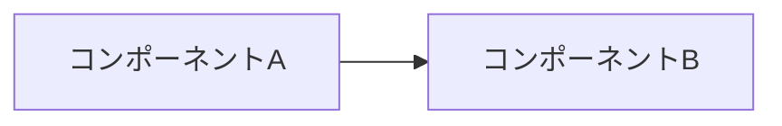

# Zenn記事生成スキル

ユーザから渡された下書き・メモ・箇条書き・アイデアをもとに、Zennブログ記事として完成させる。

## 手順

### 1. 下書きの分析
ユーザから渡された内容を分析し、以下を特定する：
- 記事のテーマ・技術トピック
- ターゲット読者
- 記事の種類（PoC/ハンズオン/概念解説/アーキテクチャ解説）
- 含まれるコード、スクリーンショット参照、リンク

### 2. スラッグの決定
記事ファイル名（スラッグ）が指定されていない場合、テーマに基づいて英語のスラッグを提案する。
- 形式: `[テーマ]-[サブテーマ].md`（例: `mcp-azure-functions.md`, `browser-automation-ai-foundry-poc.md`）
- 既存記事とスラッグが重複しないか `articles/` ディレクトリを確認する

### 3. 画像ディレクトリの準備
スクリーンショットや画像が含まれる場合：
- `images/[スラッグ名]/` ディレクトリを作成する
- 画像参照は `` の形式にする

### 4. フロントマターの生成

```yaml
---
title: "記事タイトル"
emoji: "絵文字1文字"
type: "tech"
topics: ["トピック1", "トピック2", "トピック3", "トピック4"]
published: false
---
```

**ルール:**
- `title`: 内容が一目でわかるタイトル。【】で補足をつけてもよい（例: `"【OmniRAG】ベクトル検索とナレッジグラフによるRAG"`）
- `emoji`: テーマに合った絵文字1文字
- `type`: 基本は `"tech"`。技術記事でないアイデア記事の場合のみ `"idea"`
- `topics`: 関連する技術名を3〜5個。Azure, MCP, OpenAI, LLM, Python など既存記事で使われているトピック名に合わせる
- `published`: 初回は必ず `false`

### 5. 記事本文の構成

以下の構成で記事を書く：

```markdown
# はじめに

[テーマの背景・動機を2-3段落で説明]
[関連リンク（公式ドキュメント、GitHubリポジトリなど）をURLそのままで記載]
[このブログで何をするかを明示]

# [メインコンテンツセクション]

## [サブセクション]

[技術解説、手順、コードなど]

# まとめ

[記事の振り返り: 何を実現したか、学んだこと]
[今後の展望や改善点があれば簡潔に]
```

**構成の詳細ルール:**

#### 「はじめに」セクション
- テーマの背景・なぜこの技術を試したかの動機を書く
- 関連する公式ドキュメントやブログのURLをそのまま貼る（Zennが自動でリンクカードにする）
- 記事で扱う範囲を明示する（例: 「このブログでは、**〜〜**にフォーカスして試してみます。」）

#### メインコンテンツ
- 記事の種類に応じて構成する：
  - **PoC/ハンズオン記事**: 前提条件 → 環境構築 → 実装 → 実行結果
  - **概念解説記事**: 概念説明 → ユースケース → 具体例
  - **アーキテクチャ記事**: 課題背景 → 設計思想 → アーキテクチャ図 → 実装
- 手順は番号付きの `##` サブセクションで区切る（例: `## 1. コードのダウンロード`）
- コードブロックには必ず言語指定をつける（```python, ```bash, ```json など）

#### 「まとめ」セクション
- 記事で実現したことを振り返る（2-3段落）
- 今後の展望や改善点があれば簡潔に触れる
- 前向きな一言で締める（例: 「〜〜の一助となれば幸いです！」）

### 6. 文体・表現のルール

- **自然な日本語、シンプルな文章**を心がける
- **知識のない方でも読みやすい**ブログを意識する
- **誇張した表現、余計な表現は避ける**
- 「です・ます」調で統一する
- 一人称は「わたし」or 省略
- 読者への語りかけ：「〜〜しませんか？」「〜〜ですよね。」のように自然に
- 技術用語は初出時に簡潔な説明を添える
- 箇条書きを活用して読みやすくする

### 7. Zenn固有のMarkdown記法

必要に応じて以下を使う：

**メッセージボックス（補足情報）:**
```
:::message
補足情報やメモ
:::
```

**警告ボックス（注意事項）:**
```
:::message alert
重要な注意事項や制約
:::
```

**Mermaidダイアグラム（アーキテクチャ図やフロー図）:**
````

````

**リンクカード（URLをそのまま記載するとカード表示になる）:**
```
https://learn.microsoft.com/ja-jp/...
```

**テーブル:**
```
| 項目 | 説明 |
| --- | --- |
| A | Aの説明 |
```

### 8. Advent Calendar記事の場合

ユーザがAdvent Calendar記事であると指定した場合、「はじめに」の前に以下を追加する：

```markdown
本記事は**[カレンダー名]** **Advent Calendar [年]** の X 日目の記事です。
[カレンダーURL]
```

### 9. 最終確認

記事を書き終えたら以下を確認する：
- [ ] フロントマターの `topics` が空でないこと
- [ ] `# はじめに` と `# まとめ` が含まれていること
- [ ] コードブロックに言語指定があること
- [ ] 画像パスが `` の形式であること
- [ ] URLリンクが行の先頭に単独で記載されていること（リンクカード表示のため）
- [ ] `published: false` であること（公開はユーザが手動で行う）

## 出力

`articles/[スラッグ名].md` にZenn記事ファイルを作成する。

### 10. レビューの実行

記事ファイルの作成後、自動的に `/zenn-review` スキルを実行して記事をレビューする。
レビュー結果を提示し、修正が必要な箇所があればユーザに確認のうえ修正を適用する。
