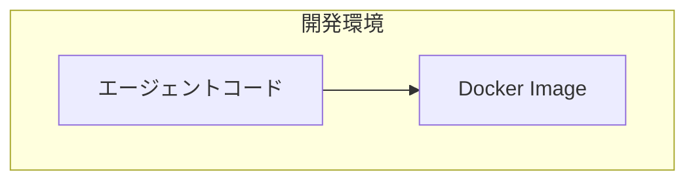

# スタイルガイド

著者の既存記事（87本）から抽出した文体・フォーマットルール。記事執筆時に必ず参照する。

---

## 著者の声（トーン & パーソナリティ）

著者は「実践者・教育者・継続的な学習者」として書く。以下の特徴を常に意識すること。

### 基本姿勢
- **敬体**（です・ます調）を基本とする
- 技術的に正確でありながら、親しみやすいトーン
- 教育的だが上から目線にならない — 読者と一緒に学ぶスタンス
- 自分の知識の限界を正直に述べる（「〜の知識が豊富ではないため」「〜はまったくやったことがない私ですが」）
- 「！」を適度に使い、発見や驚きを表現（「これだー！！！と感化され」「解説します！」）

### 探求的な表現（頻出）
著者は「試す・触る・動かす」系の表現を多用する。記事全体に探求的なトーンを持たせること。

- 「〜を試してみる」「〜を触ってみる」「〜を動かしてみる」
- 「個人的に気になった内容をPoC…」
- 「興味があったので調べてみました」
- 「〜してみましょう」（読者への語りかけ）

### 体験ベースの書き出し
導入は個人的な体験やきっかけから入ることが多い。

- 「〜のイベントがありました」「〜を触ってみました」
- 「知人と飲み会をしたときに、〜の話になり…」
- 「個人的に開発しているアプリに…」
- 動機を率直に書く（「これだー！！！と感化され」「興味があったので」）

### カジュアル表現
堅すぎない技術ブログとして、以下の表現を自然に使う。

- 「こんな感じ」「こんな感じで動作します」（表やコードブロックの前後で頻出）
- 「さて、早速始めていきましょう」「それでは」
- 「〜と思うかもしれません」「〜ですよね」（読者への語りかけ）
- 「いやいや、〜」「さて、、」（砕けたリアクション。二重読点もOK）

### 身近なたとえ（重要）
著者は技術概念を**必ず身近なたとえ**で補足する。記事内に最低2〜3個は入れること。

- 「会社の新入社員を想像してみてください。〜というルールが書かれたマニュアルがあり…」
- 「iPhoneのApp Storeでは、Appleがアプリを審査し、署名して配布します。同じ仕組みを〜」
- 「飛行機の事故調査で使うフライトレコーダーと同じ発想です」
- 「電気のブレーカーと同じ」
- 「料理のレシピに例えると、〜が人格定義で、〜が調理手順を書くイメージ」

たとえはセクション冒頭で概念を導入するときに使うと効果的。

### 素直な感想・学び（記事全体に散りばめる）
まとめだけでなく、**記事の途中にも**著者自身の感想をインラインで入れる。技術説明の直後に一言添えるイメージ。

- 「これ、地味にすごいと思います」
- 「ここがうまくできていて、〜なんですよね」
- 「なかなかスッキリした設計だなと感じました」
- 「うまい分離設計だと思います」
- 「こうした既存の成熟した概念をAIエージェントの世界に持ち込んでいるのが、このツールキットの面白いところだと思います」
- 「ハードルがかなり下がったなと実感しました」

### 避ける表現
- **解説文書調・ドキュメント調の文体**（最も陥りやすいNG。「〜である」「〜となる」「〜を担う」を連発しない。同僚に口頭で説明するトーンを意識する）
- 上から目線の解説
- 絵文字の乱用（見出しの絵文字はOK、本文中は控えめ）
- **emダッシュ（——）の使用**。英語っぽい表現なので使わない。句読点（、。）や接続表現（「つまり」「そう考えると」等）で代替する
- セクション間の過度に形式的な接続（「以下で述べる」「前述のとおり」等。代わりに「さて」「ということで」「ここからは」を使う）

---

## 見出し

- **`#` や `##` 等の見出しに番号を振らない**（`# 1. はじめに` ではなく `# はじめに`）
- `#` はセクション大見出し（例: `# はじめに`、`# まとめ`）
- `##` / `###` でサブセクション
- 水平線 `---` でセクション間を区切る

### 見出し装飾パターン
- **ステップ系**: 絵文字 + Step番号（例: `## 🧱 Step 3: 壁を作る`、`## ⚽ Step 4: プレイヤーを作る`）
- **機能紹介系**: 絵文字 + 機能名（例: `### 🧠 モデル`、`### 🔧 ツール`、`### 📁 プロジェクトの作成`）
- **問いかけ系**: 疑問形の見出し（例: `## そもそも〜って？`、`## なぜ〜が必要なのか`）

---

## 文中の強調

- 太字（`**`）で重要なキーワードを強調
- 断定と疑問を織り交ぜて読者を引き込む（例: 「そもそも、これを使う対象者はどういう方で、どういうシーンで使うのでしょう？」）
- 注意書きは「※」で始める
- 技術用語は **太字** またはインラインコード（`` ` ``）で表記

---

## データ整理

- **表（Markdownテーブル）を積極活用** — 比較、一覧、機能紹介、スペック、設定項目は表で整理
- 表のヘッダーは太字にしない（Markdown標準で太字表示される）
- 列数は2〜4列が読みやすい

例:
```markdown
| 観点 | プロンプトベース | Hosted Agent |
|------|----------------|--------------|
| 構築方法 | GUIでプロンプト設定 | コードでロジック実装 |
```

---

## コードブロック

- 言語指定を必ず付ける（```python, ```bash, ```json, ```yaml, ```mermaid 等）
- セットアップコマンドは `bash` で表記
- 設定ファイルは適切な言語（json, yaml 等）で表記
- コード内コメントは日本語で

### コード解説の流れ
1. コードブロックを提示
2. 直後にポイントを解説（「変更した箇所」「ここで注意するべき点は」等）
3. 補足的な概念は `:::details` で展開（例: `💡 Rigidbody とは？`、`💡 Input Actions の利点`）

---

## 図解（Mermaid）

- アーキテクチャ図: `graph TB` または `graph LR`
- フロー図: `sequenceDiagram`
- `subgraph` でグルーピング
- ノードのラベルは日本語OK（`<br/>` で改行）

例:


---

## 画像

- 形式: ``
- スクリーンショットは手順の直後に配置
- alt テキストは省略可（Zennでは表示されない）

---

## 注釈（Zenn独自記法）

- 注意事項: `:::message alert` 〜 `:::`
- 補足情報: `:::message` 〜 `:::`
- 展開式の補足: `:::details タイトル` 〜 `:::`
- 日付免責: 「本記事の内容は **YYYY年M月D日時点** の情報に基づいています。」を冒頭に配置

例:
```markdown
:::message alert
本記事の内容は **2026年2月1日時点** の情報に基づいています。
:::
```

---

## 参考リンク

- 記事冒頭の `### 参考情報` セクション、または記事末尾に配置
- 公式ドキュメント、GitHub リポジトリ、関連記事へのリンク
- リンクテキストはタイトルそのまま（英語のままでOK）

---

## 記事の導入パターン

- **体験ベースの書き出し**: 個人的なきっかけ、イベント、動機から入る
- **背景の提示**: 技術トレンドや前回記事の振り返り
- **一言要約**: 引用ブロック（`>`）でサービス/技術を一言で説明
- **本記事の目的**: 何を構築/解説するかを明示
- **対象読者**: 表形式で「対象者 × シーン」を整理（必要に応じて）
- **自分の立場を正直に**: 「〜はまったくやったことがない私ですが」等

---

## 記事の締め方（`# まとめ`）

- 本記事で行ったことを端的に振り返る（2〜3文）
- 個人的な感想・学びを素直に述べる（「実感しました」「面白いと思いました」）
- 次回予告や発展的な内容への軽い誘導（「次は〜を紹介します」「詳細はこちらにて！」）

---

## 転換・接続の表現

セクション間やパラグラフ間で使う表現:
- 「さて、」「ところで」「一方で」「それでは」
- 「次に」「今度は」「続いて」
- 「先に結論を述べると」「結論、このような動きになりました」
