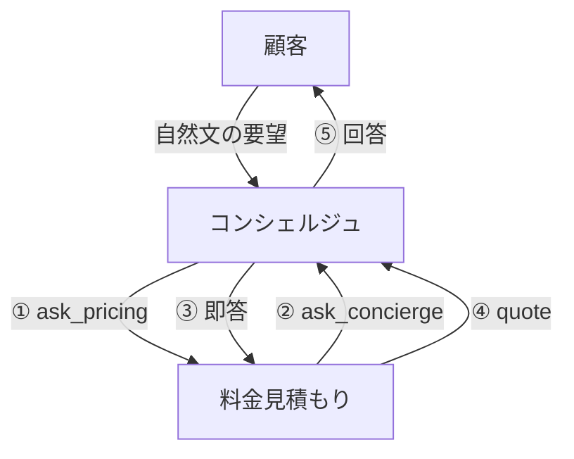
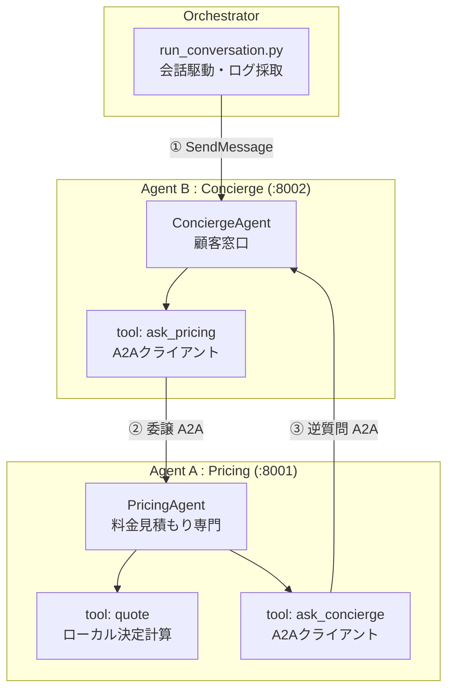

<!--  -->

# はじめに

Microsoft Agent Framework のリリースノートを眺めていたら、**A2A（Agent2Agent）Protocol** 対応の更新が入っていました。

https://github.com/microsoft/agent-framework/releases

A2A は、もともと Google 発・現在は Linux Foundation 管理の「エージェント同士が会話するための標準プロトコル」です。MCP がエージェントとツールをつなぐのに対して、A2A は**エージェントとエージェント**をつなぎます。

会社にたとえると、MCP が「社内の備品（ツール）を使う手続き」だとすると、A2A は「他社の担当者（エージェント）に電話して仕事を依頼する」イメージですね。

ということで、今回は **Agent Framework で作った自作エージェントを2体用意して、A2A で相互接続し、会話を1往復以上成立させる**ことを試してみました。

:::message alert
本記事の内容は **2026年5月31日時点** の情報に基づいています。`agent-framework-a2a` は Beta 版のため、バージョンや API は今後変わる可能性が高いです。本記事のバージョン・API はすべてインストールした実物で確認したものを記載しています。
:::

---

# 動かしたもの

題材は、クルマのサブスクを想定した **2つの専門エージェントの連携**です。

- **料金見積もりエージェント（A）**: 月額の見積もりを専門に行う。月額計算はローカルツールで決定的に算出する。
- **コンシェルジュエージェント（B）**: 顧客窓口。顧客の自然文の要望を受け取る。料金が絡む話は料金エージェントに委譲する。

それぞれを **双方向** にしています。**B→A（委譲）と A→B（逆質問）の2方向の A2A 呼び出しが、1回の会話の中で発生**します。



## 🎬 実行例

実際に動かすとこんな感じです（顧客のメッセージ起点で会話が進みます）。

```text
----- ターン 1 -----
[顧客 -> コンシェルジュ] ヤリスを2年契約で借りたいです。月額の目安を教えてください。
[コンシェルジュ -> 顧客] ヤリスを**2年（24か月）契約**で借りる場合の**月額目安**は、
約39,600円/月 です（想定：年間10,000km程度）。
※オプション追加や走行距離の前提が変わると月額も変動します。

----- ターン 2 -----
[顧客 -> コンシェルジュ] メンテナンスパックも付けると月額はどうなりますか？
[コンシェルジュ -> 顧客] メンテナンスパックを付けた場合の概算は、
- 月額：42,900円
  - 内訳：車両基本 39,600円 + メンテナンスパック 3,300円

===== ストリーミング (SSE) デモ =====
[顧客 -> コンシェルジュ(stream)] カローラを36ヶ月契約した場合の月額だけ、簡潔に教えてください。
[コンシェルジュ -> 顧客(stream結合)] カローラを36ヶ月契約した場合の月額は、42,504円です（年間走行距離10,000km想定）。
```

月額は LLM が暗算しているのではなく、料金エージェント側の**決定的なツール**が計算しています。なので `カローラ 46,200円 × 0.92（36ヶ月係数）= 42,504円` のように、ログと数字がきっちり一致します。ここが検証していて気持ちよかったところです。

---

# A2A Protocol とは

もう知ってるよ！という方は読み飛ばしてください。

**A2A（Agent2Agent）** は、AIエージェント同士をつなぐ標準プロトコルです。主役は2つです。

| 要素 | 役割 | たとえると |
|------|------|-----------|
| Agent Card | エージェントの自己紹介（名前・能力・接続先URL）を記述した JSON | 受付に置いてある名刺 |
| JSON-RPC over HTTP | メッセージ送信やタスク管理のための通信 | 名刺を見て電話をかける行為 |

Agent Card は `/.well-known/agent-card.json` という決まった場所で公開され、相手エージェントはそれを読んで「この子はどんなスキルを持っていて、どこに話しかければいいか」を解決します。`well-known` という置き場所の発想は、Web の `robots.txt` や OpenID Connect の `.well-known/openid-configuration` と同じですね。

トランスポートは JSON-RPC 2.0 / gRPC / HTTP+JSON に対応していますが、今回はいちばん素直な **JSON-RPC** を使います。

---

# システム構成

全体像はこんな感じです。



技術スタックはこれです！

| レイヤー | 技術 | 役割 |
|---------|------|------|
| Agent層 | Microsoft Agent Framework (Python) 1.7.0 | エージェント・ツール・会話管理 |
| A2A連携 | agent-framework-a2a 1.0.0b260528（Beta） | Agent Framework の Agent を A2A に適合 |
| A2A SDK | a2a-sdk 1.1.0 | Agent Card 配信・JSON-RPC・タスク管理 |
| LLM | Microsoft Foundry（gpt-5.4-nano 系デプロイ） | 自然言語理解・応答生成 |
| サーバ | Starlette + uvicorn | ASGI サーバ |

---

# 実装

## API側

API側は、Agent Framework の Agent を A2A サーバ／クライアントにするためのコードです。
A2A サーバ側は `A2AExecutor` で Agent をラップして、a2a-sdk の `DefaultRequestHandler` と routes ヘルパを Starlette に載せる形。クライアント側は、**相手を呼ぶときは `A2AAgent(url=...)` を関数ツールにするだけ**です。

```python
# クライアント（Responses API）。Azure / Foundry は azure_endpoint + api_version="preview" で接続
from agent_framework.openai import OpenAIChatClient
client = OpenAIChatClient(model=deployment, azure_endpoint=endpoint, api_key=key, api_version="preview")

# Agent 生成は Agent(client=...) ではなく client.as_agent(...) が現行の慣用
agent = client.as_agent(name="...", instructions="...", tools=[my_func, my_async_func])

# A2A サーバ側
from agent_framework.a2a import A2AExecutor
from a2a.server.request_handlers import DefaultRequestHandler
from a2a.server.tasks import InMemoryTaskStore
from a2a.server.routes import create_agent_card_routes, create_jsonrpc_routes
from a2a.types import AgentCard, AgentCapabilities, AgentInterface, AgentSkill  # ← protobuf 型
from starlette.applications import Starlette

# A2A クライアント側（相手エージェントを呼ぶ）
from agent_framework.a2a import A2AAgent, A2AAgentSession
```

## Foundry への接続

LLM は Microsoft Foundry の `/openai/v1/responses`（Responses API ）です！
`azure_endpoint` を渡すと Azure ルーティングになり、`api_version="preview"` で `/openai/v1/` の API を叩いてくれます。

```python
# src/shared.py（抜粋）
import os
from agent_framework.openai import OpenAIChatClient
from azure.identity import DefaultAzureCredential

def build_chat_client():
    return OpenAIChatClient(
        model=os.environ["AZURE_OPENAI_DEPLOYMENT"],     # 例: gpt-5.5 系のデプロイ名
        azure_endpoint=os.environ["AZURE_OPENAI_ENDPOINT"],  # https://<your-resource>.services.ai.azure.com
        azure_credential=DefaultAzureCredential(),        # RBAC 認証
        api_version="preview",                            # = /openai/v1/responses
    )
```

## 料金見積もりエージェント（A）

ローカルの `quote` ツールで月額を計算します。また、双方向のA2Aのために、走行距離が分からないときにコンシェルジュへ逆質問する `ask_concierge` を持たせます。この `ask_concierge` が「A→B」方向の A2A 呼び出しです。

```python
# src/pricing_agent.py（抜粋）
from agent_framework.a2a import A2AAgent
from a2a.types import AgentCapabilities, AgentCard, AgentInterface, AgentSkill
from src.shared import CONCIERGE_URL, PRICING_URL, build_chat_client, logging_http_client

def quote(car: str, term_months: int, annual_mileage_km: int, options: list[str] | None = None) -> dict:
    """車種・契約期間・年間走行距離・オプションから月額（円）を算出する。"""
    options = options or []
    base = {"ヤリス": 39600, "アクア": 44000, "カローラ": 46200}.get(car, 49500)
    factor = {12: 1.10, 24: 1.00, 36: 0.92, 48: 0.88, 60: 0.85}.get(term_months, 1.0)
    term_adjusted = round(base * factor)
    extra_km = max(0, annual_mileage_km - 12000)
    mileage_surcharge = (extra_km // 1000) * 800
    option_total = sum({"メンテナンスパック": 3300, "車両保険": 5500, "ETC": 1100}.get(o, 0) for o in options)
    monthly = term_adjusted + mileage_surcharge + option_total
    return {"car": car, "term_months": term_months, "monthly_fee_jpy": monthly}

async def ask_concierge(question: str) -> str:
    """コンシェルジュに顧客側の前提（想定走行距離など）を1回だけ確認する。"""
    concierge = A2AAgent(url=CONCIERGE_URL, http_client=logging_http_client("pricing"))
    response = await concierge.run(question)
    return response.text

def build_pricing_agent():
    client = build_chat_client()
    return client.as_agent(
        name="PricingAgent",
        instructions=(
            "あなたは料金見積もり専門エージェントです。月額は必ず quote ツールで計算します。"
            "顧客の想定走行距離が不明なら ask_concierge で一度だけ確認してから quote してください。"
        ),
        tools=[quote, ask_concierge],
    )

def pricing_agent_card() -> AgentCard:
    return AgentCard(
        name="PricingAgent",
        description="モビリティ・サブスクの月額見積もりを行う専門エージェント。",
        version="1.0.0",
        default_input_modes=["text"],
        default_output_modes=["text"],
        capabilities=AgentCapabilities(streaming=True),
        supported_interfaces=[AgentInterface(url=PRICING_URL, protocol_binding="JSONRPC")],
        skills=[AgentSkill(id="subscription_quote", name="サブスク月額見積もり",
                           description="車種・期間・走行距離・オプションから月額を算出する。",
                           tags=["pricing", "subscription", "mobility"])],
    )
```

## コンシェルジュエージェント（B）

こっちは顧客窓口です。料金は `ask_pricing`（B→A の A2A 呼び出し）で料金見積もりエージェントに依頼します。

A が B に逆質問したときに、B がまた A に委譲してしまうと無限ループになります。そこで instructions で「逆質問には再委譲せず、自分で即答する」と明示しました。

```python
# src/concierge_agent.py（抜粋）
async def ask_pricing(request: str) -> str:
    """料金見積もりエージェントに料金・見積もりの問い合わせを委譲する。"""
    pricing = A2AAgent(url=PRICING_URL, http_client=logging_http_client("concierge"))
    response = await pricing.run(request)
    return response.text

def build_concierge_agent():
    client = build_chat_client()
    return client.as_agent(
        name="ConciergeAgent",
        instructions=(
            "あなたは顧客窓口コンシェルジュです。料金に関わる要望は ask_pricing で料金エージェントに委譲します。"
            "ただし、料金エージェントから走行距離などの前提を尋ねられたら、ask_pricing を再度呼ばず、"
            "一般的な前提（年間10,000km程度）で自分で即答してください。"
        ),
        tools=[ask_pricing],
    )
```

## A2A サーバ（serve.py）

`A2AExecutor` が Agent Framework の Agent を A2A プロトコルに合わせてくれます。

```python
# src/serve.py（抜粋）
import sys, uvicorn
from a2a.server.request_handlers import DefaultRequestHandler
from a2a.server.routes import create_agent_card_routes, create_jsonrpc_routes
from a2a.server.tasks import InMemoryTaskStore
from agent_framework.a2a import A2AExecutor
from starlette.applications import Starlette

def build_app(which: str):
    if which == "pricing":
        from src.pricing_agent import build_pricing_agent, pricing_agent_card
        agent, card, port = build_pricing_agent(), pricing_agent_card(), 8001
    else:
        from src.concierge_agent import build_concierge_agent, concierge_agent_card
        agent, card, port = build_concierge_agent(), concierge_agent_card(), 8002

    executor = A2AExecutor(agent, stream=True)
    handler = DefaultRequestHandler(
        agent_executor=executor, task_store=InMemoryTaskStore(), agent_card=card,
    )
    app = Starlette(routes=[*create_agent_card_routes(card), *create_jsonrpc_routes(handler, "/")])
    return app, port

if __name__ == "__main__":
    app, port = build_app(sys.argv[1])
    uvicorn.run(app, host="127.0.0.1", port=port)
```

## オーケストレータ（run_conversation.py）

顧客メッセージを B に投げて、会話を駆動します。A2A クライアント側は `A2AAgent(url=...)` で相手のサーバを指定するだけ。`A2AAgentSession` を使うと `context_id` が保持され、ターンをまたいで会話が継続します。

```python
# src/run_conversation.py（抜粋）
from agent_framework.a2a import A2AAgent, A2AAgentSession
from src.shared import CONCIERGE_URL, logging_http_client

concierge = A2AAgent(url=CONCIERGE_URL, http_client=logging_http_client("orchestrator"))
session = A2AAgentSession()  # context_id を保持して会話を継続

resp1 = await concierge.run("ヤリスを2年契約で借りたいです。月額の目安を教えてください。", session=session)
print(resp1.text)
resp2 = await concierge.run("メンテナンスパックも付けると月額はどうなりますか？", session=session)
print(resp2.text)
```

ちなみに、JSON-RPC の中身をログに残したかったので、`A2AAgent` には `event_hooks` を仕込んだ `httpx.AsyncClient` を `http_client=` で注入しています。これで送受信の生 JSON をファイルに落とせます。

---

# 動作確認

3つのターミナルで動かします（A サーバ / B サーバ / オーケストレータ）。

```bash
# ターミナル1: 料金見積もりエージェント (:8001)
uv run python -m src.serve pricing

# ターミナル2: コンシェルジュエージェント (:8002)
uv run python -m src.serve concierge

# ターミナル3: Agent Card を確認してから会話を駆動
curl http://127.0.0.1:8001/.well-known/agent-card.json
uv run python -m src.run_conversation
```

JSON-RPC のログを見ると、**B→A（委譲）と A→B（逆質問）の両方向**が確認できました。

**B→A（コンシェルジュ → 料金）**: `SendMessage` で見積もりを委譲しています。

```json
>>> POST http://127.0.0.1:8001/
{"method":"SendMessage","params":{"message":{"role":"ROLE_USER",
"parts":[{"text":"ヤリスを2年契約で借りたい場合の月額目安見積もりを教えてください。"}]}},
"id":"acdb8887-...","jsonrpc":"2.0"}

<<< 200 application/json
{"result":{"task":{"status":{"state":"TASK_STATE_COMPLETED"},
"artifacts":[ ... "39","600","円","/月" ... ]}}}
```

**A→B（料金 → コンシェルジュ）**: 料金エージェントが、足りない前提を逆質問しています。

```json
>>> POST http://127.0.0.1:8002/
{"method":"SendMessage","params":{"message":{"role":"ROLE_USER",
"parts":[{"text":"一般的な前提として想定している年間走行距離（km）はどれくらいですか？"}]}},
"id":"5b0729f7-...","jsonrpc":"2.0"}

<<< 200 application/json
{"result":{"task":{"status":{"state":"TASK_STATE_COMPLETED"},
"artifacts":[ ... "年間","10","000","km","程度" ... ]}}}
```

`顧客 → B → A（委譲）→ A→B（逆質問）→ B→A（回答）→ B → 顧客` という、狙いどおりの双方向の会話が1往復以上成立しました。料金も `quote` ツールの計算（ヤリス 39,600円、メンテ込み 42,900円、カローラ36ヶ月 42,504円）と一致してます！

---

### 参考リンク

- [Microsoft Agent Framework - GitHub](https://github.com/microsoft/agent-framework)
- [Microsoft Agent Framework - リリース](https://github.com/microsoft/agent-framework/releases)
- [A2A Protocol - GitHub (Linux Foundation)](https://github.com/a2aproject/A2A)
- [A2A Protocol 公式サイト](https://a2a-protocol.org/)
