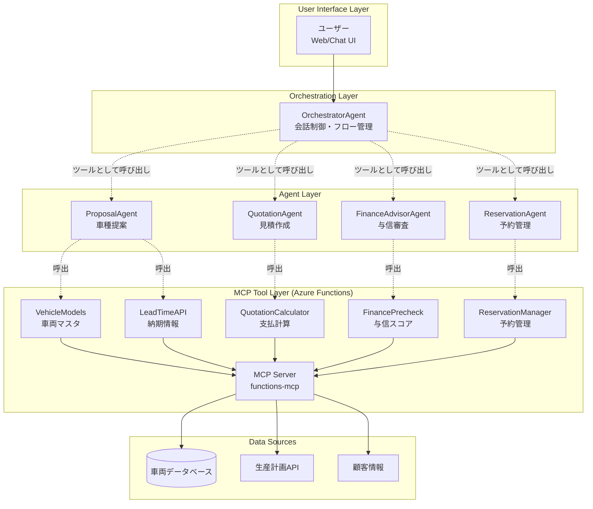
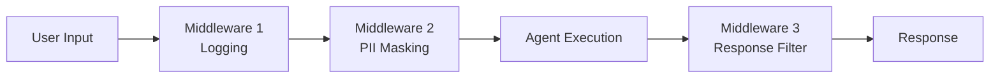
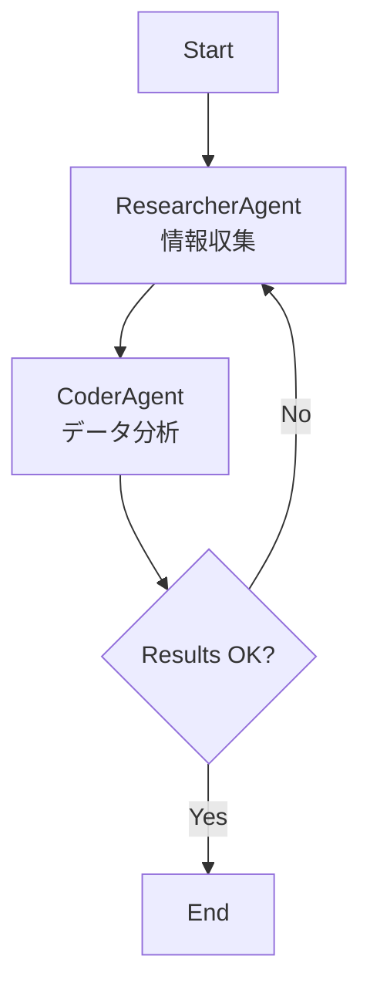
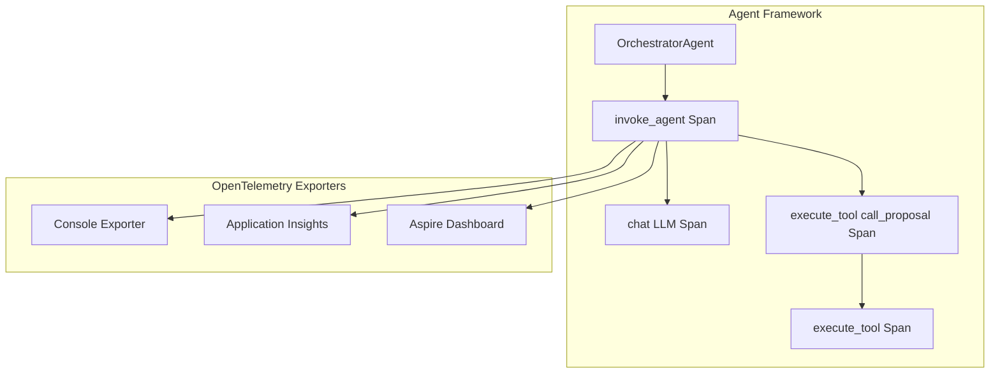
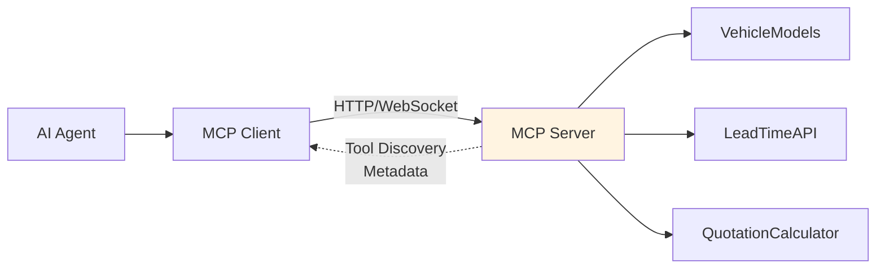

# はじめに
2025年10月に、MicrosoftからAgent Frameworkがリリースされました。従来、Microsoft関連のAIオーケストレーター層としてSemanticKernelとAutoGenがありました。これらを統合したFrameworkです。
https://learn.microsoft.com/ja-jp/agent-framework/overview/agent-framework-overview

概要について、詳しくはMicrosoftのdaka-sanのブログ記事をご覧ください。
https://zenn.dev/microsoft/articles/f0a05ba54a5df4

このブログでは、Azure Functions で MCPサーバを構築し、それらのツールを接続した、マルチエージェントな仕組みを、Microsoft Agent Frameworkで実装してみたので、その内容を紹介します。

# 動かしたもの

自動車購入を検討しているユーザーに対して、**車種提案 → 見積作成 → 与信審査 → 予約管理**まで対話形式で自動対応するマルチエージェントなシステムです。
各エージェントは、既存システムのAPIをMCPサーバ化したツールを呼び出して協調動作します。
※APIは仮実装であり、車両データや月額料金なども架空の設定です。

## 🎬 実行例
このような流れで動作します。
1. ユーザーが車の要件を入力します。
2. OrchestratorAgentが要件を解析し、各エージェントに処理を依頼します。
3. まず最初にProposalAgentが提案を作成します。
   1.  提案のために必要な車種リストをMCPツールから取得
   2.  車種リストとユーザ要件をもとに、推薦車種を絞り込み
   3.  ユーザに提案内容を返却
4.  次に、QuotationAgentが見積を作成します。
   1.  推薦車種の納期をMCPツールから取得
   2.  推薦車種の月額料金をMCPツールから取得
5.  最後に、FinanceAdvisorAgentが与信審査を行います。
   1.  ユーザーの年収・借入額をユーザにヒアリング
   2.  与信スコアをMCPツールから取得
   3.  契約可否をユーザに返却

```powershell
PS> python .\orchestrator_chat_repl.py --query "ワンボックスほど大きくない、スライドドアの車がいいなー" --budget-max=6000000 --verbose

00:18:37 - mcp.client.streamable_http - DEBUG - SSE message: root=JSONRPCResponse(jsonrpc='2.0', id=3, result={'content': [Json形式の車種情報]})

00:32:13 - agent_framework - DEBUG - Function result: {'recommendations': [{'model_id': 'VOXY', 'grade_id': 'VOXY-Z', 'engine_id': 'VOXY-Z-HV', 'vehicle_price': 3740000, 'reasons': ['スライドドア付きの車両です', '乗車人数4人に適しています', '予算内で収まり燃料効率が良好です'], 'est_lead_weeks': None}, {'model_id': 'SIENTA', 'grade_id': 'SIENTA-Z', 'engine_id': 'SIENTA-Z-HV', 'vehicle_price': 3108000, 'reasons': ['スライドドア付きのコンパクトミニバンです', 'ハイブリッド仕様で燃費が優れています', '予算内に収まり乗車人数に適しています'], 'est_lead_weeks': None}], 'normalized_requirements': {'budget_max': 6000000, 'passenger_count': 4, 'priority': 'balance', 'fuel_pref': 'hybrid'}, 'next_action_hint': None, 'metadata': {}}

00:32:29 - agent_framework - DEBUG - Function result: {'engine_id': 'VOXY-Z-HV', 'vehicle_price': 3740000.0, 'subscription_term_months': 36, 'monthly_fee': 64534.0, 'breakdown': {'base_fee': 63580.0, 'maintenance_fee': 0.0, 'taxes_and_fees': 954.0, 'discount_amount': 0.0}, 'total_cost': 2323224.0, 'rationale': [], 'metadata': {}}

00:32:32 - agent_framework - DEBUG - Function result: {'engine_id': 'SIENTA-Z-HV', 'vehicle_price': 3108000.0, 'subscription_term_months': 36, 'monthly_fee': 53629.0, 'breakdown': {'base_fee': 52836.0, 'maintenance_fee': 0.0, 'taxes_and_fees': 793.0, 'discount_amount': 0.0}, 'total_cost': 1930644.0, 'rationale': [], 'metadata': {}}

=== 初回応答 ===
トヨタの以下の2車種をおすすめします。

1. VOXY-Z (ハイブリッド)    
   - 月額料金: 64,534円
   - 契約期間: 36ヶ月

2. SIENTA-Z (ハイブリッド)
   - 月額料金: 53,629円
   - 契約期間: 36ヶ月

どちらもスライドドア付きで、予算内に収まります。さらに詳しくご検討されたい場合はお知らせください。

あなた> SIENTAがいいです！！

--- 応答 ---
素晴らしい選択です！トヨタのSIENTAは利便性が高く、燃費も良いお車です。

次は、必要に応じて与信審査を行います。以下の情報が必要ですので教えていただけますか：
- 年収
- 希望借入額

また、可能であれば以下の情報もご提供ください：
- 年齢
- 雇用形態
- 他の借入の有無と金額
- 扶養家族の数

あなた> 30歳会社員、ほかの借り入れはありません。扶養家族は二人です。

--- 応答 ---
ありがとうございます。それでは、年収と希望借入額を教えていただけますか？

あなた> 年収は700万です。借入額は全額で。

00:43:14 - agent_framework - DEBUG - Function result: {'score': 66, 'rating': 'AA', 'approved': True, 'annual_income': 7000000, 'requested_amount': 1000000, 'decision': None, 'factors': None, 'manual_review_reason': None, 'metadata': {'version': '1.0', 'source_tools': ['FinancePrecheck'], 'generated_at': '2023-11-03T13:30:46'}}

--- 応答 ---
新しい借入額での与信審査は無事に承認されました！トヨタのSIENTA、借入額100万円でのお手続きが可能です。

```
ちなみに、CLIで対話できるような実装は、AgentFrameworkに含まれてはいない認識です。対話CLIは独自実装です。

今回の実装はこちらのリポジトリです。
https://github.com/nomhiro/agent-framework-dealer-poc

## システム概要

**4つの専門エージェント** が **5つのMCPツール** を呼び出してエージェンティックな動作をするようにしています。
さらに、4つの専門エージェントをツールとして呼び出す **OrchestratorAgent**（販売店エージェント的な存在）を用意し、ユーザはこのエージェントとだけ対話します。



### 📦 技術スタック

| レイヤー | 技術 | 役割 |
|---------|------|------|
| **Agent層** | Microsoft Agent Framework (Python) | マルチエージェント制御・会話管理 |
| **LLM** | Azure OpenAI (GPT-4o) | 自然言語理解と応答生成 |
| **MCP Server** | Azure Functions (Python v2) | ツール実装とMCPプロトコル対応 |
| **Protocol** | Model Context Protocol | エージェント⇔ツール間の標準通信 |
| **Interface** | CLI/REPL | 対話実行環境 |

---

# Microsoft Agent Framework の主要なコンポーネント
私はPythonを使っているので、PythonのAgentFrameworkのクラス名で解説します。

## ChatAgent（エージェント）

**ChatAgent**は、LLMとツールを統合したエージェントの基本単位です。
**ChatAgent が持つ機能**はこれらです。
- **Function Calling**: ツール関数を自動呼び出し
- **Multi-turn Conversation**: Thread による会話履歴管理
- **Streaming Response**: リアルタイム応答生成
- **Structured Output**: Pydantic モデルで型安全な出力

```python
from agent_framework import ChatAgent
from agent_framework.azure import AzureAIAgentClient
from azure.identity.aio import DefaultAzureCredential

# AI Client → Agent の流れ
async with DefaultAzureCredential() as credential:
    agent = AzureAIAgentClient(async_credential=credential).create_agent(
        name="HelperAgent",
        instructions="あなたは親切なアシスタントです。",
        tools=[get_weather]  # ツール関数を渡す
    )

    response = await agent.run("東京の天気はどうですか？")
    print(response.text)
```

## Tools（外部機能）

エージェントが呼び出せる関数を **Tools** として登録します。

ツールの種類はこれらがあります。今回の例ではMCP Toolsを使っています。
| ツールタイプ | 説明 | 用途 |
|-------------|------|------|
| **Custom Functions** | Python 関数 | 独自ロジックの実装 |
| **HostedCodeInterpreterTool** | コード実行環境 | データ分析・計算処理 |
| **HostedFileSearchTool** | ファイル検索 | RAG（検索拡張生成） |
| **MCP Tools** | Model Context Protocol | 外部サービス統合 |

天気取得ツールを例としてツール定義の実装例は以下です。

```python
from typing import Annotated
from pydantic import Field

def get_weather(
    location: Annotated[str, Field(description="天気を取得する場所")],
) -> str:
    """天気を取得する場所の天気を返します。"""
    # Your weather API implementation here
    return f"{location}の天気は晴れで、気温は25°Cです。"

# エージェントに登録
agent = ChatAgent(
    chat_client=OpenAIChatClient(),
    instructions="あなたは親切な天気アシスタントです。",
    tools=get_weather,  # ツールとして追加
)

result = await agent.run("東京の天気はどうですか？")
print(result.text)
```

## Middleware（エージェント実行の制御）

**Middleware** は、エージェント実行の各段階でフック処理を挟める仕組みです。

例えば、以下のような処理を挟み込めます。
- **リクエスト前**: ロギング、PIIマスキング、ツールホワイトリスト
- **レスポンス後**: 不適切な応答のフィルタリング


**Middleware の実装例**

```python
from agent_framework import AgentRunContext
from typing import Callable, Awaitable

async def logging_agent_middleware(
    context: AgentRunContext,
    next: Callable[[AgentRunContext], Awaitable[None]],
) -> None:
    """エージェント実行をログ出力するミドルウェアの例"""
    print("Agent starting...")
    
    # Continue to agent execution
    await next(context)
    
    print("Agent finished!")

# Middleware を追加
async with AzureAIAgentClient(async_credential=credential).create_agent(
    name="GreetingAgent",
    instructions="あなたは親切なアシスタントです。",
    middleware=logging_agent_middleware,  # ここで追加
) as agent:
    result = await agent.run("Hello!")
    print(result.text)
```

## Workflow（マルチエージェントオーケストレーション）

**Workflow** は、複数のエージェントや関数をグラフ構造で連携させる仕組みです。

ワークフローで定義できるので、**複雑な分岐やループも表現可能**です。実業務で決まった工程がある場合に有用だと思います。
実例だと TOYOTA O-beya の思想ですね。

https://devblogs.microsoft.com/cosmosdb/toyota-motor-corporation-innovates-design-development-with-multi-agent-ai-system-and-cosmos-db/」

Workflow の種類にはこれらがあります。

| パターン | 説明 | 図 |
|---------|------|-----|
| **Sequential** | 順次実行 | A → B → C |
| **Concurrent** | 並列実行 | A, B, C → 集約 |
| **Handoff** | 条件分岐 | A → 判定 → B or C |
| **Group Chat** | 協調対話 | A ↔ B ↔ C |

例えば以下のようなフローを定義できます。


Durable Functions みたいですね。Durable Functionsの場合は状態管理もされており、より堅牢なワークフローが実装できます。

**Workflow の実装例**

```python
from agent_framework.workflows import WorkflowBuilder

# エージェント作成
researcher = ChatAgent(
    name="ResearcherAgent",
    description="調査を行うエージェント",
    instructions="あなたはデータを調査し、分析結果を提供します。",
    chat_client=OpenAIChatClient()
)

coder = ChatAgent(
    name="CoderAgent",
    description="コードを書くエージェント",
    instructions="あなたはコードを使って問題を解決します。",
    chat_client=OpenAIResponsesClient(),
    tools=HostedCodeInterpreterTool()
)

# Workflow構築
builder = WorkflowBuilder(researcher)
builder.add_edge(researcher, coder)  # researcher → coder
workflow = builder.build()

# 実行
result = await workflow.run("過去2年間の東京の天気データを分析してください。")
```

## Memory（会話状態の管理）

**Memory** は、会話履歴やコンテキストを永続化する仕組みです。

```python
# Thread による会話履歴管理
agent = ChatAgent(
    chat_client=AzureAIAgentClient(async_credential=credential),
    instructions="あなたは親切なアシスタントです。"
)

# 新しいスレッド作成
thread = agent.get_new_thread()

# 同じスレッドで複数ターン実行
response1 = await agent.run("こんにちは", thread=thread)
response2 = await agent.run("私の名前はしろくまです。", thread=thread)
response3 = await agent.run("私の名前は何ですか？", thread=thread)
print(response3.text)  # "あなたの名前はしろくまです。"
```

さらに、会話履歴を**外部ストレージと統合**できます。
以下はRedisを使う場合の例です。

```python
from agent_framework import ChatAgent
from custom_memory import RedisChatMessageStore

# Redis を使った永続化
agent = ChatAgent(
    chat_client=AzureOpenAIChatClient(...),
    chat_message_store_factory=lambda: RedisChatMessageStore(
        redis_url="redis://localhost:6379"
    )
)
```

## Observability（運用観点：可観測性）

本番運用において、エージェントの動作を監視・デバッグするための**Observability（可観測性）**は不可欠です。

Agent Frameworkは以下3種類のテレメトリを自動収集してくれます。

| テレメトリ種別 | 収集内容 | 用途 |
|---------------|---------|------|
| **Traces（トレース）** | エージェント実行フロー | - エージェント呼び出し経路の可視化<br/>- ツール実行順序の確認<br/>- ボトルネック特定 |
| **Metrics（メトリクス）** | パフォーマンス指標 | - 実行時間の統計<br/>- トークン使用量の監視<br/>- コスト最適化 |
| **Logs（ログ）** | 構造化イベント | - エラー詳細の記録<br/>- デバッグ情報<br/>- 監査ログ |

※Spanとは、トレースの単位で、一つの処理や操作の開始から終了までの記録のことです。


### 自動生成されるSpan（トレース単位）

Agent Frameworkは以下のSpanを自動生成します。

#### 1. `invoke_agent <agent_name>`

エージェント呼び出し全体を表すトップレベルのSpanです。

**収集される属性例**
```json
{
  "gen_ai.operation.name": "invoke_agent",
  "gen_ai.system": "openai",
  "gen_ai.agent.id": "OrchestratorAgent",
  "gen_ai.agent.name": "OrchestratorAgent",
  "gen_ai.request.instructions": "自動車販売オーケストレーター...",
  "gen_ai.response.id": "chatcmpl-...",
  "gen_ai.usage.input_tokens": 1250,
  "gen_ai.usage.output_tokens": 320
}
```

#### 2. `chat <model_name>`
LLM呼び出しごとに生成されるSpanです。

**収集される属性例**
- `gen_ai.request.model`: 使用モデル名（例: `gpt-4o`）
- `gen_ai.prompt`: プロンプト内容（`ENABLE_SENSITIVE_DATA=true`時のみ）
- `gen_ai.response.text`: LLMレスポンス（同上）
- `gen_ai.usage.input_tokens`: 入力トークン数
- `gen_ai.usage.output_tokens`: 出力トークン数

#### 3. `execute_tool <function_name>`
ツール関数実行ごとに生成されるSpan。

**収集される属性例**
- `tool.name`: ツール名（例: `call_proposal`）
- `tool.call.arguments`: 引数JSON（`ENABLE_SENSITIVE_DATA=true`時のみ）
- `tool.call.results`: 結果JSON（同上）

### Metrics

メトリクスも収集できます。自動で収集されるメトリクスは以下の情報です。

| メトリクス名 | 種類 | 測定内容 |
|-------------|------|---------|
| `gen_ai.client.operation.duration` | Histogram | LLM操作の実行時間（秒） |
| `gen_ai.client.token.usage` | Histogram | トークン使用量（入力/出力） |
| `agent_framework.function.invocation.duration` | Histogram | ツール関数の実行時間（秒） |

これらのメトリクスは、Azure Application Insightsで以下のようなクエリで分析できます。

```kusto
customMetrics
| where name == "gen_ai.client.token.usage"
| summarize avg(value), max(value), percentile(value, 95) by bin(timestamp, 1h)
| render timechart
```

### Observabilityの実装方法

#### パターン1: 環境変数による設定（推奨）

最もシンプルな方法です。`.env`ファイルに環境変数を設定し、`setup_observability()`を呼び出すだけです。

```python
# main.py または orchestrator_chat_repl.py の先頭
import os
from agent_framework.observability import setup_observability

# 環境変数から自動設定
setup_observability()

# 以降、通常通りエージェントを実行
async with AzureAIAgentClient(...) as client:
    agent = client.create_agent(...)
    result = await agent.run("...")
```

**.env ファイル例**
```bash
# Observability 有効化
ENABLE_OTEL=true

# センシティブデータ記録
ENABLE_SENSITIVE_DATA=false 

# Application Insights（Azure Monitor）
APPLICATIONINSIGHTS_CONNECTION_STRING="InstrumentationKey=...;IngestionEndpoint=https://..."

# ローカル開発用（Aspire Dashboard）
OTLP_ENDPOINT=http://localhost:4317
```

### トレース情報出力例

Observabilityを有効化すると、以下のようなトレースが出力されます。

**コンソール出力例**
```json
{
    "name": "invoke_agent OrchestratorAgent",
    "context": {
        "trace_id": "0xf2258b51421fe9cf4c0bd428c87b1ae4",
        "span_id": "0x2cad6fc139dcf01d",
        "trace_state": "[]"
    },
    "kind": "SpanKind.CLIENT",
    "parent_id": null,
    "start_time": "2025-01-10T11:00:48.663688Z",
    "end_time": "2025-01-10T11:00:57.271389Z",
    "status": {
        "status_code": "UNSET"
    },
    "attributes": {
        "gen_ai.operation.name": "invoke_agent",
        "gen_ai.system": "openai",
        "gen_ai.agent.id": "OrchestratorAgent",
        "gen_ai.agent.name": "OrchestratorAgent",
        "gen_ai.request.instructions": "自動車販売オーケストレーター...",
        "gen_ai.response.id": "chatcmpl-CH6fgKwMRGDtGNO3H88gA3AG2o7c5",
        "gen_ai.usage.input_tokens": 1250,
        "gen_ai.usage.output_tokens": 320
    },
    "events": [],
    "links": [],
    "resource": {
        "service.name": "agent_framework"
    }
}
```

---

# Model Context Protocol (MCP) 
もう知ってるよ！という方は読み飛ばしてください！！

## MCP の概要

**Model Context Protocol (MCP)** は、AIエージェントと外部ツールを接続する**標準プロトコル**です。Anthropicが2024年11月に発表しました。



MCPによるツール処理は以下のように行われます。

```
1. Agent → MCP Client: "VehicleModels ツールを呼び出したい"
2. MCP Client → MCP Server: HTTP POST /runtime/webhooks/mcp
   {
     "tool": "VehicleModels",
     "arguments": {}
   }
3. MCP Server → Tool Implementation: handle_vehicle_models_get()
4. Tool → MCP Server: { "vehicle_models": [...] }
5. MCP Server → MCP Client: JSON Response
6. MCP Client → Agent: ツール結果を返す
```

## Azure Functions の MCPサーバ化
Azure Functions で、MCPサーバーを簡単に構築できます。さらに最近、Streamable HTTPもサポートされました。うれしいですね。

::: message
新しいプロトコル バージョンでは、Server-Sent イベント トランスポートが非推奨になりました。 クライアントで特に要求されない限り、代わりに Streamable HTTP トランスポートを使用する必要があります。
:::

**実装例**です。従来のHTTPトリガーなどのデコレーターの代わりに、`generic_trigger` デコレーターを使います。

- `type="mcpToolTrigger"` で MCP プロトコル対応
- `toolProperties` で入力スキーマを定義
- `context` は JSON文字列（`arguments` キーにパラメータ）
- 戻り値も JSON 文字列

```python
@app.generic_trigger(
    arg_name="context",
    type="mcpToolTrigger",                    # MCP トリガー指定
    toolName="VehicleModels",                 # ツール名
    description="購入可能な車種一覧を取得",   # 説明
    toolProperties=json.dumps([])             # 入力スキーマ（空配列 = パラメータなし）
)
def vehicle_models_get_mcp(context) -> str:
    content = json.loads(context)             # context は JSON文字列
    arguments = content.get("arguments", {})
    result = handle_vehicle_models_get(arguments)
    return json.dumps(result)                 # JSON文字列で返す
```

---

# 実装内容の紹介
ここからは、実際の実装内容を紹介します。

再掲ですが、このようなシステム構成です。


## MCPツールサーバの構築（Azure Functions）

ツールの一つである、**VehicleModels** （車両マスタ取得）ツールの実装例を紹介します。
実装のポイントはこれらです。
- `context` は JSON文字列。`arguments` キーにツールのパラメータが格納される
- `toolProperties` で入力スキーマを定義（`propertyName`, `propertyType`, `required` 等）
- 戻り値も JSON 文字列

```python
# function_app.py
import azure.functions as func
import json
from handlers import handle_vehicle_models_get

app = func.FunctionApp(http_auth_level=func.AuthLevel.ANONYMOUS)

# ツールプロパティ定義（入力パラメータなし）
_TOOL_PROPERTIES_VEHICLE_MODELS_JSON = json.dumps([])

@app.generic_trigger(
    arg_name="context",
    type="mcpToolTrigger",
    toolName="VehicleModels",
    description="購入可能な車種一覧を取得",
    toolProperties=_TOOL_PROPERTIES_VEHICLE_MODELS_JSON,
)
def vehicle_models_get_mcp(context) -> str:
    """MCPトリガーによる購入可能車種一覧取得ツール"""
    try:
        content = json.loads(context)
        arguments = content.get("arguments") or {}
        result = handle_vehicle_models_get(arguments)
        return json.dumps(result)
    except Exception:
        logging.exception("vehicle_models_get_mcp 実行失敗")
        return json.dumps({"error": "internal_error"})
```

---

## Agent Framework の実装

### 各専門家エージェントの構築

用意したエージェントは、ProposalAgent, QuotationAgent, FinanceAdvisorAgent, OrchestratorAgent の4つです。

ここでは、ProposalAgent の実装内容を紹介します。
役割は、ユーザーの要望（予算/人数/納期優先度/燃料タイプ）から候補車種を2-3件提案することです。

```python
# agents/proposal_agent.py
from agent_framework import ChatAgent
from schemas.proposal_schema import ProposalQuery, ProposalResponse
from tools.mcp_tools import MCPToolClient

class ProposalAgent:
    def __init__(self, mcp: MCPToolClient, framework_client):
        self.mcp = mcp
        self.client = framework_client

    async def run(self, query: ProposalQuery) -> ProposalResponse:
        # 1. VehicleModels 取得
        vehicles = await self.mcp.call_tool("VehicleModels", {})
        all_models = vehicles.get("vehicle_models", [])

        # 2. 条件フィルタリング
        candidates = []
        for v in all_models:
            # 予算チェック
            if query.budget_max and v["base_price"] > query.budget_max:
                continue
            # 乗車人数チェック
            if query.passenger_count and v["passenger_capacity"] < query.passenger_count:
                continue
            # 燃料タイプチェック
            if query.fuel_pref and v["fuel_type"] != query.fuel_pref:
                continue
            candidates.append(v)

        # 3. 納期情報取得（priority が lead_time の場合）
        if query.priority == "lead_time":
            model_ids = list(set(c["model_id"] for c in candidates))
            leadtimes = await self.mcp.call_tool("LeadTimeAPI", {"model_ids": model_ids})

            # 納期マージ
            lt_map = {item["model_id"]: item["est_lead_weeks"]
                      for item in leadtimes.get("items", [])}
            for c in candidates:
                c["est_lead_weeks"] = lt_map.get(c["model_id"], 12)

            # 納期ソート
            candidates.sort(key=lambda x: x.get("est_lead_weeks", 999))

        # 4. 上位2-3件を推奨
        recommendations = []
        for v in candidates[:3]:
            reasons = []
            if v.get("est_lead_weeks"):
                reasons.append(f"納期約{v['est_lead_weeks']}週")
            if v["fuel_type"] == "hybrid":
                reasons.append("燃費優先")

            recommendations.append({
                "model_id": v["model_id"],
                "model_name": v["model_name"],
                "grade_id": v["grade_id"],
                "engine_id": v["engine_id"],
                "vehicle_price": v["base_price"],
                "reasons": reasons,
                "est_lead_weeks": v.get("est_lead_weeks")
            })

        return ProposalResponse(
            recommendations=recommendations,
            normalized_requirements={
                "budget_max": query.budget_max,
                "priority": query.priority
            }
        )
```

### OrchestratorAgent の実装（オーケストレーターエージェントとマルチターン対話）

各専門エージェントをツールとして呼び出し、ユーザとの会話状態を管理します。
1. **Thread による会話状態管理**: `get_new_thread()` で作成した Thread を再利用
2. **ツール関数の Docstring**: LLM に渡される説明文
3. **内部状態の保持**: `_last_proposal`, `_last_quotation` で前回結果を記憶

```python
# agents/orchestrator_agent.py
from agent_framework.azure import AzureAIAgentClient
from typing import Dict, Any

class OrchestratorAgent:
    def __init__(self, framework_client: AzureAIAgentClient):
        self.client = framework_client
        
        # マルチターン対話用の状態管理
        self._agent = None
        self._thread = None
        self._last_proposal = None
        self._last_quotation = None

    async def start_chat(self, user_query: str) -> Dict[str, Any]:
        """初回ターン: エージェント + Thread 初期化"""
        await self._initialize_agent()
        return await self._run_turn(user_query)

    async def chat_turn(self, user_message: str) -> Dict[str, Any]:
        """後続ターン: 同一 Thread で継続対話"""
        return await self._run_turn(user_message)

    async def _initialize_agent(self):
        """エージェント初期化（初回のみ実行）"""
        if self._agent is not None:
            return

        # ツール定義
        async def call_proposal(user_query: str, budget_max: int = None) -> dict:
            """候補車種リスト生成"""
            result = await self.proposal.run(user_query, budget_max)
            self._last_proposal = result
            return result

        async def call_quotation(engine_id: str, down_payment: int = 0) -> dict:
            """月額料金プラン計算"""
            result = await self.quotation.run(engine_id, down_payment)
            self._last_quotation = result
            return result

        # エージェント作成
        self._agent = self.client.create_agent(
            name="OrchestratorAgent",
            instructions="自動車販売オーケストレーター。ユーザー要求を整理し、"
                        "call_proposal → call_quotation の順で実行",
            tools=[call_proposal, call_quotation]
        )
        
        # Thread 作成（対話履歴保持）
        self._thread = self._agent.get_new_thread()

    async def _run_turn(self, user_message: str) -> Dict[str, Any]:
        """1ターン実行"""
        result = await self._agent.run(
            user_message,
            thread=self._thread,  # 同一スレッドで履歴保持
            store=True
        )

        return {
            "assistant_output": result.text,
            "proposal": self._last_proposal,
            "quotation": self._last_quotation
        }
```

# 動作確認

**Azure Functions 起動**

```bash
cd functions-mcp
func start
# → http://localhost:7071 で起動
```

**エージェント実行**

```bash
# 別ターミナル
python orchestrator_chat_repl.py \
  --query "家族4人 ハイブリッド 納期短め 予算400万" \
  --priority lead_time
```

実行結果は以下のようになります。

1. ユーザーが車の要件を入力します。
2. OrchestratorAgentが要件を解析し、各エージェントに処理を依頼します。
3. まず最初にProposalAgentが提案を作成します。
   1.  提案のために必要な車種リストをMCPツールから取得
   2.  車種リストとユーザ要件をもとに、推薦車種を絞り込み
   3.  ユーザに提案内容を返却
4.  次に、QuotationAgentが見積を作成します。
   1.  推薦車種の納期をMCPツールから取得
   2.  推薦車種の月額料金をMCPツールから取得
5.  最後に、FinanceAdvisorAgentが与信審査を行います。
   1.  ユーザーの年収・借入額をユーザにヒアリング
   2.  与信スコアをMCPツールから取得
   3.  契約可否をユーザに返却

```powershell
PS> python .\orchestrator_chat_repl.py --query "ワンボックスほど大きくない、スライドドアの車がいいなー" --budget-max=6000000 --verbose

00:18:37 - mcp.client.streamable_http - DEBUG - SSE message: root=JSONRPCResponse(jsonrpc='2.0', id=3, result={'content': [Json形式の車種情報]})

00:32:13 - agent_framework - DEBUG - Function result: {'recommendations': [{'model_id': 'VOXY', 'grade_id': 'VOXY-Z', 'engine_id': 'VOXY-Z-HV', 'vehicle_price': 3740000, 'reasons': ['スライドドア付きの車両です', '乗車人数4人に適しています', '予算内で収まり燃料効率が良好です'], 'est_lead_weeks': None}, {'model_id': 'SIENTA', 'grade_id': 'SIENTA-Z', 'engine_id': 'SIENTA-Z-HV', 'vehicle_price': 3108000, 'reasons': ['スライドドア付きのコンパクトミニバンです', 'ハイブリッド仕様で燃費が優れています', '予算内に収まり乗車人数に適しています'], 'est_lead_weeks': None}], 'normalized_requirements': {'budget_max': 6000000, 'passenger_count': 4, 'priority': 'balance', 'fuel_pref': 'hybrid'}, 'next_action_hint': None, 'metadata': {}}

00:32:29 - agent_framework - DEBUG - Function result: {'engine_id': 'VOXY-Z-HV', 'vehicle_price': 3740000.0, 'subscription_term_months': 36, 'monthly_fee': 64534.0, 'breakdown': {'base_fee': 63580.0, 'maintenance_fee': 0.0, 'taxes_and_fees': 954.0, 'discount_amount': 0.0}, 'total_cost': 2323224.0, 'rationale': [], 'metadata': {}}

00:32:32 - agent_framework - DEBUG - Function result: {'engine_id': 'SIENTA-Z-HV', 'vehicle_price': 3108000.0, 'subscription_term_months': 36, 'monthly_fee': 53629.0, 'breakdown': {'base_fee': 52836.0, 'maintenance_fee': 0.0, 'taxes_and_fees': 793.0, 'discount_amount': 0.0}, 'total_cost': 1930644.0, 'rationale': [], 'metadata': {}}

=== 初回応答 ===
トヨタの以下の2車種をおすすめします。

1. VOXY-Z (ハイブリッド)    
   - 月額料金: 64,534円
   - 契約期間: 36ヶ月

2. SIENTA-Z (ハイブリッド)
   - 月額料金: 53,629円
   - 契約期間: 36ヶ月

どちらもスライドドア付きで、予算内に収まります。さらに詳しくご検討されたい場合はお知らせください。

あなた> SIENTAがいいです！！

--- 応答 ---
素晴らしい選択です！トヨタのSIENTAは利便性が高く、燃費も良いお車です。

次は、必要に応じて与信審査を行います。以下の情報が必要ですので教えていただけますか：
- 年収
- 希望借入額

また、可能であれば以下の情報もご提供ください：
- 年齢
- 雇用形態
- 他の借入の有無と金額
- 扶養家族の数

あなた> 30歳会社員、ほかの借り入れはありません。扶養家族は二人です。

--- 応答 ---
ありがとうございます。それでは、年収と希望借入額を教えていただけますか？

あなた> 年収は700万です。借入額は全額で。

00:43:14 - agent_framework - DEBUG - Function result: {'score': 66, 'rating': 'AA', 'approved': True, 'annual_income': 7000000, 'requested_amount': 1000000, 'decision': None, 'factors': None, 'manual_review_reason': None, 'metadata': {'version': '1.0', 'source_tools': ['FinancePrecheck'], 'generated_at': '2023-11-03T13:30:46'}}

--- 応答 ---
新しい借入額での与信審査は無事に承認されました！トヨタのSIENTA、借入額100万円でのお手続きが可能です。

```

---

## まとめ
**Agent Framework はかなり実用的だなと感じました。**MCP統合、マルチターン会話、Observability が標準で備わっているのがよいですね。
Microsoftが作っているだけあり、AzureのApplicationInsights連携も簡単にできます。

Agent Framework自体の話ではなく一般的な話ですが、エージェントの活用という意味だと、**マルチエージェントは責務分離が重要**ですね。今回で言うと、Proposal/Quotation/Finance を分けたことで保守性が向上できます。それぞれで品質担保をするように運用してくイメージです。

まだWorkflowを試せていないので、次回はWorkflowを使った実装にチャレンジしたいと思います。

### 参考リンク

- [Microsoft Agent Framework - GitHub](https://github.com/microsoft/agent-framework)
- [Model Context Protocol 公式](https://modelcontextprotocol.io/)
- [Azure Functions - generic_trigger ドキュメント](https://learn.microsoft.com/en-us/azure/azure-functions/functions-bindings-mcp)
- [Azure OpenAI Service](https://learn.microsoft.com/en-us/azure/ai-services/openai/)
