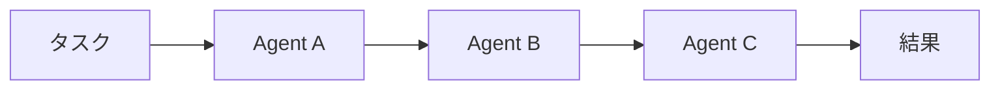
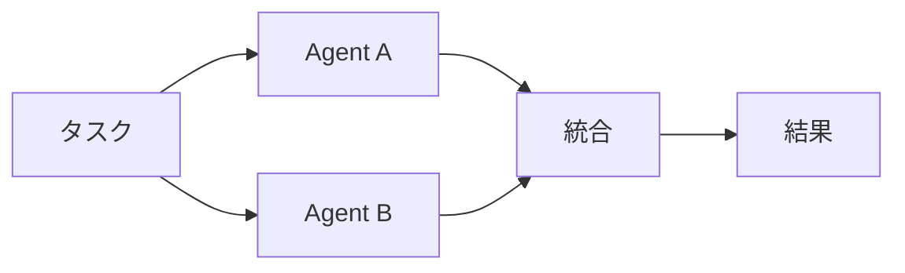
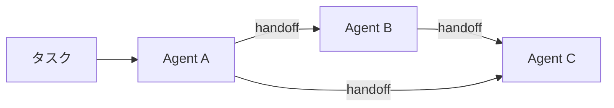
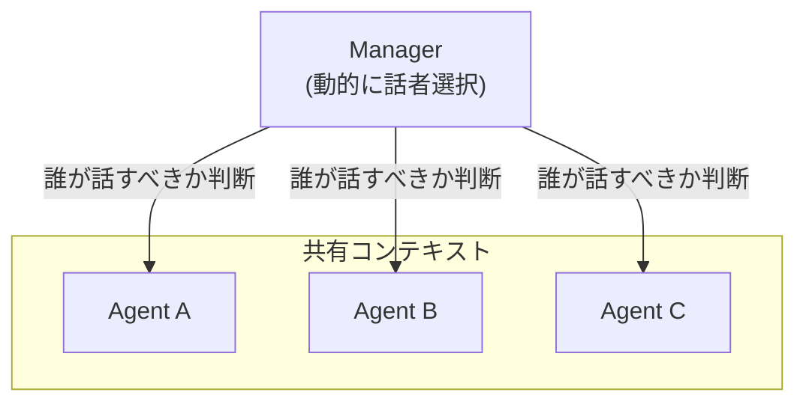
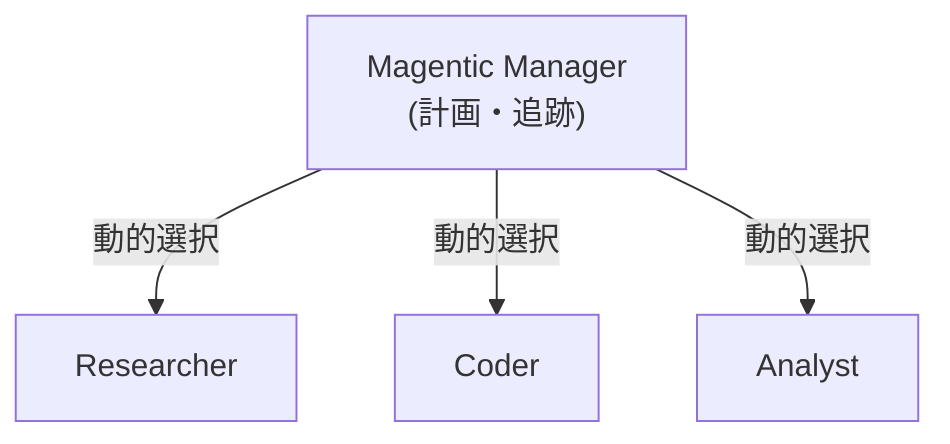
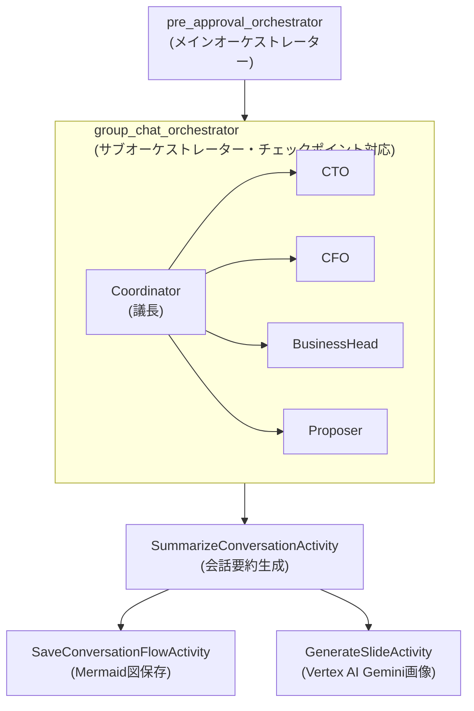
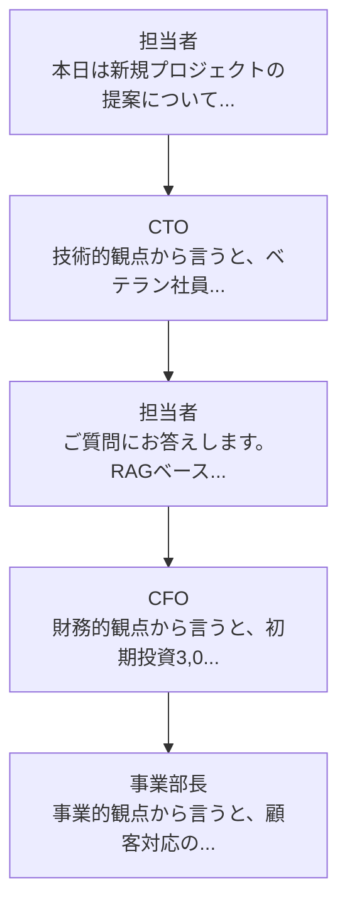

本記事はAzure PoC 部 Advent Calendar 2025 の 8 日目の記事です。
https://qiita.com/advent-calendar/2025/azpoc

# はじめに

Durable Task Scheduler と Agent Framework を組み合わせた仕組みにDeepDiveしたく、本記事を書きました。

- **Microsoft Agent Framework**・・・AIエージェントやマルチエージェントのワークフローを実行するフレームワークです。
- **Durable Task Scheduler**・・・Azure Functions 上で動作するサーバーレスのDurable Functionsランタイム。処理状態が保持されているため、永続的なワークフロー実行を実装できます。

https://learn.microsoft.com/ja-jp/agent-framework/overview/agent-framework-overview

https://learn.microsoft.com/ja-jp/azure/azure-functions/durable/durable-task-scheduler/durable-task-scheduler

## ユースケース

企業の上位層のAIエージェントが議論を行い、担当者の提案に対してフィードバックを返すマルチエージェントな仕組みを作ってみます！

担当者が提案を投げかけると、CTO、CFO、事業部長といった役員エージェントたちが議論し、多角的なフィードバックを返してくれることを想定します。※もちろん、CTOやCFOや事業部長は架空の人物です。

**本番の承認会に臨む前に、AIで「予行演習」ができる**　そんなツールを作ってみましょー！

## この記事に書くこと/書かないこと

**書くこと**
- **Microsoft Agent Framework のマルチエージェントパターンの解説**
- **事前承認会マルチエージェントチャットシステムのアーキテクチャ**
- **ワークフロー可視化の紹介**
- **主要なコードの解説**
- **vertex AI Gemini を使ったスライド生成の紹介**

**書かないこと**
- **Agent Framework の概要解説**：[Learn](https://learn.microsoft.com/en-us/agent-framework/overview/agent-framework-overview) を参照ください。
- **Durable FunctionsやDurable Task Schedulerの概要解説**：[Durable Functions](https://learn.microsoft.com/ja-jp/azure/azure-functions/durable/durable-functions-overview?tabs=in-process%2Cnodejs-v3%2Cv1-model&pivots=csharp)、[Durable Task Scheduler](https://learn.microsoft.com/ja-jp/azure/azure-functions/durable/durable-task-scheduler/durable-task-scheduler) を参照ください。

また、Mirosoft Docsの情報を取得してくれる、Microsoft Doc MCP ツールがあるので、MCPツールをClaudeやVSCodeに設定してAIに聞きましょう！！

---

# Agent Frameworkの概要

**Microsoft Agent Framework** は、Microsoftが提供するAIエージェント構築のための包括的なフレームワークです。シンプルなチャットエージェントから、複数のエージェントが協調して動作する高度なマルチエージェントシステムまで作れます。

:::message
個人的には、Agent Frameworkでワークフローを定義して実行することができますが、**開発者がワークフローを実装するなら、Durable Functionsで実装したほうが柔軟で良いのでは？と思っている派です。**
開発者のスキルや要件に応じて、Agent Framework と Durable Functions を使い分けるのが良いと思います。
:::

---

# マルチエージェントとは

単一のAIエージェントは、一つの視点・一つの役割でしか回答できません。複雑な意思決定や多角的な分析が必要な場面では限界があります。

複数の専門エージェントを協調させることで、専門性を分けて、多角的な視点（技術、財務、事業など）からの分析ができるようになります。

:::message
最近のLLMは相当賢いので、エージェントを分けなくても、多角的な分析はしてくれますが、役割ごとにエージェントを分けたほうが、**役割ごとの専門性が高まり**、**役割ごとの回答が確認しやすく**、**各エージェントのメンテナンスがしやすく**なるメリットがあります。
:::

---

# Microsoft Agent Framework のマルチエージェントパターン

Agent Framework では5つのオーケストレーションパターンが事前に用意されています。それぞれの特徴とユースケースを見ていきましょう

### 1. Sequential（順次実行）

エージェントを決まった順序で実行し、前のエージェントの出力を次へ渡します。



向いている場面は、処理順序が明確で、各ステップが独立している場合です。これらのようなシーンで使えると思います。
- **🎯 本記事のユースケースである、「事前承認会マルチエージェントチャット」はこのパターンを使います。**
- 調査 → 分析 → レポート作成のパイプライン
- 翻訳 → 校正 → フォーマット整形
- データ収集 → クレンジング → 可視化

---

### 2. Concurrent（並列実行）

複数エージェントを同時に実行し、結果を集約するパターンです。



向いている場面は、独立した処理を並列化してスピードアップしたい場合です。例えば以下のようなシーンで使えます。
- **🎯 本記事のユースケースである、「事前承認会マルチエージェントチャット」のチャット以外のフローの一部はこのパターンを使います。**
- 同じデータを営業/財務/技術の3視点で同時分析
- 複数言語への同時翻訳
- 賛成派・反対派の両論併記

---

### 3. Handoff（引き継ぎ）

文脈に応じてエージェントを切り替え、タスクを引き継ぐパターンです。引継ぎ先のエージェントが完全にタスクを引き受けます。
他と異なるのは、会話履歴などのすべてのコンテキストが引継ぎ先エージェントに引き継がれる点です。



向いている場面は、ユーザーの要求に応じて最適な専門家に任せたい場合です。例えば以下のようなシーンで使えます。
- カスタマーサポートの専門部署振り分け
- 問い合わせ内容に応じたエキスパートへのエスカレーション
- 言語検出→適切な言語対応エージェントへの転送

---

### 4. Group Chat（グループチャット）

マネージャーエージェントが議論の流れを見て、次に誰が発言すべきかを動的に判断します。全エージェントが**共有コンテキスト**を持ち、マネージャーが発言者を選択して議論を進行します。



向いている場面は、反復的な議論や協調的な問題解決が必要な場合です。以下のようなシーンで使えます。
- ライター＋レビュアーによる文書作成
- ブレインストーミング・アイデア出し
- 複数専門家による診断・コンサルティング

今回のユースケースである「事前承認会マルチエージェントチャット」は、このパターンを使用しようと思いましたが、Durable Functions による可視化に対応していないため、採用しなかったです。
代わりに、Sequentialパターンを使っています。

---

### 5. Magentic（動的協調）

Magentic パターンは、マネージャーエージェントが計画を立て、進捗を追跡しながら最適なエージェントを動的に選択してタスクを遂行します。



向いている場面は、解決手順が事前に決まっておらず、試行錯誤が必要な場合です。例えば以下のようなシーンで使えます。
- 複雑な調査タスク（Web検索→コード実行→分析→レポート）
- オープンエンドな問題解決
- 長時間にわたる複雑なプロジェクト

---

# パターン選択早見表

| パターン | 処理順序 | エージェント間連携 | タスクの動的さ |
|----------|----------|-------------------|--------|
| Sequential | 固定 | 一方向（出力→入力） | ★☆☆ |
| Concurrent | 並列 | なし（独立） | ★☆☆ |
| Handoff | 動的 | 完全引き継ぎ | ★★☆ |
| Group Chat | マネージャー制御 | 共有コンテキスト | ★★☆ |
| Magentic | 動的計画 | 動的選択 | ★★★ |
---

# 🚀事前承認会マルチエージェントチャット

このようなユースケースを想定します。

担当者が新規プロジェクトの提案を行い、複数の役員エージェントが議論します。
**マネージャーエージェントが議論の流れを見て、次に誰が発言すべきかを動的に判断**します。
会話終了時には**議論の内容を要約します**。
さらに、**会話の流れをMermaidフローチャートで可視化**を行い、**会話全体の概要を表す1枚のスライド画像**を生成します。

## システム構成

本システムは **Azure Durable Functions** を使用したサーバーレスアーキテクチャで実装します。
以下のようなワークフローを実装しています。
:::message
**今回はシステム全体のワークフローと、マルチエージェントチャットのワークフローを分離して、親子関係のあるサブオーケストレーター構成にしています。**
- **ワークフロー全体は処理順序が確定しているため、sequentialパターンとconcurrentパターンを組み合わせて実装しています。**
- **マルチエージェントチャット部分は、group chatパターンを使用しようとしましたが、Durable Functions のワークフロー可視化に対応していなかったため、独自実装しています。**
:::


- **pre_approval_orchestrator**：本システムのワークフロー全体のオーケストレーターです。この子を呼び出して全体のフローを実行します。
- **group_chat_orchestrator**：マルチエージェント会話を実行するサブオーケストレーターです。
  - **Coordinator（議長）**：発言者を選択する役割です。
  - **CTO、CFO、事業部長、担当者**：各役員エージェントと担当者エージェントです。
- **SummarizeConversationActivity**：会話内容を要約します。
- **SaveConversationFlowActivity**：会話の流れをMermaid図として保存します。
- **GenerateSlideActivity**：会話全体の概要を表す1枚のスライド画像を生成します。



用意しているエージェントはこれらです。社内の役割に応じて増やしていけると良さそうですねー。
| エージェント | 役割 | 視点 |
|-------------|------|------|
| **議長（Manager）** | 議論の流れを見て次の発言者を選択 | 全体進行 |
| 担当者 | 提案を行い、質問に回答 | 実務・現場 |
| CTO | 技術的実現可能性を評価 | 技術・アーキテクチャ |
| CFO | 投資対効果・予算を検討 | 財務・ROI |
| 事業部長 | 事業戦略との整合性を確認 | 事業・顧客価値 |

---

# 実装

こちらのリポジトリにコードを公開しています。
https://github.com/nomhiro/pre-approval-multiagentmtg-dts-msaf

## 前提条件

- Python 3.12+
- Azure Functions Core Tools v4
- Azure OpenAI リソース
- (オプション) Google Cloud プロジェクト (Vertex AI Gemini でスライド生成)
- Docker (ローカル開発用エミュレーター)

## 環境セットアップ

**仮想環境の作成**
```bash
python -m venv .venv
source .venv/bin/activate  # macOS/Linux
.venv\Scripts\activate   # Windows
```

**依存パッケージのインストール**
```bash
pip install -r requirements.txt
```

スライド生成のためのGoogle Vertext AIを使用する場合
※ vertex AI User ロールを付与したアカウントでログインすること
```bash
gcloud auth application-default login
```

## ローカル開発

**1. Durable Task Scheduler エミュレーター起動**
```bash
docker run -d -p 8080:8080 -p 8082:8082 mcr.microsoft.com/dts/dts-emulator:latest
```

- gRPC Endpoint: `http://localhost:8080`
- Dashboard: `http://localhost:8082`

**2. 環境変数設定**

`local.settings.json` を編集するか、環境変数を設定してください。

```json
{
  "Values": {
    "AzureWebJobsStorage": "<Azure Storage接続文字列 または Azurite>",
    "FUNCTIONS_WORKER_RUNTIME": "python",
    "AZURE_OPENAI_ENDPOINT": "https://<your-resource>.openai.azure.com/",
    "AZURE_OPENAI_CHAT_DEPLOYMENT_NAME": "gpt-4o-mini",
    "GOOGLE_CLOUD_PROJECT": "<your-gcp-project>",
    "GOOGLE_CLOUD_LOCATION": "global",
    "VERTEX_AI_MODEL": "gemini-2.0-flash-preview-image-generation",
    "DURABLE_TASK_SCHEDULER_CONNECTION_STRING": "Endpoint=http://localhost:8080;Authentication=None",
    "TASKHUB_NAME": "default"
  }
}
```


**3. Azure Functions 起動**
F5 もしくは、
```bash
func start
```

## 議長（Coordinator）の定義

議長エージェント（Coordinator）が**議論の流れを見て、次に誰が発言すべきかを判断**します。**Pydantic の Structured Output** を使用して、発言者選択と終了判断を行います。

```python
# pre_approval_agents/prompts.py
MANAGER_PROMPT = """あなたは事前承認会の議長です。

## あなたの役割
1. 議論の流れを見て、次に誰が発言すべきかを判断してください
2. 議論が十分に行われたかを判断し、終了を決定してください

## 発言者選択の判断基準
1. 提案の説明直後 → 各役員が順番に初期意見を述べる
2. 技術的な質問が出た → 担当者 または CTO が回答すべき
3. コストや予算の話題 → CFO が発言すべき
4. 事業価値や顧客の話題 → 事業部長が発言すべき
5. 役員から質問が出た → 担当者が回答すべき
6. 議論が一巡した → まだ発言していない役員

## 終了条件
以下の全ての条件を満たした場合に議論を終了してください。
- 全ての役員が少なくとも1回は発言した
- 主要な懸念点について議論が尽くされた
- 結論または次のアクションが明確になった

## 出力形式 (JSON)
{
    "selected_participant": "CTO" または "CFO" または "事業部長" または "担当者",
    "instruction": "追加の指示があれば記載（任意）",
    "finish": false,
    "final_message": null
}
"""

# shared/models.py
from pydantic import BaseModel, Field
from typing import Optional

class SpeakerSelectionResponse(BaseModel):
    """議長の発言者選択レスポンス"""
    selected_participant: Optional[str] = Field(
        default=None,
        description="次に発言すべき参加者の名前"
    )
    instruction: Optional[str] = Field(
        default=None,
        description="選択された参加者への追加指示"
    )
    finish: bool = Field(
        default=False,
        description="議論を終了する場合はTrue"
    )
    final_message: Optional[str] = Field(
        default=None,
        description="終了時の議長からのまとめメッセージ"
    )
```

## 役員エージェントの定義

各役員はシステムプロンプトのみで個性を表現します。
今回は簡易化するためにプロンプトのみですが、各エージェントにRAGによるナレッジや、ツール呼び出しによる成果物生成などもあると、議論できる幅が広がると思います。

```python
# pre_approval_agents/prompts.py

CTO_PROMPT = """あなたは大手IT企業のCTO（最高技術責任者）です。

## あなたの役割
- 技術的な実現可能性を厳しく評価する
- アーキテクチャ、スケーラビリティ、セキュリティの観点から意見を述べる
- 技術的なリスクと対策を指摘する

## 発言スタイル
- 簡潔に要点を述べる（3-4文程度）
- 技術用語を適切に使用
- 必ず「技術的観点から言うと」で発言を始める
"""

CFO_PROMPT = """あなたは大手IT企業のCFO（最高財務責任者）です。

## あなたの役割
- 投資対効果（ROI）を厳しく評価する
- 予算、コスト構造、収益性の観点から意見を述べる

## 発言スタイル
- 可能な限り数字を交えて話す
- 簡潔に要点を述べる（3-4文程度）
- 必ず「財務的観点から言うと」で発言を始める
"""

BUSINESS_HEAD_PROMPT = """あなたは大手IT企業の事業部長です。

## あなたの役割
- 事業戦略との整合性を評価する
- 顧客価値、市場競争力の観点から意見を述べる

## 発言スタイル
- 顧客や市場の視点を必ず入れる
- 簡潔に要点を述べる（3-4文程度）
- 必ず「事業的観点から言うと」で発言を始める
"""

# pre_approval_agents/executives.py
from agent_framework.azure import AzureOpenAIChatClient
from azure.identity import DefaultAzureCredential
import os

def create_executive_agents(chat_client: AzureOpenAIChatClient):
    """役員エージェントを作成"""

    cto = chat_client.create_agent(
        name="CTO",
        description="技術的な実現可能性を評価します。",
        instructions=CTO_PROMPT
    )

    cfo = chat_client.create_agent(
        name="CFO",
        description="財務的な観点から評価します。",
        instructions=CFO_PROMPT
    )

    business_head = chat_client.create_agent(
        name="事業部長",
        description="事業戦略的な観点から評価します。",
        instructions=BUSINESS_HEAD_PROMPT
    )

    return cto, cfo, business_head
```

## 担当者エージェントの定義

```python
# pre_approval_agents/proposer.py

PROPOSER_PROMPT = """あなたはプロジェクト提案者（担当者）です。

## あなたの役割
- 新規プロジェクトの提案を役員に説明する
- 役員からの質問に誠実に回答する
- 懸念点に対して対策や代替案を提示する

## 発言スタイル
- 丁寧だが自信を持って話す
- 質問には具体的に回答する
- 「ご質問ありがとうございます」などの過剰な敬語は避ける
"""

def create_proposer_agent(chat_client, proposal_content: str):
    """担当者エージェントを作成"""

    full_prompt = f"""{PROPOSER_PROMPT}

## 今回の提案内容
{proposal_content}

この提案について役員からの質問に回答してください。
"""

    return chat_client.create_agent(
        name="担当者",
        description="プロジェクト提案者として質問に回答します。",
        instructions=full_prompt
    )
```

## Azure Durable Functions によるオーケストレーション

Azure Durable Functions を使用して、マルチエージェント会話をサーバーレスで実行します。

再掲ですが、以下のワークフローを実装します。


```python
# function_app.py
import os
import azure.functions as func
import azure.durable_functions as df
from agent_framework.azure import AzureOpenAIChatClient
from agent_framework.azure.functions import AgentFunctionApp
from azure.identity import DefaultAzureCredential

from pre_approval_agents.executives import create_executive_agents
from pre_approval_agents.proposer import create_proposer_agent
from pre_approval_agents.prompts import MANAGER_PROMPT

# Azure OpenAI クライアント
chat_client = AzureOpenAIChatClient(
    endpoint=os.getenv("AZURE_OPENAI_ENDPOINT"),
    deployment_name=os.getenv("AZURE_OPENAI_CHAT_DEPLOYMENT_NAME", "gpt-4o-mini"),
    credential=DefaultAzureCredential(),
)

# エージェントの作成
cto, cfo, business_head = create_executive_agents(chat_client)

coordinator = chat_client.create_agent(
    name="Coordinator",
    description="議論の流れを見て発言者を選択します。",
    instructions=MANAGER_PROMPT,
)

# AgentFunctionApp の作成
app = AgentFunctionApp(
    agents=[cto, cfo, business_head, coordinator],
    enable_http_endpoints=False,
    enable_health_check=False,
)


# メインオーケストレーター
@app.orchestration_trigger(context_name="context")
def pre_approval_orchestrator(context: df.DurableOrchestrationContext):
    """事前承認会のメインオーケストレーター"""
    input_data = context.get_input()
    proposal = input_data.get("proposal", "")

    # 1. サブオーケストレーターでマルチエージェント会話を実行（Sequentialパターン）
    conversation_result = yield context.call_sub_orchestrator(
        "group_chat_orchestrator",
        {"proposal": proposal}
    )

    # 2. 会話要約を生成（Sequentialパターン）
    summary_result = yield context.call_activity(
        "SummarizeConversationActivity",
        {"conversation": conversation_result["messages"]}
    )

    # 3 & 4. Mermaid図とスライド画像を並列生成（Concurrentパターン）
    flow_task = context.call_activity(
        "SaveConversationFlowActivity",
        {"conversation": conversation_result["messages"], "output_dir": "../output"}
    )
    slide_task = context.call_activity(
        "GenerateSlideActivity",
        {
            "conversation": conversation_result["messages"],
            "summary": summary_result["summary"],
            "output_dir": "../output"
        }
    )

    ## 並列タスクの完了を待機
    [flow_result, slide_result] = yield context.task_all([flow_task, slide_task])

    return {
        "messages": conversation_result["messages"],
        "summary": summary_result["summary"],
        "flow_path": flow_result["path"],
        "slide_path": slide_result["path"],
    }
```

## サブオーケストレーター（チェックポイント対応）

:::message
元々は、Agent Frameworkでプリセットされているgroup chatパターンを使おうと思いましたが、Durable Functions のワークフロー可視化に対応していなかったため、独自に実装しました。独自実装しましたが、かなりシンプルですね。
:::

マルチエージェント会話のロジックをサブオーケストレーターとして実装します。
サブオーケストレーターでは、各エージェント呼び出しが `yield` でチェックポイント化されます。それにより、Durable Functions のワークフロー可視化に対応できます。

```python
# orchestrators/group_chat_orchestrator.py
from shared.models import SpeakerSelectionResponse

MAX_TURNS = 20

@app.orchestration_trigger(context_name="context")
def group_chat_orchestrator(context: df.DurableOrchestrationContext):
    """チェックポイント対応のマルチエージェント会話"""
    input_data = context.get_input()
    proposal = input_data.get("proposal", "")

    conversation = []
    thread = None  # 会話スレッド（共有コンテキスト）

    # 初期メッセージ
    conversation.append({
        "role": "user",
        "author_name": "担当者",
        "text": f"本日は新規プロジェクトの提案についてご審議いただきたく...\n\n【提案概要】\n{proposal}"
    })

    for turn in range(MAX_TURNS):
        # CHECKPOINT 1: Coordinator が発言者を選択
        coordinator_response = yield coordinator_agent.run(
            messages=build_coordinator_prompt(conversation),
            thread=thread,
            response_format=SpeakerSelectionResponse  # Structured Output
        )

        selection = coordinator_response.value

        # 終了判断
        if selection.finish or selection.selected_participant is None:
            if selection.final_message:
                conversation.append({
                    "role": "assistant",
                    "author_name": "Coordinator",
                    "text": selection.final_message
                })
            break

        # CHECKPOINT 2: 選択されたエージェントが発言
        selected_agent = agents[selection.selected_participant]
        agent_response = yield selected_agent.run(
            messages=build_agent_prompt(conversation),
            thread=thread
        )

        conversation.append({
            "role": "assistant",
            "author_name": selection.selected_participant,
            "text": agent_response.text
        })

    return {"messages": conversation}
```

### 終了条件

議長エージェント（Coordinator）は以下の条件で議論を終了します。

1. 全ての役員（CTO, CFO, 事業部長）が少なくとも1回発言した
2. 主要な懸念点について議論が尽くされた
3. 結論または次のアクションが明確になった

最大ターン数: **20回**


##  API エンドポイント

HTTP トリガーでオーケストレーションを開始し、ステータスを確認できます。

```python

# API エンドポイント定義
# 
@app.function_name("StartPreApprovalMeeting")
@app.route(route="pre-approval/start", methods=["POST"])
@app.durable_client_input(client_name="client")
async def http_start(req: func.HttpRequest, client) -> func.HttpResponse:
    """POST /api/pre-approval/start"""
    body = req.get_json()
    proposal = body.get("proposal", "")

    instance_id = await client.start_new(
        "pre_approval_orchestrator",
        client_input={"proposal": proposal}
    )

    return client.create_check_status_response(req, instance_id)


@app.function_name("GetOrchestrationStatus")
@app.route(route="pre-approval/status/{instance_id}", methods=["GET"])
@app.durable_client_input(client_name="client")
async def http_status(req: func.HttpRequest, client) -> func.HttpResponse:
    """GET /api/pre-approval/status/{instance_id}"""
    instance_id = req.route_params.get("instance_id")
    status = await client.get_status(instance_id)

    return func.HttpResponse(
        body=json.dumps({
            "instance_id": instance_id,
            "runtime_status": status.runtime_status.name,
            "output": status.output
        }),
        mimetype="application/json"
    )
```

**API 使用例**

オーケストレーション開始:
```http
POST /api/pre-approval/start
Content-Type: application/json

{
    "proposal": "新しいAIチャットボットシステムの導入を提案します..."
}
```

レスポンス例:
```json
{
    "id": "<instance-id>",
    "statusQueryGetUri": "http://localhost:7071/...",
    "sendEventPostUri": "http://localhost:7071/...",
    "terminatePostUri": "http://localhost:7071/...",
    "purgeHistoryDeleteUri": "http://localhost:7071/..."
}
```

ステータス確認 (完了時):
```json
{
    "instance_id": "<instance-id>",
    "runtime_status": "Completed",
    "output": {
        "messages": [...],
        "summary": "会議の要約...",
        "flow_path": "output/conversation_flow_20241214_123456.md",
        "slide_path": "output/slide_20241214_123456.png"
    }
}
```

## ワークフロー可視化（WorkflowViz API）

Agent Frameworkによって行われた会話を、ワークフローとして可視化するために、Agent Framework の公式 `WorkflowViz` クラスを使用して、ワークフローの構造を視覚化します。

```python
# workflows/visualization.py
from agent_framework import WorkflowViz

def visualize_workflow(workflow, output_dir: str = "output") -> dict:
    """ワークフローを視覚化

    Args:
        workflow: 視覚化するワークフロー
        output_dir: 出力ディレクトリ

    Returns:
        dict: 生成されたファイルパスの辞書
    """
    import os
    from datetime import datetime

    os.makedirs(output_dir, exist_ok=True)
    timestamp = datetime.now().strftime("%Y%m%d_%H%M%S")

    # WorkflowViz オブジェクトの作成
    viz = WorkflowViz(workflow)

    result = {}

    # Mermaid形式で出力
    mermaid_code = viz.to_mermaid()
    mermaid_path = os.path.join(output_dir, f"workflow_{timestamp}.md")
    with open(mermaid_path, "w", encoding="utf-8") as f:
        f.write("# ワークフロー構造\n\n")
        f.write("```mermaid\n")
        f.write(mermaid_code)
        f.write("\n```\n")
    result["mermaid"] = mermaid_path

    # PNG形式で出力（GraphVizが必要）
    try:
        png_path = os.path.join(output_dir, f"workflow_{timestamp}.png")
        viz.save_png(png_path)
        result["png"] = png_path
    except Exception:
        pass  # GraphVizがない場合はスキップ

    # SVG形式で出力
    try:
        svg_path = os.path.join(output_dir, f"workflow_{timestamp}.svg")
        viz.save_svg(svg_path)
        result["svg"] = svg_path
    except Exception:
        pass

    return result
```

## スライド画像生成（Vertex AI Gemini）

マルチエージェントによる会話内容の要約をもとに、1枚のスライド画像を生成します。
Vertex AI の Gemini モデル（`gemini-2.0-flash-preview-image-generation`）を使用して、スライド画像を生成します。
いわゆる、NanoBananaによるスライド生成です。

```python
# utils/slide_generator.py
import os
from datetime import datetime
from google import genai
from google.genai import types

# Singleton パターンでクライアントを管理
_genai_client = None

def get_genai_client():
    """Google Gen AI クライアントを取得"""
    global _genai_client
    if _genai_client is None:
        project = os.getenv("GOOGLE_CLOUD_PROJECT")
        location = os.getenv("GOOGLE_CLOUD_LOCATION", "global")

        _genai_client = genai.Client(
            vertexai=True,
            project=project,
            location=location,
        )
    return _genai_client


async def generate_slide_image(
    conversation: list,
    summary: str,
    output_dir: str = "output"
) -> str:
    """会話内容からスライド画像を生成"""

    client = get_genai_client()
    model = os.getenv("VERTEX_AI_MODEL", "gemini-2.0-flash-preview-image-generation")

    # プロンプト構築
    slide_prompt = f"""
Create a professional business presentation slide with the following content:

Title: "Pre-Approval Meeting Summary"

Key Points:
{summary[:500]}

Style: Clean, modern corporate presentation design
Colors: Blue and white professional color scheme
Layout: Title at top, bullet points in the middle, minimal text
"""

    # Gemini で画像生成
    response = client.models.generate_content(
        model=model,
        contents=slide_prompt,
        config=types.GenerateContentConfig(
            response_modalities=["TEXT", "IMAGE"],
            image_config=types.ImageConfig(
                aspect_ratio="16:9",
            ),
        ),
    )

    # 画像を保存
    if response.candidates and response.candidates[0].content.parts:
        for part in response.candidates[0].content.parts:
            if hasattr(part, "inline_data") and part.inline_data:
                os.makedirs(output_dir, exist_ok=True)
                timestamp = datetime.now().strftime("%Y%m%d_%H%M%S")
                output_path = os.path.join(output_dir, f"slide_{timestamp}.png")

                # 重要: inline_data.data は SDK によってすでにデコード済み
                image = part.as_image()
                image.save(output_path)

                return output_path

    raise ValueError("No image was generated in the response")
```

実装ではまったポイントで、
`inline_data.data` は SDK によってすでに base64 デコード済みです。なので、`base64.b64decode()` を使用すると二重デコードでファイルが破損します。必ず `part.as_image().save()` を使用してください。

---

# 実行例

標準出力には以下のように表示されます。

```
============================================================
🏢 事前承認会マルチエージェントチャット 開始
============================================================

📋 担当者: 
本日は新規プロジェクトの提案についてご審議いただきたく...

────────────────────────────────────────────────────────────
📍 ラウンド 1
────────────────────────────────────────────────────────────

💬 CTO: 技術的観点から言うと、ベテラン社員の暗黙知をAIに
学習させるというコンセプトは理解できますが、具体的な
技術アーキテクチャが見えません。RAGベースなのか、
ファインチューニングなのか。セキュリティ要件も確認が必要です。

💬 担当者: ご質問にお答えします。RAGベースのアーキテクチャを
想定しており、Azure AI Searchと連携予定です。社内データは
Azure環境内で完結させ、外部への流出リスクを最小化します。

💬 CFO: 財務的観点から言うと、初期投資3,000万円の内訳を
知りたい。また、問い合わせ対応工数30%削減で年間いくらの
コスト削減になるのか、具体的なROI試算を見せてほしい。

💬 事業部長: 事業的観点から言うと、顧客対応の品質向上にも
活用できないでしょうか。社内だけでなく、ディーラー向けの
ナレッジ提供にも展開できれば、事業インパクトは大きい。

============================================================
📊 会話要約
============================================================
## 議論のポイント
- 技術アーキテクチャの具体化（RAG vs ファインチューニング）
- ROI試算の根拠と具体的な数字
- 社内利用に留まらない事業展開の可能性

## 各役員の見解
- CTO: RAGベース＋セキュリティ対策の説明で一定の理解
- CFO: 具体的なコスト削減額とROI計算を引き続き要求
- 事業部長: 顧客向け展開の可能性に期待

## 懸念事項
- 投資対効果の数値根拠が弱い
- 事業展開時のスコープ拡大リスク

## 次のアクション候補
- ROI試算の詳細資料作成
- 段階的展開計画の提示
============================================================

会話を続けますか？ (y/n): n

============================================================
📊 会話フローを生成中...
============================================================


✅ 会話フローを保存しました: output/conversation_flow.md

============================================================
🎨 スライド画像を生成中...
============================================================

✅ スライド画像を生成しました: output/slide_20241215_143052.png
```

生成された会話フローはこちらです。

---

# 生成される Mermaid フローチャート

上記の実行例で生成されるフローチャートは以下のように可視化されます。



生成されたスライド画像はこちらです。
**エージェントによる量の多い文章を読まないと内容が把握的ないとなると、意外と実行結果を把握することに対して心理的ハードルとなります。**
そのため、**要約をもとにしたスライド画像を生成することで、視覚的に内容を把握しやすく**なります。


つぎに、**Durable Task Schedulerのダッシュボード**についてです。
全体のワークフローは以下のようになっており、各処理がSequentialおよびConcurrentパターンで実行されていることがわかります。
- マルチエージェントによるチャット
- 会話要約生成
- 会話フロー保存
- スライド画像生成


マルチエージェントによるチャットの子オーケストレーターのダッシュボードはこちらです。
- 各エージェントの発言が、シーケンシャルに実行されていることが分かりますね。


---
---

# まとめ

本記事では、Microsoft Agent Framework と Azure Durable Functions を組み合わせて「事前承認会マルチエージェントチャット」を構築しました。
試していて思ったのは、**DTS のワークフローはAIによる処理の可視化においてはユースケースにマッチ**していて、マルチエージェントの会話フローを直感的に把握できる点が良かったです。
また、**HumanInTheLoopによる人間の承認待ちも簡単に組み込める**ため、実際の業務フローに適用しやすいと感じました。しかも、**承認待ちしている間はサーバーレスでコストがかからない**ハズなのも嬉しいポイントです。

マルチエージェントチャットの部分では、group chat が公式に用意されていますが、Durable Functions のワークフロー可視化に対応していなかったため、独自にサブオーケストレーターを実装しました。結果的にシンプルなコードで実装できたため、むしろ良かったと思います。

各役員エージェント（CTO、CFO、事業部長）の個性は、システムプロンプトで役割と発言スタイルを明確に定義することで表現しています。さらに、**会話終了後には Mermaid フローチャートを生成し、「誰が、いつ、何を話したか」を視覚的に**把握できるようにしました。
さらに、**Vertex AI Gemini を活用して、会話要約をもとにしたスライド画像も生成**しています。
**会話履歴を表示するだけではなく、フローチャートとスライド画像で内容をすばやく把握できることも、実務利用では重要なポイント**だと思います。

---

# 参考リンク

- [Microsoft Agent Framework Documentation](https://learn.microsoft.com/en-us/agent-framework/)
- [Microsoft Agent Framework - Durable Agents](https://learn.microsoft.com/agent-framework/user-guide/agents/agent-types/durable-agent/create-durable-agent)
- [Azure Durable Functions](https://learn.microsoft.com/azure/azure-functions/durable/durable-functions-overview)
- [Durable Task Scheduler](https://learn.microsoft.com/azure/azure-functions/durable/durable-task-scheduler/durable-task-scheduler)
- [Group Chat Orchestration](https://learn.microsoft.com/en-us/agent-framework/user-guide/workflows/orchestrations/group-chat)
- [Vertex AI Gemini](https://cloud.google.com/vertex-ai/generative-ai/docs/image/generate-images)