# はじめに

Webアプリケーションエンジニアとして経験を積む中で、認証技術の理解が断片的になりがちだと感じることはありませんか？「OAuth 2.0」「JWT」「パスキー」など、様々な用語が飛び交いますが、これらがどのような関係にあるのか、体系的に整理できているでしょうか。

本記事では、認証技術を以下の観点から体系的に整理し、初学者にも分かりやすく解説します：

1. **認証の基本概念**（認証とは何か）
2. **認証の構成要素**（何を使って認証するか）
3. **認証の実現方式**（どのように認証を実装するか）
4. **認証情報の管理**（認証状態をどう管理するか）
5. **実践的な選定指針**（何を選ぶべきか）

# 認証の基本概念

まずは、認証と認可の違いを明確にしましょう。

### 認証（Authentication）

認証は「**あなたは誰ですか？**」という問いに答えるプロセスです。

例えば、会社のオフィスビルに入るとき、受付で社員証を提示します。これが認証です。「私は確かにこの会社の社員である○○です」ということを証明しています。

### 認可（Authorization）

認可は「**あなたは何ができますか？**」という問いに答えるプロセスです。

オフィスビルに入った後、エレベーターで行ける階が社員証によって制限されているとします。一般社員は1〜5階まで、管理職は全フロアにアクセスできる、といった具合です。これが認可です。

### 具体例で理解する

オンラインバンキングを例に考えてみましょう：

1. **認証の段階**: ログインIDとパスワードを入力して、あなたが口座の所有者であることを証明
2. **認可の段階**: ログイン後、あなたができることが決まる
   - 残高照会: ✅ 可能
   - 自分の口座間の振替: ✅ 可能
   - 他人への振込: ✅ 可能（限度額あり）
   - 他の顧客の口座情報閲覧: ❌ 不可能

このように、認証で「誰か」を確認し、認可で「何ができるか」を制御します。


認証が必要な理由は主に3つあります：

1. **プライバシーの保護**: 個人情報や機密データへの不正アクセスを防ぐ
2. **なりすましの防止**: 他人があなたのふりをして行動することを防ぐ
3. **責任の明確化**: 誰が何をしたのかを記録し、追跡可能にする

# 認証の構成要素

認証を行う方法は、大きく3つのカテゴリーに分類されます。
- 知識認証
- 所持認証
- 生体認証
です。

## 1. 知識認証

**あなたが知っていること**を使った認証です。

### パスワード認証

最も一般的な知識認証の方法です。

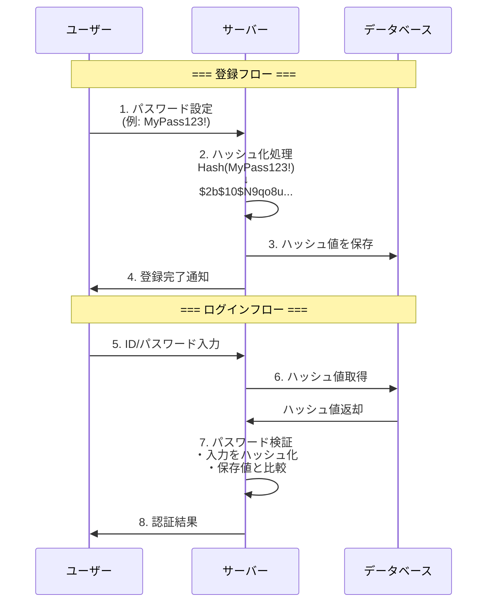
```mermaid
sequenceDiagram
    participant U as ユーザー
    participant S as サーバー
    participant DB as データベース
    
    Note over U,DB: === 登録フロー ===
    U->>S: 1. パスワード設定<br/>(例: MyPass123!)
    S->>S: 2. ハッシュ化処理<br/>Hash(MyPass123!)<br/>↓<br/>$2b$10$N9qo8u...
    S->>DB: 3. ハッシュ値を保存
    S->>U: 4. 登録完了通知
    
    Note over U,DB: === ログインフロー ===
    U->>S: 5. ID/パスワード入力
    S->>DB: 6. ハッシュ値取得
    DB->>S: ハッシュ値返却
    S->>S: 7. パスワード検証<br/>・入力をハッシュ化<br/>・保存値と比較
    S->>U: 8. 認証結果
```

#### ハッシュ化とソルト

ハッシュ化は、元のパスワードを全く別の文字列に変換する「一方向」の処理です。

- **不可逆性**: ハッシュ値から元のパスワードは復元できない
- **一意性**: 同じパスワードからは常に同じハッシュ値が生成される
- **雪崩効果**: パスワードが1文字違うだけで、全く異なるハッシュ値になる

「ソルト」は、パスワードをハッシュ化する際に追加するランダムな文字列で、レインボーテーブル攻撃を防ぎます。

### その他の知識認証

- **PINコード**: 4〜6桁程度の数字の組み合わせ
- **秘密の質問**: 「初めて飼ったペットの名前は？」など
- **パターン認証**: スマートフォンの画面上で特定のパターンを描く

## 2. 所持認証

**あなたが持っているもの**を使った認証です。

### SMS OTP（One-Time Password）

いわゆるワンタイムパスワードですね。


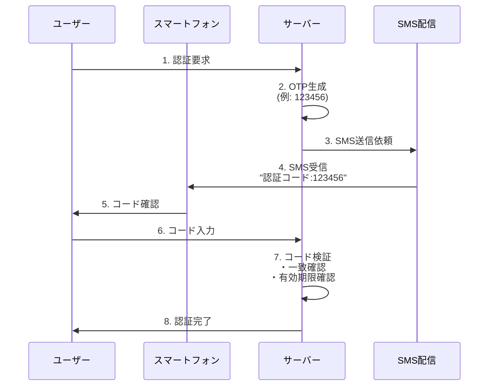
```mermaid
sequenceDiagram
    participant U as ユーザー
    participant P as スマートフォン
    participant S as サーバー
    participant SMS as SMS配信
    
    U->>S: 1. 認証要求
    S->>S: 2. OTP生成<br/>(例: 123456)
    S->>SMS: 3. SMS送信依頼
    SMS->>P: 4. SMS受信<br/>"認証コード:123456"
    P->>U: 5. コード確認
    U->>S: 6. コード入力
    S->>S: 7. コード検証<br/>・一致確認<br/>・有効期限確認
    S->>U: 8. 認証完了
```

### TOTP（Time-based One-Time Password）

Google AuthenticatorやMicrosoft Authenticatorなどのアプリを使用する方式です。

サーバ側とクライアント側で同じシークレットキーと現在時刻を使って、HMAC-SHA1アルゴリズムでコードを生成します。
※HMAC-SHA1は、メッセージとシークレットキーを入力として、固定長のハッシュ値を生成するアルゴリズムです。

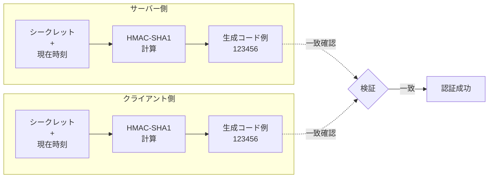
```mermaid
graph LR
    subgraph "サーバー側"
        SS[シークレット<br/>+<br/>現在時刻]
        SH[HMAC-SHA1<br/>計算]
        SC[生成コード例<br/>123456]
        SS --> SH --> SC
    end

    subgraph "クライアント側"
        CS[シークレット<br/>+<br/>現在時刻]
        CH[HMAC-SHA1<br/>計算]
        CC[生成コード例<br/>123456]
        CS --> CH --> CC
    end

    SC -.->|一致確認| V{検証}
    CC -.->|一致確認| V
    V -->|一致| OK[認証成功]
```

登録(有効化)からログインまでをシーケンスで整理します。

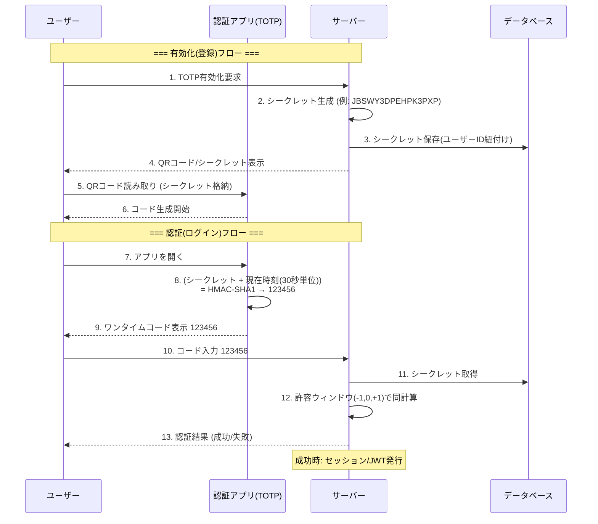
```mermaid
sequenceDiagram
    participant U as ユーザー
    participant A as 認証アプリ(TOTP)
    participant S as サーバー
    participant DB as データベース

    Note over U,S: === 有効化(登録)フロー ===
    U->>S: 1. TOTP有効化要求
    S->>S: 2. シークレット生成 (例: JBSWY3DPEHPK3PXP)
    S->>DB: 3. シークレット保存(ユーザーID紐付け)
    S-->>U: 4. QRコード/シークレット表示
    U->>A: 5. QRコード読み取り (シークレット格納)
    A-->>U: 6. コード生成開始

    Note over U,S: === 認証(ログイン)フロー ===
    U->>A: 7. アプリを開く
    A->>A: 8. (シークレット + 現在時刻(30秒単位))<br/>= HMAC-SHA1 → 123456
    A-->>U: 9. ワンタイムコード表示 123456
    U->>S: 10. コード入力 123456
    S->>DB: 11. シークレット取得
    S->>S: 12. 許容ウィンドウ(-1,0,+1)で同計算
    S-->>U: 13. 認証結果 (成功/失敗)

    Note over S: 成功時: セッション/JWT発行
```

### その他の所持認証

- **ハードウェアトークン**: YubiKeyなどの専用デバイス
- **プッシュ通知**: スマートフォンアプリへの承認通知

## 3. 生体認証（Something you are）

**あなた自身の身体的特徴**を使った認証です。

### 主な生体認証の種類

- **指紋認証**: 指紋のパターンで識別
- **顔認証**: 顔の特徴点で識別
- **虹彩認証**: 目の虹彩パターンで識別
- **声紋認証**: 声の特徴で識別
- **静脈認証**: 手のひらや指の静脈パターンで識別

# 認証の組み合わせ方式

ふたつ以上の認証要素を組み合わせることで、セキュリティを強化する方式です。

## 二要素認証（2FA: Two-Factor Authentication）

認証の3要素のうち、**異なる2つの要素**を組み合わせる方式です。

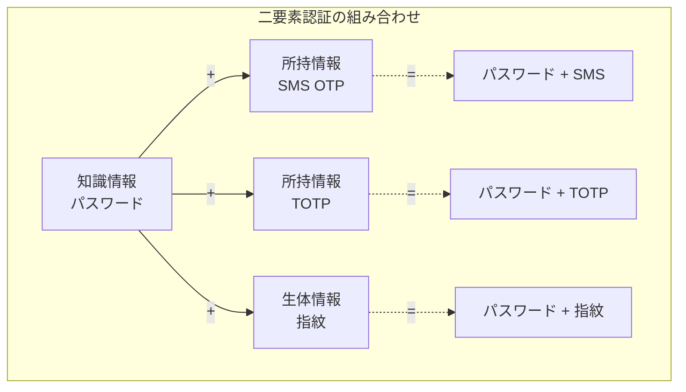
```mermaid
graph TB
    subgraph "二要素認証の組み合わせ"
        K[知識情報<br/>パスワード] 
        S1[所持情報<br/>SMS OTP]
        S2[所持情報<br/>TOTP]
        B[生体情報<br/>指紋]
        
        K -->|+| S1
        K -->|+| S2
        K -->|+| B
        
        S1 -.->|=| MFA1[パスワード + SMS]
        S2 -.->|=| MFA2[パスワード + TOTP]
        B -.->|=| MFA3[パスワード + 指紋]
    end
```

## 多要素認証（MFA: Multi-Factor Authentication）

2つ以上の異なる要素を組み合わせる方式の総称です。

# 認証連携・委譲方式

自サービスで直接認証を行うのではなく、他のサービスに認証を委譲する方式です。

## OAuth 2.0

OAuth 2.0は主に「認可」のためのプロトコルですが、実際には認証にも広く使用されています。

まずざっくり一言でいうと、「他サービスにあるあなたのデータへ、別のアプリが“必要な範囲だけ”触れるための代理アクセス仕組み」です。
例: 「この家計簿アプリが、あなたのGoogleカレンダー予定を“読み取りだけ”10分間見てもいい？」→ OK なら限定鍵を渡す。

OAuthの登場人物はこれらです。（例とともに）
- **Resource Owner**: あなた（データの持ち主）
- **Client**: 使いたいアプリ（家計簿アプリなど）
- **Authorization Server**: 許可を出す窓口（Googleの同意画面）
- **Resource Server**: 実データがあるAPI（Google Calendar API）

### OAuth 2.0の認証フロー

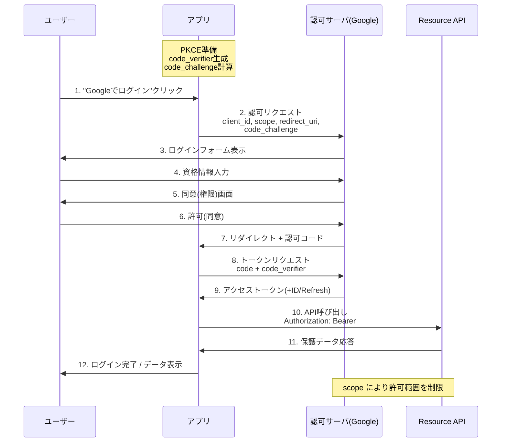
```mermaid
sequenceDiagram
    participant U as ユーザー
    participant A as アプリ
    participant G as 認可サーバ(Google)
    participant RS as Resource API

    Note over A: PKCE準備<br/>code_verifier生成<br/>code_challenge計算
    U->>A: 1. "Googleでログイン"クリック
    A->>G: 2. 認可リクエスト<br/>client_id, scope, redirect_uri,<br/>code_challenge
    G->>U: 3. ログインフォーム表示
    U->>G: 4. 資格情報入力
    G->>U: 5. 同意(権限)画面
    U->>G: 6. 許可(同意)
    G->>A: 7. リダイレクト + 認可コード
    A->>G: 8. トークンリクエスト<br/>code + code_verifier
    G->>A: 9. アクセストークン(+ID/Refresh)
    A->>RS: 10. API呼び出し<br/>Authorization: Bearer
    RS->>A: 11. 保護データ応答
    A->>U: 12. ログイン完了 / データ表示
    Note over G,RS: scope により許可範囲を制限
```

## OpenID Connect (OIDC)

OAuth 2.0の上に構築された「ユーザーが誰か」をIDトークンで伝える認証レイヤーです。

### OAuth 2.0との違い

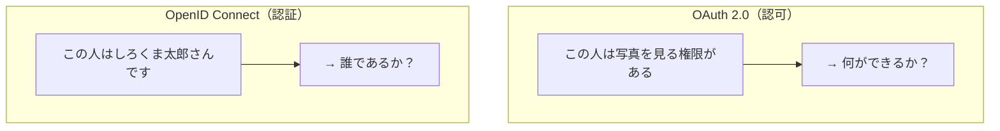
```mermaid
graph TB
    subgraph "OAuth 2.0（認可）"
        O1[この人は写真を見る権限がある]
        O2[→ 何ができるか？]
        O1 --> O2
    end
    
    subgraph "OpenID Connect（認証）"
        I1[この人はしろくま太郎さんです]
        I2[→ 誰であるか？]
        I1 --> I2
    end
```

なぜ OIDC が必要かというと、
素の OAuth 2.0 は「このトークンは写真読み取りができる」等の“権限”しかなく、“このユーザーはしろくまさん”を標準化していないことと、
OAuth 2.0 では各社バラバラのユーザー情報APIを呼ぶことがつらいからです。
OIDCだと、IDトークンで「このユーザーはしろくまさんです」と標準化され、UserInfoエンドポイントで追加情報を取得できるようになります。

### OIDCのフロー（Authorization Code + PKCE）

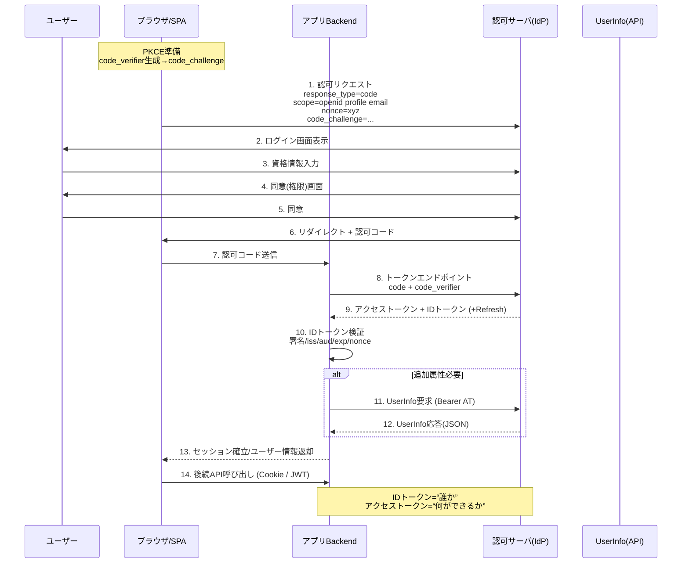
```mermaid
sequenceDiagram
    participant U as ユーザー
    participant B as ブラウザ/SPA
    participant BE as アプリBackend
    participant AS as 認可サーバ(IdP)
    participant UI as UserInfo(API)

    Note over B: PKCE準備<br/>code_verifier生成→code_challenge
    B->>AS: 1. 認可リクエスト<br/>response_type=code<br/>scope=openid profile email<br/>nonce=xyz<br/>code_challenge=...
    AS->>U: 2. ログイン画面表示
    U->>AS: 3. 資格情報入力
    AS->>U: 4. 同意(権限)画面
    U->>AS: 5. 同意
    AS->>B: 6. リダイレクト + 認可コード
    B->>BE: 7. 認可コード送信
    BE->>AS: 8. トークンエンドポイント<br/>code + code_verifier
    AS-->>BE: 9. アクセストークン + IDトークン (+Refresh)
    BE->>BE: 10. IDトークン検証<br/>署名/iss/aud/exp/nonce
    alt 追加属性必要
        BE->>AS: 11. UserInfo要求 (Bearer AT)
        AS-->>BE: 12. UserInfo応答(JSON)
    end
    BE-->>B: 13. セッション確立/ユーザー情報返却
    B->>BE: 14. 後続API呼び出し (Cookie / JWT)
    Note over BE,AS: IDトークン=“誰か”<br/>アクセストークン=“何ができるか”
```

### IDトークン

「このユーザーは誰か」をアプリに伝えるための“署名付きの身分証データ” です。中身は `ヘッダー.ペイロード.署名` の形をした JWT です。

混同しがちですが、Access Token との違いはこれらです。
- IDトークン: 「誰であるか」をアプリ内部で利用（APIに権限証明として渡さない）
- アクセストークン: 「何ができるか」をAPIに示すために送る

ざっくりイメージは、「写真付き社員証（IDトークン）」で本人確認 → 何ができるかは別の“アクセス許可証（アクセストークン）”を見る、という役割分担です。

## SAML

企業でのシングルサインオン(SSO)で昔からよく使われている仕組みです。難しく見えますが「会社の身分証を一度見せたら、他の社内サービスにも自動で入れる」ための共通ルールだと思えばOKです。

用語をざっくり解説
- IdP (Identity Provider): 本人確認の親玉ですね (社内ポータル / Azure AD など)
- SP (Service Provider): 利用したい個別サービス (勤怠、経費、メール 等)
- Assertion: IdP が「この人は○○さんで、ログイン済みです」と署名付きで書いたメモ

SP開始（最も多いパターン）の流れを生活例で
1. あなた(ユーザー)が 勤怠システム(SP) を開く
2. 勤怠システムは「この人まだ身分証確認してない」と判断し、社内ポータル(IdP)へ案内
3. ポータルでログイン（既にポータルで別タブログイン済みならスキップされる）
4. ポータルが「この人はしろくまさんです」と署名したメッセージ(Assertion)をブラウザ経由で勤怠システムへ送り返す
5. 勤怠システムは署名と有効期限などを確認し、自分のアプリ内セッションを作成してログイン完了

### SAML SP Initiated フロー（シーケンス図）

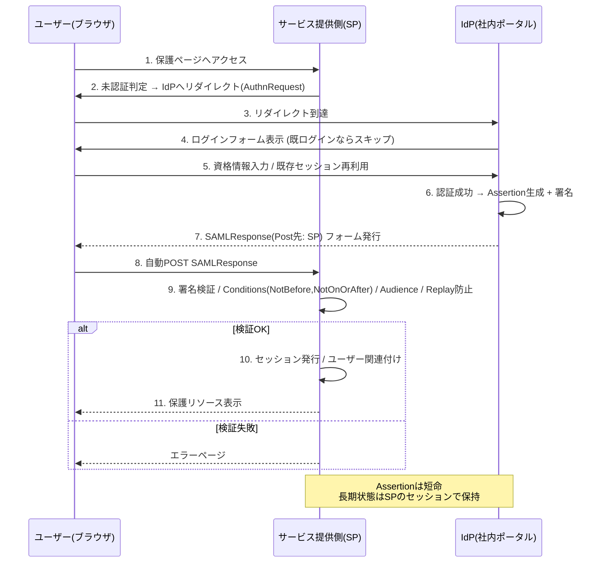
```mermaid
sequenceDiagram
    participant U as ユーザー(ブラウザ)
    participant SP as サービス提供側(SP)
    participant IdP as IdP(社内ポータル)

    U->>SP: 1. 保護ページへアクセス
    SP->>U: 2. 未認証判定 → IdPへリダイレクト(AuthnRequest)
    U->>IdP: 3. リダイレクト到達
    IdP->>U: 4. ログインフォーム表示 (既ログインならスキップ)
    U->>IdP: 5. 資格情報入力 / 既存セッション再利用
    IdP->>IdP: 6. 認証成功 → Assertion生成 + 署名
    IdP-->>U: 7. SAMLResponse(Post先: SP) フォーム発行
    U->>SP: 8. 自動POST SAMLResponse
    SP->>SP: 9. 署名検証 / Conditions(NotBefore,NotOnOrAfter) / Audience / Replay防止
    alt 検証OK
        SP->>SP: 10. セッション発行 / ユーザー関連付け
        SP-->>U: 11. 保護リソース表示
    else 検証失敗
        SP-->>U: エラーページ
    end
    Note over SP,IdP: Assertionは短命<br/>長期状態はSPのセッションで保持
```

## LDAP / Active Directory 連携

企業に既にある「社内ユーザー台帳（ディレクトリ）」をそのままログインに使わせてもらう仕組みです。<br/>
アプリが社内の“社員名簿サーバ”に「この人のIDとパスワード、正しい？」と聞いてOKならログインさせます。

ざっくりイメージは以下です。
```
社内共有電話帳(階層ツリー) = Directory
│
├── ou=Users
│    ├── cn=taro.suzuki (mail, password hash, 部署, 役職, 所属グループ)
│    └── cn=hanako.ito (...)
└── ou=Groups
     └── cn=DevTeam (member=cn=taro.suzuki,...)
```
アプリは “taro が入力したパスワード” を使ってそのツリーに「Bind(接続認証)」して成功すれば本人とみなします。

### 認証（シンプルBind）の流れ（シーケンス図）」

ユーザーが入力したID/パスワードを使って、アプリがLDAPサーバに接続し、認証を行う流れはこちらです。

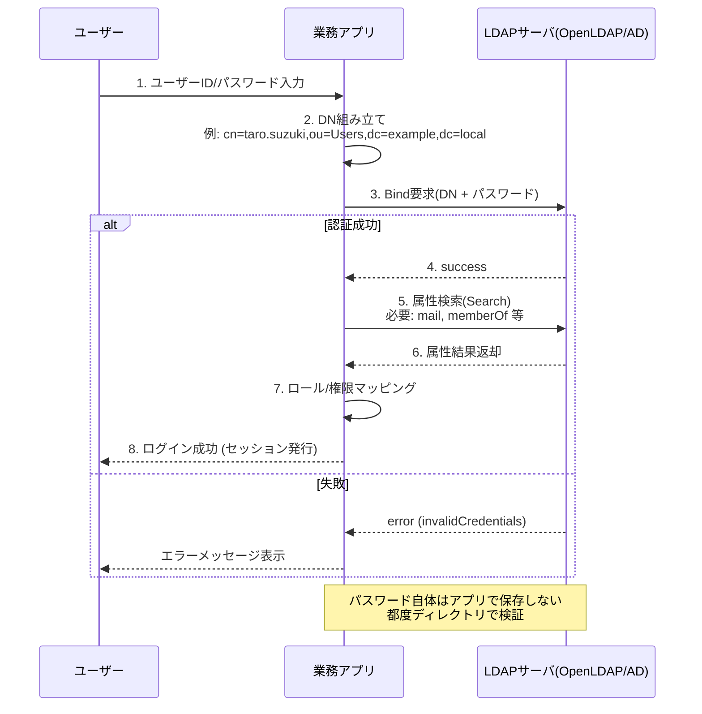
```mermaid
sequenceDiagram
    participant U as ユーザー
    participant APP as 業務アプリ
    participant LDAP as LDAPサーバ(OpenLDAP/AD)

    U->>APP: 1. ユーザーID/パスワード入力
    APP->>APP: 2. DN組み立て<br/>例: cn=taro.suzuki,ou=Users,dc=example,dc=local
    APP->>LDAP: 3. Bind要求(DN + パスワード)
    alt 認証成功
        LDAP-->>APP: 4. success
        APP->>LDAP: 5. 属性検索(Search)<br/>必要: mail, memberOf 等
        LDAP-->>APP: 6. 属性結果返却
        APP->>APP: 7. ロール/権限マッピング
        APP-->>U: 8. ログイン成功 (セッション発行)
    else 失敗
        LDAP-->>APP: error (invalidCredentials)
        APP-->>U: エラーメッセージ表示
    end
    Note over APP,LDAP: パスワード自体はアプリで保存しない<br/>都度ディレクトリで検証
```

# シングルサインオン（SSO）

## SSOとは
SSOは「一度ログインしたら、他の関連サービスでも再ログインなしで利用できるようにする仕組み・概念」です。<br/>
特定の“認証方式”そのものではなく、複数システム間で「認証済み状態を安全に伝搬させる」ためのアーキテクチャ上の考え方です。

メリット:
- 利便性: ユーザーの再入力負担を削減
- セキュリティ: パスワード入力回数減少によるフィッシング・ショルダーハックリスク低減
- 運用性: アカウント/権限の集中管理、退職時などの一括無効化

留意点:
- 単一IdP依存の障害インパクト増大 (冗長化/フェイルオーバー設計が重要)
- セッション/トークンの有効期限とリスクバランス調整
- ログ/Auditの一元化とプライバシー配慮


# 認証情報の管理方式

認証が成功した後、その状態をどのように管理するかも重要な要素です。

## セッションベース認証

サーバー側でセッション情報を保持する従来型の方式です。

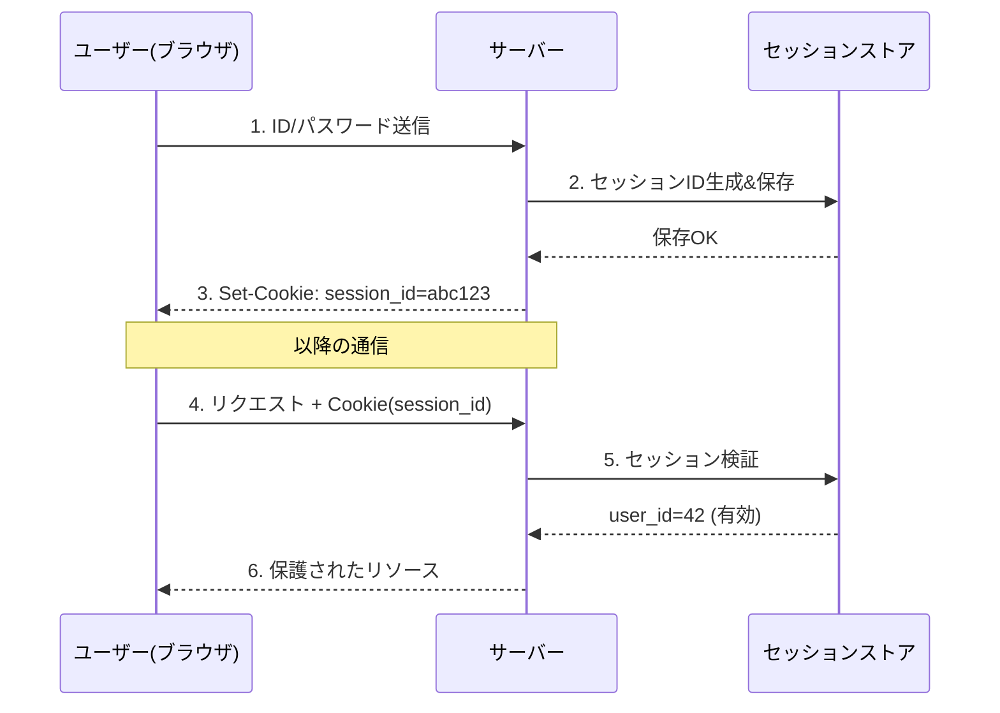
```mermaid
sequenceDiagram
    participant U as ユーザー(ブラウザ)
    participant S as サーバー
    participant ST as セッションストア

    U->>S: 1. ID/パスワード送信
    S->>ST: 2. セッションID生成&保存
    ST-->>S: 保存OK
    S-->>U: 3. Set-Cookie: session_id=abc123
    
    Note over U,S: 以降の通信
    U->>S: 4. リクエスト + Cookie(session_id)
    S->>ST: 5. セッション検証
    ST-->>S: user_id=42 (有効)
    S-->>U: 6. 保護されたリソース
```

### メリット・デメリット

**メリット**:
- サーバー側で状態を完全に制御
- セッションの無効化が簡単
- 実装がシンプル

**デメリット**:
- スケーラビリティの課題
- セッションストアの管理が必要
- サーバー間でのセッション共有が複雑

## トークンベース認証（JWT）

認証情報をトークン自体に含める、ステートレスな方式です。

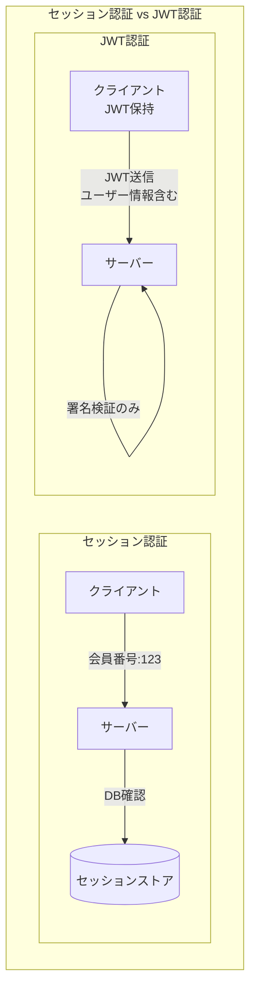
```mermaid
graph TB
    subgraph "セッション認証 vs JWT認証"
        subgraph "セッション認証"
            C1[クライアント] -->|会員番号:123| S1[サーバー]
            S1 -->|DB確認| DB1[(セッションストア)]
        end
        
        subgraph "JWT認証"
            C2[クライアント<br/>JWT保持] -->|JWT送信<br/>ユーザー情報含む| S2[サーバー]
            S2 -->|署名検証のみ| S2
        end
    end
```

### JWT構造

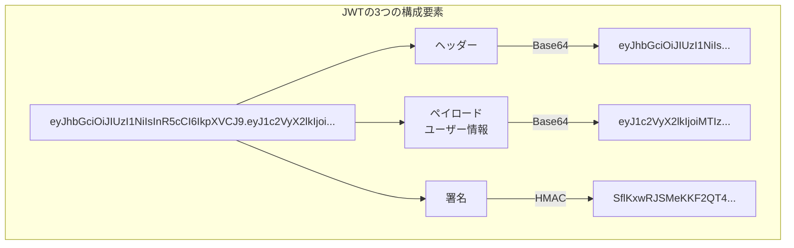
```mermaid
graph TB
    subgraph "JWTの3つの構成要素"
        JWT["eyJhbGciOiJIUzI1NiIsInR5cCI6IkpXVCJ9.eyJ1c2VyX2lkIjoi..."]
        
        JWT --> H[ヘッダー]
        JWT --> P[ペイロード<br/>ユーザー情報]
        JWT --> S[署名]
        
        H -->|Base64| HE["eyJhbGciOiJIUzI1NiIs..."]
        P -->|Base64| PE["eyJ1c2VyX2lkIjoiMTIz..."]
        S -->|HMAC| SE["SflKxwRJSMeKKF2QT4..."]
    end
```

### メリット・デメリット

**メリット**:
- スケーラビリティに優れる
- マイクロサービスに適している
- サーバー側の状態管理不要

**デメリット**:
- トークンの無効化が困難
- トークンサイズが大きい
- ペイロードの情報漏洩リスク

## ハイブリッド方式

セッションとトークンの両方の利点を活かす方式も存在します。

# 次世代認証技術

## パスキー（Passkey）/ WebAuthn

パスワードを完全に置き換える新しい認証方式です。

### パスワードとの根本的な違い

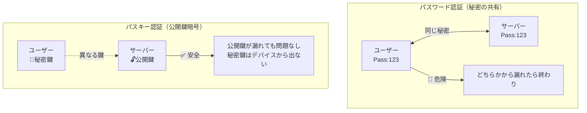
```mermaid
graph TB
    subgraph "パスワード認証（秘密の共有）"
        U1[ユーザー<br/>Pass:123] <-->|同じ秘密| S1[サーバー<br/>Pass:123]
        U1 -->|🚨 危険| R1[どちらかから漏れたら終わり]
    end
    
    subgraph "パスキー認証（公開鍵暗号）"
        U2[ユーザー<br/>🔐秘密鍵] -.->|異なる鍵| S2[サーバー<br/>🔓公開鍵]
        S2 -->|✅ 安全| R2[公開鍵が漏れても問題なし<br/>秘密鍵はデバイスから出ない]
    end
```

### パスキーの登録・認証フロー

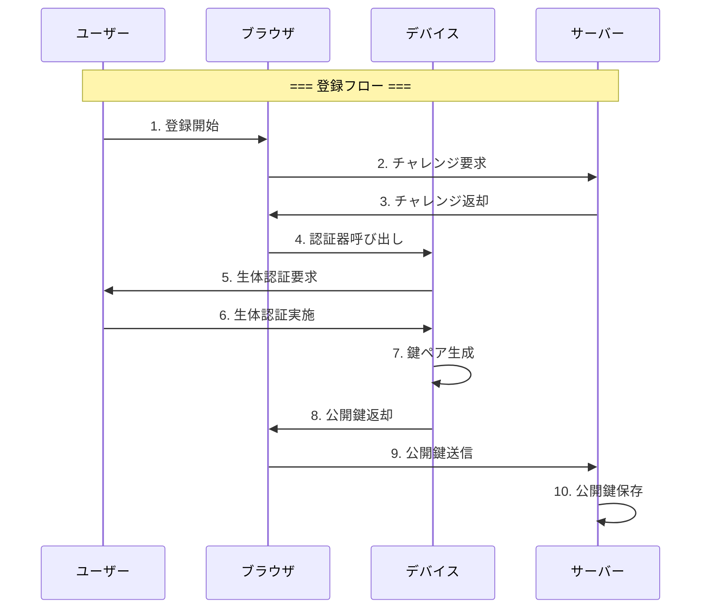
```mermaid
sequenceDiagram
    participant U as ユーザー
    participant B as ブラウザ
    participant D as デバイス
    participant S as サーバー
    
    Note over U,S: === 登録フロー ===
    U->>B: 1. 登録開始
    B->>S: 2. チャレンジ要求
    S->>B: 3. チャレンジ返却
    B->>D: 4. 認証器呼び出し
    D->>U: 5. 生体認証要求
    U->>D: 6. 生体認証実施
    D->>D: 7. 鍵ペア生成
    D->>B: 8. 公開鍵返却
    B->>S: 9. 公開鍵送信
    S->>S: 10. 公開鍵保存
```

### パスキーのメリット

1. **フィッシング完全耐性**: 偽サイトでは動作しない
2. **パスワード不要**: 覚える必要なし
3. **高速ログイン**: 生体認証だけで完了
4. **解読不可能**: 公開鍵暗号のため

## パスワードレス認証

パスワードを使わない認証方式の総称です。

### 実現方法

1. **マジックリンク**: メールで送られるワンタイムリンク
2. **生体認証のみ**: 指紋や顔認証だけで認証
3. **パスキー**: FIDO2/WebAuthn標準
4. **プッシュ通知認証**: モバイルアプリでの承認

## 継続的認証（Continuous Authentication）

ログイン時だけでなく、利用中も継続的に認証を行う方式です。

- 行動パターンの分析
- タイピングリズム
- マウスの動き
- アクセスパターン

# 認証方式の選定指針

## 認証技術の体系的な分類

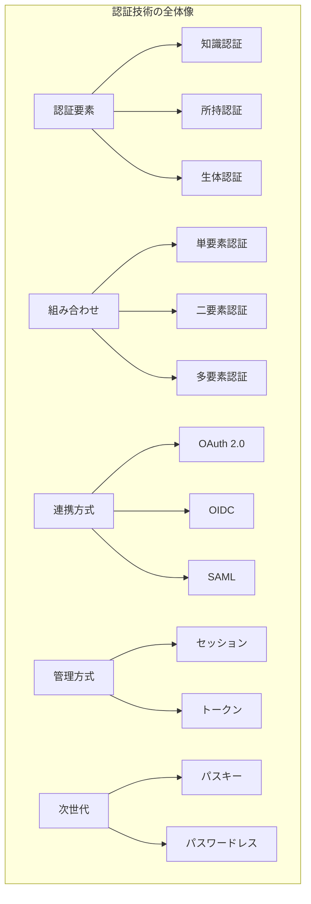
```mermaid
graph TB
    subgraph "認証技術の全体像"
        A[認証要素]
        A --> A1[知識認証]
        A --> A2[所持認証]
        A --> A3[生体認証]
        
        B[組み合わせ]
        B --> B1[単要素認証]
        B --> B2[二要素認証]
        B --> B3[多要素認証]
        
        C[連携方式]
        C --> C1[OAuth 2.0]
        C --> C2[OIDC]
        C --> C3[SAML]
        
        D[管理方式]
        D --> D1[セッション]
        D --> D2[トークン]
        
        E[次世代]
        E --> E1[パスキー]
        E --> E2[パスワードレス]
    end
```

## セキュリティレベル別の推奨構成

### レベル1: 低リスク（ニュースサイトなど）
```
基本: パスワード認証のみ
管理: セッションベース
```

### レベル2: 中リスク（ECサイト、SNS）
```
基本: パスワード認証 または OAuth 2.0
追加: オプションで2FA（SMS/TOTP）
管理: セッションまたはJWT
```

### レベル3: 高リスク（金融、医療）
```
基本: パスワード + 必須の2FA
追加: 取引時の追加認証
管理: 短期間のセッション/トークン
監査: 完全なログ記録
```

### レベル4: 最高リスク（政府、機密情報）
```
基本: 多要素認証（3要素すべて）
追加: 継続的認証、デバイス制限
管理: 短期トークン + 頻繁な再認証
監査: リアルタイム監視
```

## アプリケーションタイプ別の推奨

### B2C（一般消費者向け）
```yaml
メイン認証:
  - OAuth 2.0（Google, Facebook, Apple）
  - メール/パスワード（フォールバック）
  
追加セキュリティ:
  - 重要操作時の2FA
  
将来:
  - パスキー導入
```

### B2B（企業向け）
```yaml
メイン認証:
  - SAML SSO
  - OpenID Connect
  
必須要件:
  - 多要素認証
  - IPアドレス制限
  
管理:
  - JWT（API向け）
  - セッション（Web向け）
```

### 社内システム
```yaml
メイン認証:
  - Active Directory連携
  - LDAP
  
追加:
  - VPN必須
  - デバイス証明書
```

### API/マイクロサービス
```yaml
認証:
  - OAuth 2.0（Client Credentials）
  - JWT
  
追加:
  - API Key
  - mTLS（相互TLS認証）
```

## 実装時の考慮事項

### 技術選定チェックリスト

| 確認項目 | 考慮すべき点 |
|---------|------------|
| **ユーザー層** | 技術リテラシー、デバイス環境 |
| **セキュリティ要件** | 扱うデータの機密性、規制要件 |
| **スケーラビリティ** | 予想されるユーザー数、成長率 |
| **開発リソース** | チームのスキル、実装期間 |
| **運用コスト** | インフラ、サポート体制 |
| **将来性** | 技術の成熟度、標準化の状況 |

# セキュリティベストプラクティス

## 基本原則

### 1. 多層防御（Defense in Depth）

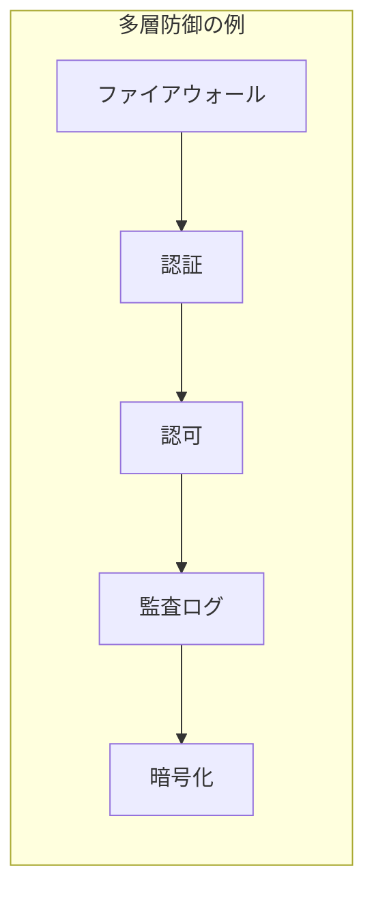
```mermaid
graph LR
    subgraph "多層防御の例"
        A[ファイアウォール] --> B[認証]
        B --> C[認可]
        C --> D[監査ログ]
        D --> E[暗号化]
    end
```

### 2. 最小権限の原則

必要最小限の権限だけを与える：
- 読み取りだけが必要なら、書き込み権限は与えない
- 一時的なアクセスなら、期限を設定
- 部門ごとにアクセス範囲を制限

### 3. ゼロトラストの考え方

「誰も信用しない、常に検証する」：
- 社内ネットワークでも認証必須
- 定期的な再認証
- アクセスのたびに権限確認

## よくある攻撃と対策

### パスワード関連の攻撃

| 攻撃手法 | 説明 | 対策 |
|---------|------|------|
| **ブルートフォース** | 総当たり攻撃 | ログイン試行回数制限、アカウントロック |
| **辞書攻撃** | よくあるパスワードを試す | パスワードポリシー、強度チェック |
| **レインボーテーブル** | 事前計算したハッシュ | ソルト、適切なハッシュ関数 |
| **フィッシング** | 偽サイトで情報窃取 | 2FA、パスキー、ユーザー教育 |

### セッション関連の攻撃

| 攻撃手法 | 説明 | 対策 |
|---------|------|------|
| **セッションハイジャック** | セッションID窃取 | HTTPS必須、定期的なID更新 |
| **セッション固定** | 攻撃者のIDを使わせる | ログイン後のID再生成 |
| **CSRF** | 意図しないリクエスト | CSRFトークン、SameSite Cookie |

## 実装上の注意点

### パスワードの取り扱い

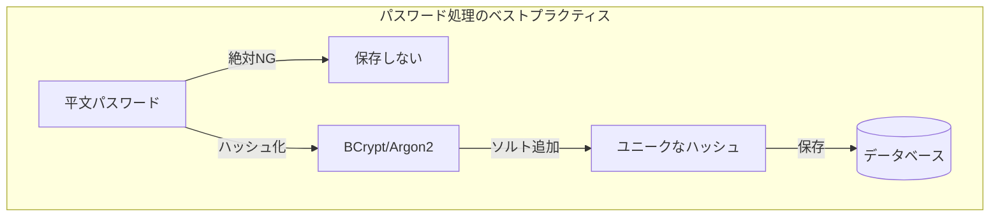
```mermaid
graph TB
    subgraph "パスワード処理のベストプラクティス"
        A[平文パスワード] -->|絶対NG| X[保存しない]
        A -->|ハッシュ化| B[BCrypt/Argon2]
        B -->|ソルト追加| C[ユニークなハッシュ]
        C -->|保存| D[(データベース)]
    end
```

### トークンの管理

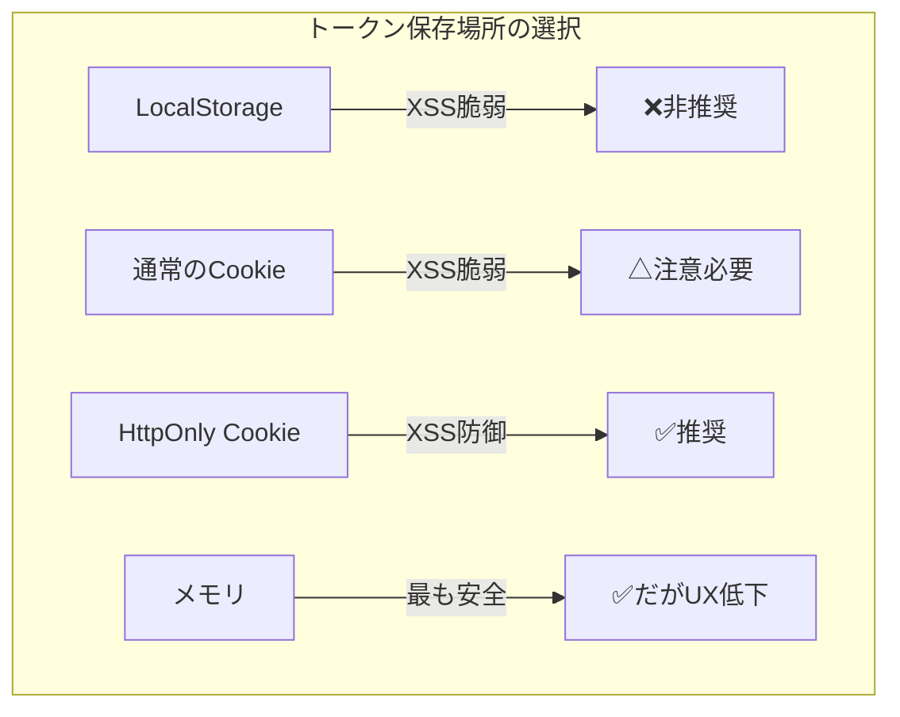
```mermaid
graph TB
    subgraph "トークン保存場所の選択"
        A[LocalStorage] -->|XSS脆弱| X1[❌非推奨]
        B[通常のCookie] -->|XSS脆弱| X2[△注意必要]
        C[HttpOnly Cookie] -->|XSS防御| O1[✅推奨]
        D[メモリ] -->|最も安全| O2[✅だがUX低下]
    end
```

# 段階的な実装アプローチ

## フェーズ1: 基礎構築（〜3ヶ月）

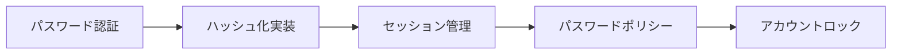
```mermaid
graph LR
    A[パスワード認証] --> B[ハッシュ化実装]
    B --> C[セッション管理]
    C --> D[パスワードポリシー]
    D --> E[アカウントロック]
```

### 実装項目
- 基本的なパスワード認証
- BCrypt/Argon2によるハッシュ化
- セッションベースの状態管理
- パスワード強度チェック
- ログイン試行回数制限

## フェーズ2: セキュリティ強化（3〜6ヶ月）

```mermaid
graph LR
    A[2FA追加] --> B[OAuth導入]
    B --> C[監査ログ]
    C --> D[HTTPS必須化]
```

### 実装項目
- TOTP/SMS認証の追加（オプション）
- ソーシャルログイン（OAuth 2.0）
- 詳細な監査ログ
- 全通信のHTTPS化

## フェーズ3: エンタープライズ対応（6〜12ヶ月）

```mermaid
graph LR
    A[SSO導入] --> B[SAML/OIDC]
    B --> C[MFA必須化]
    C --> D[コンプライアンス]
```

### 実装項目
- SAML/OIDC対応
- 企業向けSSO
- 多要素認証の必須化
- 規制要件への対応

## フェーズ4: 次世代技術（12ヶ月〜）

```mermaid
graph LR
    A[パスキー試験] --> B[段階的導入]
    B --> C[パスワードレス]
    C --> D[AI/ML活用]
```

### 実装項目
- パスキーのパイロット導入
- パスワードレスオプション
- 行動分析による異常検知
- 継続的認証の実装

# まとめ

## 認証技術の選定フローチャート

```mermaid
graph TD
    Start[認証方式の選定] --> Q1{扱うデータは<br/>機密性が高い？}
    Q1 -->|Yes| Q2{企業向け？}
    Q1 -->|No| Simple[パスワード認証<br/>+ オプション2FA]
    
    Q2 -->|Yes| Enterprise[SAML/OIDC<br/>+ 必須MFA]
    Q2 -->|No| Q3{金融・医療？}
    
    Q3 -->|Yes| High[必須2FA<br/>+ 短期セッション<br/>+ 監査ログ]
    Q3 -->|No| Medium[OAuth 2.0<br/>+ 推奨2FA]
    
    Simple --> Future{将来性を<br/>考慮？}
    Medium --> Future
    High --> Future
    Enterprise --> Future
    
    Future -->|Yes| Modern[パスキー導入<br/>検討]
    Future -->|No| End[実装開始]
    Modern --> End
```

## 重要なポイント

### 1. 体系的な理解
- 認証要素（3要素）を理解する
- 各技術の位置づけを把握する
- 適材適所で技術を選定する

### 2. セキュリティと利便性のバランス
- ユーザー体験を損なわない
- リスクに応じた適切な強度
- 段階的な強化アプローチ

### 3. 将来を見据えた設計
- パスワードレスへの移行準備
- 標準規格の採用
- 拡張性のあるアーキテクチャ

## これからの認証技術

**短期的トレンド（1-2年）**:
- パスキーの本格普及
- MFAの標準化
- AIによる異常検知

**中期的トレンド（3-5年）**:
- 完全パスワードレス化
- 継続的認証の一般化
- 分散型IDの実用化

**長期的展望（5-10年）**:
- 量子耐性暗号への移行
- 完全に透明な認証
- 生体認証の高度化

## エンジニアとしての心構え

認証技術は、単なる実装の問題ではありません。ユーザーの安全とプライバシーを守る重要な責任があります。

1. **ユーザーファースト**: 技術的に優れていても、使いにくければ意味がない
2. **セキュリティバイデザイン**: 後付けではなく、設計段階から考慮
3. **継続的な学習**: 新しい脅威と対策を常にキャッチアップ
4. **バランス感覚**: 完璧を求めすぎず、現実的な解を選択

認証は、デジタル社会の信頼の基盤です。この記事が、体系的な理解と実践的な実装の一助となれば幸いです。