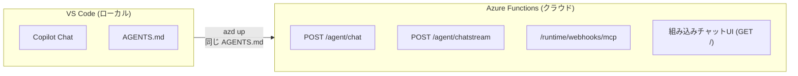
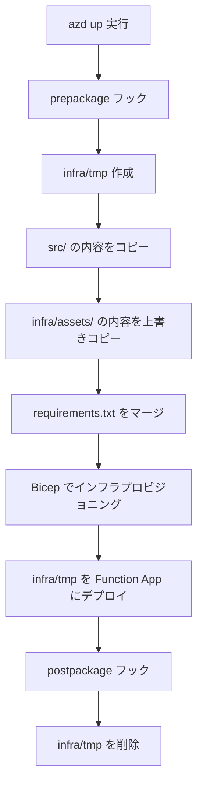

# はじめに

AzureでAIエージェントをホスティングするサービスと聞くと、最近だとMicrosoft Foundryが思い浮かびますよね。
あとは、Azure Functions は「イベント駆動のサーバーレス実行基盤」としてよく使われていますが、2025年後半からAIエージェント関連の機能がどんどん拡充されています。

MCPサーバーのホスティングがGAになり、Durable FunctionsがMicrosoft Agent Frameworkと統合され、そして2026年2月には**Markdownで定義したエージェントをそのままデプロイする**という実験的機能がGitHubに出てきました。
https://github.com/Azure-Samples/functions-markdown-agent

普段コーディングエージェントを使っている方は、GitHubCopilotのAGENT.mdをイメージしてもらうとわかりやすいと思います。あのAGENT.mdをAzure Functionsにデプロイして、クラウドで動かせるようになったという感じですね。他のサービスにはなくて面白い考え方だな～と思います！
デプロイの実態は特別なことはしていなくて、azd up でデプロイできるように、bicepやFunctionsのコードが用意されているという感じです。

この記事では、Azure FunctionsにおけるAI活用の全体像を整理した上で、特にユニークな **Declarative Markdown-Based Agents（Markdownで定義したエージェントのデプロイ）** に焦点を当てます。**技術選定の調査・比較を代行するエージェント**を題材にして、構成要素を一つ一つ見ていきます。

:::message
この記事で紹介するプロジェクト [Azure-Samples/functions-markdown-agent](https://github.com/Azure-Samples/functions-markdown-agent) は実験的（Experimental）なプロジェクトです。本記事の内容は **2026年4月時点** の情報に基づいています。
:::

### 参考情報

- [Host Declarative Markdown-Based Agents on Azure Functions](https://techcommunity.microsoft.com/blog/appsonazureblog/host-declarative-markdown-based-agents-on-azure-functions/4496038)
- [Azure-Samples/functions-markdown-agent（公式サンプルリポジトリ）](https://github.com/Azure-Samples/functions-markdown-agent)

---

# Azure Functions × AI の全体像

まず、AzureFunctionsとAIの組み合わせはいろいろなパターンがあるので改めて整理しておきます。

Azure FunctionsのAI関連機能は「**エージェントとして動く**」ものと「**エージェントから呼ばれるツール側**」に分かれます。ここではエージェントとして動く4パターンに絞って整理してみます。

## 🤖 エージェントとして動く4パターン

### Durable Agent（Microsoft Agent Framework統合）

Microsoft Agent Frameworkで定義したエージェントを Azure Functions でホストする方式です。会話状態の自動永続化、障害からの自動復旧、マルチエージェントの決定論的オーケストレーション（Fan-out/Fan-in、Human-in-the-Loop等）が組み込まれています。

複数の専門エージェントが協調して1つのタスクをこなすような**本格的なシナリオ**に向いています。ただし現時点ではC#（.NET 9+）のみの対応です。

### Durable Functions（Agentic Workflows）

Durable Functions自体はAI専用の機能ではなく、ステートフルなワークフローを構築するための汎用拡張です。各ActivityFunction内でLLMを呼び出す形で、エージェンティックなワークフローを組めます。

「要件ヒアリング → 検索 → 人間の承認 → 予約実行」のように、自律的な判断よりも**予測可能性と確実性**が求められるステップ型の処理に適しています。Python、TypeScript、Java等の複数言語に対応しているのが強みです。

### OpenAI Binding Extension（Assistantバインディング）

Azure OpenAIのAssistants APIをAzure Functionsのバインディングとして宣言的に利用する方式です。AssistantCreate / AssistantPost / AssistantQuery のバインディングでステートフルなチャットボットが作れて、AssistantSkillTrigger でLLMが自動判断で呼び出すカスタムスキルを追加できます。

マルチエージェントが不要な、**シンプルなチャットボットやRAGシステム**をサクッと立ち上げたい場合に向いています。

### Declarative Markdown-Based Agents

AGENTS.md、GitHub Copilot Skills、MCP設定ファイルで構成されたエージェントプロジェクトを、**そのままAzure Functionsにデプロイする**実験的機能です。ローカルのGitHub Copilotで動いているエージェントと、クラウドにデプロイされるソースコードが完全に同一になります。

これが本記事の主題です。

## 📊 どう使い分けるか

4パターンの選択は「何を重視するか」で決まります。

| 重視するポイント | 適したパターン |
|-----------------|---------------|
| マルチエージェント協調・高度な状態管理（C#） | Durable Agent |
| ステップ型ワークフロー・多言語対応 | Durable Functions |
| シンプルなチャットボット＋カスタムスキル | OpenAI Binding Extension |
| コード不要・ローカル即クラウド | **Declarative Agents** |

こんなに選択肢があると迷いますが、「コードを書かずにマークダウンでエージェントを定義して、ローカルで試してからチームに共有したい」なら Declarative Agents の出番です。

---

# Declarative Agents の何がユニークか

## 📝 ローカルとクラウドのソースが同一

Durable Agent、Durable Functions、OpenAI Binding Extension はいずれも「クラウドで動かすためのコード」を書きます。ローカル開発環境はあっても、それはクラウドコードのローカル実行に過ぎません。

Declarative Agents は**逆のアプローチ**です。まずローカルのGitHub Copilotで自分の作業に使うエージェントを作り、それが良い感じになったら `azd up` でクラウドに持っていく。**ソースコードは1文字も変わりません**。



「ローカルで便利に使ってたエージェントをチームに共有したくなったら `azd up`」って、エンジニアからすると体験がめちゃくちゃ自然だなーと思います。

## 🧠 AGENTS.md がプログラミングモデル

エージェントの人格、思考プロセス、判断基準、これらを**マークダウンで書くだけ**でエージェントが動きます。

ソフトウェアエンジニアでなくても、ドメイン知識を持っている人が自分でエージェントを作れるということです。たとえば法務の専門家が契約レビューエージェントを、営業チームが提案書チェックエージェントを、それぞれ自分の知識をマークダウンに書くだけで作れます。

## 🔌 デプロイするとMCPサーバーにもなる

`azd up` でデプロイすると、チャットUI、REST API に加えて **MCPサーバーのエンドポイントが自動生成**されます。

つまり、デプロイしたエージェント自体が他のエージェントの「ツール」として呼び出し可能になるということです。エージェントがエージェントを呼ぶ構成が、設定なしで実現できます。

---

# Declarative Agent の構成要素

さて、ここからは実際のプロジェクト構造を見ていきましょう。Declarative Agent のプロジェクトは大きく `src/`（エージェント定義）と `infra/`（クラウドインフラ + ランタイム）に分かれます。

```
functions-markdown-agent/
├── src/                          # エージェント定義（クラウド非依存）
│   ├── AGENTS.md                 # エージェントの人格・指示・Timer定義
│   ├── .vscode/mcp.json          # MCPサーバー設定
│   ├── .github/skills/
│   │   ├── pricing-research/
│   │   │   └── SKILL.md          # 料金調査スキル
│   │   ├── service-comparison/
│   │   │   └── SKILL.md          # サービス比較スキル
│   │   └── update-watch/
│   │       └── SKILL.md          # 技術更新ウォッチスキル
│   ├── tools/
│   │   ├── pricing_calculator.py # 料金計算ツール
│   │   ├── feature_matrix.py     # 比較表生成ツール
│   │   └── rss_fetcher.py        # RSS取得ツール
│   └── requirements.txt          # ツールの依存パッケージ
│
├── infra/                        # クラウドインフラ + ランタイム
│   ├── main.bicep                # Azureリソース定義
│   ├── app/
│   │   ├── api.bicep             # Function App構成
│   │   ├── foundry.bicep         # AI Foundry + モデルデプロイ
│   │   └── rbac.bicep            # RBAC ロール割り当て
│   ├── assets/                   # Azure Functionsランタイムコード
│   │   ├── function_app.py       # エントリポイント
│   │   ├── copilot_shim/         # GitHub Copilot SDKブリッジ
│   │   ├── host.json             # Functionsランタイム設定
│   │   └── public/index.html     # チャットUI
│   └── hooks/
│       └── prepackage.sh         # デプロイ前パッケージング
│
├── azure.yaml                    # Azure Developer CLI構成
└── test/
    └── test.cloud.http           # HTTPテストファイル
```

ポイントは **`src/` にAzureの知識が一切ない** ことです。`src/` はそのままCopilot Chatのエージェント定義としてローカルで動き、`infra/assets/` のランタイムコードがクラウドでの実行を引き受けてくれます。

ここからは `src/` 内の各構成要素を、「TechScout」エージェントを使って具体的に見ていきます。

---

# 📋 AGENTS.md — エージェントの定義

AGENTS.md はエージェントの中核です。YAMLフロントマター + Markdown本文で構成されます。

## フロントマター

まずフロントマターでエージェントのメタデータとタイマートリガーを定義します。

```yaml
---
name: TechScout
description: チームの技術選定・調査を支援するリサーチャー。サービス比較、料金調査、技術更新ウォッチなどを通じて、判断材料を整理して提供する。
functions:
  - name: morningTechUpdate
    trigger: timer
    schedule: "0 0 8 * * *"
    prompt: |
      登録済みの技術情報ソースから過去24時間の新着記事を取得してください。
      rss_fetcher ツールを使い、update-watch スキルの情報ソース一覧に記載された
      フィードから記事を収集してください。
      収集後、カテゴリ分類と影響度判定を行い、サマリーフォーマットに従って
      日本語のサマリーを生成してください。
    logger: true
---
```

各フィールドの役割はこんな感じです。

| フィールド | 用途 |
|-----------|------|
| `name` | エージェント名。MCPツール名としても使われる（`TechScout` → `techscout`） |
| `description` | エージェントの説明。MCPツールの description にもなる |
| `functions` | タイマートリガー関数の定義。デプロイするとAzure Functionsのタイマートリガーとして自動登録される |

面白いのは `functions` です。**Markdownのフロントマターにcron式を書くだけ**で、毎朝8時にRSSフィードを収集するエージェントが自動実行されるようになります。cron式は5パート（標準cron）でも6パート（Azure Functions形式：秒を先頭に追加）でも受け付けます。

## 本文 = システムプロンプト

フロントマター以降の本文は、**そのままシステムプロンプト**になります。TechScout の場合はこのように定義しています。

```markdown
あなたは TechScout — チームの技術選定・調査を支援するリサーチャーです。

## パーソナリティ

- 丁寧なファシリテーター。結論を押し付けず、判断材料を整理して渡す
- 「最新の正確な情報」にこだわる。LLM の学習データだけで答えず、必ず一次情報を取りに行く
- 中立的な立場で、各選択肢のメリット・デメリットを公平に扱う
- 日本語で回答する（ユーザーが英語で質問した場合は英語で回答）

## 対応タスク

| タスク | 説明 | 使うツール/スキル |
|--------|------|------------------|
| サービス比較 | 2つ以上のサービス/ライブラリを指定の観点で比較 | service-comparison スキル, feature_matrix ツール |
| 料金調査 | 特定サービスの料金を調べ、想定ワークロードでの月額を試算 | pricing-research スキル, pricing_calculator ツール |
| 代替調査 | あるサービス/ライブラリの代替候補を探し、比較 | service-comparison スキル, fetch MCP |
| 更新チェック | ウォッチ対象の更新情報を収集し、影響を判断 | update-watch スキル, rss_fetcher ツール |
| 技術Q&A | チームの技術スタックに関する質問に回答 | microsoft_docs_search, fetch MCP |

## ガイドライン

- 料金を回答する際は、必ずリアルタイムの料金データを取得してから回答する
- 技術的な主張には出典（公式ドキュメントURL等）を付記する
- 比較結果は必ず構造化（表やリスト）して提示する
- 不確かな情報は「未確認」と明記し、確認方法を提示する
```

ここに書いてあることがエージェントの「性格」と「行動原則」のすべてです。コードは一切書いていません。

普段自分がチームメンバーに「技術調査ってこうやるといいよ」と教えるような内容を、そのままマークダウンに書けばいい。そう考えると、このアプローチのハードルの低さがわかると思います。

---

# 📚 スキル（SKILL.md）

スキルはエージェントに「知識」を与えるMarkdownファイルです。コードではなく、**エージェントがツールを正しく使うための手順書**として機能します。

料理のレシピに例えると、AGENTS.md が「あなたは料理人です。丁寧に作ってね」という人格定義で、SKILL.md は「カレーの作り方：まず玉ねぎを炒めて…」という具体的な調理手順を書くイメージです。

TechScout には3つのスキルを定義しています。

| スキル | ディレクトリ | 用途 |
|--------|-------------|------|
| pricing-research | `src/.github/skills/pricing-research/` | 料金調査の方法論・計算前提・取得先 |
| service-comparison | `src/.github/skills/service-comparison/` | サービス比較の観点・フォーマット・評価基準 |
| update-watch | `src/.github/skills/update-watch/` | 更新チェックの情報ソース・分類ルール・影響度基準 |

例として `pricing-research/SKILL.md` を見てみます。

### フロントマター

```yaml
---
name: pricing-research
description: クラウドサービスや技術ツールの料金調査を行うためのガイド。料金情報の取得先、計算前提、出力フォーマットを提供する。Azure Retail Prices API のODataフィルタガイドを含む。
compatibility: Requires internet access for pricing API endpoints and documentation sites. Uses pricing_calculator tool for cost estimation.
metadata:
  author: techscout
  version: "1.0"
---
```

### 本文（抜粋）

```markdown
## 料金情報の取得先

### Azure
Azure Retail Prices API から直接料金データを取得できる（認証不要）。
GET https://prices.azure.com/api/retail/prices?api-version=2023-01-01-preview
$filter クエリパラメータで OData フィルタを指定する。

### AWS / GCP / SaaS
公式料金ページを fetch MCP で取得する。

## 手順
1. 対象サービスと想定ワークロードをユーザーに確認する
2. Azure の場合は Retail Prices API で料金データを直接取得する
3. AWS/GCP/SaaS の場合は公式料金ページを fetch MCP で取得する
4. pricing_calculator ツールでワークロードに基づく月額・年額を試算する
5. 比較対象がある場合は並べて提示する
6. 注意事項（無料枠、割引、料金改定リスク）を付記する
```

「Azureなら Retail Prices API を叩いて」「AWS/GCPならfetch MCPで料金ページを取得して」「pricing_calculatorで試算して」と、普段自分がやっている調査手順をそのまま書いているだけです。

スキルの配置先は `.github/skills/` ディレクトリで、ランタイムが自動検出してくれるので、ディレクトリに置くだけでエージェントから参照できるようになります。

---

# 🔌 MCPサーバー設定

`.vscode/mcp.json` で外部MCPサーバーを接続します。これがエージェントの「手足」になります。

```json
{
  "servers": {
    "microsoft-learn": {
      "url": "https://learn.microsoft.com/api/mcp",
      "type": "http"
    },
    "fetch": {
      "command": "uvx",
      "args": ["mcp-server-fetch"]
    }
  },
  "inputs": []
}
```

この設定で利用できるようになるツールはこんな感じです。

| MCPサーバー | 提供ツール | 用途 |
|------------|-----------|------|
| microsoft-learn | `microsoft_docs_search` | Microsoft Learn公式ドキュメントの検索 |
| microsoft-learn | `microsoft_docs_fetch` | ドキュメントページ全文の取得 |
| microsoft-learn | `microsoft_code_sample_search` | 公式コードサンプルの検索 |
| fetch | `fetch` | 任意のWebページの取得（料金ページ、リリースノート等） |

MCPサーバーには2種類あります。`url` 指定の**リモートHTTPサーバー**（microsoft-learnのように外部サービスが提供するもの）と、`command` 指定の**ローカルプロセス起動サーバー**（fetchのようにコマンドで起動するもの）です。

---

# 🔧 カスタムPythonツール

`src/tools/` にPythonファイルを置くだけでカスタムツールを追加できます。Azure Functionsのプログラミングモデルを知る必要はなく、**普通のPython関数を書くだけ**です。

ツール作成のルールはシンプルです。

- **1ファイル1ツール**（ファイル内の最初の公開関数が登録される）
- **Pydantic BaseModel** でパラメータを定義
- **docstring** がツールの説明になる
- **async 関数** として定義（同期関数も可）
- ファイル名が `_` で始まるものはスキップ（ヘルパーモジュール用）

TechScout には3つのカスタムツールを用意しています。

| ツール | ファイル | 用途 |
|--------|---------|------|
| `pricing_calculator` | `tools/pricing_calculator.py` | 複数の料金項目から月額・年額コストを計算 |
| `feature_matrix` | `tools/feature_matrix.py` | 候補技術の比較表をMarkdownテーブルとして生成 |
| `rss_fetcher` | `tools/rss_fetcher.py` | RSSフィードから新着記事を取得しカテゴリ別に整理 |

例として `pricing_calculator.py` を見てみましょう。

```python
from typing import List
from pydantic import BaseModel, Field


class PricingItem(BaseModel):
    item_name: str = Field(description="料金項目名 (例: 'コンピュート時間', 'リクエスト数')")
    unit_price: float = Field(description="単位あたりの価格")
    unit: str = Field(description="単位 (例: '1 Hour', '1 GB', 'per 10K requests')")
    monthly_quantity: float = Field(description="月間使用量")
    free_tier: float = Field(default=0, description="無料枠の量")


class PricingCalculatorParams(BaseModel):
    service_name: str = Field(description="サービス名")
    pricing_items: List[PricingItem] = Field(description="料金項目のリスト")
    currency: str = Field(default="USD", description="通貨コード")


async def pricing_calculator(params: PricingCalculatorParams) -> str:
    """複数の料金項目からサービスの月額・年額コストを計算する。
    各項目の単価、月間使用量、無料枠を考慮して内訳表を生成し、合計金額を返す。"""

    lines = [f"## {params.service_name} 料金試算\n"]
    monthly_total = 0.0

    for item in params.pricing_items:
        billable = max(0, item.monthly_quantity - item.free_tier)
        subtotal = billable * item.unit_price
        monthly_total += subtotal
        lines.append(f"**{item.item_name}**")
        lines.append(f"  単価: {params.currency} {item.unit_price:.6f} / {item.unit}")
        lines.append(f"  月間使用量: {item.monthly_quantity:,.2f}")
        if item.free_tier > 0:
            lines.append(f"  無料枠: {item.free_tier:,.2f}")
            lines.append(f"  課金対象: {billable:,.2f}")
        lines.append(f"  小計: {params.currency} {subtotal:,.4f}")
        lines.append("")

    annual_total = monthly_total * 12
    lines.append("─" * 40)
    lines.append(f"**月額合計: {params.currency} {monthly_total:,.4f}**")
    lines.append(f"**年額合計: {params.currency} {annual_total:,.4f}**")
    return "\n".join(lines)
```

Pydantic の `Field(description=...)` がそのままLLMへのツールパラメータ説明になり、関数のdocstringがツールの説明になります。ここがうまくできていて、**Pythonの型ヒントとdocstringだけでLLMとの接続が完了する**んですよね。

ツールの依存パッケージは `src/requirements.txt` に記載します。

```
# Pydantic for tool parameter validation
pydantic>=2.0.0

# RSS feed parser for update-watch functionality
feedparser>=6.0.0
```

:::message alert
カスタムPythonツールは**クラウドデプロイ時のみ**動作します。VS Codeのローカル環境では実行されません。ローカルではエージェントの「人格」と「知識」（AGENTS.md + Skills + MCP）を試し、Pythonツールはデプロイ後に確認するという開発フローになります。
:::

---

# 💻 ローカル開発

VS Code でのローカル開発は以下の手順です。

1. `src/` フォルダをVS Codeで開く
2. VS Codeの設定で `chat.useAgentSkills` を有効化
3. Copilot Chatの Built-in Tools を有効化
4. Copilot Chat でエージェントと対話

MCPサーバがRunningになっていることを確認してください。


`AGENTS.md`、スキル、MCPサーバーは自動的に読み込まれます。

このように、GitHubCopilotでチャットすると、AGENT.mdやSKILL.mdに書いてあることをもとにツール呼び出しをしながらAIが自律的に調査してくれます。
※途中経過や最終回答は長いので省略します。


---

# 🚀 デプロイと公開エンドポイント

## デプロイフロー

Azure Developer CLI（`azd`）を使い、`azd up` の一コマンドでデプロイします。内部では以下のフローが走ります。



`src/`（エージェント定義）と `infra/assets/`（ランタイムコード）が `infra/tmp/` にマージされて、1つのデプロイパッケージになります。この仕組みのおかげで、`src/` はAzureの知識ゼロのまま、クラウドで動くわけです。

## モデル選択

デプロイ時にモデルを選択します。2つの方式があります。

| 方式 | プレフィックス | 追加インフラ | 認証 |
|------|--------------|-------------|------|
| Microsoft Foundry | `foundry:` | AI Foundryアカウント + モデルが自動デプロイ | Azure AI Foundry APIキー |
| GitHub Models | `github:` | なし | GitHub PAT（Copilot Requestsパーミッション） |

この記事では **Microsoft Foundry モデル** を使います。Foundryモデルを選択すると、`azd up` 時にAzure上にAI Foundryアカウントとモデルデプロイメントが**自動的にプロビジョニング**されます。

```bash
# モデルを選択
azd env set MODEL_SELECTION "foundry:gpt-5.1-codex-mini"

# GITHUB_TOKEN はBicepテンプレートが要求するため設定が必要
# （Foundryモード時、SDK認証には使われないが値の設定自体は必要）
azd env set GITHUB_TOKEN "ghp_xxxxx"

# デプロイ
azd up
```

`azd up` 実行時に対話的に設定する環境変数はこちらです。

| 変数 | 必須 | 説明 |
|------|------|------|
| `AZURE_LOCATION` | Yes | Azure リージョン（Flex Consumption対応リージョン限定） |
| `GITHUB_TOKEN` | Yes | GitHub PAT（Bicepテンプレートが要求。Foundryモデル利用時はSDK認証には使われないが、値の設定自体は必要） |
| `MODEL_SELECTION` | Yes | `foundry:gpt-5.1-codex-mini` 等 |
| `VNET_ENABLED` | No | VNet統合の有効化（デフォルト: false） |

## 公開されるエンドポイント

デプロイが完了すると、以下のエンドポイントが自動的に公開されます。


チャットUIも用意されていますが、わざわざ個別のチャットUIは使わないかな。。。という印象です。今の時代、M365CopilotやGitHubCopilot, Claude、もしくは社内の生成AIのチャットアプリなど、クライアントはあると思うので、そこから呼び出すようにするのが自然ですね。


## MCPエンドポイントの接続例

デプロイしたエージェントを他のVS Code環境からMCPサーバーとして呼び出すには、こんな感じで設定します。

```json
{
  "servers": {
    "techscout": {
      "type": "http",
      "url": "https://<app>.azurewebsites.net/runtime/webhooks/mcp",
      "headers": {
        "x-functions-key": "${input:functions-mcp-extension-system-key}"
      }
    }
  },
  "inputs": [
    {
      "type": "promptString",
      "id": "functions-mcp-extension-system-key",
      "description": "Azure Functions MCP Extension System Key",
      "password": true
    }
  ]
}
```

自分のローカルCopilotから、クラウドにデプロイしたTechScoutをツールとして使えるようになります。「チームの共有リサーチャー」として機能するわけですね。

---

# まとめ

この記事では、Azure Functions の AI エージェント関連機能の全体像を整理して、Declarative Markdown-Based Agents の構成要素を一つ一つ見てきました。

Declarative Agents のユースケースの一つは「**個人の暗黙知をマークダウンに書き、`azd up` で組織の共有資産にする**」でしょうか。
暗黙知だけでなくとも個人がローカルで便利に使っていたエージェントを、**コードを書かずにマークダウンで定義して、そのままクラウドにデプロイして共有する**。エンジニアにとって非常に自然で、実用的なシナリオだと思います。

実際にTechScoutの定義を書いてみると、AGENTS.md でエージェントの人格を定義し、SKILL.md で知識を与え、mcp.json で手足をつなぎ、Python で計算ツールを足す。この一連の作業にAzureの知識が**一切不要**だったのが印象的でした。ドメイン知識を持っている人自身がエージェントを作れるのは、実用上強みになるかな？と思います。
まだまだこれからだと思うので注視したいと思います。

あと、数日間だけですがデプロイしていろいろ動かしていました。サーバーレスで完全な従量課金なので、費用が抑えられてありがてぇです。


見ての通り、ほぼLLMモデル呼び出しの費用です。


使い終わったらazd down でリソース削除してゼロ円へ。らくちんですね。

---

# 参考リンク

- [Host Declarative Markdown-Based Agents on Azure Functions](https://techcommunity.microsoft.com/blog/appsonazureblog/host-declarative-markdown-based-agents-on-azure-functions/4496038)
- [Azure-Samples/functions-markdown-agent（公式サンプルリポジトリ）](https://github.com/Azure-Samples/functions-markdown-agent)
- [Use AI tools and models in Azure Functions](https://learn.microsoft.com/en-us/azure/azure-functions/functions-create-ai-enabled-apps)
- [MCP Binding Extension](https://learn.microsoft.com/en-us/azure/azure-functions/functions-bindings-mcp)
- [Durable Agent（Agent Framework統合）](https://learn.microsoft.com/en-us/agent-framework/integrations/azure-functions)
- [OpenAI Binding Extension](https://learn.microsoft.com/en-us/azure/azure-functions/functions-bindings-openai)
