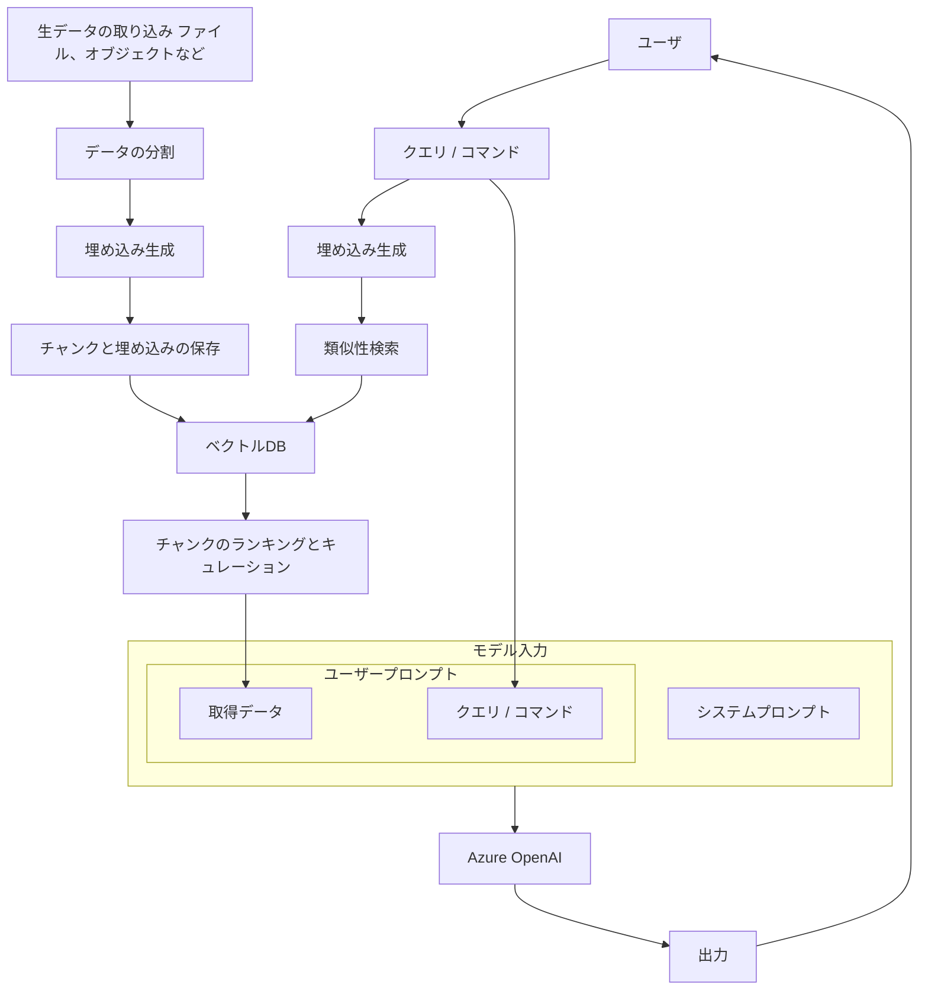
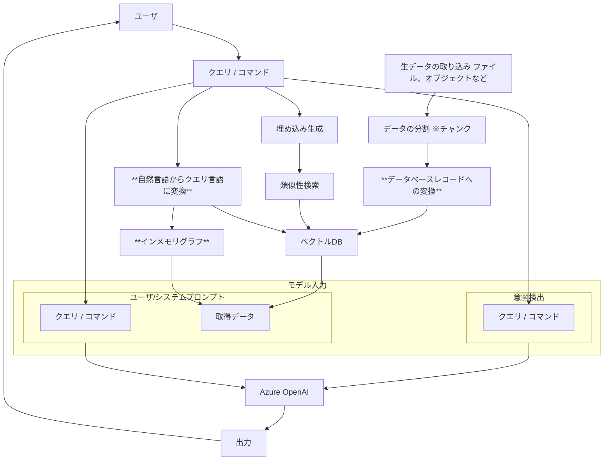

# はじめに

生成AIによるRAGアプリケーションはドキュメントをベクトル検索し、類似度が高いドキュメントを使って推論する手法が一般的です。
一方、ドキュメントが多量にある場合やお互いのドキュメントやナレッジの関連性を考慮したい場合に、ドキュメント同士やナレッジ同士の重みを考慮したデータ化をしたいシーンがあります。

ナレッジの関連性という点では、ナレッジグラフと呼ばれるグラフ構造で保持したデータ化の手法があります。グラフ構造にデータを保持するため、要素同士の関係性を定義できます。ナレッジグラフとベクトル検索を組み合わせてRAGするイメージです。

ナレッジグラフが有効なユースケースは以下のようなものがあります。
- 要素同士の関係性を考慮したうえで回答してほしい
  - 例）組織内の人間関係
- 要素の階層構造を考慮したうえで回答してほしい
  - 例）組織構造、
- つながりのある情報を考慮して回答してほしい
  - 例）部品サプライチェーンの調達～製品納入までの手順

一方、ベクトル検索が向くケースはこれらです。ほとんどのRAGの場合はこちらで十分対処できると思います。
- 類似性のあるナレッジを回答する。
  - 画像やドキュメント取得で役立つ。


# Azure Cosmos DB AI Graph
CosmosDBの公式ページを見ていたら、CosmosAIGraphなるものがありましたので、調べてみようと思ったのがきっかけです。
https://learn.microsoft.com/ja-jp/azure/cosmos-db/gen-ai/cosmos-ai-graph

## CosmosAIGraphとは
CosmosAIGraphは、以下のようなコスト効果の高いパフォーマンスソリューションです。
- グラフワークロード（AIがほとんどまたは全くない場合）
- AI駆動のグラフワークロード
- AI駆動のナレッジグラフワークロード
- AIチャットアプリケーション

また、Generative AIをサポートし、正確でコスト効果の高いOmni RAGパターンを使用します。これらはオープンスタンダードに沿っていて、以下の技術を使用しています。
- RDF (Resource Description Framework)
- OWL (Web Ontology Language)
- SPARQLクエリ言語
- Pythonプログラミング言語

## OminiRAG
OmniRAGとは、**データベースクエリ、ベクトル検索、ナレッジグラフ走査の中から、最も適切な方法を動的に選択**することで、ユーザクエリに対して正確性高く回答するための、データ取得部分に汎用性の高いアプローチです。各検索(データ取得)方法の長所を活かしたつくりといえます。
動的選択で重要なのは、ユーザの質問から推察される「**ユーザの意図**」です。
例えば、類似ドキュメントを知りたいならベクトル検索、紐づく情報のことを知りたいならナレッジグラフという具合ですね。

RAGプロセス内でオーケストレーションを使うことで、複数のソースを使いAIのためのコンテキストを収集できる。
例えば、最初にGraph走査してから、Graphで取得したエンティティの詳細情報をデータベースレコードからクエリできます。もし結果が何も見つからなかったならベクトル検索で類似性の高いデータを取得することもできます。
Microsoft の公式ページでは、以下のような例があげられています。
| ユーザの質問 | 戦略 |
| --- | --- |
| Python Flask ライブラリとは? | DB RAG |
| どんな依存関係があるか? | Graph RAG |
| 非同期処理を使用する代替案は？ | Vector RAG |
| 作成者は? | DB RAG |
| 彼女が書いたその他のライブラリは? | Graph RAG |
| すべてのライブラリとその依存関係のグラフを表示する | Graph RAG |

### OmniRAGの処理の流れ

従来RAGの処理の流れはこちらです。



OmniRAGの処理の流れはこちらです。
違いはこれらです。
- **ユーザの質問から意図を推測する**
- **ユーザの質問文からクエリ言語を生成する**
- **生成したクエリ言語を使いインメモリグラフからデータを取得**
- **ベクトルDBとインメモリグラフのデータを推論時のデータに使う**




## CosmosAIGraphの前提
https://github.com/nomhiro/CosmosAIGraph
- Microsoft, Azure, CosmosDBの製品ではない
- CosmosDB Mongo vCore、またはNoSQL PaaSサービスとして稼働
- ベクトル検索可能
- RDFテクノロジー - トリプル、OWLオントロジー（スキーマ）、SPARQLクエリ
- インメモリグラフ - LinkedInにインスパイアされ、より高速なパフォーマンスと低コストを実現。
- BicepでAzure Container Apps (ACA)にデプロイ。 またはAKS。 
- DBはCosmos DB1つだけで、シンプルなアーキテクチャ
- Omni RAGの概念を導入し、実装

::: details Resource Description Framework (RDF)
- W3C標準のひとつ。  20年前の成熟したもの。
- 一般的にナレッジグラフに使用される
- ラベル付きプロパティグラフ(LPG)に代わるデザイン
:::

::: details Web Ontology Language (OWL)
- グラフのClassとObjectPropertiesを定義するXML構文
- これらをEntityとRelationship、GraphSchemaととらえる
:::

::: details Triples
- ( 主語、述語、目的語 ) のタプル
  - 例： ( Cosmos DB → has_api → vCore ) 
- RDFグラフは、これらの単純なトリプルとオントロジーから構成される。
- 概念的に単純
:::

::: details SPARQL1.1
問い合わせ言語。 SQLに似ている。 Gremlin & Cypherよりシンプル。
:::

::: details Apache Jena 
- オープンソースの RDF データベース実装。
:::

## Graphデザインと開発ステップ
1. Cosmos DBアカウントの設計とロード
   - NoSQLデザインパターンとして、JSONドキュメントを使用
   - 特別な 「Triples 」ドキュメントは不要
2. グラフスキーマの定義
   - XML構文。 クラス、データ型付き属性、リレーションシップの定義
3. Cosmos DBからインメモリRDFデータベースをロードする。
   - 適切なCosmos DBドキュメントの必要な属性のみを読み込む。 サブセット。
   - AppGraphBuilderクラスから呼び出されるGraphTriplesBuilderクラスを実装する。
   - 観測されたデータメタデータ/構造に基づいてコード生成を使用する可能性がある。
   - グラフは厳密にはインメモリ実装であり、ディスク上には存在しない。
   - あるいは、開発環境では、RDFファイル（つまり、*.nt）からグラフをロードする。
4. インメモリRDFデータベースにSPARQLでクエリーする。
   - インメモリなので非常に速い。
   - ベクトル化が不要なため、低コストである。
   - SPARQLはオプションでGenAI & Azure OpenAIで生成できる。 これは素晴らしい学習ツールだ

## CosmosAIGraphにおける生成AIの使われ方
1. **RAG戦略をユーザーの自然言語から推測する**
     - 「LUISのような」発話、エンティティ、意図をOpenAIとプロンプトで実装
      > LUIS (Language Understanding Intelligent Service)・・・Microsoftの自然言語処理サービスで、ユーザーの発話やテキストから意図やエンティティを理解します。ユーザーが自然言語で入力した要求や質問を解釈して適切なアクションを取ることができます。例えば、「明日の天気を教えて」と言った場合、LUISは「天気」を求める意図（インテント）と「明日」を示す時間（エンティティ）を認識します。
     - ※クラス名「StrategyBuilder」
2. **ユーザーの自然言語からSPARQLクエリを生成する**
     - OWLオントロジーをシステムプロンプトとして使用
      > OWLオントロジー (Web Ontology Language)・・・ データの意味を定義し、共有するための言語です。特に、複雑なデータの関係を明確にし、機械が理解しやすい形でデータを表現するのに使用されます。これにより、異なるデータソース間でのデータ統合や推論を支援します。
     - クラスAIService#generate_sparql_from_user_promptを参照
3. **入力データをCosmos DBドキュメントに整形するコードをオプションで生成**
     - CSVヘッダー、JSON構造から入力スキーマを推測

2 ではこのように、自然言語で入力すると、SPARQLクエリが生成されます。


## CosmosAIGraphのアプリロジック

※ https://aka.ms/caig から引用


#### データ化
1. RAG用のデータを登録する
2. 登録したデータから**RDFグラフデータを生成**する
3. 生成された**グラフデータをCosmosDBに永続データとして保管**する
4. **インメモリのグラフマイクロサービス上に、Triples( 主語、述語、目的語 ) のタプルとしてロード**する

#### ユーザ問い合わせ
5. ユーザーからの質問を受け取る
6. ユーザからの質問をインメモリのグラフマイクロサービスに送信
7. ユーザからの質問から**ユーザ意図を推論**
8. ユーザ意図に基づいて、**SPARQLクエリを生成**
9. SPARQLクエリを使い、**インメモリのグラフマイクロサービスからデータを取得**
10. ベクトルDBに対して**ベクトル検索**
11. ベクトル検索結果をもとに**元データを取得**
12. **グラフデータとベクトル検索結果をもとにユーザからの質問に対して回答を生成**


## CosmosAIGraphのサービスと使われるモジュール
CosmosAIGraphアプリは、WebとGraphのマイクロサービスがあります。それらはコンテナとして動作するようになっており、それぞれcaig_webとciag_graphという名前で動作します。
- **Web**
  - ユーザーが使うWebアプリケーション
- **Graph**
  - インメモリRDFグラフ（Json）を扱うサービス

各モジュールの解説です。
- **FastAPI**  
  - WebアプリケーションおよびHTTPサービスのフレームワーク
- **Azure Cosmos DB**
  - 元データの格納先、セッション履歴、ベクトル値を格納する永続的なデータストア
  - Cosmos DB for MonogoDB、もしくは Cosmos DB for NoSQLのいずれかを使用可能
  - （オプション）Cosmos DB データは、Microsoft Fabric の One Lake にミラーリング可能
- **semantic-kernel**
  - AIとLLMのオーケストレーションとして利用
- **rdflib**
  - インメモリグラフ（RDF）を扱うためのPythonライブラリ
- **SPARQL1.1**
  - インメモリグラフからデータを取得するためのグラフクエリ言語
- **Web Ontology Language (OML)**
  - グラフスキーマ/オントロジー定義言語


# サンプルデータを用いたグラフデータのベクトル検索を試す
CosmosDB for NoSQLを使います。
Cosmos DB の JSON ドキュメントに特定の構造が必要ないことで、一般的な NoSQL の設計ベストプラクティスの通りに、非グラフアプリケーションのように構造化できます。CosmosDB for NoSQLはグラフDBではありませんからね。

## データ - PyPi の Python ライブラリ
impl\data ディレクトリには、PyPi (Python) ライブラリの JSON ドキュメントのキュレートセットが含まれています。
このソフトウェアライブラリのドメインは、ほとんどの顧客に関連性があると考えられ、グラフデータに適しています。
developers フィールドと dependency_ids フィールドに関連性があり、グラフ構造になります。
```
...
"developers": [
   "contact@palletsprojects.com"
],
...
"dependency_ids": [
   "pypi_asgiref",
   "pypi_blinker",
   "pypi_click",
   "pypi_importlib_metadata",
   "pypi_itsdangerous",
   "pypi_jinja2",
   "pypi_python_dotenv",
   "pypi_werkzeug"
],
...
```

::: message
**Pypi サンプルデータの作られ方**
PyPi の JSON ファイルは、https://pypi.org/pypi/{libname}/json のような公開 URL に HTTP リクエストを送信して取得され、その HTML コンテンツは JSON に変換されています。
その後のデータ整理では、参照された HTML ドキュメントを取得し、Azure OpenAI と semantic-kernel を使用してテキストの要約を生成し、各ライブラリの JSON ドキュメント内の複数の連結テキスト属性からベクトル化された埋め込み値を生成しました。このデータ整理プロセスの完全な説明は、このドキュメントの範囲を超えていますが、プロセス自体はリポジトリの 'impl/app/wrangle.py' ファイルにあります。
:::

## 開発環境の前提
- Python 3.12.x
- OpenJDKのJava21（グラフマイクロサービス）
  - https://learn.microsoft.com/en-us/java/openjdk/download#openjdk-21
- Gradle Build Tool 8.12

## Cosmos DB の設定
Cosmos DB for NoSQL リソース、データベース、コンテナを作成し、環境変数を設定します。

### Cosmos DB for NoSQL リソースの作成
CosmosDB for NoSQL アカウントの作成自体はスキップします。

まず、ベクトル検索機能を有効化します。


Database を作成します。Database名は caig です。


次に libraries コンテナを作成します。**diskANN ベクトルインデックス**を使用してコンテナを作成します。 ベクトル化された「ビジネスデータ」を含むドメインデータコンテナの例です。


次に config コンテナを作成します。configコンテナには、このシステム内のエンティティを特定するドキュメントが1つ含まれます。これは、EntitiesServiceクラスおよびStrategyBuilderクラスがユーザー指定の自然言語クエリを分析するために使用されます。


次に conversations と feedback コンテナを作成します。conversations と feedback コンテナは、AIConversations の状態を記録します。これらのコンテナは、モデルやプロンプトなどのAIロジックの分析および最適化に役立ちます。このデータをMicrosoft FabricのOneLakeにミラーリングすることは、コスト効率の良い解決策となるかもしれません。


### CosmosDB関連の環境変数
.envファイルに以下の環境変数を設定します。
```bash
CAIG_GRAPH_SOURCE_TYPE              <-- must be set to 'cosmos_nosql'
CAIG_COSMOSDB_NOSQL_URI             <-- this value is unique to your Azure deployment
CAIG_COSMOSDB_NOSQL_KEY1            <-- Read/Write key value
CAIG_COSMOSDB_NOSQL_AUTH_MECHANISM  <-- Authentication mechanism - key or RBAC (Entra ID)

CAIG_GRAPH_SOURCE_DB                <-- defaults to 'caig'
CAIG_GRAPH_SOURCE_CONTAINER         <-- defaults to 'libraries'
CAIG_CONFIG_CONTAINER               <-- defaults to 'config'
CAIG_CONVERSATIONS_CONTAINER        <-- defaults to 'conversations'
CAIG_FEEDBACK_CONTAINER             <-- defaults to 'feedback'
```

## グラフデータをロードしベクトル検索を試す🚀

### config コンテナにエンティティを追加
configコンテナに、設定用のエンティティを追加します。追加するJsonは、../data/entities/entities_doc.json にあります。
以下のコマンドを実行すると、load_entities 関数が呼び出され、entities_doc.json が config コンテナに追加されます。

```bash
.\venv.ps1
.\venv\Scripts\Activate.ps1
python main_nosql.py load_entities caig config
```

```python
async def load_entities(dbname, cname):
    logging.info("load_entities, dbname: {}, cname: {}".format(dbname, cname))
    try:
        opts = dict()
        nosql_svc = CosmosNoSQLService(opts)
        await nosql_svc.initialize()
        nosql_svc.set_db(dbname)
        nosql_svc.set_container(cname)
        doc = FS.read_json("../data/entities/entities_doc.json")
        print(doc)
        resp = await nosql_svc.upsert_item(doc)
        print(resp)

        # impl/app/src/services/entities_service.py
        # impl/app/tests/test_entities_service.py
        # impl/data/entities/entities_doc.json

    except Exception as e:
        logging.info(str(e))
        logging.info(traceback.format_exc())
    await nosql_svc.close()
```

config コンテナに登録されていますね。


### ライブラリデータを libraries コンテナに追加
メインデータセットをライブラリコンテナにロードします。

```bash
python main_nosql.py load_libraries caig libraries 999999
```


### ロードしたデータでベクトル検索を実行してみましょう
まず、"asynchronous web framework with pydantic" という文章からベクトル値を生成します。次に、そのベクトル値を使用して、Cosmos DB ライブラリのコンテナでベクトル検索を行います。

```bash
python main_nosql.py vector_search_words asynchronous web framework with pydantic
```

4つのドキュメントが取得されます。
```txt
doc 0: {'pk': 'pypi', 'id': 'pypi_x_clip', 'name': 'x-clip', 'summary': 'x-clip', 'documentation_summary': 'The GitHub repository "lucidrains/x-clip" offers a comprehensive yet succinct implementation of CLIP (Contrastive Language–Image Pre-training) with several experimental enhancements derived from recent research papers. It includes features such as fine-grained contrastive learning, decoupled contrastive learning, and self-supervised learning on images. The repository provides detailed instructions for installation, usage, and integration with external visual transformers or residual nets. It also supports multiview contrastive learning loss and custom vision self-supervised learning modules. The project is licensed under the MIT license and has garnered significant interest, indicated by its 637 stars and 46 forks.', 'libtype': 'pypi', 'score': 0.03518376887815099}
doc 1: {'pk': 'pypi', 'id': 'pypi_install_jdk', 'name': 'install-jdk', 'summary': 'install-jdk allows you to easily install latest java openjdk version. supports openjdk builds from adoptium (previously adoptopenjdk), corretto, and zulu. simplify your java development with the latest openjdk builds.', 'documentation_summary': "The `install-jdk` library is a Python package designed to simplify the installation of the latest OpenJDK for a specified major version, supporting builds from Adoptium and Corretto. It aims to ease Java development by providing the latest OpenJDK builds across various operating systems and architectures without requiring third-party dependencies, relying solely on Python3's standard libraries. The library offers functions to install OpenJDK, get download URLs, and download the JDK or JRE to a specified path or the default location. It automatically detects the user's operating system and architecture, supporting Windows, Linux, MacOS, and various architectures. The project is open-source under the MIT license and encourages contributions.", 'libtype': 'pypi', 'score': 0.031327320855809936}
doc 2: {'pk': 'pypi', 'id': 'pypi_envyaml', 'name': 'envyaml', 'summary': 'simple yaml configuration file parser with easy access for structured data', 'documentation_summary': 'The HTML text provides information about "envyaml," a Python package available on PyPI (Python Package Index) for parsing YAML configuration files with support for environment variables. It simplifies using YAML files and environment variables as program configuration files, offering easy access to config keys. The package, compatible with Python versions 2.7 and above, allows for structured data access, supports default values, and has a strict mode to prevent undeclared variables. It\'s licensed under the MIT License, with Mykola Bubelich as the author. The latest version, 1.10.211231, was released on January 8, 2022. Installation instructions, basic usage examples, and information on accessing and formatting configuration data are provided.', 'libtype': 'pypi', 'score': 0.029118966895804826}
doc 3: {'pk': 'pypi', 'id': 'pypi_load_dotenv', 'name': 'load-dotenv', 'summary': 'automatically and implicitly load environment variables from .env file', 'documentation_summary': 'The GitHub repository "fly/load-dotenv" is designed to automatically and implicitly load environment variables from a .env file, simplifying the management of these variables during development. It eliminates the need for explicit execution of loading commands in the code, which is particularly useful for developers who do not want to modify their production code or create custom runners for development. The repository includes a README, LICENSE, and several other files related to the project. Installation is straightforward via pip, and usage involves creating a .env file and running the application with the LOAD_DOTENV variable set. The project is licensed under the Apache-2.0 license and is written entirely in Python.', 'libtype': 'pypi', 'score': 0.026099959186434447}
```


# ローカル実行

ローカルでの実行モードは３つあります。
- ターミナルで実行する
- スクリプトで実行する
- Dockerで実行する

今回は、Azureで実行する状態となるべく近づけたいので、３つ目の Dockerで実行 します。

## 環境の前提
- Docker 環境があること（Docker Desktop）
- Azure OpenAI がプロビジョニングされていること

## 事前準備

#### ファイルを解凍
libraries-graph.zip を解凍しておきます。　※このN-triplesファイルはサイズが大きいので圧縮されてGitHubに格納されているためです。


#### 環境変数の設定
Webアプリケーション、グラフマイクロサービスの両方に対して環境変数を設定しておきます。

- docker-compose-with-rdflib.yml

設定する環境変数はこれらがあります。
| 環境変数名 | 説明 |
| --- | --- |
| CAIG_ACA_ENVIRONMENT_NAME | Azure Container App (ACA) 環境名 |
| CAIG_AZURE_MONGO_VCORE_CONN_STR | Cosmos DB Mongo 仮想コア アカウントの完全な接続文字列 |
| CAIG_AZURE_OPENAI_COMPLETIONS_DEP | Azure OpenAI 完了デプロイの名前 |
| CAIG_AZURE_OPENAI_EMBEDDINGS_DEP | Azure OpenAI 埋め込みデプロイの名前 |
| CAIG_AZURE_OPENAI_KEY | Azure OpenAI アカウントのキー |
| CAIG_AZURE_OPENAI_URL | Azure OpenAI アカウントの URL |
| CAIG_AZURE_REGION | ACA アプリがデプロイされている Azure リージョン |
| CAIG_CONFIG_CONTAINER | 構成 JSON 値の仮想コア コンテナー |
| CAIG_CONVERSATIONS_CONTAINER | チャットの会話と履歴が保持される仮想コア コンテナー |
| CAIG_COSMOSDB_NOSQL_ACCT | Cosmos DB NoSQL アカウントの名前 |
| CAIG_COSMOSDB_NOSQL_AUTH_MECHANISM | Cosmos DB NoSQL 認証メカニズム。キーまたはRBAC |
| CAIG_COSMOSDB_NOSQL_KEY1 | Cosmos DB NoSQL アカウントのキー |
| CAIG_COSMOSDB_NOSQL_RG | Cosmos DB NoSQL アカウントのリソース グループ |
| CAIG_COSMOSDB_NOSQL_URI | Cosmos DB NoSQL アカウントの URI |
| CAIG_DEFINED_AUTH_USERS |  |
| CAIG_ENCRYPTION_SYMMETRIC_KEY | 暗号化/復号化用のオプションの対称キー |
| CAIG_FEEDBACK_CONTAINER | ユーザーフィードバックが保持される仮想コア コンテナー |
| CAIG_GRAPH_DUMP_OUTFILE | CAIG_GRAPH_DUMP_UPON_BUILD が true の場合に書き込むファイル |
| CAIG_GRAPH_DUMP_UPON_BUILD | GraphBuilder の完了後に Java/Jena モデルをCAIG_GRAPH_DUMP_OUTFILEにダンプするブール値 true/false |
| CAIG_GRAPH_NAMESPACE | RED グラフのカスタム名前空間 |
| CAIG_GRAPH_SERVICE_NAME |  |
| CAIG_GRAPH_SERVICE_PORT |  |
| CAIG_GRAPH_SERVICE_URL |  |
| CAIG_GRAPH_SOURCE_CONTAINER | グラフの仮想コア コンテナー名 (CAIG_GRAPH_SOURCE_TYPE が 'cosmos_vcore' の場合) |
| CAIG_GRAPH_SOURCE_DB | グラフの仮想コア データベース名 (CAIG_GRAPH_SOURCE_TYPEが 'cosmos_vcore' の場合) |
| CAIG_GRAPH_SOURCE_OWL_FILENAME | 入力RDF OWLオントロジーファイル |
| CAIG_GRAPH_SOURCE_RDF_FILENAME | RDF 入力ファイル (CAIG_GRAPH_SOURCE_TYPE が 'rdf_file' の場合 |
| CAIG_GRAPH_SOURCE_TYPE | RDF グラフ データ ソース タイプ ('rdf_file' または 'cosmos_vcore' または 'cosmos_nosql' |
| CAIG_HOME | システム上の CosmosAIGraph GitHub リポジトリのルート ディレクトリ |
| CAIG_LA_WORKSPACE_NAME | Azure Container App (ACA) によって使用される Log Analytics ワークスペース名 |
| CAIG_LOG_LEVEL | Python ロギングの standard-lib レベル名: notset、debug、info、warning、error、または critical |
| CAIG_WEBSVC_AUTH_HEADER | X-CAIG-認証 |
| CAIG_WEBSVC_AUTH_VALUE | K6ZQw!81 |
| CAIG_WEB_APP_NAME |  |
| CAIG_WEB_APP_PORT |  |
| CAIG_WEB_APP_URL |  |

## 実行
graph-serviceとweb-appのDockerコンテナを二つ起動します。
```bash
docker compose -f docker/docker-compose-with-rdflib.yml up
```

http://localhost:8000 にアクセスすると、Webアプリケーションが表示されます。


Sparql画面では、ライブラリ名と階層数を指定してD3.jsで表現されたグラフを確認できます。


Generate Sparql画面では、自然言語から生成されたSPARQLクエリを確認できます。


Vector Search画面では、ライブラリ名をキーにベクトル検索の結果を確認できます。


Conversation AIの画面では、以下のように自然言語で問い合わせ可能です。RAGモードがdb, vector, graphのどれが選ばれて実行されたかが分かるようになっています。


# まとめ
CosmosAIGraphは、Azure OpenAIとCosmosDBを使ったグラフデータのベクトル検索を実現するアプリケーションです。RAGモデルを導入し、ユーザの自然言語からSPARQLクエリを生成し、CosmosDBのデータを取得することができます。また、インメモリグラフを使い、高速なパフォーマンスと低コストを実現しています。今回は、ローカル環境でDockerコンテナを使ってCosmosAIGraphを実行しましたが、Azure上で実行することも可能です。Azure OpenAIとCosmosDBを使ったグラフデータのベクトル検索を試してみたい方は、CosmosAIGraphを使ってみてはいかがでしょうか。

現時点では、CosmosDBやContainerAppsなどを使ったアプリケーションは自分で設定及びデプロイしなければなりません。
将来的には、Azureのマネージドサービスとして提供されることを期待しています。また、CosmosDB for NoSQLにグラフのJson構造を格納する方法ですが、私が個人的に期待するのは、エッジ（頂点）同士の重みを考慮したデータ化をしたいシーンがあるので、このようなユースケースには合わないかもしれません。