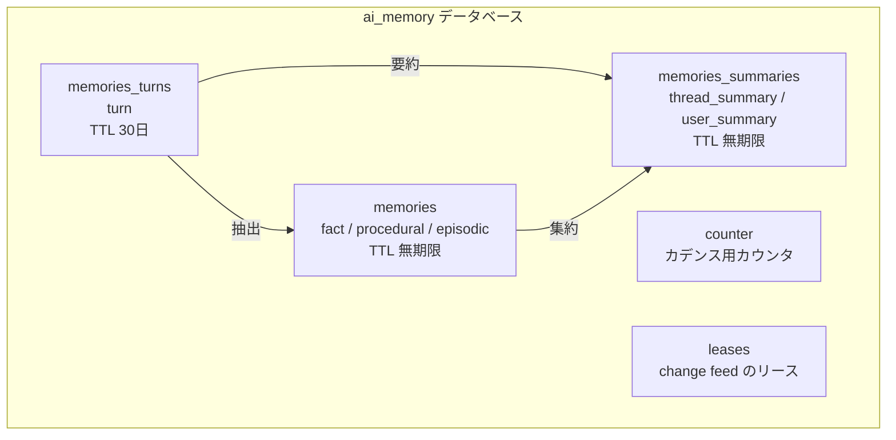
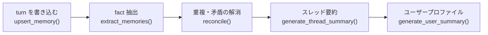
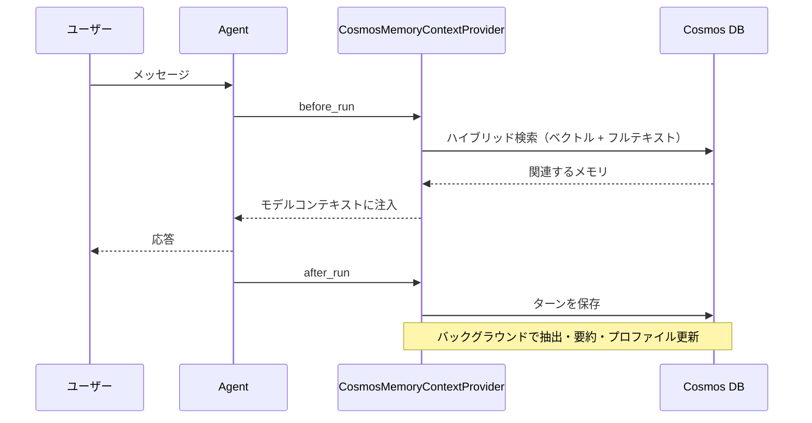

:::message alert
本記事の内容は **2026年8月26日時点** の情報に基づいています。Agent Memory Toolkit（`azure-cosmos-agent-memory`）は preview、Agent Framework 連携パッケージ（`agent-framework-azure-cosmos-memory`）は alpha です。**バージョンは必ずピン止めしてください。** API は予告なく変わります。
:::

# はじめに

エージェントに長期記憶を持たせたい、と思って調べ始めたら、Azure には道が2本ありました。Microsoft がストレージまで面倒を見てくれるマネージドな道と、自分の Cosmos DB に持つ道です。

本記事は後者、**自分の Cosmos DB にエージェントの記憶を持たせる**ほうです。前者は[姉妹記事](https://zenn.dev/nomhiro/articles/foundry-agent-memory-poc)で扱っています。

> Agent Memory Toolkit は、Azure Cosmos DB 上に AI エージェントのメモリを保存・取得・変換するための Python SDK です。生の会話履歴だけでなく、スレッド要約・抽出された事実・スレッドを跨ぐユーザープロファイルといった「蒸留されたメモリ」も作ってくれます。

「1オブジェクト注入するだけで Agent Framework に組み込める」という触れ込みだったので、それが本当かどうかも含めて触ってみました。

## エージェントの「記憶」には2つのアプローチがある

| 観点 | マネージド Memory（[姉妹記事](https://zenn.dev/nomhiro/articles/foundry-agent-memory-poc)） | Agent Memory Toolkit（本記事） |
|---|---|---|
| ストレージ | Microsoft 管理（実装は非公開） | 自分の Cosmos DB アカウント |
| 組み込み方 | `memory_search_preview` ツールを付ける | `context_providers` に1オブジェクト注入 |
| 前提フレームワーク | Foundry Agent Service（プロンプトエージェント） | Microsoft Agent Framework |
| メモリ種別 | 3種類（user_profile / chat_summary / procedural） | 6種類（turn / fact / episodic / procedural / thread_summary / user_summary） |
| 中身を直接見る | API 経由でアイテム単位に参照 | Cosmos のドキュメントをそのまま参照 |
| 抽出ロジックの差し替え | `user_profile_details` の自然言語指示のみ | Prompty テンプレートを差し替え可能 |
| 運用の手間 | ほぼゼロ | Cosmos の設計・インデックス・TTL・課金を自分で見る |
| 向いているユースケース | 記憶の中身に説明責任を負わない社内向けアシスタント | 保存内容の説明・監査・削除が要件になる業務 |

:::message
姉妹記事: [エージェントに記憶を持たせる。Foundry Agent Service の Memory を試してみた（マネージド編）](https://zenn.dev/nomhiro/articles/foundry-agent-memory-poc)
:::

ひとつ、紛らわしい点を先に片付けておきます。Azure Cosmos DB のブログに「Powering Memory in Foundry Agent Service, with Azure Cosmos DB」という記事があります。タイトルを読むと「マネージド Memory の中身が Cosmos DB なんだ」と思ってしまいますが、**中身は本記事で扱う BYO ストレージ側のサンプル解説**です。マネージド Memory のバックエンド実装は公式には非公開のままです。

---

# Agent Memory Toolkit とは

Python の SDK で、Cosmos DB for NoSQL をエージェントメモリのストアとして使うためのものです。

やってくれることは大きく2つあります。

1. **生の会話ターンを永続化する**
2. **そこから価値の高いメモリを蒸留する**（事実の抽出、スレッド要約、ユーザープロファイル、重複と矛盾の解消）

そして検索は Cosmos DB のベクトル検索とフルテキスト検索をそのまま使います。**別のベクトル DB を立てず、2つ目の検索サービスと同期する必要もない**というのが売りです。生の会話も、抽出した事実も、検索用のインデックスも、ぜんぶ同じデータベースに入ります。

「こうした既存の成熟した DB の機能をエージェントメモリに持ち込んでいる」のが、この Toolkit の面白いところだと思います。

## どういうときにセルフマネージドを選ぶか

先に書いておきます。**とりあえずエージェントに記憶を持たせたいだけなら、この道は遠回りです。** マネージド Memory ならツールを1つ足すだけで済むところを、こちらは Cosmos DB の準備から始めることになります。

では、その手間を払う価値があるのはどういうときか。判断軸はこれだと思います。

> **その記憶、あとから説明を求められるか？**

求められるなら、中身が見えるほうを選ぶ意味があります。具体的にはこんな場面です。

### 規程のある業務で「何を保存しているか」を文書化する

金融・医療・人事のように社内規程や外部規制がある業務だと、「このエージェントは利用者の何を保存しているのか」を説明できないと導入審査を通りません。

セルフマネージドなら、Cosmos DB のドキュメントをそのまま出せます。後半で実物を貼りますが、`content`（保存された内容）だけでなく `category`、`salience`、`confidence`、どのプロンプトが作ったかまで残ります。審査の場に持っていけるレベルの情報です。

### 個人データの削除要求に応えて、証跡を残す

「私のデータを消してください」と言われたとき、消すこと自体はマネージドでもできます。違うのは**証跡**です。

Toolkit は `user_id` をパーティションキーの第1階層に置くので、そのユーザーのドキュメントだけを引いて消せます。さらに矛盾解消のときは古いレコードをソフト削除して残す作りなので、「いつ何がどう書き換わったか」を `supersedes_ids` でたどれます。

### 記憶の品質がおかしいときに、原因を特定して直す

「エージェントが変なことを覚えている」となったとき、マネージドだと打てる手が `user_profile_details` の書き換えくらいしかありません。

セルフマネージドなら、各メモリに `prompt_id` と `prompt_version` が残っています。どのプロンプトのどのバージョンが作ったメモリかを特定して、`prompts_dir` で Prompty テンプレートを差し替えられます。抽出のルーブリックそのものを業務に合わせて書き換えられる、ということです。

### 保持期間を種類ごとに決める

「生ログは30日で消すが、抽出した好みは残す」のような要件があるとき、コンテナ単位・ドキュメント単位で TTL を設定できます。これは既定でそうなっているので、あとで説明します。

## 向かないユースケース

| 条件 | なぜ向かないか |
|---|---|
| とりあえず動かしたい | Cosmos DB の準備がそのままオーバーヘッドになる |
| 運用を見る人がいない | RU、インデックス、TTL、パーティション設計を自分で持つことになる |
| Agent Framework を使っていない | 連携パッケージが前提。Toolkit 単体なら使えますが、注入の手軽さは失われます |
| 記憶が会話体験の飾り程度 | 説明責任がないなら、払うコストに見合いません |

## 今回の PoC が想定するユースケース

この記事では、**姉妹記事とまったく同じ「社内の出張手配アシスタント」**を、要件だけ追加して作ります。同じ題材にしたので、2つのアプローチで何が変わるかがそのまま比べられます。

| 項目 | 内容 |
|---|---|
| 誰が使うか | 出張が多い社員 |
| 覚えてほしいもの | 座席の好み、宿の条件、出発時刻の制約 |
| **追加の要件** | 生の会話は30日で消す。抽出した好みは残す |
| **追加の要件** | 誰の何を保存しているか、いつでも出せる |
| **追加の要件** | 削除依頼に応えられて、証跡が残る |
| 成功の条件 | 別セッション・同一社員で想起され、かつ保存内容を JSON で提示できる |

太字が姉妹記事との差分です。**機能要件は同じで、非機能要件だけが増えている**という設定にしました。実務でセルフマネージドを選ぶ理由は、たいていこの形をしているはずです。

## メモリは6種類ある

ドキュメントには4種類として説明されているのですが、実際にパッケージの enum を見ると6種類ありました。実物を正としてまとめておきます。

```python
from azure.cosmos.agent_memory import MemoryType
for m in MemoryType:
    print(m.name, "=", repr(m.value))
```

```text
MemoryType.turn             = 'turn'
MemoryType.thread_summary   = 'thread_summary'
MemoryType.fact             = 'fact'
MemoryType.user_summary     = 'user_summary'
MemoryType.procedural       = 'procedural'
MemoryType.episodic         = 'episodic'
```

| 種類 | 何を持つか | 既定 TTL |
|---|---|---|
| `turn` | 生の会話レコード（user / agent / tool / system） | 2592000（30日） |
| `fact` | 会話から抽出した個別の言明。好み、要件、確定した決定 | -1（無期限） |
| `procedural` | 再利用できる振る舞いのルール | -1（無期限） |
| `episodic` | 過去の出来事としてのエピソード | 7776000（90日） |
| `thread_summary` | 1スレッドの要約 | -1（無期限） |
| `user_summary` | スレッドを跨ぐユーザープロファイル | -1（無期限） |

TTL の値はパッケージの定数から取れます。

```python
from azure.cosmos.agent_memory.cosmos_memory_client import DEFAULT_TTL_BY_TYPE
print(DEFAULT_TTL_BY_TYPE)
```

```text
{'turn': 2592000, 'episodic': 7776000, 'thread_summary': -1,
 'user_summary': -1, 'fact': -1, 'procedural': -1}
```

生の会話は30日で消え、そこから蒸留した事実と要約は残る。エピソード記憶だけ90日。この設計はよく考えられていると感じました。生ログを永久に持つのはストレージもコンプライアンスもつらいけれど、蒸留した結果は持っていたいわけですから。

## コンテナは3つ（＋補助2つ）

型とコンテナは1対1ではありません。ここは最初に押さえておかないと `get_memories()` で例外を食らいます。



読み出し API も分かれています。

| 読みたいもの | 使う API |
|---|---|
| `fact` / `procedural` / `episodic` | `get_memories()` / `search_cosmos()` |
| `thread_summary` | `get_thread_summary()` |
| `user_summary` | `get_user_summary()` |
| `turn` | `get_thread()` / `search_turns()` |

`get_memories(memory_types=["thread_summary"])` のように書くと、こう怒られます。

```text
ValueError: memory_types must be a subset of ['fact', 'episodic', 'procedural'];
got ['thread_summary', 'user_summary']
```

## 蒸留パイプラインとその起動タイミング

生の会話から派生メモリが作られる流れはこうです。



面白いのは、**これらが `upsert_memory()` の中で自動的に走る**ところです。何ターンごとに何を走らせるかは環境変数で決まっています。

```python
import azure.cosmos.agent_memory as am
print(am.DEFAULT_FACT_EXTRACTION_EVERY_N)    # 2
print(am.DEFAULT_THREAD_SUMMARY_EVERY_N)     # 10
print(am.DEFAULT_USER_SUMMARY_EVERY_N)       # 20
print(am.DEFAULT_EPISODE_EVAL_EVERY_N)       # 4
```

家計簿を「レシート2枚ごとに記帳、10枚ごとに月次集計」と決めておくようなものです。全ターンで LLM を回すのは高すぎるので、頻度で刻んでいます。

## 実行モデルは2つ

| モード | 指定 | どんなとき |
|---|---|---|
| インプロセス | `processor=InProcessProcessor()`（既定） | PoC、dev/test、軽いデモ |
| Durable Functions | `processor=DurableFunctionProcessor()` | 本番。change feed で新しいターンを拾い、別の Function App でバックグラウンド処理 |

本番では Cosmos DB の change feed をトリガーに Durable Functions で回す構成が想定されています。アプリのリクエストパスから LLM 呼び出しを追い出せるので、これはうまい分離設計だと思います。本記事はインプロセスで進めます。

---

# Agent Framework への組み込みは1オブジェクト

Toolkit 単体でも使えますが、Microsoft Agent Framework と組み合わせるなら専用のパッケージがあります。



`before_run` で検索して注入、`after_run` で保存して抽出。エージェント側のコードは `context_providers` に1つ入れるだけです。

---

# 触ってみる

## 検証シナリオと、各ステップが確かめること

上で決めた要件に沿ってステップを組みました。追加した非機能要件（保持期間・説明できること・削除の証跡）が本当に満たせるのかを、1つずつ確かめる順番です。

| ステップ | 確かめること | 要件上の意味 |
|---|---|---|
| Step 1〜2 | コンテナのトポロジー | 「生ログ30日・派生は無期限」を保持期間として設定できるか |
| Step 3 | fact 抽出のカデンス | いつ何が保存されるかを説明できるか |
| Step 4 | 要約とユーザープロファイル | 何がどう集約されるか |
| Step 5 | Agent Framework への注入 | 実装コストと、社員ごとの分離 |
| Step 6 | 保存ドキュメントの中身 | 監査に出せる情報が揃っているか。削除の証跡が追えるか |

## 前提と、いきなり出た依存衝突

```bash
pip install azure-cosmos-agent-memory==0.3.0b2 \
            agent-framework-azure-cosmos-memory==1.0.0a260813 \
            agent-framework-foundry azure-cosmos azure-identity
```

姉妹記事のマネージド Memory と同じ環境で動かそうとしたら、いきなり止まりました。

```text
× No solution found when resolving dependencies:
  ╰─▶ Because agent-framework-foundry==1.11.0 depends on
      azure-ai-projects>=2.2.0,<2.4.0 ... and your project depends on
      azure-ai-projects>=2.5.0, we can conclude that your project's
      requirements are unsatisfiable.
```

`agent-framework-foundry` は `azure-ai-projects` を 2.4.0 未満に縛っていて、マネージド Memory の最新機能は 2.5.0 が必要です。**この2つは同じ仮想環境に同居できません。** 検証リポジトリでは uv プロジェクトを2つに分けて対処しました。

もうひとつ、alpha 版パッケージが prerelease に依存しているので、明示的に許可が必要です。

```toml
[tool.uv]
prerelease = "allow"   # agent-framework-azure-cosmos-memory が prompty>=2.0.0a9 に依存
```

環境はこうしました。

| 項目 | 値 |
|---|---|
| Cosmos DB | Serverless、East US 2、`EnableNoSQLVectorSearch` |
| Foundry プロジェクト | East US 2 |
| チャットモデル | `gpt-5.6-luna` |
| 埋め込みモデル | `text-embedding-3-large`（1536次元で使用） |
| Python | 3.12 |

## Step 1: Cosmos DB アカウントを作る

ベクトル検索は capability で有効化します。フルテキスト検索は capability の指定なしで使えました（コンテナ側のポリシーで有効化します）。

```bash
az cosmosdb create -n cosmos-agent-memory-poc -g rg-ai-poc-eastus2 \
  --locations regionName=eastus2 \
  --capabilities EnableServerless EnableNoSQLVectorSearch \
  --default-consistency-level Session
```

Toolkit はキーを使わず `DefaultAzureCredential` 前提なので、データプレーンの RBAC を自分に割り当てます。

```bash
PRINCIPAL_ID="$(az ad signed-in-user show --query id -o tsv)"
SCOPE="/subscriptions/$SUB/resourceGroups/$RG/providers/Microsoft.DocumentDB/databaseAccounts/$ACCOUNT"

az cosmosdb sql role assignment create -a "$ACCOUNT" -g "$RG" \
  --role-definition-id "00000000-0000-0000-0000-000000000002" \
  --principal-id "$PRINCIPAL_ID" \
  --scope "$SCOPE"
```

:::message alert
Git Bash から実行すると、先頭が `/` のスコープが Windows パスに変換されて `Expected path segment [dbs] at position [0] but found [Program Files]` という珍妙なエラーになります。`export MSYS_NO_PATHCONV=1` を入れるか、PowerShell から実行してください。
:::

## Step 2: コンテナを作る。ただし Entra ID では作れない

ここが最大のハマりどころでした。素直に Toolkit の `create_memory_store()` を呼ぶと、こうなります。

```text
azure.cosmos.exceptions.CosmosHttpResponseError: (Forbidden)
Request blocked by Auth cosmos-agent-memory-poc :
The given request [POST /dbs] cannot be authorized by AAD token in data plane.
```

**Cosmos DB の Entra ID データプレーン RBAC では、データベースやコンテナの作成が許可されていません。** これは仕様で、`Cosmos DB Built-in Data Contributor` を持っていても変わりません。メタデータの書き込みは管理プレーン（ARM）の仕事だからです。

なので方針を変えます。**トポロジーは ARM で作り、データ操作だけ Entra ID で行う。**

ところが az CLI でも詰まります。Toolkit は階層パーティションキー `(/user_id, /thread_id)` を使うのですが、

```bash
az cosmosdb sql container create ... -p "/user_id" "/thread_id"
# ERROR: unrecognized arguments: /thread_id
```

az CLI 2.88 の `--partition-key-path` は単一パスしか受け付けません。というわけで ARM の REST API を直接叩くことにしました。

ここでポリシーを自分で書き起こすと、`create_memory_store()` が作るものとズレるリスクがあります。そこで **Toolkit 本体の関数からポリシーを取り出す**ことにしました。

```python
from azure.cosmos.agent_memory._utils import _container_policies

vec, idx, ft = _container_policies(
    embedding_dimensions=1536,
    embedding_data_type="float32",
    distance_function="cosine",
    full_text_language="en-US",
    vector_index_type="quantizedFlat",
)
```

取り出したものがこれです。

```json
{
  "vectorEmbeddings": [
    { "path": "/embedding", "dataType": "float32",
      "distanceFunction": "cosine", "dimensions": 1536 }
  ]
}
```

```json
{
  "includedPaths": [{ "path": "/*" }],
  "excludedPaths": [
    { "path": "/source_memory_ids/*" },
    { "path": "/supersedes_ids/*" },
    { "path": "/\"_etag\"/?" }
  ],
  "vectorIndexes": [{ "path": "/embedding", "type": "quantizedFlat" }],
  "fullTextIndexes": [{ "path": "/content" }]
}
```

```json
{
  "defaultLanguage": "en-US",
  "fullTextPaths": [{ "path": "/content", "language": "en-US" }]
}
```

あとはこれを ARM に PUT するだけです。

```python
HPK = {"paths": ["/user_id", "/thread_id"], "kind": "MultiHash", "version": 2}

CONTAINERS = [
    ("memories",           HPK, -1,      idx,           True),
    ("memories_turns",     HPK, 2592000, idx,           True),
    ("memories_summaries", HPK, -1,      idx_summaries, True),
    ("counter",            HPK, None,    None,          False),
    ("leases",             {"paths": ["/id"], "kind": "Hash"}, None, None, False),
]

for name, pk, ttl, indexing, with_search in CONTAINERS:
    resource = {"id": name, "partitionKey": pk}
    if ttl is not None:
        resource["defaultTtl"] = ttl
    if indexing is not None:
        resource["indexingPolicy"] = indexing
    if with_search:
        resource["vectorEmbeddingPolicy"] = vec
        resource["fullTextPolicy"] = ft
    az_rest("PUT", f"{BASE}/sqlDatabases/{DB}/containers/{name}?api-version={API_VERSION}",
            {"location": LOCATION, "properties": {"resource": resource, "options": {}}})
```

`memories_summaries` だけ複合インデックスが追加されます。`get_*_summary()` のポイントルックアップがこれに依存しています。

```python
idx_summaries["compositeIndexes"] = [[
    {"path": "/user_id", "order": "ascending"},
    {"path": "/thread_id", "order": "ascending"},
    {"path": "/version", "order": "descending"},
]]
```

できあがったトポロジーがこれです。


そして、ここが救いのある話なのですが、**トポロジーが既にあれば `create_memory_store()` は Entra ID でもそのまま通ります**。`create_if_not_exists` の read パスを通るので、`POST /dbs` が発生しないからです。つまり初回だけ ARM でトポロジーを作れば、以降のコードはドキュメントどおりキーレスで書けます。

## Step 3: Toolkit 単体でパイプラインを分解する

まずクライアントを作ります。`cosmos_endpoint` をコンストラクタに渡すと `__init__` の中で `create_memory_store()` が走るので、初回だけは注意します。

```python
from azure.cosmos.agent_memory import CosmosMemoryClient
from azure.identity import DefaultAzureCredential

memory = CosmosMemoryClient(
    cosmos_database="ai_memory",
    ai_foundry_endpoint=FOUNDRY_ENDPOINT,
    embedding_deployment_name="text-embedding-3-large",
    embedding_dimensions=1536,   # コンテナのベクトルポリシーと必ず合わせる
    chat_deployment_name="gpt-5.6-luna",
    use_default_credential=True,
)
memory.connect_cosmos(
    endpoint=COSMOS_ENDPOINT,
    credential=DefaultAzureCredential(),
    database="ai_memory",
)
memory.validate_topology()   # コンテナ構成が期待どおりか確認してくれる
```

:::message alert
`embedding_dimensions` は必ずコンテナのベクトルポリシーと揃えてください。`create_memory_store()` の内部既定は 1536 ですが、`text-embedding-3-large` の素の出力は 3072 次元です。指定しないままだとポリシーと実際の次元が食い違います。
:::

`validate_topology()` があるのは親切です。構成のズレを、データを書く前に落としてくれます。

では会話ターンを1件ずつ入れて、派生メモリが増えるタイミングを見てみます。

```python
for role, content in TURNS:
    memory.upsert_memory(user_id=USER, thread_id=THREAD, role=role, content=content)
    n = len(memory.get_memories(user_id=USER, thread_id=THREAD,
                                memory_types=["fact", "episodic", "procedural"]))
    print(f"turn [{role}] {content[:30]} → {n} 件")
```


ターン2、4、6 でぴったり増えています。`FACT_EXTRACTION_EVERY_N = 2` がそのまま出ました。抽出済みなので、あとから明示的に呼んでも新規はゼロです。

```python
counts = memory.extract_memories(user_id=USER, thread_id=THREAD)
# {"fact_count": 0, "episodic_count": 0, "updated_count": 0,
#  "contradicted_count": 0, "exact_dedup_skipped": 0, ...}
```

抽出された fact には `salience`（重要度）が付いています。取得時に `min_salience` でしきい値を切れます。

重複と矛盾の解消も明示的に呼べます。

```python
rec = memory.reconcile(user_id=USER)
# {"kept": 3, "merged": 0, "contradicted": 0}
```

今回は重複なしという判定でした。矛盾したときは、古い側をソフト削除して監査トレイルを残す作りになっています。

## Step 4: 要約とプロファイル

スレッド要約とユーザープロファイルも呼べます。

```python
memory.generate_thread_summary(user_id=USER, thread_id=THREAD)
memory.generate_user_summary(user_id=USER)
```

生の会話がどう蒸留されていったかを並べると、こうなりました。


要約は自由文だけでなく、`metadata.structured_summary` に構造化された形でも入ります。ここが想像以上にリッチでした。

```json
{
  "overview": "ユーザーの旅行手配に関する希望が確認され、今後は通路側の航空座席、駅から徒歩5分以内のビジネスホテル、10時以降出発の便を優先することになった。",
  "key_points": [
    "ユーザーは飛行機では必ず通路側の座席を希望している",
    "宿泊先は駅から徒歩5分以内のビジネスホテルを希望している",
    "朝早い便は苦手で、出発時刻は10時以降を希望している"
  ],
  "decisions": [
    "航空便は通路側の座席で手配する",
    "宿泊先は駅近のビジネスホテルを優先する",
    "出発時刻が10時以降の便で手配する"
  ],
  "open_issues": [],
  "action_items": [
    { "owner": "agent",
      "task": "今後の旅行手配で、通路側の座席、駅から徒歩5分以内のビジネスホテル、10時以降出発の便を優先する",
      "deadline": null }
  ]
}
```

`decisions` と `open_issues` と `action_items` が分かれているのは、議事録として使えるレベルです。

ユーザープロファイルのほうはカテゴリの枠が決まっていて、埋まらない枠は空配列で残ります。

```json
{
  "key_facts": [],
  "personal_preferences": [
    "ユーザーは飛行機では必ず通路側の座席を選ぶ。",
    "ユーザーは駅から徒歩5分以内のビジネスホテルを希望している。",
    "ユーザーは朝の便が苦手で、出発時刻が10時以降の便を希望している。"
  ],
  "account_environment": [],
  "goals_current_work": ["…"],
  "behavioral_patterns": ["旅行手配では、航空座席・ホテル立地・出発時刻について明確な条件を指定している。"],
  "compliance_requirements": [],
  "open_items": [],
  "topics": ["旅行", "航空券", "ホテル"]
}
```

`compliance_requirements` という枠があらかじめ用意されているのが、業務利用を意識している感じで印象的でした。

## Step 5: Agent Framework に注入する

ここが「1オブジェクト注入」の実演です。

```python
from agent_framework import Agent
from agent_framework.foundry import FoundryChatClient
from agent_framework_azure_cosmos_memory import CosmosMemoryContextProvider
from azure.identity.aio import DefaultAzureCredential

async with DefaultAzureCredential() as credential:
    provider = CosmosMemoryContextProvider(
        cosmos_endpoint=COSMOS_ENDPOINT,
        cosmos_database="ai_memory",
        foundry_endpoint=FOUNDRY_ENDPOINT,
        embedding_model="text-embedding-3-large",
        chat_model="gpt-5.6-luna",
        credential=credential,
        memory_types=["fact", "procedural", "episodic"],
        top_k=5,
        min_confidence=0.7,
    )

    async with provider:
        agent = Agent(
            client=FoundryChatClient(
                project_endpoint=FOUNDRY_ENDPOINT,
                model="gpt-5.6-luna",
                credential=credential,
            ),
            name="MemoryAssistant",
            instructions="あなたは出張手配を手伝うアシスタントです。日本語で簡潔に答えてください。",
            context_providers=[provider],   # ← ここだけが差分
        )
```

本当に `context_providers=[provider]` の1行だけでした。ハードルがかなり下がったなと実感しました。

ユーザー分離はセッションの state に `user_id` を入れて行います。

```python
session = agent.create_session()
session.state.setdefault(provider.source_id, {})["user_id"] = user_id
res = await agent.run(text, session=session)
```

セッションを作り直しても同じ `user_id` なら想起され、別の `user_id` なら想起されないことを確認しました。

```text
=== ユーザーA にまず伝える（セッション1）===
[A] USER  : 私は飛行機では必ず通路側を選びます。宿泊は駅から徒歩5分以内のビジネスホテルが希望です。
[A] AGENT : 承知しました。
            - 航空便：通路側の座席
            - 宿泊：駅から徒歩5分以内のビジネスホテル

=== ユーザーA が別セッションで聞く ===
[A] USER  : 私の座席と宿泊の希望を教えてください。
[A] AGENT : - **座席**：飛行機では必ず通路側
            - **宿泊**：駅から徒歩5分以内のビジネスホテル

=== ユーザーB が同じことを聞く（別 user_id）===
[B] USER  : 私の座席と宿泊の希望を教えてください。
[B] AGENT : 現時点では、座席・宿泊の希望を把握していません。以下を教えてください。
            - 座席：窓側／通路側、クラス、前方・後方など
            - 宿泊：ホテルのランク、禁煙・喫煙、ベッドタイプ、立地、予算、朝食の要否など
```

抽出はバックグラウンドで走るので、セッション1のあとに確定させたいときは `flush()` を呼びます。

```python
await provider.flush()
```

`__aexit__` でも自動的に `flush()` されるので、通常は明示的に呼ばなくても取りこぼしません。この「ターン書き込みはブロックしないが、終了時には必ず落ちている」という作り方はうまいと思います。

## Step 6: Cosmos の中を覗く

さて、ここが本記事の一番の見せ場です。**ストレージが自分のものなので、何がどう保存されているか全部見えます。**

```python
from azure.cosmos import CosmosClient
from azure.identity import DefaultAzureCredential

client = CosmosClient(COSMOS_ENDPOINT, credential=DefaultAzureCredential())
db = client.get_database_client("ai_memory")
c = db.get_container_client("memories")

rows = list(c.query_items(
    "SELECT TOP 1 * FROM c WHERE c.type = 'fact' ORDER BY c._ts DESC",
    enable_cross_partition_query=True))
```


注目したいフィールドを挙げます。

| フィールド | 何がわかるか |
|---|---|
| `salience` / `confidence` | 重要度と確信度。取得時のフィルタに使える |
| `content_hash` | 完全一致の重複をここで弾いている |
| `supersedes_ids` | 何を上書きしたか。統合の履歴をたどれる |
| `prompt_id` / `prompt_version` | どのプロンプトが作ったメモリか（例: `extract_memories-v2.prompty` / `v4-additive`） |
| `tags` | `sys:auto-extracted` `sys:fact` `topic:hotels` のように自動でタグ付けされる |
| `extracted_at`（turn 側） | そのターンが抽出済みかどうか |
| `ttl` | ドキュメント単位の TTL |

`prompt_id` と `prompt_version` が残るのが個人的にいちばん嬉しいポイントでした。プロンプトを改善したあとに「このメモリは古いプロンプトが作ったものだ」と特定できます。エージェントメモリの品質を評価しようとすると必ず必要になる情報で、こういう既存の成熟した運用の考え方が最初から入っているのは頼もしいです。

ハイブリッド検索も生の SQL で書けます。

```sql
SELECT TOP 3 c.type, c.content
FROM c
WHERE c.user_id = @user_id
ORDER BY RANK FullTextScore(c.content, '通路側', '座席')
```

ただ、ここで日本語の壁にぶつかりました。

```text
@user_id = toolkit-f646ef
  [fact] ユーザーは朝の便が苦手なため、出発時刻は10時以降を希望している。
  [fact] ユーザーは、駅から徒歩5分以内のビジネスホテルでの宿泊を希望している。
  [fact] エージェントは今後、ユーザーの航空券を通路側の座席で手配する。
```

「通路側」「座席」で検索しているのに、それを含む fact が3位です。**`fullTextPolicy` の language が `en-US` 固定で作られる**ためで、日本語のトークナイズやステミングが効いていません。多言語サポートは early preview の扱いなので、日本語で運用するならフルテキスト側の順位は当てにせず、ベクトル検索に寄せる設計にしたほうがよさそうです。

---

# 設定値まとめ

| 設定値 | 場所 | 既定 | 効果 |
|---|---|---|---|
| `FACT_EXTRACTION_EVERY_N` | 環境変数 / `cadence_thresholds` | 2 | N ターンごとに fact 抽出 |
| `THREAD_SUMMARY_EVERY_N` | 同上 | 10 | N ターンごとにスレッド要約 |
| `USER_SUMMARY_EVERY_N` | 同上 | 20 | N ターンごとにユーザープロファイル更新 |
| `EPISODE_EVAL_EVERY_N` | 同上 | 4 | N ターンごとにエピソード評価 |
| `EPISODE_IDLE_GAP_SECONDS` | 同上 | 1800 | この時間空いたらエピソードを区切る |
| `embedding_dimensions` | クライアント | 1536 | コンテナのベクトルポリシーと必ず一致させる |
| `memory_types` | provider | - | 検索対象にする型 |
| `top_k` | provider | 5 | 注入するメモリの件数 |
| `min_confidence` | provider | 0.7 | この確信度未満のメモリは注入しない |
| `context_prompt` | provider | `## Relevant Memories …` | メモリを注入するときの前置き |
| `auto_extract` | provider | True | `after_run` で抽出まで走らせるか |
| `prompts_dir` | provider | - | Prompty テンプレートを差し替えるディレクトリ |
| `processor` | クライアント | `InProcessProcessor()` | インプロセスか Durable Functions か |

`prompts_dir` を指定すると、抽出のルーブリックそのものを差し替えられます。`extract_memories.prompty` が本体で、入出力のスキーマを保ったまま「何を fact として拾うか」の判断基準を書き換えられます。ドメイン特化のエージェントを作るなら、ここが一番効く調整箇所だと思います。

---

# マネージド Memory との比較

姉妹記事で同じ題材を扱ったので、実際に両方触った感想として比べてみます。

| 観点 | マネージド Memory | Agent Memory Toolkit |
|---|---|---|
| 立ち上げの速さ | ツールを1つ足すだけ。数分 | Cosmos の準備が必要。ARM でトポロジーを作る手間がある |
| 何が保存されているか見えるか | アイテム単位に API で見える。ただし内部構造は非公開 | ドキュメントを丸ごと見える。`prompt_id` まで残る |
| 保持期間のコントロール | ストア単位の既定 TTL（作成時のみ） | コンテナごと・型ごとに細かく設定できる |
| 抽出ルールの調整 | `user_profile_details` の自然言語指示 | Prompty テンプレートを差し替え |
| 蒸留の段階 | 抽出と統合（内部で自動） | ターン → fact → 要約 → プロファイルを個別に呼べる |
| 検索の自由度 | `search_memories` の範囲 | 生の SQL でハイブリッド検索を書ける |
| 日本語 | 会話は日本語で通る。メモリは英語になることがある | 抽出結果は日本語で入る。ただしフルテキスト索引は en-US 固定 |
| 課金 | チャット・埋め込みモデルの使用分 | 上記 ＋ Cosmos の RU とストレージ |
| 運用で見るもの | ほぼなし | RU、インデックス、TTL、パーティション設計 |

どちらが良いという話ではなく、**握りたいものが違う**という整理になりました。

「まず動かしたい、記憶の中身に責任を持ちたくない」ならマネージド。「何が保存されているか説明できないと困る、保持期間や抽出ルールを規程に合わせたい」なら Toolkit。監査やコンプライアンスの要件が絡む業務なら、後者の「全部見える」は思っていたよりずっと大きな価値だと感じました。

---

# ハマりどころ

**マネージド Memory と同居できない。** `agent-framework-foundry` の `azure-ai-projects<2.4.0` 制約と衝突します。仮想環境を分けるのが手っ取り早いです。

**alpha 版パッケージが prerelease に依存している。** uv なら `prerelease = "allow"` が必要です。

**Entra ID ではコンテナを作れない。** データプレーンの RBAC はデータ操作専用です。トポロジーは ARM で作ります。一度作れば以降はキーレスで動きます。

**az CLI では階層パーティションキーのコンテナを作れない。** 2.88 の `--partition-key-path` は単一パスのみ。ARM の REST API を使います。

**`embedding_dimensions` の不一致に注意。** 内部既定は 1536、`text-embedding-3-large` の素の出力は 3072 です。

**`get_memories()` は3型しか受け付けない。** 要約は別 API です。

**クロスパーティションの `GROUP BY` が使えない。**

```text
(BadRequest) Cross partition query only supports 'VALUE <AggregateFunc>' for aggregates.
```

型ごとの件数を数えたいだけなら、投影してクライアント側で数えるのが早いです。

```python
counts = {}
for row in c.query_items("SELECT c.type FROM c", enable_cross_partition_query=True):
    counts[row["type"]] = counts.get(row["type"], 0) + 1
```

**フルテキスト索引が en-US 固定。** 日本語での順位は当てにできません。

---

# 後片付け

Serverless でもストレージ課金は続くので、検証が終わったらアカウントごと消します。

```bash
az cosmosdb delete -n cosmos-agent-memory-poc -g rg-ai-poc-eastus2 --yes
```

---

# まとめ

姉妹記事と**同じ出張手配アシスタント**に「保存内容を説明できること」「生ログは30日で消すこと」「削除の証跡が残ること」という非機能要件だけを足して、Agent Memory Toolkit で作ってみました。Cosmos DB のトポロジー作成から、蒸留パイプラインの各段の観察、Agent Framework への注入、保存されたドキュメントの中身まで通しています。

「1オブジェクト注入するだけ」は本当でした。`context_providers=[provider]` の1行だけです。ただしそこにたどり着くまでに、Entra ID ではコンテナが作れないという壁と、az CLI が階層パーティションキーに対応していないという壁があって、そこはドキュメントに書かれていない部分を自分で埋める必要がありました。

そして、いちばん価値を感じたのは「全部見える」ことです。`salience` も `confidence` も `content_hash` も `prompt_id` も、Cosmos のドキュメントとしてそのまま置かれている。エージェントの記憶を評価したり監査したりする必要が出てきたとき、この差は決定的だろうと思います。

[姉妹記事](https://zenn.dev/nomhiro/articles/foundry-agent-memory-poc)のマネージド Memory では、統合フェーズが正しかったメモリを上書きしてしまう場面に遭遇しました。あちらは中で何が起きたかを推測するしかなかったのですが、Toolkit なら `supersedes_ids` をたどって追えます。同じ「エージェントの長期記憶」でも、握れる情報の量がまるで違うというのが、2本続けて書いてみての実感です。

## 結局、どのユースケースなら選ぶか

最初に立てた「その記憶、あとから説明を求められるか？」に、検証を踏まえて答えを書いておきます。

| ユースケース | 判定 | 理由 |
|---|---|---|
| 規程・監査があり保存内容を文書化する業務 | 選ぶ | ドキュメントをそのまま提示できる。`prompt_id` まで残るので、抽出の根拠も説明できる |
| 個人データの削除要求に証跡つきで応える | 選ぶ | `user_id` パーティションで引けて、`supersedes_ids` で書き換え履歴が追える |
| 記憶の品質を継続的に改善したい | 選ぶ | Prompty で抽出ルーブリックを差し替えられる。どのバージョンが作ったメモリかも特定できる |
| 保持期間を種類ごとに決めたい | 選ぶ | コンテナ単位・ドキュメント単位で TTL を設定できる |
| とりあえず記憶を持たせたいだけ | 選ばない | 姉妹記事のマネージドのほうが圧倒的に速い |
| 日本語のキーワード検索の精度が要る | 保留 | フルテキスト索引が en-US 固定。ベクトル検索に寄せる設計が必要 |

想定した「非機能要件だけが増えた出張手配アシスタント」については、追加要件を全部満たせました。逆に、その要件がないなら払うコストに見合いません。**機能ではなく要件で選ぶ**というのが、2つ触ってみての結論です。


# 参考リンク

- [Agent Memory Toolkit for Azure Cosmos DB (preview)](https://learn.microsoft.com/azure/cosmos-db/gen-ai/agent-memory-toolkit)
- [Agent memories in Azure Cosmos DB for NoSQL](https://learn.microsoft.com/azure/cosmos-db/gen-ai/agentic-memories)
- [AzureCosmosDB/AgentMemoryToolkit (GitHub)](https://github.com/AzureCosmosDB/AgentMemoryToolkit)
- [azure-cosmos-agent-memory (PyPI)](https://pypi.org/project/azure-cosmos-agent-memory/)
- [Native Agent Memory for Microsoft Agent Framework, Powered by Azure Cosmos DB](https://devblogs.microsoft.com/cosmosdb/native-agent-memory-for-microsoft-agent-framework-powered-by-azure-cosmos-db/)
- [Powering Memory in Foundry Agent Service, with Azure Cosmos DB](https://devblogs.microsoft.com/cosmosdb/powering-memory-in-foundry-agent-service-with-azure-cosmos-db/)
- [Hybrid search in Azure Cosmos DB for NoSQL](https://learn.microsoft.com/azure/cosmos-db/gen-ai/hybrid-search)
