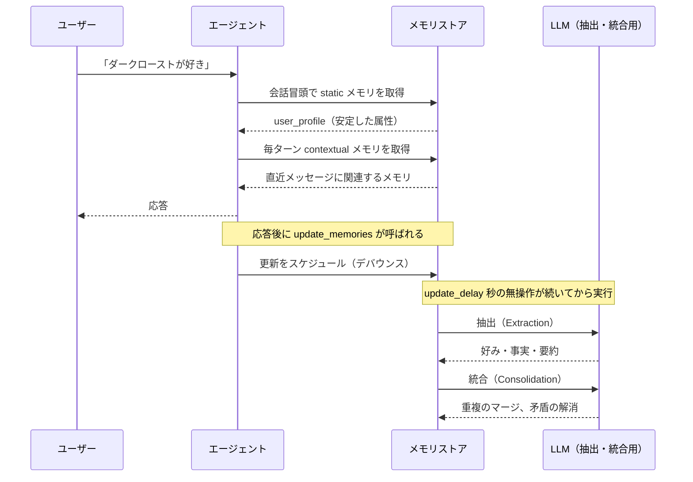
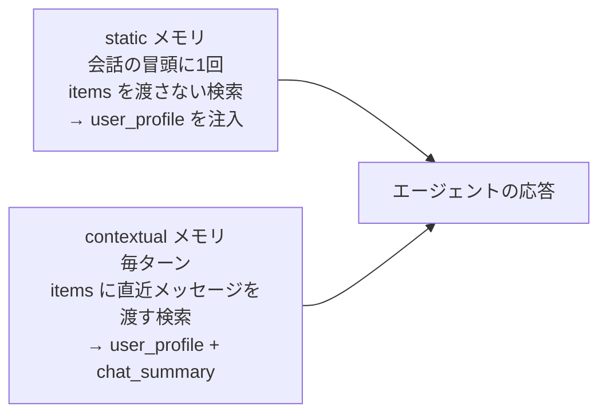

:::message alert
本記事の内容は **2026年8月26日時点** の情報に基づいています。Foundry Agent Service の Memory と Memory Store API は public preview です。API のスキーマや既定値は変わる可能性があります。
:::

# はじめに

私は普段、気になった技術ネタを GitHub の Issue に溜めておいて、時間があるときに順番に消化しています。そのリストを久しぶりに眺めていたら、「エージェントの記憶」系のネタが4件も溜まっていました。

まとめて片付けようと調べ始めたのですが、いくつかやり方あることに気づきました。

- Foundry Agent Service に組み込みの Memory（Microsoft が管理してくれるもの）
- Agent Memory Toolkit を使って、自分の Cosmos DB にエージェントの記憶を持たせるもの

どちらも「エージェントの長期記憶」ですが、誰がストレージを持つかがまるで違います。混同したまま書くと事実として間違ってしまうので、記事を2本に分けました。本記事は前者、**マネージドな Memory** のほうです。

> Memory in Microsoft Foundry Agent Service は、セッション・デバイス・ワークフローを跨いでエージェントの継続性を実現する、マネージドな長期記憶の仕組みです。

Memory の仕組みを裏側まで掘ってから、実際に手を動かして「セッションを跨いで思い出す」ところまで確認していきます。

## エージェントの「記憶」には2つのアプローチがある

| 観点 | マネージド Memory（本記事） | Agent Memory Toolkit（[姉妹記事](https://zenn.dev/nomhiro/articles/cosmosdb-agent-memory-toolkit-poc)） |
|---|---|---|
| ストレージ | Microsoft 管理（実装は非公開） | 自分の Cosmos DB アカウント |
| 組み込み方 | `memory_search_preview` ツールを付ける | `context_providers` に1オブジェクト注入 |
| 前提フレームワーク | Foundry Agent Service（プロンプトエージェント） | Microsoft Agent Framework |
| メモリ種別 | 3種類（user_profile / chat_summary / procedural） | 6種類（turn / fact / episodic / procedural / thread_summary / user_summary） |
| 中身を直接見る | API 経由でアイテム単位に参照 | Cosmos のドキュメントをそのまま参照 |
| 抽出ロジックの差し替え | `user_profile_details` の自然言語指示のみ | Prompty テンプレートを差し替え可能 |
| 運用の手間 | ほぼゼロ | Cosmos の設計・インデックス・TTL・課金を自分で見る |
| 向いているユースケース | 記憶の中身に説明責任を負わない社内向けアシスタント | 保存内容の説明・監査・削除が要件になる業務 |

「とりあえずエージェントに記憶を持たせたい」なら本記事のマネージド Memory、「保存されている内容を監査したい、抽出ルールを自分で決めたい」なら[姉妹記事](https://zenn.dev/nomhiro/articles/cosmosdb-agent-memory-toolkit-poc)の Toolkit、という住み分けになります。

:::message
姉妹記事: [Agent Memory Toolkit で Cosmos DB にエージェントの記憶を持たせる（セルフマネージド編）](https://zenn.dev/nomhiro/articles/cosmosdb-agent-memory-toolkit-poc)
:::

---

# そもそも、エージェントに記憶が必要なのはどんなとき？

会社に新しく入った人を想像してみてください。初日に「私はコーヒーはブラックで、朝は早いのが苦手です」と話したとして、翌日また同じ説明をしなければならないとしたら、けっこうストレスですよね。エージェントも同じで、セッションが変わるたびに前提を説明し直すのは体験としてかなり悪いです。

とはいえ、記憶を付ければ何でも良くなるわけではありません。判断軸をひとつ立てるなら、これが一番わかりやすいと思います。

> **同じことを2回聞かれたら、ユーザーがイラッとするか？**

イラッとするなら Memory の出番です。そうでもないなら、抽出用の LLM 代を払う意味がありません。もう少し具体的に整理すると、こうなります。

## Memory が効くユースケース

| 条件 | 具体例 | なぜ効くか |
|---|---|---|
| 同じ人が何度も来る | 社内ヘルプデスク、出張手配、営業支援 | 前提の再説明をなくせる |
| 好みが結果を左右する | 座席・宿の条件、単位系、回答の言語、出力の書式 | 毎回指定しなくても意図した形で返ってくる |
| セッションが短く切れる | チャット UI、モバイル、日をまたぐ作業 | 会話 ID が変わっても文脈が続く |
| 続けるほど価値が出る作業 | 手配、設計、リサーチ | 過去に試して駄目だったことを繰り返さない |

## Memory が向かないユースケース

ここも先に書いておきます。検証してみて「これは向かないな」と感じた場面です。

| 条件 | なぜ向かないか |
|---|---|
| 一問一答で終わる | 記憶される前に会話が終わる。抽出の LLM 代だけ損をする |
| 記憶の内容に説明責任がある | 抽出も統合も LLM 任せで中身が非決定的。実際に、正しかったメモリが統合で上書きされる場面に遭遇しました（後述） |
| 記憶した値を確定値として扱いたい | 同上。設定値や業務データはアプリ側の DB に持つべきです |
| 利用者が多い | メモリストアあたりの scope 上限が 100（preview 時点）。scope をユーザー単位にする設計だとすぐ頭を打ちます |
| 組織の「正解」を答えさせたい | それは学習ではなく参照。ナレッジベースの仕事です |

エージェントの記憶は、大きく2つに分かれます。

| 種類 | 何を持つか | 誰が管理するか |
|---|---|---|
| 短期記憶 | いま進行中の会話。直近のやりとりの文脈 | 会話（conversation / thread）として、フレームワークが持つ |
| 長期記憶 | セッションを跨いで残る、蒸留された知識 | 抽出・統合・検索を行う永続的な仕組みが必要 |

Foundry Agent Service の Memory は、後者の長期記憶を担当します。会話から意味のある情報を抜き出し、重複や矛盾を整理して、次のセッションで引けるようにしてくれます。

## Memory とナレッジベースと file search の使い分け

似た機能が並んでいて迷いやすいところなので、整理しておきます。

| やりたいこと | 使うもの |
|---|---|
| ユーザーごとに、やりとりを通じて学習した内容を持たせたい | **Memory** |
| 組織の整備済みドキュメントでエージェントを根拠づけたい | Foundry IQ のナレッジベース |
| その場でユーザーが投げてきたファイルを検索したい | file search ツール |

「学習して溜まっていくもの」が Memory、「あらかじめ用意しておくもの」がナレッジベース、という分け方です。

公式ドキュメントには、こんなユースケースが挙げられています。

| エージェントの種類 | 記憶する内容の例 |
|---|---|
| 会話型（カスタマーサポート） | 名前、過去の問い合わせと解決内容、チケット番号、希望の連絡手段 |
| 会話型（買い物アシスタント） | ブランドごとのサイズ、好きな色、返品履歴、購入済みの商品 |
| 計画型（旅行手配） | 窓側／通路側、座席、食事、直行便かどうか、マイレージ、過去の旅の感想 |
| リサーチ型（医薬研究） | 過去に試して失敗した化合物、各ラボの主要な知見 |

## 今回の PoC が想定するユースケース

この記事の検証は、**社内の出張手配アシスタント**を想定して組んでいます。姉妹記事でも同じ題材を使うので、2つのアプローチの差が比べやすくなっています。

| 項目 | 内容 |
|---|---|
| 誰が使うか | 出張が多い社員。月に何度も同じ手配を頼む |
| いまの課題 | 毎回「通路側で」「駅から近いところで」「朝早いのは無理」を言い直している |
| 覚えてほしいもの | 座席の好み、宿の条件、出発時刻の制約 |
| 覚えてほしくないもの | 年齢、財務情報、正確な位置情報、認証情報 |
| 成功の条件 | 別のセッションで「来週の大阪出張の方針をまとめて」と言うだけで、3つの条件が反映された答えが返ってくる |

「覚えてほしくないもの」をリストにしているのがポイントです。Memory には `user_profile_details` という設定があって、これを自然言語で指示できます。社内で使うなら、ここは必ず埋めることになるはずです。


---

# Memory の仕組み

ここが本記事の本題です。Memory は3つのフェーズで動いています。



やっていること自体は素直です。**会話から LLM が情報を抜き、別の LLM 呼び出しで重複や矛盾を整理して、検索できる形で置いておく。** 検索にはハイブリッド検索（ベクトル検索と語彙的な検索の組み合わせ）が使われます。

## メモリは3種類ある

抽出されるメモリには種類があり、取得のタイミングも違います。

| 種類 | 何を持つか | 取得のタイミング |
|---|---|---|
| `user_profile` | 言語設定、既定値、アクセシビリティの要件など、持続する好みや属性 | 会話の冒頭。安定した個人化の土台にする |
| `chat_summary` | 過去の会話トピックやスレッドを蒸留した要約 | 毎ターン、いまのメッセージに関連するものを引く |
| `procedural` | 過去のやりとりから推測した、再利用できる手順や振る舞いのパターン | 過去に扱った定型作業を頼まれたとき |

3つとも「既定で有効」とドキュメントには書かれています。ただ、実際に `options` を何も渡さずにストアを作ってみたら、返ってきた既定値はこうでした。

```json
{
  "user_profile_enabled": true,
  "chat_summary_enabled": true,
  "default_ttl_seconds": 0
}
```

`procedural_memory_enabled` がそもそも入っていません。`default_ttl_seconds` は指定していなくても既定値（0）が補われて返ってくるので、キーが省かれているのは「既定で無効」と読むのが自然です。**手順記憶を使いたいなら、ストア作成時に明示的に `procedural_memory_enabled=True` を渡す**のが確実です。

なお、明示的に有効化した場合は後述のとおりきちんと手順記憶が作られました。

## static メモリと contextual メモリ

ここは地味ですが大事なところです。

`user_profile` のような情報は、ユーザーのメッセージと意味的に似ていないことがよくあります。「大阪出張の手配をお願い」というメッセージに対して「この人は通路側が好き」というメモリは、文としてあまり似ていません。類似度検索だけに任せると引けないのです。

そこで Memory は取得を2系統に分けています。



低レベル API では、`search_memories` に `items` を渡すか渡さないかでこの2つを切り替えます。渡さなければ static、直近メッセージを渡せば contextual です。この分離、なかなかスッキリした設計だなと感じました。

## 書き込みは「あとでまとめて」行われる

応答のたびに内部で `update_memories` が呼ばれますが、**実際の書き込みは即座には起きません**。`update_delay` で指定した秒数だけ無操作が続いてから、まとめて処理されます。

レシートをその場で家計簿に書くのではなく、いったん財布に溜めて、落ち着いたときにまとめて記帳するイメージです。1ターンごとに抽出用の LLM を回すのは無駄なので、こうなっているのは納得できます。

既定値は **300秒（5分）**。検証で「書いたのに思い出さない」となったら、まずここを疑うことになります。

## で、裏側は Cosmos DB なの？

冒頭で触れた Issue のひとつが、まさに「Foundry Agent Memory の仕組み解説（Cosmos？）」でした。答えを先に書きます。

**マネージド Memory のバックエンド実装は、公式には非公開です。**

公式ドキュメントが明言しているのは、ここまでです。

- メモリは「マネージドなメモリストア」のアイテムとして保存される
- 抽出と統合には LLM が使われる
- 取得にはハイブリッド検索が使われる
- 埋め込みモデルとチャットモデルは、こちらが指定したデプロイが使われる

Foundry のアナウンス記事には「Foundry のマネージドサービスへのアクセスと、将来的な bring your own storage への、統一されたインターフェースを提供する」という書き方があります。つまり現時点では中を見せない設計で、将来 BYO ストレージに対応する余地を残している、という読み方になります。

そして「Cosmos DB」が出てくるのは、**別の話**です。Azure Cosmos DB のブログにある `CosmosMemoryContextProvider` のサンプルは、Agent Framework のライフサイクルフックから**自分の Cosmos DB アカウント**に読み書きするものです。タイトルに Foundry Agent Service と入っているので紛らわしいのですが、マネージド Memory の内部実装の解説ではありません。こちらは[姉妹記事](https://zenn.dev/nomhiro/articles/cosmosdb-agent-memory-toolkit-poc)で扱います。

ただ、後で実際にメモリを覗いてみたら、内部実装のヒントらしきものが1つ見つかりました。それは検証パートで出てきます。

---

# 2つの使い方

Memory の使い方は2通りあります。

| | memory search tool | Memory Store API |
|---|---|---|
| やり方 | エージェント定義の `tools` に `memory_search_preview` を追加 | `memory_stores` の各 API を直接呼ぶ |
| 読み書き | 会話のなかで自動 | 自分で `begin_update_memories` / `search_memories` を呼ぶ |
| scope の解決 | `{{$userId}}` でエンドユーザーに自動マッピングできる | 毎リクエストで明示的に指定（自動解決なし） |
| アイテム単位の操作 | できない | 作成・取得・更新・一覧・削除ができる |
| 向いているケース | ほとんどの場面 | 保持期間やライフサイクルを自分で握りたい場面 |

まずはツールのほうから触ってみます。

---

# 触ってみる

## 検証シナリオと、各ステップが確かめること

上で決めた出張手配アシスタントのユースケースに沿って、ステップを組みました。仕組みの確認だけで終わらせず、「そのユースケースで本当に使えるのか」を1つずつ潰していく順番にしています。

| ステップ | 確かめること | ユースケース上の意味 |
|---|---|---|
| Step 1 | ストアの作成と設定値の反映 | 何を覚え、何を覚えないかを決められるか |
| Step 2 | セッションを跨いだ想起 | 「言い直さなくていい」が成立するか |
| Step 3 | 実際に保存されたメモリの中身 | 社員の何が保存されているか説明できるか |
| Step 3 の補足 | static と contextual の引き比べ | 毎ターン何が入力に載るか。つまりコスト |
| Step 3 の補足 | 統合による上書き | 記憶を確定値として扱えるか |
| Step 4 | scope による分離 | 社員Aの好みが社員Bに漏れないか |
| Step 5 | remember / forget | 「これは覚えて」「これは忘れて」に応えられるか |
| Step 6 | Memory あり / なしの比較 | 効果とトークン増分の実測 |
| Step 7 | 後片付け | 消し方 |

## 前提

| 項目 | 今回の値 |
|---|---|
| Foundry プロジェクト | East US 2（Memory の対応リージョン一覧に含まれる） |
| チャットモデル | `gpt-5.6-luna` |
| 埋め込みモデル | `text-embedding-3-small` |
| SDK | `azure-ai-projects` 2.5.0 |

:::message
Memory は対応リージョンが限られています。2026年8月26日時点では East US 2、Japan East、Sweden Central、West US 3 などが対象です。VNet 統合には対応していません。
:::

```bash
pip install "azure-ai-projects>=2.3.0" azure-identity
```

```bash
export FOUNDRY_PROJECT_ENDPOINT="https://{account}.services.ai.azure.com/api/projects/{project}"
export MEMORY_STORE_CHAT_MODEL_DEPLOYMENT_NAME="gpt-5.6-luna"
export MEMORY_STORE_EMBEDDING_MODEL_DEPLOYMENT_NAME="text-embedding-3-small"
```

`gpt-5.6-luna` はかなり新しいモデルなので「互換性のあるモデルが必要」という記述に引っかかるかと思っていたのですが、素直に通ってひと安心でした。

## Step 1: メモリストアを作る

```python
import os
from datetime import timedelta
from azure.ai.projects import AIProjectClient
from azure.ai.projects.models import (
    MemoryStoreDefaultDefinition,
    MemoryStoreDefaultOptions,
)
from azure.identity import DefaultAzureCredential

client = AIProjectClient(
    endpoint=os.environ["FOUNDRY_PROJECT_ENDPOINT"],
    credential=DefaultAzureCredential(),
)

options = MemoryStoreDefaultOptions(
    user_profile_enabled=True,
    chat_summary_enabled=True,
    procedural_memory_enabled=True,
    default_ttl_seconds=timedelta(days=30),
    user_profile_details=(
        "コーヒーの好み、作業する時間帯、使用する言語を優先して記憶する。"
        "年齢・財務情報・正確な位置情報・認証情報は記憶しない。"
    ),
)

store = client.beta.memory_stores.create(
    name="poc_memory_store",
    definition=MemoryStoreDefaultDefinition(
        chat_model=os.environ["MEMORY_STORE_CHAT_MODEL_DEPLOYMENT_NAME"],
        embedding_model=os.environ["MEMORY_STORE_EMBEDDING_MODEL_DEPLOYMENT_NAME"],
        options=options,
    ),
    description="手順記憶あり・既定TTL30日のメモリストア",
)
```

ここでのポイントは2つです。

**`user_profile_details` が効きます。** 何を覚えるか、何を覚えないかを自然言語で指示できます。裏側でこの文字列が抽出モデルへの指示に変換されるので、旅行エージェントなら「航空会社の好みと食事制限を優先」のように書けます。プライバシー要件から除外項目を書くのにも使えます。

**`procedural_memory_enabled` と `default_ttl_seconds` は作成時しか設定できません。** あとから `update` を呼んでも反映されないので、試したい設定は最初に決めておく必要があります。ここは preview 中の制約として明記されています。

作成すると、指定した値がそのまま返ってきました。

```json
{
  "object": "memory_store",
  "id": "memstore_59a5cb355941cd05005rDz5MjUZQXIkdsdREQNFWKHxlzvX2lz",
  "name": "poc_memory_store",
  "definition": {
    "kind": "default",
    "chat_model": "gpt-5.6-luna",
    "embedding_model": "text-embedding-3-small",
    "options": {
      "user_profile_enabled": true,
      "user_profile_details": "コーヒーの好み、作業する時間帯、使用する言語を優先して記憶する。年齢・財務情報・正確な位置情報・認証情報は記憶しない。",
      "chat_summary_enabled": true,
      "procedural_memory_enabled": true,
      "default_ttl_seconds": 2592000
    }
  }
}
```

`timedelta(days=30)` は秒（2592000）に変換されて格納されます。`0` を指定すると無期限です。

## Step 2: エージェントにツールを付けて、セッションを跨がせる

```python
from azure.ai.projects.models import MemorySearchPreviewTool, PromptAgentDefinition

tool = MemorySearchPreviewTool(
    memory_store_name="poc_memory_store",
    scope="user_123",
    update_delay=1,   # 検証用。既定は 300 秒
)

agent = client.agents.create_version(
    agent_name="PocAgentWithMemory",
    definition=PromptAgentDefinition(
        model=os.environ["MEMORY_STORE_CHAT_MODEL_DEPLOYMENT_NAME"],
        instructions="あなたは親切なアシスタントです。日本語で簡潔に答えてください。",
        tools=[tool],
    ),
)
```

エージェント側の変更はこれだけです。あとは会話を2つ作って、あいだに待ち時間を挟みます。

```python
import time

openai_client = client.get_openai_client()
agent_ref = {"agent_reference": {"name": agent.name, "type": "agent_reference"}}

# 会話1
conv1 = openai_client.conversations.create()
res1 = openai_client.responses.create(
    input="私はダークローストのコーヒーが好きで、いつも朝7時ごろに飲みます。",
    conversation=conv1.id,
    extra_body=agent_ref,
)

# デバウンス待ち
time.sleep(70)

# 会話2（別の conversation）
conv2 = openai_client.conversations.create()
res2 = openai_client.responses.create(
    input="いつものコーヒーを注文しておいて。あと私が飲む時間帯も教えて。",
    conversation=conv2.id,
    extra_body=agent_ref,
)
```

結果、こうなりました。


別の conversation なのに、ダークローストと朝7時をきちんと思い出しています。これ、地味にすごいと思います。会話履歴を自分で引き回すコードは1行も書いていません。

`response.output` を覗くと、何が起きたかがもう少し見えます。

```python
for item in response.output:
    if getattr(item, "type", None) == "memory_search_call":
        print(item.model_dump())
```

```json
{
  "type": "memory_search_call",
  "status": "in_progress",
  "search_id": "91119178ae6f41ad89b27d0eb4d87d77",
  "update_id": "53823991-5590-4db1-839c-3c8ae80de2ba",
  "usage": { "embedding_tokens": 33, "total_tokens": 33 },
  "memories": [
    {
      "memory_id": "21a23258c8874dd2b8cd00c3841107b8",
      "scope": "user_123",
      "content": " ユーザーはダークローストのコーヒーが好きで、朝7時ごろに飲む。",
      "kind": "user_profile"
    },
    {
      "memory_id": "35b07e27168f474eac26a80e5efea33d",
      "scope": "user_123",
      "content": "ユーザーはダークローストのコーヒーを好み、普段は朝7時ごろにコーヒーを飲む。このコーヒーの好みと朝の習慣を記憶しておくよう求め、アシスタントは了承した。",
      "kind": "chat_summary"
    }
  ]
}
```

会話1では `memories` が空、会話2では3件返っています。before / after がきれいに出ました。

:::message
preview の途中で、ツール出力のフィールド名が `results` から `memories` に変わっています。生のペイロードをパースしているコードがあれば直す必要があります。
:::

`usage` に `embedding_tokens` が別枠で載っているのも見どころです。埋め込みモデルの課金がここに出てくるわけですね。

もうひとつ、会話1の出力に予想外のものが入っていました。

```json
{
  "type": "memory_command_preview_call",
  "status": "completed",
  "arguments": "{\"action\":\"remember\",\"content\":\"ユーザーはダークローストのコーヒーが好きで、朝7時ごろに飲む。\"}"
}
```

私は「覚えておいて」と明示的には言っていません。「私は〜が好きで」と述べただけです。それを受けてモデルが自分で remember コマンドを発行していました。後述の remember / forget は明示的な依頼のときの機能なのですが、実際にはモデルの判断でも発行されるようです。

## Step 3: 実際に入っているメモリを覗く

ここが「裏側」パートで一番おもしろかったところです。低レベル API でメモリアイテムを一覧できます。

```python
items = list(client.beta.memory_stores.list_memories(
    name="poc_memory_store",
    scope="user_123",
))
for m in items:
    d = m.as_dict()
    print(d["kind"], "|", d["content"])
```

コーヒーの話を2往復しただけなのに、3種類・5件のメモリができていました。


見どころが3つあります。

**`procedural` メモリが本当に作られていました。** 中身は JSON で、`applicable_to`（どういう状況に当てはまるか）と `instruction`（何をすべきか）のペアになっています。

```json
{
  "applicable_to": "When a user refers to a usual or previously established item but the available context does not contain the underlying preference or schedule.",
  "instruction": "Do not invent the item's attributes or the user's habitual time. Explicitly state that the preference is not available in the current context and ask the user to confirm the relevant details before summarizing or acting on the request."
}
```

「確定していない好みを勝手に作るな」という手順が自動生成されている。手順記憶がこういう形で持たれているのは、想像していたよりずっと具体的でした。

**`memory_id` の頭に scope が埋まっています。** `dXNlcl8xMjM_e6adb32f…` という ID の、アンダースコアより前を Base64 デコードすると `user_123` になります。

```bash
$ echo -n "dXNlcl8xMjM" | base64 -d
user_123
```

これが冒頭で触れた「内部実装のヒントらしきもの」です。scope が ID に埋め込まれているということは、scope でパーティション分割されたキー空間を持っている、と想像がつきます。バックエンドが何であれ、scope が単なる検索フィルタではなく物理的な区切りとして使われていそうだ、というのは運用を考えるうえで意味のある情報です。

**言語が混ざりました。** 会話1の直後に作られたメモリは日本語だったのに、統合を経たあとのメモリは英語になっていました。日本語で会話しているのにメモリが英語で保存されるのは、内容を見たいときに少し戸惑います。

## static メモリと contextual メモリを引き比べる

仕組みの説明で触れた2系統の取得を、低レベル API で撃ち比べてみます。違いは `items` を渡すかどうかだけです。

```python
from azure.ai.projects.models import MemorySearchOptions

ms = client.beta.memory_stores

# static: items を渡さない
static = ms.search_memories(name="poc_memory_store", scope="user_123")

# contextual: items に直近メッセージを渡す
query = {"role": "user", "content": "コーヒーの好みを教えて", "type": "message"}
ctx = ms.search_memories(
    name="poc_memory_store",
    scope="user_123",
    items=[query],
    options=MemorySearchOptions(max_memories=5),
)
```

結果はきれいに分かれました。

```text
--- static（items なし）: 2 件 ---
  [user_profile] The user refers to a recurring or usual coffee order, but the coffee type ...
  [user_profile] The user communicates in Japanese.

--- contextual（items あり・max_memories=5）: 5 件 ---
  [chat_summary] ユーザーはダークローストのコーヒーを好み、普段は朝7時ごろにコーヒーを飲む。...
  [chat_summary] On August 26, 2026, the user asked in Japanese to order the user's usual coffee ...
  [user_profile] The user refers to a recurring or usual coffee order, but the coffee type ...
  [user_profile] The user communicates in Japanese.
  [procedural]   {"applicable_to": "When a user refers to a usual or previously established item ...
```

**static は `user_profile` だけ**、**contextual は3種類すべて**が返りました。ドキュメントには contextual で「user profile と chat summary が返る」と書かれていますが、実測では `procedural` も混ざってきました。

もうひとつ、試しておくべきことがあります。まったく関係ない質問を投げたらどうなるか。

```python
q2 = {"role": "user", "content": "京都のおすすめ観光スポットは？", "type": "message"}
```

```text
--- contextual（京都の観光）: 5 件 ---
  [chat_summary] ユーザーはダークローストのコーヒーを好み、普段は朝7時ごろに ...
  [user_profile] The user communicates in Japanese.
  [chat_summary] On August 26, 2026, the user asked in Japanese to order ...
  [procedural]   {"applicable_to": "When a user refers to a usual ...
  [user_profile] The user refers to a recurring or usual coffee order ...
```

**同じ5件が、順位だけ入れ替わって返ってきました。** コーヒーの話しか入っていないストアに観光の質問を投げても、0件にはなりません。`max_memories` の件数までは、関連が薄くても返す作りです。

これは押さえておいたほうがよい挙動だと思います。「関連するメモリだけが注入される」と思い込むと、無関係なメモリが毎ターン入力トークンを食い続けることになります。低レベル API を自分で叩く設計なら、`max_memories` を小さめにするか、返ってきたものを呼び出し側で絞る前提で考えるのが安全です。

## 統合がメモリを書き換えてしまった話

そして、いちばん考えさせられたのがこれです。会話1の直後は正しかったメモリが、会話2の処理後に**同じ `memory_id` のまま内容が悪化していました**。


「ユーザーはダークローストのコーヒーが好きで、朝7時ごろに飲む」が、「いつものコーヒーへの言及はあるが、種類も注文内容も飲む時間も確定していない」に変わっています。

種明かしをしているのは、同時に作られた `chat_summary` でした。

> … However, the assistant **asserted** that the usual coffee was a dark roast and that the drinking time was around 7:00 AM **without support from the available conversation**.

統合を担う LLM は、会話2の本文だけを見ています。会話2の中では「ダークロースト」「朝7時」はユーザーが言っておらず、エージェントが突然言い出したように見えます。そこで「根拠のない主張」と判定して、正しかったメモリを「未確定」に上書きしてしまったわけです。

会議の後半だけ聞いていた人が議事録を書いて、「この結論には根拠がない」と書き足してしまった、という状況に近いです。しかも、その判断が次回の `procedural` メモリにまで反映されている。

これは preview の挙動なので今後変わるかもしれませんが、**統合フェーズは既存メモリを上書きしうる**という性質は押さえておいたほうがよさそうです。重要な設定値を Memory だけに頼って持たせるのは、今の段階ではまだ怖いなと感じました。確定させたい値は、明示的な remember や `create_memory` でアイテムとして持つか、そもそもアプリ側の DB に置くほうが安全です。

## Step 4: scope でユーザーを分ける

`scope` は Memory でいちばん重要な設定値です。ツール定義で `{{$userId}}` を指定しておくと、リクエストヘッダーからエンドユーザーを解決してくれます。

会社の受付が名札を見て取り次ぐのと同じで、エージェント自体は1つでよくて、名札だけ差し替えれば記憶が分かれます。

```python
tool = MemorySearchPreviewTool(
    memory_store_name="poc_memory_store",
    scope="{{$userId}}",
    update_delay=1,
)
```

```python
res = openai_client.responses.create(
    input="私の愛車の車種と色は？",
    conversation=conv.id,
    extra_body=agent_ref,
    extra_headers={"x-memory-user-id": "alice-0826"},   # ← ここだけ変える
)
```

ユーザーA に車のことを覚えさせてから、ヘッダーだけ変えて同じ質問をしてみました。

```text
[A] x-memory-user-id: alice-0826
[A] USER  : 私の愛車の車種と色は？
[A] AGENT : 愛車は、青色のスバル BRZです。
[A] 取得メモリ 3 件
           - [user_profile] scope=alice-0826 /  ユーザーの愛車は青いスバル BRZ。
           - [chat_summary] scope=alice-0826 / 2026年8月26日、ユーザーは愛車がスバル BRZで、色は青色であることを伝え…

[B] x-memory-user-id: bob-0826
[B] USER  : 私の愛車の車種と色は？
[B] AGENT : まだ存じ上げません。愛車の車種と色を教えてください。
[B] 取得メモリ 0 件
```

きれいに分かれました。取得メモリの `scope` にヘッダーの値がそのまま入っているのも確認できます。

:::message alert
`{{$userId}}` の自動解決は **memory search tool 経由のときだけ**です。低レベル API を直接呼ぶ場合は、毎リクエストで `scope` を明示する必要があります。ヘッダーがないときは呼び出し元の Microsoft Entra の識別子（テナントIDとオブジェクトID）にフォールバックします。
:::

## Step 5: remember / forget は即時に効く

「覚えておいて」「忘れて」に対しては、デバウンスを待たずに即座に反映されます。

```python
tools = [{
    "type": "memory_search_preview",
    "memory_store_name": "poc_memory_store",
    "scope": "cmd-0826",
}]

res = openai_client.responses.create(
    model=os.environ["MEMORY_STORE_CHAT_MODEL_DEPLOYMENT_NAME"],
    tools=tools,
    input="私の好きな座席は通路側です。覚えておいてください。",
)
```

```text
[remember] USER : 私の好きな座席は通路側です。覚えておいてください。
[remember] AGENT: 覚えておきます。通路側の座席がお好きなのですね。
[remember] type      : memory_command_preview_call
[remember] status    : completed
[remember] arguments : {"action":"remember","content":"ユーザーは通路側の座席が好き。"}

--- after remember（待ち時間なし）: scope=cmd-0826 のメモリ 1 件 ---
    [user_profile]  ユーザーは通路側の座席が好き。

[forget] USER : 座席の好みは忘れてください。
[forget] AGENT: 座席の好みを忘れました。
[forget] arguments : {"action":"forget","content":"ユーザーは通路側の座席が好き。"}

--- after forget（待ち時間なし）: scope=cmd-0826 のメモリ 0 件 ---
    （なし）
```

`sleep` を1秒も入れていません。ユーザーが明示的に頼んだ操作は待たされない、という設計は理にかなっていると思います。

:::message alert
remember で入れたメモリも TTL の対象です。TTL を上書きはしないので、ストアに `default_ttl_seconds` が設定されていれば期限切れで消えます。
:::

なお、forget の直後に `list_memories` を呼ぶと 500 が返ってくることがありました。数秒待ってリトライすれば通るので、preview らしい不安定さとして織り込んでおくとよさそうです。

## Step 6: Memory あり / なしを並べてみる

ここまでで仕組みは見えたので、最後に効果を測ります。instructions とモデルは完全に同じで、`tools` に memory search tool を付けるかどうかだけを変えた2エージェントを用意しました。

セッション1で希望を3つ伝え、無操作を挟んでから、別セッションで同じ質問を投げます。


Memory ありは具体的な方針を出し、なしは7項目の聞き返しをしてきました。ユーザー体験としての差はかなり大きいです。

トークンはこうなりました。

| 項目 | Memory あり | Memory なし | 差 |
|---|---|---|---|
| `input_tokens` | 599 | 60 | +539 |
| `output_tokens` | 130 | 168 | -38 |
| `total_tokens` | 729 | 228 | +501 |
| `embedding_tokens` | 34 | 0 | +34 |

入力トークンが約10倍になっています。メモリの注入ぶんですね。ただ、なし側は聞き返しに答えるラリーが必ず1往復以上増えるので、会話全体で見れば必ずしも高くつくとは言えません。

:::message
この数値は preview 環境での1ターン分の参考値です。レイテンシはばらつきが大きく誤解を招くため、あえて載せていません。
:::

## Step 7: 後片付け

作ったものは消しておきます。

```python
for name in ["PocAgentWithMemory", "PocAgentPerUser", "PocAgentNoMemory"]:
    client.agents.delete(agent_name=name, force=True)

client.beta.memory_stores.delete(name="poc_memory_store")
```

---

# 設定値まとめ

触ってわかった範囲で、設定値を整理しておきます。

| 設定値 | 指定する場所 | 既定 | 効果 |
|---|---|---|---|
| `scope` | ツール定義 / API | なし（必須） | メモリの分離単位。`{{$userId}}` はツール経由のときだけ解決される |
| `update_delay` | ツール定義 | 300秒 | 無操作がこの秒数続いてから長期メモリに書き込む |
| `user_profile_enabled` | ストア作成時 | true | ユーザープロファイル記憶の有効化 |
| `chat_summary_enabled` | ストア作成時 | true | 会話要約記憶の有効化 |
| `procedural_memory_enabled` | ストア作成時（**後から変更不可**） | ドキュメントは true。実測では既定応答に含まれず、明示指定が必要 | 手順記憶の有効化 |
| `default_ttl_seconds` | ストア作成時（**後から変更不可**） | 0（無期限） | 新規メモリの既定有効期限 |
| `user_profile_details` | ストア作成時 | なし | 何を覚え、何を覚えないかの自然言語指示 |
| `max_memories` | 検索時 | - | 取得件数の上限 |

---

# ハマりどころ

実際に踏んだものだけ書きます。

**書き込みがデバウンスされる。** 待たずに次の会話を始めると想起されません。検証では `update_delay=1` にして70秒待つ、くらいの余裕を持たせるのが確実でした。

**書き込みと検索で `scope` 文字列が一致していないと0件。** 当たり前なのですが、`{{$userId}}` とヘッダーの組み合わせを使い始めると意外と間違えます。

**API のバージョンが2系統ある。** Agents API は `api-version=v1`、Memory Store API は `2025-11-15-preview` です。REST で叩くときは混ぜないよう注意します。

**低レベル API の contextual 検索には、プロジェクトのマネージド ID の権限が必要。** `search_memories` に `items` を渡す呼び方（contextual 検索）をしたところ、埋め込みモデルへの認証で 401 になりました。

```text
azure.core.exceptions.HttpResponseError: (forbidden) Memory search failed:
{"code":"ResourceError","message":"{\"message\":\"Provided Azure resource encountered an error.\",
\"deployment\":\"491c900735a74eb6a0b6bf0b42d9c365/deployments/text-embedding-3-small\",
\"details\":{\"type\":\"Authentication\",\"status_code\":401,
\"description\":\"Authentication to the Azure OpenAI resource failed.\"}}"}
```

面白いのは、**同じストアに対して memory search tool 経由なら埋め込みが動く**ことです（`embedding_tokens: 33` が出ていました）。エージェントのランタイムとメモリストア API で、埋め込みモデルを呼ぶときの ID が違うようです。

対処は、プロジェクトのシステム割り当てマネージド ID に、親リソース（アカウント）のスコープで `Foundry User` ロールを割り当てることです。今回のプロジェクトはマネージド ID が有効になっているだけで、ロールが1つも付いていませんでした。

```bash
# プロジェクトのマネージド ID の principalId を確認
az rest --method get \
  --url "https://management.azure.com/subscriptions/<sub>/resourceGroups/<rg>/providers/Microsoft.CognitiveServices/accounts/<account>/projects/<project>?api-version=2025-06-01" \
  --query identity.principalId -o tsv

# Foundry User を親リソースのスコープで割り当てる
az role assignment create \
  --assignee-object-id <上で得た principalId> \
  --assignee-principal-type ServicePrincipal \
  --role "Foundry User" \
  --scope "/subscriptions/<sub>/resourceGroups/<rg>/providers/Microsoft.CognitiveServices/accounts/<account>"
```

これで contextual 検索が通るようになりました。先ほどの static / contextual の引き比べは、この割り当て後に取った結果です。

:::message alert
Git Bash から実行すると `MissingSubscription` という的外れなエラーになります。先頭が `/` の `--scope` が Windows パスに変換されてしまうためです。`export MSYS_NO_PATHCONV=1` を入れるか、PowerShell から実行してください。これで時間を溶かしました。
:::

**ロール名が改名されたばかり。** `Foundry User` は旧 `Azure AI User` です。`Foundry Owner` / `Foundry Account Owner` / `Foundry Project Manager` も同様に改名されています。古い記事を参考にすると名前が見つからず戸惑います。

**ストア作成時オプションは後から変えられない。** `procedural_memory_enabled` と `default_ttl_seconds` は作り直しが必要です。

**`procedural_memory_enabled` の既定値がドキュメントと食い違う。** ドキュメントは「既定で有効」と書いていますが、`options` を渡さずに作ったストアの応答にはこのキーが含まれませんでした。明示的に指定するのが確実です。

**preview らしい 500 が出る。** forget 直後の `list_memories` などで単発の `server_error` が返ることがありました。リトライで通ります。

---

# 制約とコスト

| 項目 | 値 |
|---|---|
| メモリストアあたりの scope 数 | 最大 100 |
| scope あたりのメモリ数 | 最大 10,000 |
| メモリ検索 | 1,000 リクエスト/分 |
| メモリ更新 | 1,000 リクエスト/分 |
| VNet 統合 | 非対応 |

scope 上限が100なのは注意が必要です。scope をエンドユーザー単位にする設計だと、100ユーザーで頭を打ちます。preview 中の値なので緩和されると思いますが、今の時点で本番規模を考えるならここは確認したいところです。

課金は、Memory 自体ではなく**裏で動くチャットモデルと埋め込みモデルの使用分**です。抽出と統合で LLM が回るので、`update_delay` を小さくしすぎるとそこが効いてきます。

セキュリティ面では、公式ドキュメントがプロンプトインジェクションとメモリ汚染への注意を促しています。会話から自動でメモリを作る仕組みなので、悪意ある入力がそのまま長期記憶に焼き付くリスクがあるわけです。Azure AI Content Safety のジェイルブレイク検出を組み合わせる、という案内になっています。今回の検証で統合が正しいメモリを壊すのを見たあとだと、この注意書きの重みが変わって感じられました。

---

# まとめ

**社内の出張手配アシスタント**という想定で、Foundry Agent Service の Memory を、メモリストアの作成からセッション跨ぎの想起、scope 分離、remember / forget、Memory あり／なしの比較まで通して触ってみました。「毎回『通路側で』『駅近で』『朝は無理』を言い直している」という課題が、実際に消えるかどうかを見たかったわけです。

エージェント側にやることが `tools` に1つ足すだけ、というのはかなりハードルが低いです。会話履歴の永続化と要約を自分で実装したことがある人なら、これがマネージドで済むありがたさはすぐ分かると思います。

一方で、抽出も統合もぜんぶ LLM 任せなので、**メモリの内容は決定的ではない**という前提は必要でした。今回いちばん学びが大きかったのは、正しかったメモリが統合で上書きされる場面を実物で見られたことです。「エージェントが賢く覚えてくれる」ではなく、「LLM が要約を書き続けているデータストア」だと思って設計するのが正しい距離感なのだろうと思います。

冒頭で触れたもうひとつのアプローチ、自分の Cosmos DB に記憶を持たせるほうは姉妹記事で扱っています。あちらは保存されているドキュメントを全部覗けるので、「何がどう保存されているのか」を見たい方はそちらもどうぞ。

## 結局、どのユースケースなら使えるか

検証を踏まえて、最初に立てた判断軸に答えを書いておきます。

| ユースケース | 判定 | 理由 |
|---|---|---|
| 社内アシスタント（今回の出張手配など） | 使える | 言い直しが消える効果が大きく、記憶が多少ぶれても致命的にならない |
| カスタマーサポートの一次対応 | 使える | 名前や過去の問い合わせを覚えるだけで体験が変わる。ただし解決履歴を「事実」として扱わない |
| 設定値やユーザー属性の永続化 | 使わない | 統合で上書きされうる。アプリ側の DB の仕事 |
| 規程で保存内容の説明が求められる業務 | 使わない | バックエンドが非公開で、抽出結果も非決定的。姉妹記事のセルフマネージドを検討する |
| 一般ユーザー向けの大規模サービス | いまは使わない | scope 上限 100（preview 時点）。緩和を待つ |

想定していた出張手配アシスタントについては、期待どおり動きました。「毎回同じことを言い直している」という課題があるなら、`tools` に1行足すだけで解けます。逆に、記憶した内容を業務の根拠として使いたいなら、この機能に持たせるのは違うな、というのが今回の結論です。


# 参考リンク

- [Memory in Microsoft Foundry Agent Service (preview)](https://learn.microsoft.com/azure/foundry/agents/concepts/what-is-memory)
- [Create and use memory in Foundry Agent Service (preview)](https://learn.microsoft.com/azure/foundry/agents/how-to/memory-usage)
- [Introducing Memory in Foundry Agent Service | Microsoft Foundry Blog](https://devblogs.microsoft.com/foundry/introducing-memory-in-foundry-agent-service/)
- [Agents can learn with Memory in Microsoft Foundry Agent Service | Microsoft Community Hub](https://techcommunity.microsoft.com/blog/azure-ai-foundry-blog/agents-can-learn-with-memory-in-microsoft-foundry-agent-service/4535431)
