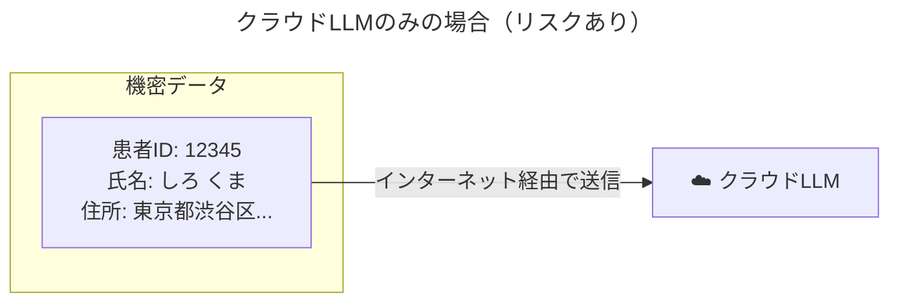
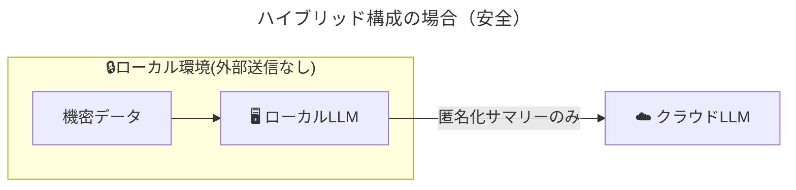
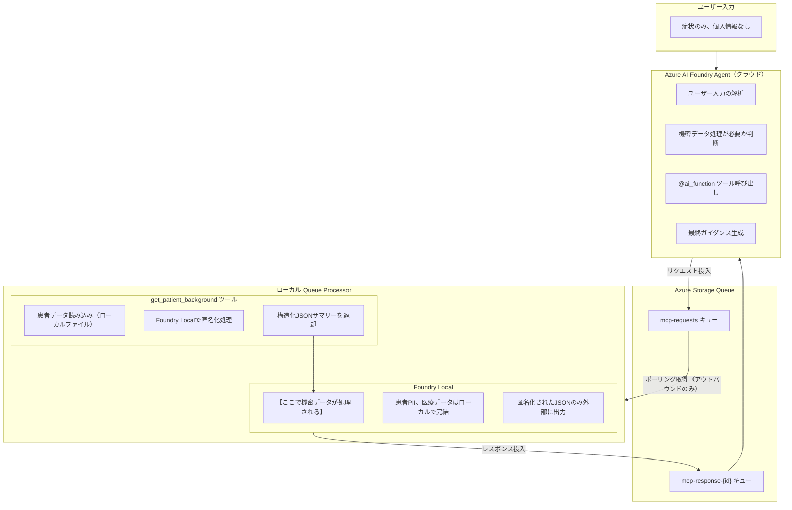
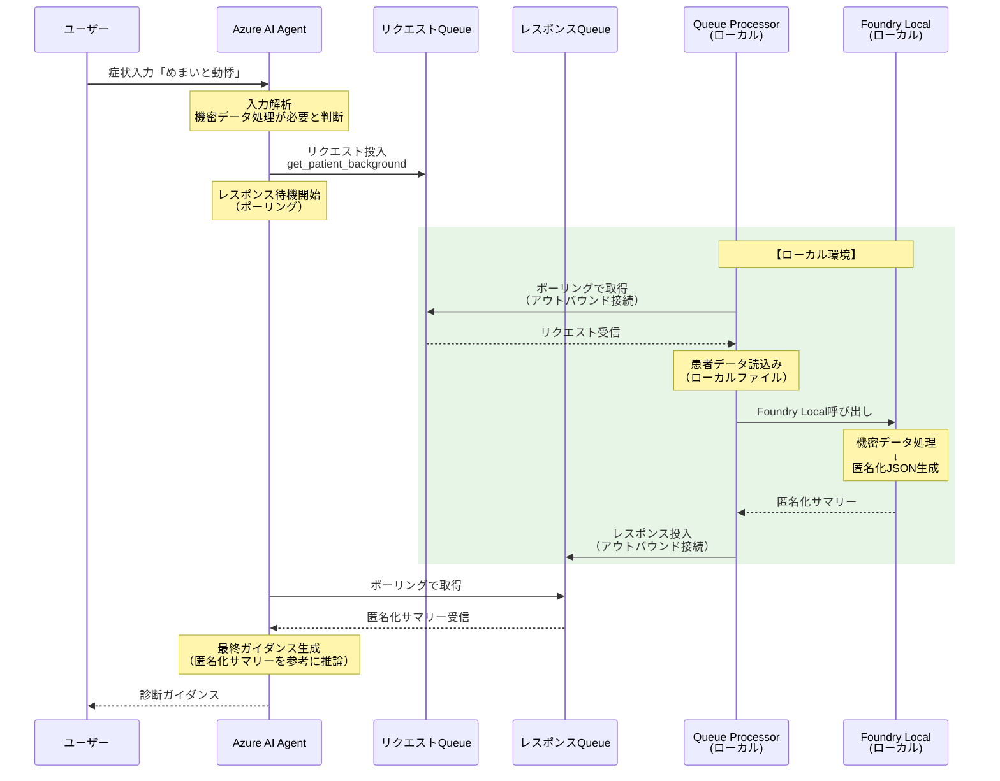
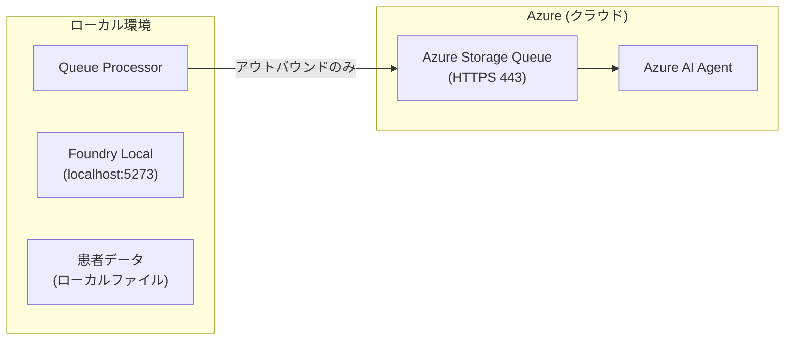

本記事は**Azure PoC 部** **Advent Calendar 2025** の 21 日目の記事です。
https://qiita.com/advent-calendar/2025/azpoc


# はじめに

本記事は、以前公開した「ローカルとクラウドLLMのハイブリッドAI活用」の**続編**です。
https://zenn.dev/nomhiro/articles/hybrid-ai-local-azure-security

前回の記事では、**MCP（Model Context Protocol）+ Azure Dev Tunnel** を使用してローカルMCPサーバーをインターネットに公開する方式を紹介しました。しかし、この方式には以下の課題がありました。

| 課題 | 説明 |
|------|------|
| **セキュリティリスク** | ローカルサーバーがインターネットからアクセス可能 |
| **ファイアウォール問題** | 企業環境ではDev Tunnelが許可されない場合がある |
| **常時接続の必要性** | トンネルが切断されるとシステムが動作しない |

前回記事の最後で「今後の展望」として挙げていた**ポーリング方式** (**Azure Storage Queue**) を、今回実際に実装しました。

## 本記事での改善点

| 項目 | 前回（MCP + Dev Tunnel） | 今回（Azure Storage Queue） |
|------|-------------------------|----------------------------|
| 通信方向 | インバウンド + アウトバウンド | **アウトバウンドのみ** |
| 認証 | なし（匿名アクセス） | **Azure AD / SAS認証** |
| サーバー公開 | 必要 | **不要** |

これにより、**エンタープライズ環境でも安心して導入できるセキュアなハイブリッドAIアーキテクチャ**を実現しました。

:::message
**「機密データはローカルで処理し、高度な推論のみクラウドで実行する」**
:::

本記事では、**Azure Storage Queueを使ったセキュアなクラウド・ローカル連携**の実装方法を解説します。

:::message alert
本ブログでは推論内容というよりは、**ローカルLLMとクラウドLLMを組み合わせてセキュアに動かすアーキテクチャ**に焦点を当てています。
医療ドメインのユースケースを例にしていますが、わたしは医療ドメインに詳しいわけではないので、生成結果やテストデータについては不正確な部分があることをご承知おきください。
:::


## 本記事で扱う内容

- ローカルでLLM（SLM）を動かすユースケース
- ハイブリッドAI構成の設計思想
- セキュリティを考慮した多層的なプライバシー保護
- Azure Storage Queueを使ったセキュアなクラウド・ローカル連携
- インバウンドポート不要のアーキテクチャ

---

# 技術解説：SLM、NPU、Foundry Localとは

## SLM（Small Language Model）とは

SLM（小規模言語モデル）は、GPT-4やClaude等の大規模モデル（LLM）と比較して、パラメータ数が少ないコンパクトなモデルです。

| 項目 | LLM（大規模） | SLM（小規模） |
|------|--------------|--------------|
| パラメータ数 | 数千億〜数兆 | 数十億〜百億程度 |
| 実行環境 | 大規模クラウドインフラ | ローカルPC、エッジデバイス |
| 推論速度 | 高速（専用インフラ） | 高速（ローカル処理） |
| 得意分野 | 汎用的な推論、創造的タスク | 特定タスクの効率的処理 |

代表的なSLMとして、**Phi-4-mini**（Microsoft）、Gemma（Google）、Llama 3.2（Meta）などがあります。

## NPU（Neural Processing Unit）とは

NPUは、**AI/機械学習の推論処理に特化したプロセッサ**です。最新のWindows PC（Copilot+ PC）には、NPUが搭載されているものがあります。

- CPU: 汎用処理
- GPU: グラフィック処理
- NPU: AI推論に特化（低消費電力で高効率）

NPUを使用することで、バッテリー消費を抑えながらローカルでAI推論を実行できます。

## Microsoft Foundry Localとは

**Foundry Local**は、Microsoftが提供するローカルLLM実行環境です。Windows PC上で簡単にSLMを動作させることができます。

```powershell
# インストール
winget install Microsoft.FoundryLocal

# モデルのダウンロード
foundry model download phi-4-mini

# モデルのロード（サービス起動）
foundry model load phi-4-mini

# 状態確認（エンドポイントURL取得）
foundry service status
# → http://127.0.0.1:5273
```

起動後は、OpenAI互換のAPIエンドポイントが公開され、既存のOpenAI SDKやHTTPリクエストでアクセスできます。

```python
# OpenAI互換APIでアクセス
import requests

response = requests.post(
    "http://127.0.0.1:5273/v1/chat/completions",
    json={
        "model": "phi-4-mini-instruct-vitis-npu:2",
        "messages": [
            {"role": "user", "content": "Hello!"}
        ]
    }
)
```

---

# ハイブリッドAIアーキテクチャとは

今回のブログで紹介する、ローカルのLLMとクラウドのLLMを組み合わせたアーキテクチャを**ハイブリッドAIアーキテクチャ**と呼ぶことにします。

このような動作をする仕組みを解説します。
https://youtu.be/qY69w6BWJpc

## 基本コンセプト

ハイブリッドAIアーキテクチャは、データセキュリティの観点で**ローカルLLMとクラウドLLMの役割を分離**し、それぞれの強みを活かす設計です。

| 役割 | 実行場所 | 担当タスク |
|------|---------|-----------|
| **前処理・匿名化** | ローカル（Foundry Local） | データ構造化、PII除去、要約 |
| **高度な推論** | クラウド（Azure OpenAI） | 複雑な判断、ガイダンス生成 |

## データフローから見るハイブリッド構成のメリット

クラウドのみの構成では、患者の過去の診断履歴や個人情報などの機密データが外部に出てしまうことになります。



ハイブリッド構成の場合、個人情報や機密データを外部に送信せず、ローカル環境内で完結させることができます。


## システム全体構成

今回実装したシステムの全体構成を示します。Azure Storage Queueを介して、クラウドとローカルがセキュアに連携します。



---

# 技術解説：Azure Storage Queueによるセキュア通信

## Azure Storage Queueを選んだ理由

本アーキテクチャでは、**Azure Storage Queue**を使用してクラウドとローカル間の通信を行います。

| 特徴 | 説明 |
|------|------|
| **アウトバウンド接続のみ** | ローカルからクラウドへのPULL型通信のみ。サーバー公開不要 |
| **Azure認証** | 接続文字列またはManaged Identityによる認証 |
| **ファイアウォール設定** | 標準HTTPS(443)のみで動作、ローカルからStorageQueueへのOutboundアクセスのみ |

## Azure AI Foundry Agent Frameworkとは

Azure AI Foundry Agent Frameworkは、Microsoftが提供するAIエージェント開発フレームワークです。LLMに「ツール」を持たせ、自律的にタスクを実行させることができます。
https://learn.microsoft.com/ja-jp/agent-framework/overview/agent-framework-overview

本実装では、`@ai_function`デコレータを使用してツールを定義し、エージェントに持たせています。

```python
from agent_framework import ChatAgent, ai_function
from agent_framework.azure import AzureAIAgentClient

@ai_function(
    name="get_patient_background",
    description=(
        "患者の医療背景情報を取得します。"
        "アレルギー、既往歴、服用中の薬、関連する検査結果などを"
        "ローカルで処理し、匿名化されたサマリーを返します。"
    ),
)
def get_patient_background(symptoms: str) -> Dict[str, Any]:
    """Queue経由でローカルLLM（Foundry Local + Phi-4-mini）を呼び出す"""
    return _send_queue_request_and_wait("get_patient_background", {"symptoms": symptoms})

# エージェントを作成
async with ChatAgent(
    chat_client=AzureAIAgentClient(async_credential=credential),
    instructions=SYMPTOM_CHECKER_INSTRUCTIONS,
    tools=[get_patient_background],
    name="hybrid-symptom-checker",
) as agent:
    async for update in agent.run_stream(user_message):
        # ストリーミング処理
        pass
```

エージェントは、ユーザーの入力を解析し、必要に応じてツール（この場合はQueue経由でローカルLLMを呼び出す）を実行します。

---

# ローカルLLMでの機密情報の匿名化処理

Foundry Local（Phi-4-mini）に渡すシステムプロンプトで、出力形式を厳格に制限しています。

```python
LOCAL_PATIENT_SYSTEM_PROMPT = """
あなたはユーザーのマシン上でローカルに動作する医療背景情報要約器です。

【絶対ルール】
- 出力はJSON構造のみ。それ以外は一切出力禁止。
- 説明文、注釈、コメント、マークダウン記法は禁止。
- バッククォート(```)で囲まない。
- 回答は必ず { で始まり } で終わること。

【プライバシー保護】
- 患者の具体的な氏名、住所、電話番号は絶対に出力しない
- 年齢は年代（30代、40代など）で表現
- 匿名化された医療情報のみを出力

【出力スキーマ】
- patient_context: 患者背景（age_group, chronic_conditions, allergies, current_medications）
- symptom_relevance: 症状との関連性（related_history, potential_interactions, risk_factors）
- recommendations: 医療従事者への推奨事項（配列）
"""
```

## 匿名化の具体例

実際のデータ変換例を示します。

**入力（ローカルに保存された機密データ）:**

```json
{
  "patient": {
    "full_name": "佐藤 美咲",
    "date_of_birth": "1989-08-23",
    "age": 35,
    "address": {
      "postal_code": "150-0002",
      "prefecture": "東京都",
      "city": "渋谷区",
      "street": "渋谷2-15-8"
    },
    "phone": "090-1234-5678",
    "patient_id": "STO-558923"
  },
  "allergies": ["ペニシリン"],
  "medical_history": [
    {
      "condition": "バセドウ病",
      "diagnosed": "2020年",
      "status": "2022年に寛解",
      "lab_results": {
        "TSH": 0.01,
        "FreeT4": 2.5,
        "TRAb": 15.0
      }
    }
  ]
}
```

**出力（クラウドに送信される匿名化サマリー）:**

```json
{
  "patient_context": {
    "age_group": "30代",
    "chronic_conditions": ["甲状腺機能亢進症（既往歴）"],
    "allergies": ["ペニシリン"],
    "current_medications": []
  },
  "symptom_relevance": {
    "related_history": ["過去の甲状腺疾患"],
    "potential_interactions": [],
    "risk_factors": ["甲状腺疾患の既往歴あり"]
  },
  "recommendations": [
    "甲状腺症状には特に注意",
    "ペニシリン系抗生物質は禁忌"
  ]
}
```

---

# 処理フローの詳細

## シーケンス図

実際の処理の流れを時系列で示します。



## 主要な関数の解説

実装はGitHubにありますので、詳しくはこちらを参照ください。
https://github.com/nomhiro/hybrid-ai-local-and-cloud-queue-polling

### Queue経由のリクエスト送信（app.py）

クラウド側からAzure Storage Queueにリクエストを送信し、レスポンスを待機する処理です。

```python
def _send_queue_request_and_wait(tool_name: str, arguments: dict) -> Any:
    """
    Azure Storage Queueにリクエストを送信し、レスポンスを待機する。
    """
    # Queueクライアント初期化
    queue_service = QueueServiceClient.from_connection_string(AZURE_STORAGE_CONNECTION_STRING)
    request_queue = queue_service.get_queue_client(REQUEST_QUEUE_NAME)

    # リクエストID生成
    request_id = str(uuid.uuid4())

    # リクエスト送信
    request = {
        "jsonrpc": "2.0",
        "method": "tools/call",
        "id": request_id,
        "request_id": request_id,
        "params": {
            "name": tool_name,
            "arguments": arguments,
        },
    }

    request_queue.send_message(
        json.dumps(request, ensure_ascii=False),
        time_to_live=QUEUE_TIMEOUT_SECONDS,
    )

    # レスポンスキューを作成・ポーリング
    response_queue_name = f"{RESPONSE_QUEUE_PREFIX}{request_id}"
    response_queue = queue_service.get_queue_client(response_queue_name)

    # レスポンスを待機（ポーリング）
    while True:
        messages = list(response_queue.receive_messages(
            messages_per_page=1,
            visibility_timeout=30,
        ))

        if messages:
            # レスポンスを取得して返却
            response_data = json.loads(messages[0].content)
            return response_data.get("response", {})

        time.sleep(0.5)
```

### Queue Processorのポーリング処理（queue_processor/processor.py）

ローカル側でAzure Storage Queueをポーリングし、リクエストを処理します。

```python
class QueueProcessor:
    """Azure Storage Queueをポーリングしてリクエストを処理する"""

    def _poll_loop(self):
        """メインポーリングループ"""
        while not self._stop_event.is_set():
            # メッセージを受信（アウトバウンド接続のみ）
            messages = self._request_queue.receive_messages(
                messages_per_page=1,
                visibility_timeout=self.config.visibility_timeout_seconds,
            )

            for message in messages:
                self._process_message(message)

            # ポーリング間隔
            self._stop_event.wait(timeout=self.config.poll_interval_seconds)

    def _handle_tool_call(self, request: dict) -> dict:
        """ツール呼び出しを処理してレスポンスを返す"""
        params = request.get("params", {})
        tool_name = params.get("name", "")
        tool_args = params.get("arguments", {})

        if tool_name == "get_patient_background":
            symptoms = tool_args.get("symptoms", "")
            # ローカルLLMを呼び出し
            patient_summary = call_local_llm(symptoms)
            return {"result": {"content": [{"type": "text", "text": json.dumps(patient_summary)}]}}

        return {"error": f"Unknown tool: {tool_name}"}
```

### Foundry Local呼び出し（queue_processor/local_llm.py）

ローカルで動作するFoundry Local (Phi-4-mini) を呼び出して、患者背景情報を匿名化します。

```python
def call_local_llm(symptoms: str) -> dict:
    """
    Foundry Local (Phi-4-mini) を呼び出して患者背景を要約する。
    """
    patient_data = build_patient_context()
    user_content = f"【報告された症状】\n{symptoms}\n\n{patient_data}"

    payload = {
        "model": FOUNDRY_LOCAL_MODEL_ID,  # phi-4-mini-instruct-vitis-npu:2
        "messages": [
            {"role": "system", "content": LOCAL_PATIENT_SYSTEM_PROMPT},
            {"role": "user", "content": user_content},
        ],
        "max_tokens": 2048,
        "temperature": 0.2,
    }

    resp = requests.post(
        FOUNDRY_LOCAL_CHAT_URL,  # http://127.0.0.1:5273/v1/chat/completions
        headers={"Content-Type": "application/json"},
        data=json.dumps(payload),
        timeout=600,
    )

    resp.raise_for_status()
    response_json = resp.json()
    content = response_json["choices"][0]["message"]["content"]

    return parse_json_response(content)
```

---

# それでは実行しよう！

## 事前準備

GitHubからコードをクローンし、必要なライブラリをインストールします。

```bash
git clone https://github.com/nomhiro/hybrid-ai-local-and-cloud-queue-polling.git
cd hybrid-ai-local-and-cloud-queue-polling
```

```bash
python -m venv .venv
source .venv/bin/activate  # Windowsの場合は .venv\Scripts\activate

pip install -r requirements.txt
```

環境変数を設定します（`.env`ファイル）:

```
AZURE_AI_PROJECT_ENDPOINT=...
AZURE_AI_MODEL_DEPLOYMENT_NAME=gpt-4o-mini
FOUNDRY_LOCAL_URL=http://127.0.0.1:5273
AZURE_STORAGE_CONNECTION_STRING=...
```

Azureリソースをプロビジョニングします:

```bash
azd auth login
azd provision
```

## 実行方法

**ステップ1: ローカルQueue Processorを起動（別ターミナル）**

```bash
python run_local_processor.py
```

起動すると以下のように表示されます:
```
============================================================
ローカル Queue Processor サービス
============================================================

✅ Azure Storage接続文字列: 設定済み
📥 リクエストキュー: mcp-requests
📤 レスポンスキュープレフィックス: mcp-response-
⏱️  ポーリング間隔: 1.0秒

✅ Queue Processor起動完了
Ctrl+C で停止します...
```

**ステップ2: クラウドチャットアプリを起動**

```bash
streamlit run app.py
```

## 動作確認

以下のような画面が起動します。

プロンプトを選択して「読み込む」ボタンをクリックし、ユーザープロンプトをロードします。


「実行」ボタンをクリックすると、Azure AI Foundry Agentがユーザープロンプトを解析します。

ここで、`get_patient_background`ツールの呼び出しが必要と判断されると、Azure Storage Queue経由でローカルQueue Processorにリクエストが送信されます。


ローカルのQueue Processorがリクエストを受信し、Foundry Local (Phi-4-mini) を呼び出して匿名化処理を実行します。

NPUが動いていることも確認できると思います！


ローカルの推論が終わると、匿名化サマリーがAzure Storage Queue経由でクラウドに返却されます。


最後に、ローカルで生成された匿名化サマリーをもとに、クラウド側で最終ガイダンスが生成されます。


---

# セキュリティ機能

本実装では、以下のセキュリティ機能を実装しています。

| 機能 | 設定値 | 説明 |
|------|--------|------|
| **アウトバウンド接続のみ** | - | ローカルからクラウドへのPULL型通信のみ。インバウンドポート不要 |
| **Azure AD / SAS認証** | - | 接続文字列またはManaged Identityによる認証 |
| **許可ツール** | `get_patient_background` のみ | ホワイトリスト方式で許可されたツールのみ実行 |

## 通信セキュリティのポイント



- **インバウンドポート不要**: ローカル環境にHTTPサーバーを立てる必要がない
- **標準HTTPS通信**: ファイアウォールで許可されやすいポート443のみ使用
- **ポーリング方式**: ローカルからクラウドへのPULL型通信で、接続切断時も自動再接続

---

# まとめ

本記事では、ローカルLLMとクラウドLLMを組み合わせた**ハイブリッドAIアーキテクチャ**について解説しました。

このアーキテクチャの最大の価値は、**機密データをローカルで処理しながら、クラウドLLMの高度な推論能力を活用できる**点です。医療データや個人情報といったセンシティブな情報を外部に送信することなく、LLMを活用できます。

Azure Storage Queue方式により、以下の利点を実現しました：

- **アウトバウンド接続のみ**: ローカルサーバーを公開する必要がない
- **Azure認証**: 接続文字列またはManaged Identityによる認証
- **レート制限**: DoS攻撃対策を標準搭載
- **ファイアウォールフレンドリー**: 標準HTTPS(443)のみで動作

ハイブリッドAIアーキテクチャは、医療機関、金融機関、法律事務所、製造業など、機密データを扱いながらもAIを活用したいエンタープライズユースケースにおいて有効なアプローチです。本実装が、プライバシーを守りながらAIの能力を最大限に活用した社会実装の一助となれば幸いです！

---

# 参考リンク

- [Hybrid AI using Foundry Local, Microsoft Foundry and the Agent Framework - Part 1](https://techcommunity.microsoft.com/blog/azure-ai-foundry-blog/hybrid-ai-using-foundry-local-microsoft-foundry-and-the-agent-framework---part-1/4470813)
- [Hybrid AI using Foundry Local, Microsoft Foundry and the Agent Framework - Part 2](https://techcommunity.microsoft.com/blog/azure-ai-foundry-blog/hybrid-ai-using-foundry-local-microsoft-foundry-and-the-agent-framework---part-2/4471983)
- [Microsoft Foundry Local](https://learn.microsoft.com/azure/ai-foundry/foundry-local/)
- [Azure AI Agent Framework](https://learn.microsoft.com/azure/ai-foundry/agent-framework/)
- [Azure Storage Queue Documentation](https://learn.microsoft.com/azure/storage/queues/)
- [Azure Storage Queue Python SDK](https://learn.microsoft.com/python/api/azure-storage-queue/)
