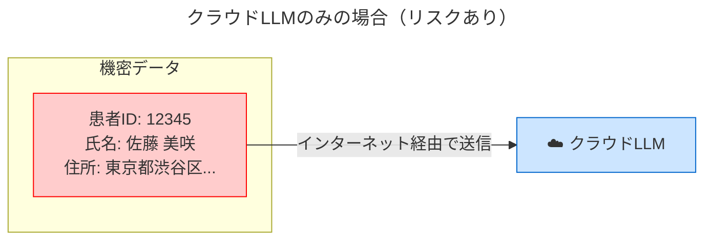
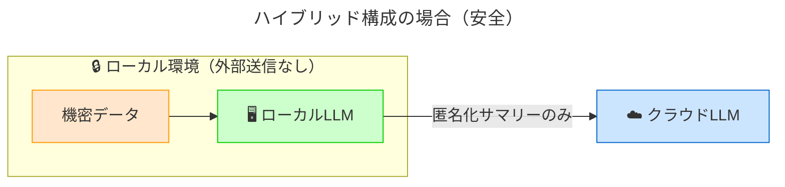
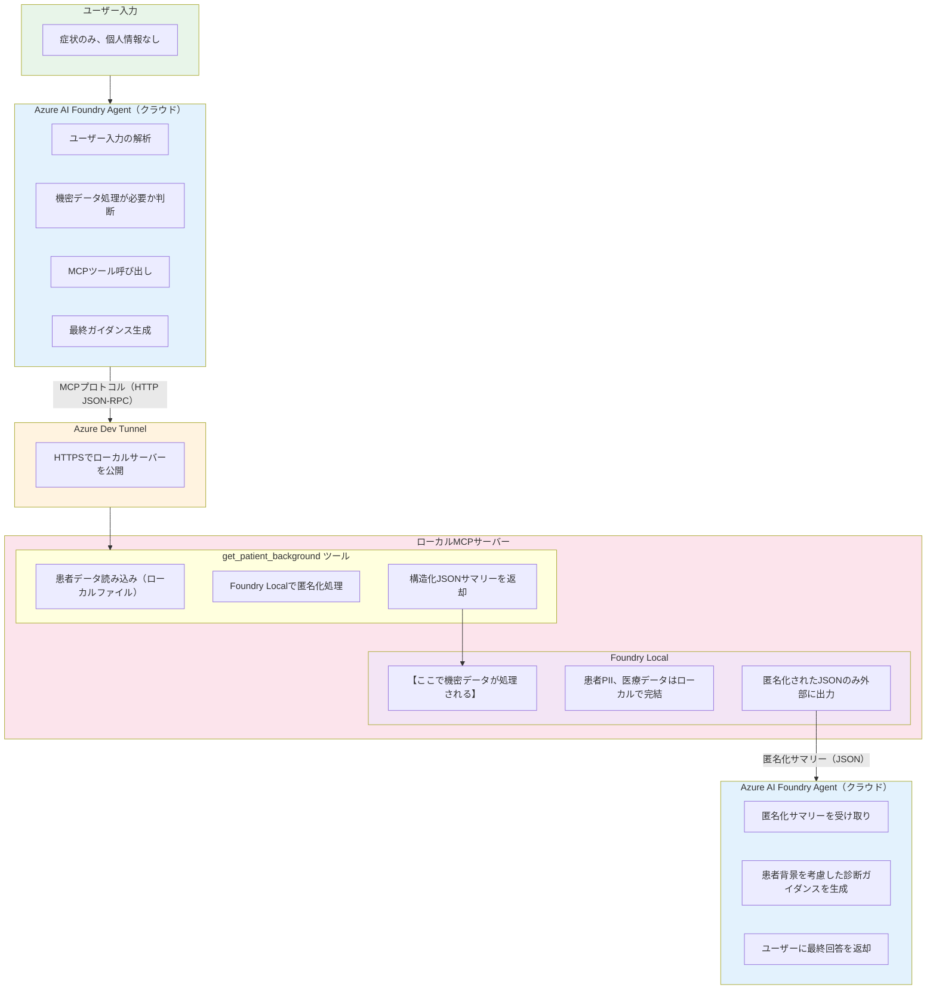
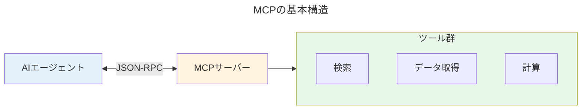
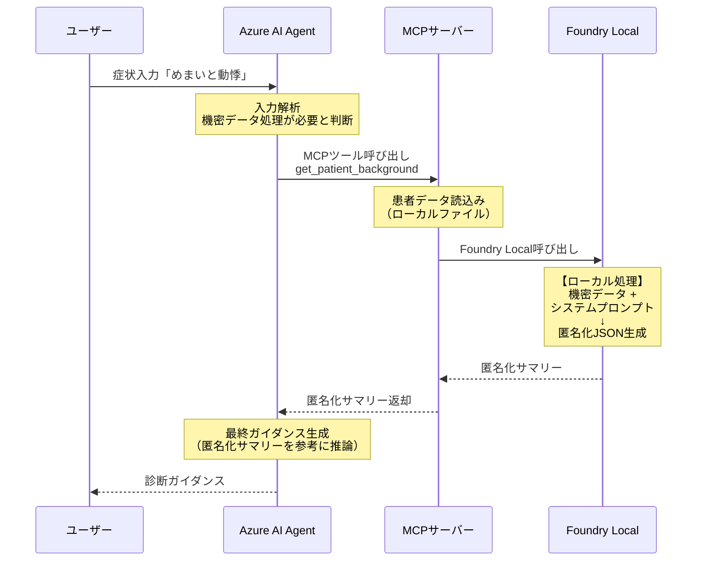
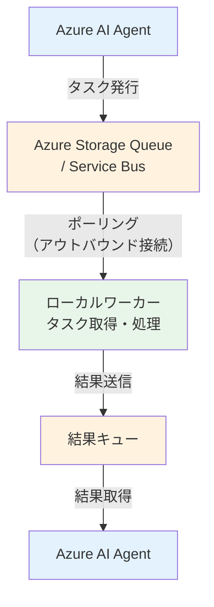
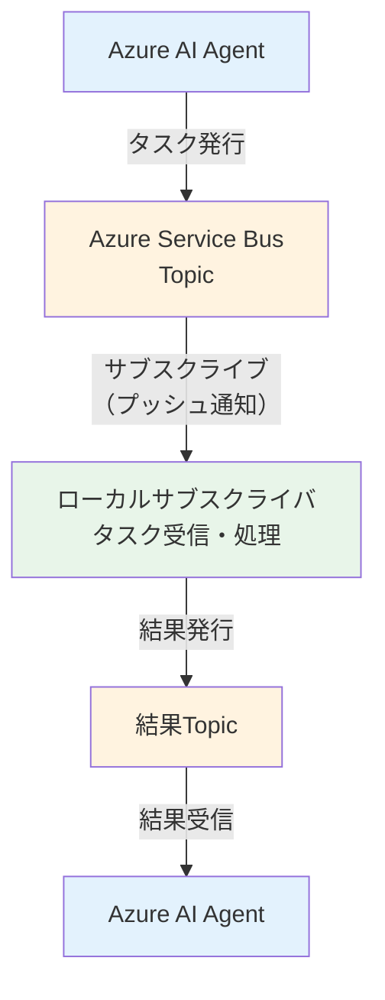
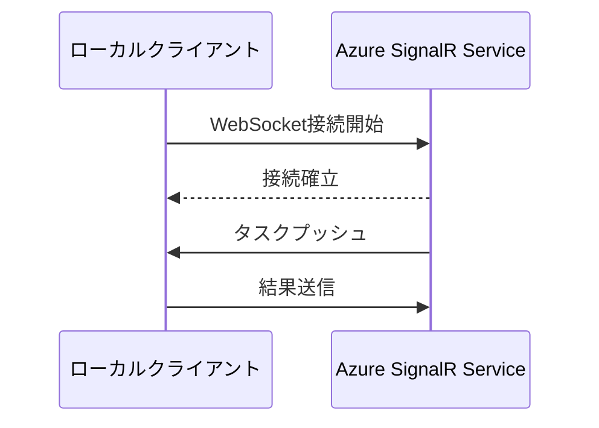
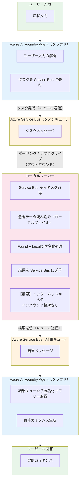

本記事は**Azure PoC 部** **Advent Calendar 2025** の 8 日目の記事です。
https://qiita.com/advent-calendar/2025/azpoc

また、名古屋のAzureコミュニティ **なごあず** で登壇した内容です。
https://75az.connpass.com/event/373754/


# モチベーション

わたしは今年の6月ごろにNPU（AMD）がついているCopilot+PCを購入したのですが、気が付けばNPUを活用した検証が全くできていませんでした。。。
みなさん、普段の業務やアプリケーションでLLMを使うときはクラウドベンダーが提供するLLMを使うことが多いと思います。
そのLLMが、皆さんのPCで動かせるって、エンジニア（ガジェット好き？）としてはちょっとワクワクしませんか？？
そんなモチベーションをもとに、クラウドではなく、社会実装されることをイメージしながら、ローカルでLLMを動かすユースケースを考えてみました。

※ここまでNPUと言っていますが、CPUやGPUでも動作しますので、ご安心ください。

- **プライバシー保護**: 個人情報や機密データを外部に出さない
- **通信環境への対応**: ネットワークが不安定な場所での利用
- **コスト最適化**: クラウドへのトークン送信量を減らしコストを削減
- **ローカルマシンに対する動作**: ローカル環境特有の操作

本記事では、**プライバシー保護のユースケースに焦点を置き、ハイブリッドAIアーキテクチャ**の考え方と設計、実装方法を解説します。

:::message
**「機密データはローカルで処理し、高度な推論のみクラウドで実行する」**
:::

このコンセプトに基づき、**セキュリティ観点**から設計・実装した医療診断支援システムを例に、具体的なアーキテクチャと実装方法を解説します。

また、本ブログでは 医療ドメインのユースケースを例にしています。ある患者の過去の診断結果や個人情報をローカルで処理し、症状に基づく診断ガイダンスをクラウドで生成する流れを示します。

:::message alert
わたしは医療ドメインに詳しいわけではないので、生成結果やテストデータについては不正確な部分があることをご承知おきください。
本ブログでは推論内容というよりは、**ローカルLLMとクラウドLLMを組み合わせてセキュアに動かすアーキテクチャ**に焦点を当てています。
:::


## 本記事で扱う内容

- ローカルでLLM（SLM）を動かすユースケース
- ハイブリッドAI構成の設計思想
- セキュリティを考慮した多層的なプライバシー保護
- MCP（Model Context Protocol）を使ったクラウド・ローカル連携
- 現時点の課題と解決策の提案

---

# 技術解説：SLM、NPU、Foundry Localとは

## SLM（Small Language Model）とは

SLM（小規模言語モデル）は、GPT-4やClaude等の大規模モデル（LLM）と比較して、パラメータ数が少ないコンパクトなモデルです。

| 項目 | LLM（大規模） | SLM（小規模） |
|------|--------------|--------------|
| パラメータ数 | 数千億〜数兆 | 数十億〜百億程度 |
| 実行環境 | 大規模クラウドインフラ | ローカルPC、エッジデバイス |
| 推論速度 | 高速（専用インフラ） | 高速（ローカル処理） |
| 得意分野 | 汎用的な推論、創造的タスク | 特定タスクの効率的処理 |

代表的なSLMとして、**Phi-4-mini**（Microsoft）、Gemma（Google）、Llama 3.2（Meta）などがあります。

## NPU（Neural Processing Unit）とは

NPUは、**AI/機械学習の推論処理に特化したプロセッサ**です。最新のWindows PC（Copilot+ PC）には、NPUが搭載されているものがあります。

- CPU: 汎用処理
- GPU: グラフィック処理
- NPU: AI推論に特化（低消費電力で高効率）

NPUを使用することで、バッテリー消費を抑えながらローカルでAI推論を実行できます。

## Microsoft Foundry Localとは

**Foundry Local**は、Microsoftが提供するローカルLLM実行環境です。Windows PC上で簡単にSLMを動作させることができます。

```powershell
# インストール
winget install Microsoft.FoundryLocal

# モデルのダウンロード
foundry model download phi-4-mini

# モデルのロード（サービス起動）
foundry model load phi-4-mini

# 状態確認（エンドポイントURL取得）
foundry service status
# → http://127.0.0.1:5273
```

起動後は、OpenAI互換のAPIエンドポイントが公開され、既存のOpenAI SDKやHTTPリクエストでアクセスできます。

```python
# OpenAI互換APIでアクセス
import requests

response = requests.post(
    "http://127.0.0.1:5273/v1/chat/completions",
    json={
        "model": "phi-4-mini-instruct-vitis-npu:2",
        "messages": [
            {"role": "user", "content": "Hello!"}
        ]
    }
)
```

---

# ハイブリッドAIアーキテクチャとは

今回のブログで紹介する、ローカルのLLMとクラウドのLLMを組み合わせたアーキテクチャを**ハイブリッドAIアーキテクチャ**と呼ぶことにします。

このような動作をするシステムの全体像を示します。
https://youtu.be/NwsLdB7B7tM

## 基本コンセプト

ハイブリッドAIアーキテクチャは、**ローカルLLMとクラウドLLMの役割を明確に分離**し、それぞれの強みを活かす設計です。

| 役割 | 実行場所 | 担当タスク |
|------|---------|-----------|
| **前処理・匿名化** | ローカル（Foundry Local） | データ構造化、PII除去、要約 |
| **高度な推論** | クラウド（Azure OpenAI） | 複雑な判断、ガイダンス生成 |

## データフローから見るハイブリッド構成のメリット

クラウドのみの構成では、患者の過去の診断履歴や個人情報などの機密データが外部に出てしまうことになります。



ハイブリッド構成の場合、個人情報や機密データを外部に送信せず、ローカル環境内で完結させることができます。


## システム全体構成

今回実装したシステムの全体構成を示します。



# 技術解説：Azure AI Foundry Agent Framework、MCP、Dev Tunnelとは

## Azure AI Foundry Agent Frameworkとは

Azure AI Foundry Agent Frameworkは、Microsoftが提供するAIエージェント開発フレームワークです。LLMに「ツール」を持たせ、自律的にタスクを実行させることができます。
https://learn.microsoft.com/ja-jp/agent-framework/overview/agent-framework-overview

```python
from agent_framework.azure import ChatAgent
from agent_framework.tools import MCPStreamableHTTPTool

# MCPツールを持つエージェントを作成
agent = ChatAgent(
    model="gpt-4o",
    instructions="あなたは症状チェッカーです...",
    tools=[
        MCPStreamableHTTPTool(
            server_url="https://xxx.devtunnels.ms/mcp"
        )
    ]
)
```

エージェントは、ユーザーの入力を解析し、必要に応じてツール（この場合はMCPサーバー上のツール）を呼び出します。

## MCP（Model Context Protocol）とは

MCP（Model Context Protocol）は、AIエージェントとツールを接続するための標準プロトコルです。Anthropicが提唱し、オープンスタンダードとして公開されています。
https://modelcontextprotocol.io/docs/getting-started/intro



MCPを使用することで、エージェントは外部のツールやデータソースにアクセスできます。今回の実装では、ローカルで動作するMCPサーバーを通じて、Foundry Localを呼び出しています。

---

# ローカルLLMでの機密情報の匿名化処理

Foundry Local（Phi-4-mini）に渡すシステムプロンプトで、出力形式を厳格に制限しています。

```python
LOCAL_PATIENT_SYSTEM_PROMPT = """
あなたはユーザーのマシン上でローカルに動作する医療背景情報要約器です。

【絶対ルール】
- 出力はJSON構造のみ。それ以外は一切出力禁止。
- 説明文、注釈、コメント、マークダウン記法は禁止。
- バッククォート(```)で囲まない。
- 回答は必ず { で始まり } で終わること。

【プライバシー保護】
- 患者の具体的な氏名、住所、電話番号は絶対に出力しない
- 年齢は年代（30代、40代など）で表現
- 匿名化された医療情報のみを出力

【出力スキーマ】
- patient_context: 患者背景（age_group, chronic_conditions, allergies, current_medications）
- symptom_relevance: 症状との関連性（related_history, potential_interactions, risk_factors）
- recommendations: 医療従事者への推奨事項（配列）
"""
```

## 匿名化の具体例

実際のデータ変換例を示します。

**入力（ローカルに保存された機密データ）:**

```json
{
  "patient": {
    "full_name": "佐藤 美咲",
    "date_of_birth": "1989-08-23",
    "age": 35,
    "address": {
      "postal_code": "150-0002",
      "prefecture": "東京都",
      "city": "渋谷区",
      "street": "渋谷2-15-8"
    },
    "phone": "090-1234-5678",
    "patient_id": "STO-558923"
  },
  "allergies": ["ペニシリン"],
  "medical_history": [
    {
      "condition": "バセドウ病",
      "diagnosed": "2020年",
      "status": "2022年に寛解",
      "lab_results": {   // 診断の数値情報
        "TSH": 0.01,
        "FreeT4": 2.5,
        "TRAb": 15.0,
      }
    }
  ]
}
```

**出力（クラウドに送信される匿名化サマリー）:**

```json
{
  "patient_context": {
    "age_group": "30代",
    "chronic_conditions": ["甲状腺機能亢進症（既往歴）"],
    "allergies": ["ペニシリン"],
    "current_medications": []
  },
  "symptom_relevance": {
    "related_history": ["過去の甲状腺疾患"],
    "potential_interactions": [],
    "risk_factors": ["甲状腺疾患の既往歴あり"]
  },
  "recommendations": [
    "甲状腺症状には特に注意",
    "ペニシリン系抗生物質は禁忌"
  ]
}
```

---

# 処理フローの詳細

## シーケンス図

実際の処理の流れを時系列で示します。



## 主要な関数の解説

実施はGitHubにありますので、詳しくはこちらを参照ください。
https://github.com/nomhiro/hybrid-ai-agent-local-and-azure

### Foundry Local呼び出し（common/foundry_local.py）

```python
def call_local_model(
    system_prompt: str,
    user_content: str,
    model_id: str = FOUNDRY_LOCAL_MODEL_ID,
    max_tokens: int = 1024,
    temperature: float = 0.2,
    timeout: int = 600,
    tool_name: str = "unknown",
) -> tuple[Dict[str, Any], Optional[LLMLogEntry]]:
    """
    Foundry Local を呼び出す共通関数。

    Args:
        system_prompt: システムプロンプト（匿名化指示を含む）
        user_content: ユーザーメッセージ（患者データ + 症状）
        model_id: 使用するモデルID
        max_tokens: 最大トークン数
        temperature: 温度パラメータ（低いほど決定的）

    Returns:
        OpenAI互換形式のレスポンス辞書
    """
    payload = {
        "model": model_id,
        "messages": [
            {"role": "system", "content": system_prompt},
            {"role": "user", "content": user_content},
        ],
        "max_tokens": max_tokens,
        "temperature": temperature,
    }

    resp = requests.post(
        FOUNDRY_LOCAL_CHAT_URL,  # http://127.0.0.1:5273/v1/chat/completions
        headers={"Content-Type": "application/json"},
        data=json.dumps(payload),
        timeout=timeout,
    )

    resp.raise_for_status()
    return resp.json()
```

### MCPサーバーでのツール実行

ローカル環境で公開するMCPサーバーは、HTTP JSON-RPCプロトコルでリクエストを受け付けます。

```python
# tools/call メソッドのハンドリング

def handle_tools_call(tool_name: str, arguments: dict) -> dict:
  if tool_name == "get_patient_background":
    symptoms = arguments.get("symptoms", "")

    # 患者データをローカルファイルから読み込み
    patient_context = build_patient_context()

    # Foundry Localで匿名化処理
    user_prompt = f"""
    【患者が報告した症状】
    {symptoms}

    【患者の医療背景（秘匿対象を含む）】
    {patient_context}

    上記の情報を基に、匿名化されたJSONサマリーを生成してください。
    """

    response = call_local_model(
        system_prompt=LOCAL_PATIENT_SYSTEM_PROMPT,
        user_content=user_prompt,
    )

    # 出力をパース・サニタイズ
    content = extract_content(response)
    result = parse_json_response(content)

    return result

def start(self, start_tunnel: bool = True) -> bool:
  """
  サーバーを起動

  Args:
      start_tunnel: Dev Tunnelも同時に起動するかどうか
  """
  if self.server is not None:
      return False

  try:
      self.state.set_status(ServerStatus.STARTING)
      self.server = HTTPServer(("0.0.0.0", self.port), self._create_handler())
      self.thread = threading.Thread(target=self.server.serve_forever, daemon=True)
      self.thread.start()
      self.state.set_status(ServerStatus.RUNNING)
      print(f"[MCP] Listening at http://0.0.0.0:{self.port}")

      # Dev Tunnelを自動起動
      if start_tunnel:
          self._start_tunnel()

      return True
  except Exception as e:
      self.state.set_status(ServerStatus.ERROR, str(e))
      return False
```

---

# それでは実行しよう！

## 事前準備

GitHubからコードをクローンし、必要なライブラリをインストールします。

```bash
git clone https://github.com/nomhiro/hybrid-ai-agent-local-and-azure.git
cd hybrid-ai-agent-local-and-azure
```

```bash
python -m venv .venv
source .venv/bin/activate  # Windowsの場合は .venv\Scripts\activate

pip install -r requirements.txt
```

F5で実行、もしくは以下のコマンドで起動します。

```bash
streamlit run app.py
```

## 動作確認

以下のような画面が起動します。
まず、左側のサイドメニューで「起動」ボタンをクリックし、MCPサーバーとDev Tunnelを起動します。


以下のように表示されればOKです！


次に、中央のメイン画面で、ユーザプロンプトを読み込み、必要に応じてメッセージを入力して実行しましょう。


まず、以下のようにAzure AI Foundry Agentがユーザープロンプトを解析します。ここで、MCPツールの呼び出しが必要と判断されます。


ローカル推論のためのMCPによるツールが実行されます。


NPUが動いていることも確認できると思います！


ローカルの推論が終わると、画面に上記のように匿名化サマリーが表示されます。


最後に、ローカルで生成された匿名化サマリーをもとに、クラウド側で最終ガイダンスが生成されます。


また、MCPログのタブでは、MCPツールの呼び出し結果を確認できます。


---

# 現時点の課題と今後の展望

## 課題：MCPサーバーの公開問題

現在の実装では、**Azure Dev Tunnel**を使用してローカルMCPサーバーをインターネットに公開しています。

この構成には以下の課題があります。

| 課題 | 説明 |
|------|------|
| **セキュリティリスク** | ローカルサーバーがインターネットからアクセス可能 |
| **ファイアウォール問題** | 企業環境ではDev Tunnelが許可されない場合がある |
| **常時接続の必要性** | トンネルが切断されるとシステムが動作しない |

**本来の理想は、ローカルサーバーを公開せずにハイブリッド構成を実現すること**です。

## 解決策の候補

以下に、サーバー公開を避けながらハイブリッド構成を実現する方法を4つ紹介します。

### 解決策: ポーリング方式

ローカル側からクラウドのキューに定期的に問い合わせる方式です。



**メリット:**
- ローカルからの**アウトバウンド接続のみ**で動作
- ファイアウォールの制約を受けにくい
- 実装がシンプル

**デメリット:**
- ポーリング間隔による**遅延**が発生
- 無駄なAPI呼び出しが発生する可能性

これであれば、Azure Storage Queueなどで実現できそうですね。

### 解決策: PubSub方式

イベントドリブンでタスクを配信する方式です。



**メリット:**
- リアルタイム性が高い
- 無駄なポーリングが不要
- スケーラブル（複数のローカルワーカーに対応）

**デメリット:**
- Service Busの設定が必要
- 若干複雑な実装

Azure Service Bus、Azure Event Gridなどで実現可能です。

### 解決策: WebSocket Reverse Connection

ローカルからクラウドにWebSocket接続を開始し、その接続を通じてタスクを受け取る方式です。



**メリット:**
- **リアルタイム性が最も高い**
- アウトバウンド接続のみ（ローカルがサーバーを公開しない）
- 双方向通信が可能

**デメリット:**
- WebSocket接続の維持が必要
- 切断時の再接続処理が必要

あまり詳しくありませんが、Azure SignalR Service で実現可能そうです。

## 理想的なアーキテクチャ

まとめると、以下のようなアーキテクチャが理想的なように思います。
この構成はまだ実装していませんが、ニーズがあれば今後検証していきたいと思います。



---

# まとめ

本記事では、ローカルLLMとクラウドLLMを組み合わせた**ハイブリッドAIアーキテクチャ**について解説しました。

このアーキテクチャの最大の価値は、**機密データをローカルで処理しながら、クラウドLLMの高度な推論能力を活用できる**点です。医療データや個人情報といったセンシティブな情報を外部に送信することなく、LLMを活用できます。

一方で、現時点ではDev Tunnelを使用してローカルサーバーをインターネットに公開する必要があるという課題があります。この課題に対しては、ポーリング方式やPubSub方式、WebSocket Reverse Connectionといったアウトバウンド接続のみで動作するアーキテクチャへの移行が解決策として考えられます。

ハイブリッドAIアーキテクチャは、医療機関、金融機関、法律事務所、製造業など、機密データを扱いながらもAIを活用したいエンタープライズユースケースにおいて有効なアプローチだと思っています。
今後、より成熟した実装パターンが確立されていくことで、プライバシーを守りながらAIの能力を最大限に活用した社会実装が進んでいくための一助となれば幸いです！

---

# 参考リンク

- [Hybrid AI using Foundry Local, Microsoft Foundry and the Agent Framework - Part 1](https://techcommunity.microsoft.com/blog/azure-ai-foundry-blog/hybrid-ai-using-foundry-local-microsoft-foundry-and-the-agent-framework---part-1/4470813)
- [Hybrid AI using Foundry Local, Microsoft Foundry and the Agent Framework - Part 2](https://techcommunity.microsoft.com/blog/azure-ai-foundry-blog/hybrid-ai-using-foundry-local-microsoft-foundry-and-the-agent-framework---part-2/4471983)
- [Microsoft Foundry Local](https://learn.microsoft.com/azure/ai-foundry/foundry-local/)
- [Azure AI Agent Framework](https://learn.microsoft.com/azure/ai-foundry/agent-framework/)
- [Model Context Protocol (MCP)](https://modelcontextprotocol.io/)
