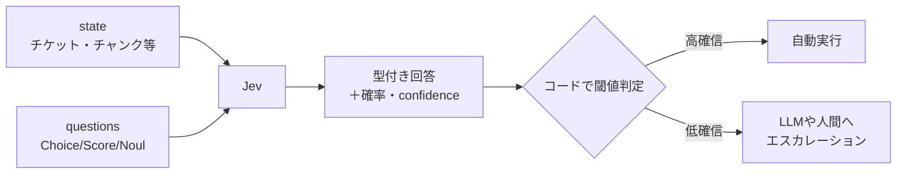
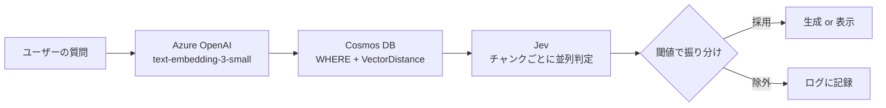

# はじめに

Jevが話題ですねー　この頃わたしのXのタイムラインが、Jevだけで7割くらい埋まるようになりました。TypeSafe AIが2026年9月15日に発表した「Jev」というAIモデルです。文章を一切生成せず、「Choice（選択）」「Score（段階評価）」「Noul（Yes/No確率）」の3種類の判断だけを返すという分類器のようなモデルです。

Jevは、文章を生成せず「型付きの判断＋キャリブレーション済み確率」だけを返すAIモデルです。応答は70〜500msと速く、コストもLLMの数十〜数百分の一と謳われています。

https://typesafe.ai/blog/introducing-system-one-models-and-jev

Jevを使ってみよう！ということで、以下のようなユースケースを想定して試してみます。
これまでいくつもAIエージェントを構築してきた中で、RAGの検索結果に「話題は近いけど答えにならないチャンク」が混ざって誤回答につながる、という困りごとに何度もぶつかってきました。これ、Jevで弾けるんじゃないかと思って、実際に手を動かしてPoCをしてみました。

やることは2段階です。

1. Jevを単体で呼んで、どんな値が返ってくるのか触ってみる
2. Azure Cosmos DB for NoSQLのベクトル検索結果を、Jevでフィルタしてみる（クエリのフィルター＋ベクトル検索＋Jevフィルタの合わせ技）

:::message alert
本記事の内容は **2026年9月19日時点** の情報に基づいています。Jevはアーリーアクセス段階のサービスであり、今後仕様が変わる可能性があります。
:::

### 参考情報

https://typesafe.ai/blog/introducing-system-one-models-and-jev
https://docs.typesafe.ai/concepts/system-one
https://learn.microsoft.com/ja-jp/azure/cosmos-db/nosql/vector-search

---

# Jevとは

Jevは、TypeSafe AIが「System One Model」と呼ぶモデルクラスの一つです。名前はたぶん心理学の「システム1（直感的・即断的な思考）」から来ていて、じっくり考えて文章を書くLLM（システム2寄り）とは真逆の立ち位置を狙っています。

https://docs.typesafe.ai/concepts/system-one

創業者のDiogo Almeida氏はOpenAI出身。RLHFやChatGPTの開発に関わっていた人らしく、発表と同時にシリーズAで4,000万ドル（リード：DCVC）も調達したというから、景気のいい話です。

https://typesafe.ai/blog/introducing-system-one-models-and-jev
https://www.kucoin.com/news/flash/ex-openai-researcher-launches-typesafe-ai-with-non-text-model-jev

特徴を並べるとこんな感じです。

- **できることは3種類だけ**：Choice（最大255択から選ぶ）、Score（順序付きの段階評価）、Noul（Yes/No確率）
- **速い・安い**：応答70〜500ms、入力$0.042/100万トークン、出力は無料
- **出力は選択肢に制約される**：存在しないラベルを返すような構造化エラーは起きない
- **できないこと**：文章生成、コード生成、算術、判断理由の説明

公式ブログは「frontier-intelligence function call」と呼んでいます。要するにLLMの置き換えじゃなくて、エージェントやワークフローの「**制御層**」を安く速くする部品ってことですね。実際に触ってみても、たしかにそうだなと納得しました。

https://typesafe.ai/blog/introducing-system-one-models-and-jev
https://docs.typesafe.ai/concepts/system-one
https://docs.typesafe.ai/primitives
https://docs.typesafe.ai/model-jaggedness/jev-1.13

## 仕組みをざっくり理解する

Jevへのリクエストは「state（判断対象の文脈）」と「questions（判断の問い）」の2つを渡すだけです。イメージとしては、上司に「このチケットの内容（state）を見て、緊急か・カテゴリは何か・苛立ち度はどれくらいか（questions）を教えて」と一気に聞いて、理由抜きで即答してもらう感じ。



LLMみたいに1トークンずつ生成するんじゃなくて、質問への回答を並列サンプラーで一括生成する仕組みだそうです。だから同じstateに質問を増やしても、レイテンシはほぼ変わらないと。学習もRLHFじゃなく**RLCD**（Reinforcement Learning for Calibrated Decisions）という手法を使っていて、狙いは「確率90%と言ったら実際に90%当たる」ようにキャリブレーションすること、とのことでした。

https://docs.typesafe.ai/api
https://docs.typesafe.ai/patterns/fan-out
https://docs.typesafe.ai/introduction/machine-learning-primer
https://typesafe.ai/blog/introducing-system-one-models-and-jev

## 3つのプリミティブ


*Choice=選択肢から1つ選ぶ／Score=段階評価／Noul=Yes・Noの確率、の3種類しか返さない*

| プリミティブ | 問いの形 | criteria | 返り値 |
| --- | --- | --- | --- |
| Choice | どれか1つを選ぶ | 名前付き選択肢のマップ（最大255） | choice, probabilities, confidence |
| Score | どのレベルか | 順序付きレベルの配列（2〜10段階） | score, legend, probabilities, confidence |
| Noul | 真か偽か | 任意（true/falseの意味の補足） | noul（0〜1の確率） |

`confidence`は確率分布の「尖り具合」を表す数値です。出力自体が指定した選択肢に制約されているので、存在しないラベルを返す幻覚は構造上起きません。ここは面白い設計だなと。ただ「間違った選択肢を自信満々に選ぶ」ことは普通にあり得ます。

https://docs.typesafe.ai/primitives
https://docs.typesafe.ai/primitives/choice
https://docs.typesafe.ai/primitives/score
https://docs.typesafe.ai/primitives/noul

---

# 🧪 Step 1: Jevを単体で呼び出してみる

まずは一番シンプルな形で、Jevがどんな値を返すのか触ってみます。

## 準備

[console.typesafe.ai](https://console.typesafe.ai/) でアカウントを作り、APIキーを発行します（現在アーリーアクセスで、ウェイトリスト登録が必要です）。

Pythonから使う場合は公式SDKの `typesafe-sdk` を入れるだけです。

```bash
uv init poc-jev-rag
uv add typesafe-sdk python-dotenv
```

`.env` にAPIキーを置いておきます。

```
TYPESAFE_API_KEY=sk-xxxxxxxxxxxx
```

https://docs.typesafe.ai/introduction/quickstart
https://typesafe.ai/blog/introducing-system-one-models-and-jev

## コード

問い合わせチケットの例文に対して、緊急度（Noul）・カテゴリ（Choice）・苛立ち度（Score）を1回のリクエストで判定させてみます。

```python
from dotenv import load_dotenv
from typesafe_sdk import Choice, Noul, Score, TypeSafeClient

load_dotenv()

STATE = {
    "ticket": "Stripe連携が3日間失敗していて売上を失っています。至急対応をお願いします。",
}

QUESTIONS = {
    "is_urgent": Noul(instructions="このメッセージは緊急性を伴うか"),
    "category": Choice(
        instructions="問い合わせの種類",
        criteria={"billing": "請求関連", "technical": "技術的な問題", "other": "その他"},
    ),
    "frustration": Score(
        instructions="顧客の苛立ち度",
        criteria=["落ち着いている", "不満", "激怒"],
    ),
}

client = TypeSafeClient()
response = client.system_one(state=STATE, questions=QUESTIONS)

print(f"model: {response.model}")
print(f"usage: {response.usage}")

noul = response.nouls["is_urgent"]
print(f"is_urgent: {noul.noul:.3f}")

choice = response.choices["category"]
print(f"category: {choice.choice} (confidence={choice.confidence:.3f})")
print(f"  probabilities: {choice.probabilities}")

score = response.scores["frustration"]
print(f"frustration: {score.score:.2f} / legend={score.legend} (confidence={score.confidence:.3f})")
```

`TypeSafeClient()` は環境変数 `TYPESAFE_API_KEY` を自動で読みにいくので、引数なしでそのまま使えます。デフォルトのモデル名は `jev-latest` でした。

https://docs.typesafe.ai/introduction/quickstart
https://docs.typesafe.ai/models

## 実行結果

```
model: jev-1.13.0
usage: input_tokens=441 output_tokens=73

is_urgent: 0.960
category: technical (confidence=0.890)
  probabilities: {'billing': 0.07, 'technical': 0.93, 'other': 0.0}
frustration: 1.43 / legend={0: '落ち着いている', 1: '不満', 2: '激怒'} (confidence=0.350)
```

## 返ってくる値の一覧

実行結果にいろいろ並んでいるので、何がどういう値なのか整理しておきます。公式ドキュメントで確認した内容です。まず、レスポンス全体に付いてくるものから。

| 項目 | 中身 |
| --- | --- |
| model | 回答に使われたモデル名（`jev-1.13.0`など） |
| usage | トークン使用量。`input_tokens`と`output_tokens`があり、APIが報告しないときは`None` |
| answers | 質問名をキーにした回答の辞書。`nouls`、`choices`、`scores`は、これを型ごとに取り出したもの |
| request_id | レスポンスヘッダ`x-typesafe-request-id`の値 |

続いて、質問の型ごとの回答に付いてくるものです。

| 項目 | 付く型 | 中身 |
| --- | --- | --- |
| noul | Noul | yes（true）になる確率。0〜1で、1に近いほどyes、0に近いほどno、0.5付近はどちらとも言えない |
| choice | Choice | 一番確率が高かった選択肢の名前 |
| score | Score | 各レベルの番号に確率を掛けて足した期待値。0から最上位レベルの番号までの値で、整数とは限らない |
| probabilities | Choice、Score | 選択肢やレベルごとの確率。キーはChoiceなら選択肢名、Scoreならレベル番号で、合計は1 |
| confidence | Choice、Score | 0〜1の値。`probabilities`の広がり具合から計算される。1つに集中していれば高く、散らばっていれば低い |
| legend | Score | レベル番号と説明の対応表。`criteria`で渡した内容が返ってくる |

詳しくはこちら！！　細かい仕様は公式ページをベースにAIを使って把握してください～

https://docs.typesafe.ai/sdk/python/api/types/responses
https://docs.typesafe.ai/confidence
https://docs.typesafe.ai/primitives/score
https://docs.typesafe.ai/primitives/noul

## 実行結果を読んでみる

「Stripe連携が3日間失敗」という文面を`technical`（確信度0.89）と判定しました。個人的には課金がらみだから`billing`寄りかなと予想していたんですが、「連携の失敗」という技術的な原因の方を拾ったみたいです。

苛立ち度（frustration）は1.43で、confidenceは0.350とかなり低めです。Scoreは段階間の小数値を返すので「不満と激怒の間くらい」という解釈になりますが、confidenceが低いってことはJev自身も自信がないってことですね。この**確信度**（confidence）が低い判断だけ人間やLLMにエスカレーションする、みたいなハンドリングができそうです。

出力トークンは73個で1回のAPIコールに収まっています。レスポンス時間も測ってみました。手元のWindows PCから`jev_poc.py`と同じリクエストを10回投げて、`time.perf_counter()`でAPIコールの前後を測っています（2026年9月19日）。毎回`TypeSafeClient()`を作り直して新しく接続すると、中央値は527ms（520〜633ms）。同じクライアントで連続して呼ぶと、中央値は244ms（228〜287ms）まで短くなります。公式は応答時間を70〜500msとしているので、接続を再利用すればその範囲、新しく接続すると上限を少し超える、という結果でした。usageを見るとinput_tokensが441。questionsの定義文（instructions）もトークン扱いされているのがわかります。

---

# 🔍 Step 2: Cosmos DBのRAG検索結果をJevでフィルタする

ここからが本題です。まず、RAGでJevを置ける場所を2パターン紹介します。そのうえで、パターン①をAzure Cosmos DB for NoSQLのベクトル検索の結果に対してPoCしてみます。

## RAGのどこにJevを置くか

Jevを置ける場所は、ベクトル検索の後と前の2つが考えられます。検索した候補をJevで弾くのがパターン①、検索する前にJevへ「この質問なら、どのタグで絞るか」を選ばせるのがパターン②です。

### パターン①：検索したあとに、Jevで弾く


*パターン①: WHERE句とベクトル検索で候補を取ってから、Jevが対象読者の一致などを判定して絞り込む*

WHERE句とベクトル検索で候補を取ってから、Jevがチャンクの本文を読んで「対象読者は合っているか」を判定します。「話題は似ているけど対象が違う」ように、本文を読まないと分からない判断ができるのが強みです。

### パターン②：検索する前に、Jevでタグを選ぶ


*パターン②: ユーザーの質問からJevがタグを選び、そのタグでWHERE句を絞ってからベクトル検索する*

こちらはPoCまではしていませんが、使えそうなので紹介します。Cosmos DBのレコードごとにタグ（文書種別、分野、発行年、言語など）が付いている前提です。ユーザーの質問をJevに渡して該当するタグを選ばせ、そのタグでWHERE句を作ってからベクトル検索します。

条件が分かっているなら、WHERE句で先に絞ればRUの節約にもなります。その条件を人が渡す代わりに、Jevが質問文から選ぶ、というのがパターン②です。

タグの選び方は2通りです。

- 文書種別のように1つに決まる項目は、Choiceで選択肢から1つ選ばせる。Choiceは最大255択で、「該当なし」用の`other`も足せる
- 複数のタグが当てはまりうる項目は、タグごとにNoulを投げる。質問は1回のリクエストにまとめて並列に評価されるので、増やしてもレイテンシはほぼ変わらない

一度に投げられる質問数の上限は、確認できませんでした。ただ、リクエスト全体は約64,000トークンまでなので、タグの選択肢を長く書くほど入力が膨らみます。

気をつけたいのは、外したときの影響です。タグの選択を間違えると、正解のチャンクがそもそも検索の対象に入らなくなります。Choiceの`confidence`が低いときや、Noulが0.5付近のときは、絞り込まずに全体を検索するフォールバックを用意しておきたいところです。

### 2つのパターンの違い

| 観点 | ① 検索したあとに弾く | ② 検索する前にタグを選ぶ |
| --- | --- | --- |
| WHERE句の条件 | 人が渡す（このPoCでは`issuer=None`で絞らない） | Jevが質問文から選ぶ |
| Jevが見るもの | 質問とチャンクの本文 | ユーザーの質問だけ |
| Jevのリクエスト | 候補のチャンク数だけ（このPoCでは6件を並列） | 質問1つにつき1回にまとめられる |
| 外したとき | 正解のチャンクが候補から落ちる | 正解のチャンクが検索の対象に入らない |
| 向いていそうな場面 | 本文を読まないと分からない判断（対象読者の一致など） | 質問文だけで決められる絞り込み（タグなど） |

https://docs.typesafe.ai/patterns/fan-out
https://docs.typesafe.ai/primitives/choice
https://docs.typesafe.ai/confidence
https://docs.typesafe.ai/models

ここからは、パターン①をPoCで動かしていきます。

## やりたいこと

RAGでベクトル検索をしていると、「話題は似ているけど、対象読者や前提が違うから答えにはならない」チャンクが上位に紛れ込むことがあります。例えば「行政機関向けのAI調達ガイドライン」を検索しているのに、似た言葉が使われている「民間事業者向けのAIガイドライン」が上位に来てしまう、といったケースです。

これは、ベクトル類似度だけで弾くのは難しいです。なのでJevに「このチャンクの対象読者は質問の対象読者と一致しているか」を判定させて、クエリのフィルター（WHERE句）とベクトル検索に加えて第3のフィルタとして組み込んでみます。




https://docs.typesafe.ai/cookbooks/classifying_rag_passages

## Azureリソースの準備

Cosmos DB for NoSQL（Vector Search有効化）と、埋め込み生成用のAzure OpenAIが必要です。キーは使わず、Microsoft Entra ID（AAD）による認証にしたかったので、`azd`（Azure Developer CLI）でBicepからプロビジョニングし、RBACロールをサインイン中のユーザーに割り当てる構成にしました。

```bicep
resource cosmos 'Microsoft.DocumentDB/databaseAccounts@2024-11-15' = {
  name: cosmosAccountName
  location: location
  kind: 'GlobalDocumentDB'
  properties: {
    databaseAccountOfferType: 'Standard'
    disableLocalAuth: true // キー認証を無効化してAADのみに
    capabilities: [
      { name: 'EnableServerless' }
      { name: 'EnableNoSQLVectorSearch' }
    ]
  }
}
```

`disableLocalAuth: true` にすることで、そもそもキーが発行されない状態にしています。代わりにCosmos DBの組み込みロール `Cosmos DB Built-in Data Contributor` をサインイン中のユーザーに割り当てて、Pythonからは`DefaultAzureCredential`（実体は`az login`のトークン）でアクセスします。

プロビジョニングが終わると、`postprovision`フックで`azd env get-values`の出力を`.env`に自動反映するようにしておいたので、あとはPythonコードからは`.env`を読むだけで済みます。

## サンプルデータの投入

動作確認用に、話題が近い3種類の文書から合成的にチャンクを作りました（実際の政府文書の引用ではなく、説明用のダミーテキストです）。

| doc_id | issuer | section | 内容の方向性 |
| --- | --- | --- | --- |
| 行政AI利活用ガイドライン | デジタル庁 | 調達手続 / リスク評価 | 質問に対する **正解** |
| AI事業者ガイドライン | 総務省・経済産業省 | 提供者の対応 / リスク管理 | 話題は近いが **対象読者が違う** ノイズ |
| 観光白書 | 観光庁 | 概況 / 施策 | 明らかに **無関係** なノイズ |

```python
container.upsert_item({
    "id": "gov-1",
    "doc_id": "doc-gov-ai-guideline",
    "doc_title": "行政AI利活用ガイドライン(サンプル)",
    "issuer": "デジタル庁",
    "section": "調達手続",
    "text": "行政機関が生成AIを調達する際は、利用目的とリスクレベルに応じて必要な安全対策を...",
    "embedding": embedding,  # text-embedding-3-smallで生成
})
```

埋め込みはAzure OpenAIの`text-embedding-3-small`（1536次元）です。こちらもAADトークンで呼んでいて、キーは一切使っていません。

```python
openai_client = AzureOpenAI(
    azure_endpoint=os.environ["AZURE_OPENAI_ENDPOINT"],
    api_version="2024-10-21",
    azure_ad_token_provider=get_bearer_token_provider(
        credential, "https://cognitiveservices.azure.com/.default"
    ),
)
```

## クエリでのフィルター + ベクトル検索

Cosmos DBのクエリは、WHERE句によるプロパティフィルターと`VectorDistance`によるベクトル検索を素直に組み合わせられます。

```python
def vector_search(container, query_vector, issuer, top_k):
    where_clause = "WHERE c.issuer = @issuer " if issuer else ""
    query = (
        f"SELECT TOP {top_k} c.id, c.doc_title, c.issuer, c.section, c.text, "
        f"VectorDistance(c.embedding, @qv) AS score "
        f"FROM c {where_clause}"
        f"ORDER BY VectorDistance(c.embedding, @qv)"
    )
    parameters = [{"name": "@qv", "value": query_vector}]
    if issuer:
        parameters.append({"name": "@issuer", "value": issuer})
    return list(container.query_items(query=query, parameters=parameters, enable_cross_partition_query=True))
```

`issuer`が分かっている場合はWHERE句で先に絞り込めばRUの節約になりますが、今回はあえて`issuer=None`のまま（フィルターなし）でベクトル検索だけを試して、どれくらいノイズが混ざるかを見てみます。

質問は「行政機関が生成AIを調達するときのリスク評価はどうすればいいか？」にしました。

```
score=0.8139  issuer=デジタル庁         行政AI利活用ガイドライン / リスク評価
score=0.7657  issuer=デジタル庁         行政AI利活用ガイドライン / 調達手続
score=0.6477  issuer=総務省・経済産業省  AI事業者ガイドライン / リスク管理
score=0.4548  issuer=総務省・経済産業省  AI事業者ガイドライン / 提供者の対応
score=0.2297  issuer=観光庁            観光白書 / 施策
score=0.1403  issuer=観光庁            観光白書 / 概況
```

予想通り、デジタル庁の2チャンクが上位に来る一方で、対象読者が違う「AI事業者ガイドライン」のチャンクもscore 0.65とけっこう高めに紛れ込んでいます。「リスク」という単語が両方の文書で使われているので、ベクトル類似度だけでは区別しきれないんですよね。ここがまさに設計段階で想定していた「話題は似ているけど対象が違う」パターンです。


*デジタル庁は明確に正解、総務省・経産省は類似度こそ高いが対象読者が違う要注意ノイズ、観光庁は無関係*

## Jevでフィルタする

上位チャンクに対して、Jevで3つの観点をNoulで並列判定させます。

```python
QUESTIONS = {
    "is_relevant": Noul(instructions="このチャンクは質問の主題を扱っているか"),
    "has_answer_evidence": Noul(instructions="このチャンクに、質問への直接の回答に使える記述があるか"),
    "scope_matches": Noul(instructions="チャンクの対象読者(issuer)が、質問が想定する対象読者と一致するか"),
}

async def judge_chunk(client, query_text, chunk):
    response = await client.system_one(
        state={"query": query_text, "chunk": {k: chunk[k] for k in ("doc_title", "issuer", "section", "text")}},
        questions=QUESTIONS,
    )
    return {k: response.nouls[k].noul for k in QUESTIONS}

async def jev_filter(query_text, chunks):
    async with AsyncTypeSafeClient() as client:
        judgements = await asyncio.gather(*(judge_chunk(client, query_text, c) for c in chunks))
    ...
```

`asyncio.gather`で6件を並列に投げたときの時間も測りました。10回の中央値は、1件だけ判定した場合が550ms（491〜611ms）、6件を並列にした場合が586ms（561〜638ms）で、ほぼ1回分です。同じ6件を1件ずつ順番に投げると、1,780msかかりました（3回の中央値）。「並列サンプラーだからレイテンシが増えない」という触れ込み、ほんとにその通りでした。

結果がこちらです。

| issuer / section | is_relevant | scope_matches | has_answer_evidence | 判定 |
| --- | --- | --- | --- | --- |
| デジタル庁 / リスク評価 | 0.95 | 0.68 | 0.86 | ✅ 採用 |
| デジタル庁 / 調達手続 | 0.93 | 0.74 | 0.67 | ✅ 採用 |
| 総務省・経産省 / リスク管理 | 0.51 | 0.15 | 0.26 | ❌ 除外 |
| 総務省・経産省 / 提供者の対応 | 0.36 | 0.17 | 0.19 | ❌ 除外 |
| 観光庁 / 施策 | 0.05 | 0.31 | 0.03 | ❌ 除外 |
| 観光庁 / 概況 | 0.02 | 0.24 | 0.02 | ❌ 除外 |

ベクトル検索でscore 0.65まで来ていた「AI事業者ガイドライン」のチャンクが、`scope_matches`0.15/0.17としっかり低く出ていて、「対象読者が違う」ことをJevが検出できています。これ、ベクトル類似度の数字だけを見ていたら絶対に気づけないやつです。観光白書の方は`is_relevant`が0.05/0.02とそもそも無関係だと一発で判定されていて、こちらは想定通りの結果でした。

最終的に、6件中デジタル庁の2件だけが残りました。閾値（`is_relevant >= 0.45`、`scope_matches >= 0.50`、`has_answer_evidence >= 0.55`）は今回は決め打ちですが、実運用では評価データを使って調整する必要があります。


*3つのNoulの確率がすべてしきい値以上なら採用、1つでも下回れば除外*

https://docs.typesafe.ai/cookbooks/classifying_rag_passages
https://docs.typesafe.ai/sdk/python/api/clients/async
https://docs.typesafe.ai/patterns/fan-out

---

# Jevはどう使うのがよさそうか

ここまで触ってみて、Jevの立ち位置について自分なりに考えたことをまとめておきます。

## LLMの置き換えではなく「前さばき」として使う

Jevは文章生成も理由の説明もできないので、単体でLLMの代わりにはなりません。それより、**LLMに投げる前の前さばき**として使う方が向いていそうです。

- モデルルーティング：ユーザーの入力をどのLLM（軽量モデル／高性能モデル）に振るべきかの分類
- LLMでなくてもいい判断の代替：意図分類、緊急度判定、カテゴリ振り分けなど、これまで「とりあえずLLMに聞いていた」処理のうち、実は数個の選択肢から選ぶだけで済むもの

今回のRAGフィルタもまさにこのパターンで、「関連しているかどうか」を判定するだけならLLMで文章を作ってもらう必要はなく、Jevのcallable関数的な返り値で十分でした。

https://docs.typesafe.ai/concepts/how-to-build-with-system-one
https://docs.typesafe.ai/patterns/intent-routing

## 並列で大量の判断をさせる分類器として

もう一つの使いどころは、**システムに組み込んで一度に大量の判断をさせる**ケースです。今回のPoCは6件でしたが、同じ6件を使い回して20件にし、並列で投げても測ってみました。5回の中央値は733ms（689〜1,042ms）で、1件のときの550msの1.3倍ほどです。6件ならほぼ1回分ですが、20件だと少し伸びます。それでも1件ずつ投げたら6件で1.8秒かかることを考えると、20件が1秒前後で返ってくるのは、LLMでは真似しづらいところです。LLMで同じことをやろうとすると、レートリミットやコストがすぐにネックになります。

パイプラインの中に「賢いけど喋らない分類器」を挟んでおいて、確信度が低いものだけLLMや人間にエスカレーションする、という設計にすると、コストと精度のバランスが取りやすくなりそうです。

https://docs.typesafe.ai/patterns/fan-out
https://docs.typesafe.ai/patterns/confidence-routing

---

# Jevの判断に説明性はあるのか

Step 2で`scope_matches`が0.15/0.17と低く出て、「対象読者が違う」ことは検出できました。でもよく考えると**なぜ0.15という数字になったのか**、Jevは一切教えてくれません。監査や規制対応が絡む業務に組み込むなら無視できないポイントなので、ここだけ少し掘って調べてみました。

## 公式には「説明はしない」と明言されている

結論から言うと、現時点でJevに説明性を持たせる機能は存在しません。公式ドキュメントにもはっきり書かれています。

> System One models do not write replies, produce code, or generate explanations of their reasoning.

https://docs.typesafe.ai/concepts/system-one

バグでも検討中の機能でもなく、「そもそも説明しない」という設計上の割り切りみたいです。ロードマップで説明性機能を予告している記述も、調べた範囲では見つかりませんでした。

## confidenceとcalibrationは「説明」の代わりにならない

Jevが返すもので説明性に近いものといえば、confidence（確信度）とcalibration（RLCDによる確率の較正）の2つですが、どちらも個々の判断の理由を教えてくれるものではありません。

- **confidence**：公式ドキュメントには「confidenceを見て、いつ実行し、いつ人やLLMにエスカレーションするか判断できる」とありますが、これは確率分布がどれだけ尖っているかを示す数値で、「なぜその選択肢を選んだか」の説明にはなりません
- **calibration**（RLCD）：公式ドキュメントには「calibrationは予測のグループ単位で測定されるものであり、個々の回答が正しいことを保証するものではない」と明記されています

これ、地味に見落としやすいところだと思います。「calibrationが取れている」と聞くと精度が高そうに聞こえますが、それは「confidence 90%の判断はまとめて見れば約90%当たる」という統計的な性質であって、目の前の1件がなぜその答えになったかとはまったく別の軸なんですよね。

https://docs.typesafe.ai/confidence
https://docs.typesafe.ai/introduction/machine-learning-primer

## 第三者からも同じ指摘がある

いくつかの解説記事でも、同じ趣旨の指摘がされていました。

> Jev's output consists only of dry options and probabilities; it lacks the ability to explain its reasoning in natural language. When the model makes a critical misjudgment, no one can trace the cause from its black-box weights. In highly regulated fields such as finance, healthcare, and law, this lack of auditability often leads directly to compliance failures.

https://www.kucoin.com/news/flash/ex-openai-researcher-launches-typesafe-ai-with-non-text-model-jev

意訳すると「Jevの出力は乾いた選択肢と確率だけで、重大な誤判定が起きても原因をブラックボックスな重みから追跡できる人はいない。金融・医療・法務のような規制の厳しい領域では、この監査可能性の欠如がそのままコンプライアンス違反につながりやすい」って内容です。SHAPみたいな特徴量の寄与度を出す仕組みや、判断過程をトレースする仕組みも、少なくとも今回調べた範囲では見つかりませんでした。

## 実務でどう補うか

各記事を見ても、Jev自体に説明性を足す方法ではなく、**アーキテクチャ側で補う**のが現実的な落としどころのようです。

- 確信度が低い判断や、影響の大きい判断だけLLMや人間にエスカレーションし、そちらで理由付きの判断をしてもらう
- state・questions・answers・probabilitiesを全件ログに残し、あとから監査できるようにする
- 定期的にキャリブレーションを監視し、確信度と実際の正解率がズレていないか確認する

今回のRAGフィルタで言うと、`scope_matches`が閾値ギリギリのチャンクだけLLMにもダブルチェックさせる、みたいな構成にすれば実用に近づけられそうです。説明責任が問われる審査・監査系の業務にJevをそのまま組み込むのはまだ早くて、「速い一次判定＋確信度が低いものだけ丁寧に見る」という組み合わせが、今のところの現実的な落としどころだと感じました。

---

# 使ってみて感じた注意点

- **否定文に弱い**：公式ドキュメントでも触れられていますが、指示を文字通りに読むため「〜ではないか」型の問いは避けた方が良さそうです
- **日本語の精度**：公開ベンチマークは英語中心なので、日本語文書での精度は自分のデータで検証してから使うのが安全だと思います
- **入力上限**：1リクエストあたり約64,000トークンで、stateと一番長い質問の合計は約32,000トークンまで。チャンク単位で渡す分には問題になりにくいです

https://docs.typesafe.ai/model-jaggedness/jev-1.13
https://docs.typesafe.ai/models

---

# まとめ

Jevを単体で呼び出すシンプルなPoCと、Cosmos DBのベクトル検索結果をJevでフィルタするPoCの2つをやってみました。

- Jevは文章を生成せず、Choice/Score/Noulの3種類の判断だけを高速・低コストで返すモデル
- ベクトル検索だけでは「話題は似ているが対象読者が違う」ノイズを弾けないが、Jevの`scope_matches`のような観点別判定を挟むことで検出できた
- LLMの置き換えではなく、LLMの前さばき・大量判断の分類器として組み込むのが向いている

実際に動かしてみると、確信度（confidence）付きで返ってくる値をそのまま閾値判定に使えるのが地味に便利で、「低確信のものだけ人間やLLMに回す」という設計がすぐ書けるのは良いなと思いました。アーリーアクセス段階ではありますが、RAGの検索結果フィルタやモデルルーティングあたりから、自分のデータで試してみる価値はありそうです。

---

# 参考リンク

- [Introducing System One Models & Jev（TypeSafe AI公式ブログ）](https://typesafe.ai/blog/introducing-system-one-models-and-jev)
- [System One（公式ドキュメント）](https://docs.typesafe.ai/concepts/system-one)
- [Classifying RAG passages（TypeSafe公式クックブック）](https://docs.typesafe.ai/cookbooks/classifying_rag_passages)
- [Python SDK](https://docs.typesafe.ai/sdk/python)
- [Vector search in Azure Cosmos DB for NoSQL（Microsoft Learn）](https://learn.microsoft.com/azure/cosmos-db/vector-search)
- [Microsoft Foundry architecture（Microsoft Learn）](https://learn.microsoft.com/azure/foundry/concepts/architecture)
- [Former OpenAI researcher launches TypeSafe AI with non-text model Jev（KuCoin）](https://www.kucoin.com/news/flash/ex-openai-researcher-launches-typesafe-ai-with-non-text-model-jev)
