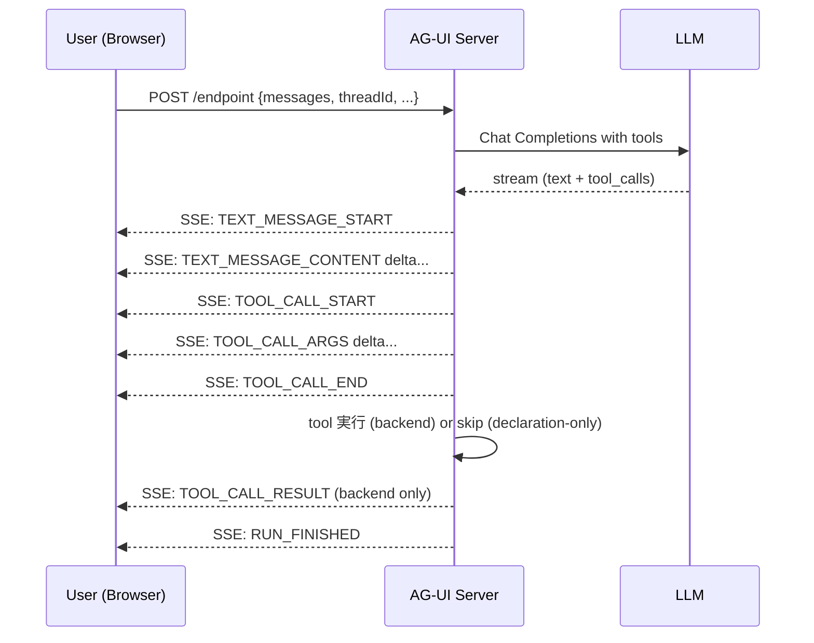
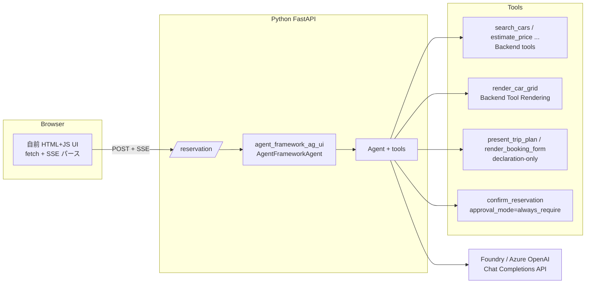

# はじめに

AI を実際に使う場面では、結局のところ **人と AI の協働** で動きます。最終判断するのは人なので、判断材料は **見やすく出す** のが大事。車種一覧・予約確認・日程候補みたいなものを全部チャットのテキストで返されると、正直ごちゃごちゃして見づらいですよね。**チャットだけが UI の全てじゃない** って割り切るだけで、協働の質はけっこう変わります。

かといって、画面を全部人間が事前に組んでしまうと AI である意味がなくなる。そこで **「AI が状況に応じて UI を選んで描く」仕組み** が欲しくなります。

これをやるための代表的なプロトコルが **AG-UI (Agent–User Interaction Protocol)** で、**Microsoft Agent Framework (MAF)** が公式に対応しています。本記事では、MAF + AG-UI で「しろくまレンタカー予約アシスタント」を作ってみた話をベースに、AG-UI / MAF の概要、Generative UI の 2 パターン、実装のキモ、ハマりどころをまとめます。

# 「AI が UI を選んで描く」位置づけ

「LLM が UI を生成する」と一口に言っても、実は粒度がだいぶ違います。本記事で扱うのは **「UI のレイアウトや CSS は人間が書いておく。どの UI を出すか・何を中身として詰めるかを LLM が tool 呼び出しで決める」** タイプ。AG-UI / CopilotKit / Vercel AI SDK あたりが採っている流儀ですね。これだと見栄えとセキュリティは保ちつつ、AI の柔軟性も活きてくれます。

AG-UI 内でも、画面生成の流派は 2 つに分かれます。

| パターン | tool 実行 | データ生成 | 用途 |
|---|---|---|---|
| **A. Backend Tool Rendering (Feature 2)** | サーバー側で実行 | DB/カタログから取得 | 既存データの可視化 (車種カタログ、検索結果) |
| **B. Tool-based Generative UI (Feature 5)** | サーバーでは実行されない (declaration-only) | LLM が完全生成 | LLM の知識・推論で生成するもの (旅行プラン、比較表、注意事項) |

# AG-UI とは

[AG-UI](https://docs.ag-ui.com/) は CopilotKit が中心となって策定している、**AI エージェントと UI クライアントの通信プロトコル** です。HTTP POST + SSE という素直な作りで、フレームワーク非依存 (LangGraph / CrewAI / Pydantic AI / Microsoft Agent Framework などが対応)。

機能は 7 つに整理されています
- ①Agentic Chat
- ②Backend Tool Rendering
- ③Human in the Loop
- ④Agentic Generative UI (長時間処理の進捗)
- ⑤Tool-based Generative UI
- ⑥Shared State
- ⑦Predictive State Updates

本 PoC は ①②③⑤⑥ を使いました。



# Microsoft Agent Framework と AG-UI 対応

[Microsoft Agent Framework](https://learn.microsoft.com/agent-framework/) は 2025 年 10 月にリリースされた、Microsoft 公式のエージェントフレームワークです。Semantic Kernel と AutoGen が合流したような立ち位置で、Python / .NET 両対応。AG-UI には Python・.NET ともに公式パッケージで対応していて ([公式ドキュメント](https://learn.microsoft.com/agent-framework/integrations/ag-ui/))、7 機能すべてサポートと書かれています (2026 年 5 月時点、`agent-framework-ag-ui 1.0.0rc1`)。

最小構成のサーバは、ほんとに数行で立ちます
```python
from agent_framework import Agent, tool
from agent_framework.openai import OpenAIChatCompletionClient
from agent_framework_ag_ui import add_agent_framework_fastapi_endpoint
from fastapi import FastAPI

@tool
def search_cars(car_class: str | None = None) -> list[dict]    return [...]

agent = Agent(
    name="ShirokumaChat",
    instructions="しろくまレンタカーの予約案内係です",
    client=OpenAIChatCompletionClient(...),
    tools=[search_cars],
)

app = FastAPI()
add_agent_framework_fastapi_endpoint(app, agent, "/reservation")
```

# PoC: しろくまレンタカー予約アシスタント

題材として、北海道のレンタカー予約を AI に手伝わせる UI を作りました。

ユーザー発話: 「**家族 4 人で 5/20 から 5/23 まで道東をぐるっと旅行したい。冬タイヤは大丈夫?**」

AI の応答フロー: テキスト直接回答 → **旅行プランカード (Feature 5)** → **車種選択カードグリッド (Feature 2)** → 予約フォーム → **予約確認カード (HITL)** → ✓ 承認 → 予約番号発行 → 「決済を進めて」 → **進捗ストリーミング** → 領収書。

## 動作イメージ

ユーザが「5 月下旬の道東を家族旅行したい」と入力すると、旅行プランが描画されます。


ユーザは内容を確認して承認ボタンを押下します。
すると次は、車種選択のカードグリッドが描画されます。どの車を予約するのかを視覚的に確認して選びます。


ユーザーは車種のカードを選びます。クリックだけなのでチャットの必要がなくなるのがいいですよね。


## アーキテクチャ



ポイントは 3 つ
- AG-UI Dojo (CopilotKit React) は使わず、**自前の HTML+JS** に切り替えた (理由は後述、ハマったので…)
- 統合エンドポイント `/reservation` に全 tool を集約して、1 つの会話で完結する作りに
- フロントは `fetch` + `ReadableStream` で SSE を直接パース。`@ag-ui/client` も不要

# 実装のキモ

## 1. パターン B (declaration-only tool) で旅行プランカード

「LLM の知識を最大限活用する」 UI には Feature 5 (Tool-based Generative UI) を使います。`FunctionTool(func=None, input_model=...)` で **サーバー実行されない tool** を定義します。

```python
from agent_framework import FunctionTool

present_trip_plan = FunctionTool(
    name="present_trip_plan",
    description=(
        "Present a trip plan as a rich timeline card on the user's screen. "
        "Use this when the user shares a travel purpose / destination / period."
    ),
    func=None,  # ← サーバー実行しないマーカー
    input_model={
        "type": "object",
        "properties": {
            "title": {"type": "string"},
            "summary": {"type": "string"},
            "itinerary": {
                "type": "array",
                "items": {
                    "type": "object",
                    "properties": {
                        "day": {"type": "integer"},
                        "date": {"type": "string"},
                        "location": {"type": "string"},
                        "activity": {"type": "string"},
                        "drive_minutes": {"type": "integer"},
                    },
                },
            },
            "caveats": {"type": "array", "items": {"type": "string"}},
        },
        "required": ["title", "summary", "itinerary"],
    },
)
```

クライアント側は `TOOL_CALL_END` イベントで描画します
```javascript
case "TOOL_CALL_END": {
  const entry = ctx.toolCalls[ev.toolCallId];
  if (entry.declarationOnly) {
    const parsed = JSON.parse(entry.tc.function.arguments);
    if (entry.tc.function.name === "present_trip_plan") {
      renderTripPlan(parsed);
    }
    // declaration-only tool は TOOL_CALL_RESULT が来ないので、
    // 履歴に synthetic な tool message を挿入しないと次ターンで 400 になる
    messages.push({
      id: uuid(), role: "tool",
      content: "[rendered on client]",
      toolCallId: ev.toolCallId,
    });
  }
  break;
}
```

## 2. パターン A (backend tool rendering) で車種カードグリッド

サーバ側にあるデータをそのまま見せる用途なら、Feature 2 が向いてます。普通の `@tool` を書いて、return で UI 用の payload を返すだけ。

```python
@tool
def render_car_grid(
    car_ids: Annotated[list[str], Field(description="['SUV-001', 'SUV-002']")],
    headline: Annotated[str | None, Field(description="Optional heading")] = None,
) -> dict    cars = [c for c in CARS if c["car_id"] in car_ids]
    return {"display": "car_grid", "headline": headline, "cars": cars}
```

クライアント側は `TOOL_CALL_RESULT` で描画します
```javascript
case "TOOL_CALL_RESULT": {
  messages.push({
    id: ev.messageId, role: "tool",
    content: typeof ev.content === "string" ? ev.content : JSON.stringify(ev.content),
    tool_call_id: ev.toolCallId,
  });
  const parsed = typeof ev.content === "object"
    ? ev.content
    : JSON.parse(ev.content);
  if (parsed.display === "car_grid") {
    renderCarGrid(parsed);
  }
  break;
}
```

ポイントは、**LLM には `car_ids: list[str]` だけ渡させて、`cars` の中身 (model や daily_jpy など) はサーバ側で展開すること**。LLM に全部 generate させると、価格や仕様がしれっと間違ってたりするので、信頼できる情報源 (カタログ) は人間 (=サーバ) が担当するのが安全です。

## 3. HITL (Human in the Loop) — MAF 独自の wire format

予約確定みたいな **取り消せないアクション** は人の承認をワンクッション挟みたいですよね。MAF はこの承認まわりを、AG-UI 標準にはない独自の wire format で処理しています。

### サーバ → クライアント

`@tool(approval_mode="always_require")` を付けた tool が呼ばれると、サーバが **`CustomEvent("function_approval_request")`** を流してきます
```json
{
  "type": "CUSTOM",
  "name": "function_approval_request",
  "value": {
    "id": "<approval-content-id>",
    "function_call": {
      "call_id": "...",
      "name": "confirm_reservation",
      "arguments": { ... }
    }
  }
}
```

この `value.id` が **サーバ側 `pending_approvals` レジストリのキー** です。次ターンでこれを返さないと「`no matching pending approval request`」と怒られます。

### クライアント → サーバ

承認/拒否は、次ターンの user message に `function_approvals` 配列を付けて送ります
```json
{
  "role": "user",
  "content": "",
  "function_approvals": [{
    "id": "<value.id from CustomEvent>",
    "call_id": "<inner call_id>",
    "name": "confirm_reservation",
    "arguments": { ... },
    "approved": true
  }]
}
```

サーバ側 (`agent_framework_ag_ui/_message_adapters.py`) でこれが `function_approval_response` content に変換され、approved なら実 tool が走って予約成立、という流れ。

### UI 側の実装

```javascript
case "CUSTOM": {
  if (ev.name !== "function_approval_request") break;
  const v = ev.value || {};
  const fc = v.function_call || v.functionCall || {};
  const info = {
    approvalId: v.id,
    innerCallId: fc.call_id || fc.callId,
    innerName: fc.name,
    innerArgs: fc.arguments,
  };
  renderReservationApprovalCard(info).then((approved) =>
    sendApprovalResult(approved, info)
  );
  break;
}
```

# 躓きポイントと工夫

## A. AG-UI Dojo が multi-turn の tool call で history を壊す

最初は AG-UI 公式の Dojo (CopilotKit ベースの React フロント) でデモしようとしたんですが、1 ターン目は動くのに 2 ターン目以降が HTTP 400 で必ず死にます。

サーバ側で受信した history をダンプしてみると
```
[0] user
[1] assistant.toolCalls = []          ← id が消えてる
[2] tool.toolCallId = null            ← ペアリング情報なし
[3] assistant.toolCalls = []
[4] user
```

`tool_calls` は空配列、tool 側の `tool_call_id` は null。**情報が完全に欠落していて、サーバ側でも修復しようがない** 状態。

切り分けで、公式 Python の `AGUIChatClient` から同じサーバを叩いてみたら、こちらは multi-turn が普通に動きました。つまり **悪いのは Dojo 側の history serialization** という結論。Microsoft の Issue [#5941](https://github.com/microsoft/agent-framework/issues/5941) として報告しています。

回避策はシンプルで、Dojo を捨てて自前の HTML+JS に切り替えました。`@ag-ui/client` も不要で、`fetch` + `ReadableStream` で SSE を直接パースするだけです。

## B. HITL の wire format がドキュメント化されてない

MAF の HITL の正しい wire format を見つけるのに、なかなか苦労しました。試したパターンと結果はこんな感じ
1. `{"accepted": true}` を user message の本文に書いて送る → サーバのフォールバック処理に偶然ヒットすれば動くけど、`confirm_changes` がフィルターされたケースでは素通りして無限ループに突入
2. `confirm_changes` の `tool_call_id` を `function_approvals[].id` に入れる → `Rejected approval response: no matching pending approval request` で拒否
3. `CustomEvent("function_approval_request")` の `value.id` を `function_approvals[].id` に入れる → ✅ **これが正解**

ドキュメントには書いていなかったので、`agent_framework_ag_ui` のソース (`_run_common.py`、`_message_adapters.py`) を読んでようやく辿り着きました。Microsoft Learn の[該当ページ](https://learn.microsoft.com/agent-framework/integrations/ag-ui/human-in-the-loop) に追記提案中です。

## C. declaration-only tool は client 側で tool message を入れる

Feature 5 の `FunctionTool(func=None, ...)` はサーバで実行されないので、当然 `TOOL_CALL_RESULT` イベントも流れてきません。何もしないで次ターンを送ると、OpenAI 側で
```
An assistant message with 'tool_calls' must be followed by
tool messages responding to each 'tool_call_id'
```

と 400 エラー。これを防ぐために、`TOOL_CALL_END` のタイミングで **クライアント側の history に synthetic な tool message を push** しておく必要があります
```javascript
messages.push({
  id: uuid(), role: "tool",
  content: "[rendered on client]",
  toolCallId: ev.toolCallId,
});
```

これは AG-UI / MAF のドキュメントには書かれていない、**declaration-only tool を使うクライアント側の暗黙の責務** です。

## D. `function_approvals` は transient フィールド

承認した後、`function_approvals` をそのまま history に残しっぱなしで次のターン (例: 「決済を進めて」) を送ると、サーバの approval registry はもう consume 済みなので
```
Rejected approval response id=...: no matching pending approval request
```

でまた怒られます。クライアント側で **最後の user message 以外の `function_approvals` は strip** してから送るのが正解
```javascript
const bodyMessages = messages.map((m, idx, arr) => {
  if (idx < arr.length - 1 && m.function_approvals) {
    const { function_approvals, ...rest } = m;
    return rest;
  }
  return m;
});
```

これもどこにも書いてなかった。

## E. LLM を制御するのは instructions より tool result が効く

承認後、LLM が「お見積もりと確認カードをご覧ください」みたいな **前ターンの応答を繰り返す** 癖が抜けなくて苦戦しました。instructions に「承認後は予約番号を伝えること」と何回書いても、LLM はあっさり無視してきます。

結局効いたのは、`confirm_reservation` の return value 自体に「次にこうしてね」を書いておく作戦
```python
return {
    "reservation_id": reservation_id,
    ...,
    "next_action": (
        f"Reservation is now confirmed. Tell the user the reservation_id "
        f"({reservation_id}) and the booking summary in 2-3 sentences, "
        "then ask whether to proceed with payment. Do NOT repeat previous "
        "messages like 'お見積もりと確認カードをご覧ください'."
    ),
}
```

tool result は直近の文脈に入るので、instructions よりずっと従順度が高いです。プロンプトエンジニアリングでよく言われる「近い文脈ほど効く」の典型ですね。

## F. 並列 tool call と LLM のクセ

gpt-5.4-mini クラスのモデルは、1 ターンで複数の tool を並列に呼んできます。それ自体は効率的でいいんですが、`text + tool_calls` を **2 つの別々の assistant message に分けて返してくる** 挙動も観測しました。

```
[1] assistant.toolCalls = [present_trip_plan]   ← tool_call だけ
[2] assistant.content = "5月下旬の道東は..."   ← text だけ
[3] user (next turn)
```

MAF サーバ側の `_sanitize_tool_history` は「2 連続 assistant」で pending tool 状態をリセットしてしまうので、orphan な tool_call が残って 400 になります。

対策として、サーバ側で `AgentFrameworkAgent` を subclass して、**declaration-only tool の orphan toolCalls の直後に synthetic tool message を強制 inject** するラッパーを噛ませました。これで LLM のクセに振り回されなくなります。

# まとめ

AI が UI を選んで描く仕組みは、チャットによる自由度や柔軟性を保ちつつ、人が視認性の良いUIを提供できることです。ポイントは、「LLM が自由に HTML を吐く」のとは違って **コンポーネントは人間が、データと選択は LLM が** 担当する分業にすることです。

PoC を通して見えた「何が動いて、何が動かなくて、なぜ動かないのか」は Issue にもまとめてあるので、これから AG-UI + MAF を試す方の参考になれば嬉しいです。

# 参考

- [Microsoft Agent Framework: AG-UI Integration](https://learn.microsoft.com/agent-framework/integrations/ag-ui/)
- [AG-UI Protocol](https://docs.ag-ui.com/)
- [Microsoft Agent Framework GitHub](https://github.com/microsoft/agent-framework)
- [Issue #5941: Multi-turn tool calls fail (本 PoC で報告)](https://github.com/microsoft/agent-framework/issues/5941)
- [CopilotKit/CopilotKit#3884: AG-UI history serialization bug](https://github.com/CopilotKit/CopilotKit/issues/3884)
