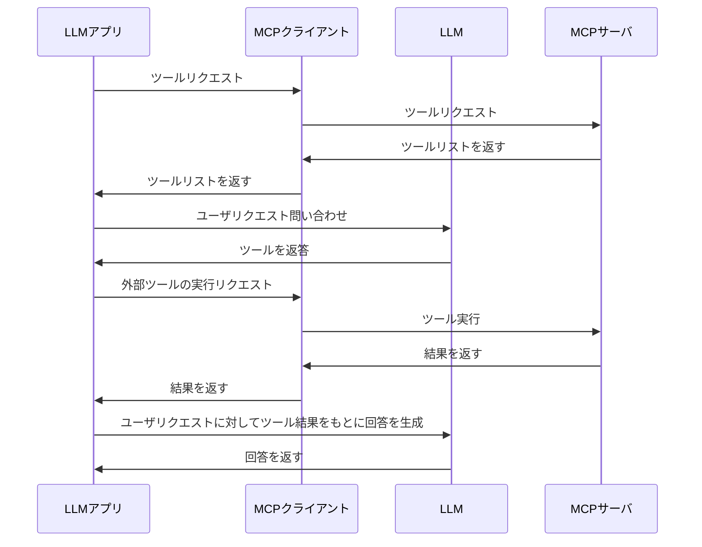
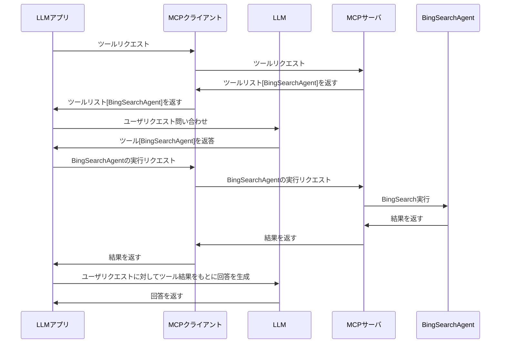

# MCP（Model Context Protocol）とは？

MCPとは、アプリケーションがLLMにコンテキストを提供する方法を標準化するオープンプロトコルです。　つまり、**LLMが他のツールを呼び出しデータ取得やツール実行を行うためのプロトコル**です。

ここまで聞くと、従来のFunctionCallingと何が異なる？となりますよね。
FunctionCallingの場合、LLMアプリケーションの中でFunctionのスキーマを定義する必要がありました。また、FunctionCallingで選ばれたツールの実行はコーディングする必要がありました。

MCPの場合は、以下の図のとおり、ツールは別のサーバやプロセスにて独立して動作できます。MCPは、MCPクライアントとMCPサーバで分かれています。LLMアプリケーションとは独立し、MCPクライアントに実装できるのでLLMアプリと分離して管理可能です。


https://modelcontextprotocol.io/introduction より引用

MCPを使ったLLMアプリの動きはこのような流れになります。



::: message
サービスを公開する際に、MCPサーバーもセットで公開すると、生成AIを扱うプロダクトからの利用がしやすくなります。
そうなっていくと、AIから呼ばれる際の認証認可は重要ですね。この点の技術進歩もウォッチ必要そうです。
:::

---
# Azure AI Agent サービスを使ったMCPサーバ作成
2025/3/21に、Microsoft DevBlogにて、Azure AI Agent サービスを使ったMCPサーバの作成方法が公開されました。
https://devblogs.microsoft.com/foundry/integrating-azure-ai-agents-mcp/

以下のようなことができるようになる。と書かれています。
- Bing Search でのグラウンディングを使用したリアルタイムの Web データ
- Azure AI Search を使用した内部のプライベート データ

つまり、Azure AI Agent を MCPサーバ部分（赤枠）にすることができますよ。ということですね。


SharePointやFabricなどのデータソースとの連携は今後展開予定とのことです。

---
# BingSearchを行うAgent ServiceのMCPサーバ

そういえば、Azure から Bing Search API が廃止され衝撃を受けた最近でした。Azure AI Agent Service 経由で Bing Search を行えますので、**Bing Search でグランディングを行うMCPサーバを作成**してみます。

MCPサーバの裏側に、Bing Search を行うAgent Serviceがいることになりますね。



# LLMアプリとMCPクライアント
上記のフローで、チャットのようなアプリを作ろうとすると、LLMアプリとMCPクライアントの実装をする必要がありますね。
**実装レスでもっとも簡単な方法は、Claude Desktop を使う方法**です。
https://modelcontextprotocol.io/quickstart/user

こちらの設定をすると以下のようになります。


ちなみに設定ファイルはこちらです。
:::details claude-mcp-settings.json
```json
{
  "mcpServers": {
    "azure-agent": {
      "command": "python",
      "args": [
        "-m",
        "azure_agent_mcp_server"
      ],
      "cwd": "C:\\Users\\AdmUser\\Documents\\mcp-foundry\\src\\python",
      "env": {
        "PYTHONPATH": "C:\\Users\\AdmUser\\Documents\\mcp-foundry\\src\\python",
        "PROJECT_CONNECTION_STRING": "https://swedencentral.api.azureml.ms;f80766c9-6be7-43f9-8369-d492efceff1e;mcp-poc;mcp-poc",
        "DEFAULT_AGENT_ID": "asst_s9pNftL0Z0posbBEJblTwQn3"
      }
    }
  }
}
```
:::

本ブログでは、**自前でLLMアプリを作成する場合**を考えてみましょう。
LLMアプリはユーザ体験が重要なため、React, Next.js がよく使われる印象です。また、LLMモデルについても複数使う可能性があります。そういう際には、**Vercel AI SDKを使うと各LLMモデルのSDKをラッピングしてくれる**ため便利です。
以前のブログでVercel AI SDK について書いているのでこちらを参照ください。
https://zenn.dev/nomhiro/articles/poc-vercel-ai-sdk

**Vercel AI SDK のアップデートで、バージョン4.2でMCPクライアントが導入**されました。
https://vercel.com/blog/ai-sdk-4-2#model-context-protocol-(mcp)-clients
https://sdk.vercel.ai/docs/ai-sdk-core/tools-and-tool-calling#initializing-an-mcp-client
まだexperimental （試験段階）なので、注意が必要ですが、LLMアプリとMCPクライアントの実装はNext.jsでVercel AI SDKを試してみます。

---
# 早速PoCしていきましょう🚀
Azure AI Foundry の Hub と Project は作成済みとします。
Project の接続文字列を控えておきましょう。


## Bing Search Agent を作成
まずはAzure AI Foundry で Bing Search Agent を作成します。


非常に雑ですが、このようなAgentを作成しました。エージェントIDを後ほど使うので控えておきましょう。


「ナレッジの追加」からBingSearchを有効にします。


## MCPサーバを立ち上げましょう！
Microsoft の GitHub プロジェクトを参考にします。

https://github.com/azure-ai-foundry/mcp-foundry

.envファイルに環境変数を設定します。
``` env
PROJECT_CONNECTION_STRING="上記で控えたProjectの接続文字列"
DEFAULT_AGENT_ID="asst_s9pNftL0Z0posbBEJblTwQn3"
```

次にMCPサーバーのPythonコードを用意します。GitHubのコードとほぼ同じなので割愛します。
:::details mcp-server.py
``` python
"""Azure AI Agent Service MCP Server"""

import os
import sys
import logging
import asyncio
from dotenv import load_dotenv
from mcp.server.fastmcp import FastMCP, Context
from azure.ai.projects.aio import AIProjectClient
from azure.ai.projects.models import MessageRole, Agent
from azure.identity.aio import AzureCliCredential

logging.basicConfig(
    level=logging.WARNING,
    format="%(asctime)s - %(name)s - %(levelname)s - %(message)s",
    stream=sys.stderr,
)
logger = logging.getLogger("azure_agent_mcp")

# Global variables for client and agent cache
ai_client = None
agent_cache = {}
default_agent_id = None


def initialize_server():
    """Initialize the Azure AI Agent client asynchronously."""
    global ai_client, default_agent_id

    # Load environment variables
    project_connection_string = os.getenv("PROJECT_CONNECTION_STRING")
    default_agent_id = os.getenv("DEFAULT_AGENT_ID")

    # Validate essential environment variables
    if not project_connection_string:
        logger.error("Missing required environment variable: PROJECT_CONNECTION_STRING")
        return False

    try:
        credential = AzureCliCredential()
        ai_client = AIProjectClient.from_connection_string(
            credential=credential,
            conn_str=project_connection_string,
            user_agent="mcp-azure-ai-agent",
        )
        return True
    except Exception as e:
        logger.error(f"Failed to initialize AIProjectClient: {str(e)}")
        return False


async def get_agent(agent_id: str) -> Agent:
    """Get an agent by ID with simple caching."""
    global agent_cache

    # Check cache first
    if agent_id in agent_cache:
        return agent_cache[agent_id]

    # Fetch agent if not in cache
    try:
        agent = await ai_client.agents.get_agent(agent_id=agent_id)
        agent_cache[agent_id] = agent
        return agent
    except Exception as e:
        logger.error(f"Agent retrieval failed - ID: {agent_id}, Error: {str(e)}")
        raise ValueError(f"Agent not found or inaccessible: {agent_id}")


async def query_agent(agent_id: str, query: str) -> str:
    """Query an Azure AI Agent and get the response."""
    try:
        # Get agent (from cache or fetch it)
        agent = await get_agent(agent_id)

        # Always create a new thread
        thread = await ai_client.agents.create_thread()
        thread_id = thread.id

        # Add message to thread
        await ai_client.agents.create_message(
            thread_id=thread_id, role=MessageRole.USER, content=query
        )

        # Process the run asynchronously
        run = await ai_client.agents.create_run(thread_id=thread_id, agent_id=agent_id)

        # Poll until the run is complete
        while run.status in ["queued", "in_progress", "requires_action"]:
            await asyncio.sleep(1)  # Non-blocking sleep
            run = await ai_client.agents.get_run(thread_id=thread_id, run_id=run.id)

        if run.status == "failed":
            error_msg = f"Agent run failed: {run.last_error}"
            logger.error(error_msg)
            return f"Error: {error_msg}"

        # Get the agent's response
        response_messages = await ai_client.agents.list_messages(thread_id=thread_id)
        response_message = response_messages.get_last_message_by_role(MessageRole.AGENT)

        result = ""
        citations = []

        if response_message:
            # Collect text content
            for text_message in response_message.text_messages:
                result += text_message.text.value + "\n"

            # Collect citations
            for annotation in response_message.url_citation_annotations:
                citation = (
                    f"[{annotation.url_citation.title}]({annotation.url_citation.url})"
                )
                if citation not in citations:
                    citations.append(citation)

        # Add citations if any
        if citations:
            result += "\n\n## Sources\n"
            for citation in citations:
                result += f"- {citation}\n"

        return result.strip()

    except Exception as e:
        logger.error(f"Agent query failed - ID: {agent_id}, Error: {str(e)}")
        raise


# Initialize MCP and server
load_dotenv()
server_initialized = initialize_server()
mcp = FastMCP(
    "azure-agent",
    description="MCP server for Azure AI Agent Service integration",
    dependencies=["azure-identity", "python-dotenv", "azure-ai-projects", "aiohttp"],
)


@mcp.tool()
async def connect_agent(agent_id: str, query: str, ctx: Context = None) -> str:
    """Connect to a specific Azure AI Agent."""
    if not server_initialized:
        return "Error: Azure AI Agent server is not initialized. Check server logs for details."

    try:
        response = await query_agent(agent_id, query)
        return f"## Response from Azure AI Agent\n\n{response}"
    except Exception as e:
        return f"Error connecting to agent: {str(e)}"


@mcp.tool()
async def query_default_agent(query: str, ctx: Context = None) -> str:
    """Send a query to the default configured Azure AI Agent."""
    if not server_initialized:
        return "Error: Azure AI Agent server is not initialized. Check server logs for details."

    if not default_agent_id:
        return "Error: No default agent configured. Set DEFAULT_AGENT_ID environment variable or use connect_agent tool."

    try:
        response = await query_agent(default_agent_id, query)
        return f"## Response from Default Azure AI Agent\n\n{response}"
    except Exception as e:
        return f"Error querying default agent: {str(e)}"


@mcp.tool()
async def list_agents() -> str:
    """List available agents in the Azure AI Agent Service."""
    if not server_initialized:
        return "Error: Azure AI Agent server is not initialized. Check server logs for details."

    try:
        agents = await ai_client.agents.list_agents()
        if not agents or not agents.data:
            return "No agents found in the Azure AI Agent Service."

        result = "## Available Azure AI Agents\n\n"
        for agent in agents.data:
            result += f"- **{agent.name}**: `{agent.id}`\n"

        if default_agent_id:
            result += f"\n**Default Agent ID**: `{default_agent_id}`"

        return result
    except Exception as e:
        return f"Error listing agents: {str(e)}"


if __name__ == "__main__":

    status = "successfully initialized" if server_initialized else "initialization failed"
    print(f"\n{'='*50}\nAzure AI Agent MCP Server {status}\nStarting server...\n{'='*50}\n")

    # MCPサーバを指定したホストとポートで起動
    mcp.run("sse")
```
:::

Pythonコードを実行します。表示はStartingのままですが、サーバが起動しています。
もしMCPサーバ側でエラーになる場合は、以下のようにコンソールに出力されます。これはTPMを超えた場合のエラーです。


## Vercel AI SDK で、LLMアプリとMCPクライアントを実装
まずはNext.js のアプリケーションを作成します。
コードはこちらのGitHubにあります。
https://github.com/nomhiro/mcp-vercel-ai-foundry

ルートフォルダで.env.localファイルを作成し、以下のように環境変数を設定します。LLMモデルはAzure OpenAIを利用します。
``` env
AZURE_RESOURCE_NAME="AzureOpenAIのリソース名"
AZURE_API_KEY="AzureOpenAIのAPIキー"
```

プロジェクトフォルダで以下を実行し起動します。
```bash
npm install
npm run dev
```

# 動作確認
ブラウザでアクセスすると、以下のような画面が表示されるはずです。

「今日の日経平均株価」を聞いてみました。


ちゃんとBing検索してくれていますね！！！
検索結果のURLもあり、内容も合っています。


# まとめ

Azure AI Foundry の Agent Service を MCPサーバから呼び出せることが実際に確認できました。
さらに、どうやら Copilot Studio でも MCP が使えるようになっていますね。MCPサーバと連携してツール呼び出しができるようになるという内容です。
https://www.microsoft.com/en-us/microsoft-copilot/blog/copilot-studio/introducing-model-context-protocol-mcp-in-copilot-studio-simplified-integration-with-ai-apps-and-agents/?msockid=2ded0802190e6e23183c1d4318536fb4

Vercel AI SDK のおかげで、LLMアプリ側の実装は非常に簡単でした。LLMアプリはユーザ体験が重要なため、私はNext.jsなどをよく使います。Vercel AI SDK で Next.jsで完結して実装できるので開発体験がとても良かったです。


---

# 参考情報

以下はMCPサーバコードの簡単な解説です。

#### 初期化処理
`initialize_server` 関数で、Azure AI Agent Service クライアントを初期化します。

```python
def initialize_server():
    project_connection_string = os.getenv("PROJECT_CONNECTION_STRING")
    default_agent_id = os.getenv("DEFAULT_AGENT_ID")
    credential = AzureCliCredential()
    ai_client = AIProjectClient.from_connection_string(
        credential=credential,
        conn_str=project_connection_string,
        user_agent="mcp-azure-ai-agent",
    )
```

- **環境変数の読み込み**: 接続文字列とデフォルトエージェントIDを取得。
- **認証**: `AzureCliCredential` を使用して認証。
- **クライアント初期化**: `AIProjectClient` を作成。

---

#### エージェントの取得とキャッシュ
`get_agent` 関数で、エージェント情報を取得します。キャッシュを利用して効率化しています。

```python
async def get_agent(agent_id: str) -> Agent:
    if agent_id in agent_cache:
        return agent_cache[agent_id]
    agent = await ai_client.agents.get_agent(agent_id=agent_id)
    agent_cache[agent_id] = agent
    return agent
```

- **キャッシュ**: すでに取得済みのエージェントは再取得しません。
- **非同期処理**: `await` を使用して非同期でエージェント情報を取得。

---

#### エージェントへのクエリ送信
`query_agent` 関数で、指定したエージェントにクエリを送信し、結果を取得します。

```python
async def query_agent(agent_id: str, query: str) -> str:
    thread = await ai_client.agents.create_thread()
    await ai_client.agents.create_message(thread_id=thread.id, role=MessageRole.USER, content=query)
    run = await ai_client.agents.create_run(thread_id=thread.id, agent_id=agent_id)
    while run.status in ["queued", "in_progress", "requires_action"]:
        await asyncio.sleep(1)
    response_messages = await ai_client.agents.list_messages(thread_id=thread.id)
    response_message = response_messages.get_last_message_by_role(MessageRole.AGENT)
    return response_message.text_messages[0].text.value
```

- **スレッド作成**: エージェントとの通信スレッドを作成。
- **クエリ送信**: ユーザーのクエリを送信。
- **非同期ポーリング**: 実行ステータスを確認し、完了するまで待機。
- **応答取得**: エージェントからの応答を取得。

---

#### MCP サーバのツール定義
以下のツールを MCP サーバに登録しています。

##### 1. `connect_agent`
指定したエージェントにクエリを送信します。

```python
@mcp.tool()
async def connect_agent(agent_id: str, query: str, ctx: Context = None) -> str:
    response = await query_agent(agent_id, query)
    return f"## Response from Azure AI Agent\n\n{response}"
```

##### 2. `query_default_agent`
デフォルトエージェントにクエリを送信します。

```python
@mcp.tool()
async def query_default_agent(query: str, ctx: Context = None) -> str:
    response = await query_agent(default_agent_id, query)
    return f"## Response from Default Azure AI Agent\n\n{response}"
```

##### 3. `list_agents`
利用可能なエージェントの一覧を取得します。

```python
@mcp.tool()
async def list_agents() -> str:
    agents = await ai_client.agents.list_agents()
    result = "## Available Azure AI Agents\n\n"
    for agent in agents.data:
        result += f"- **{agent.name}**: `{agent.id}`\n"
    return result
```

---

#### MCP サーバの起動
`FastMCP` を使用して MCP サーバを起動します。

```python
if __name__ == "__main__":
    mcp.run("sse")
```

- **ツール登録**: 上記で定義したツールを MCP サーバに登録。
- **サーバ起動**: `mcp.run("sse")` でサーバを起動。

---

