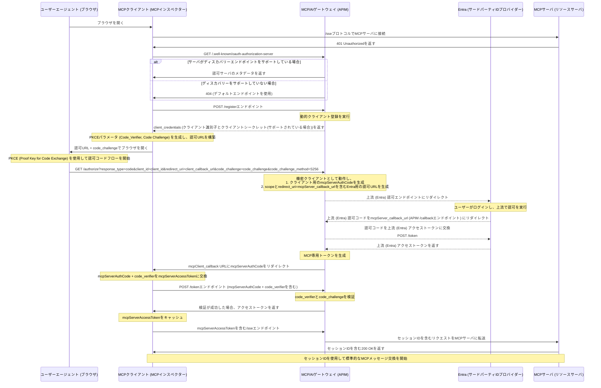

# はじめに
AI技術が進化する中で、Model Context Protocol (MCP) は、AIモデルが外部ツールと連携するための標準的なプロトコルとして注目されています。MCPを活用することで、AIエージェントがさまざまなデータソースにアクセスし、より高度なタスクを実行できるようになります。

しかし、MCPを安全に運用するためには、認証・認可の仕組みが不可欠です。そこで登場するのが Azure API Management (APIM) です。本記事では、APIMをMCPの認証ゲートウェイとして活用するメリットについて、分かりやすく解説します。

# MCPとは

## MCPを利用する場合の課題
1. **セキュリティの確保**
  - MCPサーバーは、外部ツールやデータソースと接続するため、適切な認証・認可がないと、不正アクセスのリスクが高まります。
2. **スケーラビリティの問題**
  - AIエージェントの利用が増えると、MCPサーバーへのアクセスが集中し、負荷が高まります。適切な管理がないと、システムのパフォーマンスが低下する可能性があります。
3. **認証フローの複雑化**
  - MCPクライアントがMCPサーバーにアクセスする際、OAuthを利用した認証フローが必要になります。しかし、これを適切に実装するのは容易ではありません。

# MCPサーバと認証の重要性

MCPサーバは、AIエージェントやその他の外部システムが統一されたプロトコルを介して様々なデータソースやエンドポイントにアクセスするための仕組みです。APIMは、MCPサーバと組み合わせることで、OAuthプロトコルを用いた認証・認可を実現し、外部ユーザーがアクセスする際に正しいユーザーであることを確認できます。

## 認証フローの仕組みと具体例

1. **MCPクライアントからのリクエスト**  
   - MCPクライアント（例：AIエージェントやアプリケーション）がAPIMゲートウェイにアクセス。

2. **認証・認可のためのリダイレクト**  
   - APIMはユーザーをMicrosoft Entra（旧称Azure AD）にリダイレクトし、ログインとアクセス許可の確認を行う。

3. **アクセストークンの発行**  
   - ユーザーが認証に成功すると、EntraからアクセストークンがAPIMへ返される。

4. **MCPサーバとの安全な通信**  
   - APIMは得られた認証情報をMCPサーバに渡し、MCPサーバはセッションキーを生成して継続的な安全通信を実現。

# AI Gateway

## API Managementとは

Azure API Managementは、組織内外のAPIを一元管理し、セキュリティ、スケーラビリティ、監視などの機能を提供するサービスです。たとえば、複数のアプリケーションやサービスに対して一貫したセキュリティルールを適用したい場合、APIMをゲートウェイとして利用することで、すべてのリクエストの認証やアクセス権のチェックをまとめて行うことができます。

## AI GatewayとしてのAPI Management

APIManagement を AI Gateway として扱うことで、MCPサーバを安全に公開することができます。これにより、AIエージェントやアプリケーションは、APIMを通じてMCPサーバにアクセスし、必要なデータや機能を利用できるようになります。

- Microsoft Entra ID が、認証と認可を管理します。


## Azure API Managementを活用するメリット
Azure API Management (APIM) をMCPの認証ゲートウェイとして利用することで、これらの課題を解決できます。

1. **セキュリティの強化**
APIMは、OAuth認証をサポートしており、MCPクライアントがMCPサーバーにアクセスする際に、Microsoft Entra ID (旧Azure AD) を利用した安全な認証を実現できます。これにより、不正アクセスを防ぎ、データの保護を強化できます。

2. **スケーラビリティの向上**
APIMは、APIの管理と負荷分散を行うため、MCPサーバーへのアクセスが増えても、システムのパフォーマンスを維持できます。これにより、大規模なAIエージェントの運用が可能になります。

3. **認証フローの簡素化**
APIMを利用することで、OAuth認証のフローを統一し、MCPクライアントとMCPサーバーの接続をスムーズに管理できます。APIMがアクセストークンの仲介を行うため、開発者は複雑な認証処理を意識せずに済みます。


## AI Gatewayの認証フロー
このMCPの認証フローは、MCPクライアントは安全にMCPサーバーと通信できるようになります。

1. MCPクライアントがAPIMゲートウェイを呼び出す
2. APIMゲートウェイがMicrosoft Entra IDにリダイレクトし、ユーザーのログインと同意を取得
3. Entra IDがAPIMゲートウェイにアクセストークンを提供
4. APIMゲートウェイがMCPサーバーと通信し、認証済みのリクエストを処理
5. MCPサーバーがセッションキーを確立し、継続的な通信を可能にする




# PoC
前提
- Azure CLI がインストールされていること
- 

## Azure CLI で Azure にログイン
```bash
azd auth login
```

## プロバイダの登録
Azure API Management を使用するには、Microsoft.App プロバイダを登録する必要があります。これを行うには、次のコマンドを実行します。
```bash
az provider register --namespace Microsoft.App --wait
```

## リソースをプロビジョニング
API Management サービス、関数アプリ (コードを含む)、およびその他すべての必要な Azure リソースをプロビジョニングする
```bash
azd up
```

以下を指定します。
- ユニークな環境名（リソースグループや各種リソースの名前に使用されます）
- Azure サブスクリプション
- Azure リージョン

```bash
? Enter a unique environment name: mcp-poc
? Select an Azure Subscription to use:  1. Microsoft Azure Education (8de42282-72ff-4d35-b380-ccfbf9e8f3fd)
? Enter a value for the 'location' infrastructure parameter:  7. (US) East US (eastus)

  You can view detailed progress in the Azure Portal:
  https://portal.azure.com/#view/HubsExtension/DeploymentDetailsBlade/~/overview/id/%2Fsubscriptions%2F8de42282-72ff-4d35-b380-ccfbf9e8f3fd%2Fproviders%2FMicrosoft.Resources%2Fdeployments%2Fmcp-poc-1747562339        

  (✓) Done: Resource group: rg-mcp-poc (2.305s)
  (✓) Done: Virtual Network: vnet-4n2mfsh2wmgbm (255ms)
  (✓) Done: Storage account: st4n2mfsh2wmgbm (267ms)
  (✓) Done: App Service plan: plan-4n2mfsh2wmgbm (1.528s)
  (✓) Done: Log Analytics workspace: log-4n2mfsh2wmgbm (325ms)
  (✓) Done: Private Endpoint: queue-private-endpoint (2.443s)
  (✓) Done: Private Endpoint: blob-private-endpoint (396ms)
  (✓) Done: Application Insights: appi-4n2mfsh2wmgbm (611ms)
  (✓) Done: Function App: func-api-4n2mfsh2wmgbm (2.097s)
  (✓) Done: Azure API Management: apim-2f34fedyxr4la (1m9.489s)

Deploying services (azd deploy)

  (✓) Done: Deploying service api
  - Endpoint: https://apim-2f34fedyxr4la.azure-api.net/mcp/sse


SUCCESS: Your up workflow to provision and deploy to Azure completed in 6 minutes 6 seconds.
```

Azure Portalでリソースを確認しましょう。
