# はじめに

**Microsoft Foundry** と聞いて、ピンときますか？？　そんなあなたは2025年のMicrosoft Igniteの内容を把握しているか、Azure の AIサービスの最新動向に詳しい方ですね！

このブログでは、だれもが **Microsoft Foundry** でエージェントを作成できるように、解説したいと思います。

Microsoft Foundry（旧Azure AI Foundry）は、AIアプリケーションの開発・デプロイ・管理を統合的に行えるプラットフォームです。本記事では、まず**AIエージェントの基本概念**を整理した上で、Foundryポータルの**9つの主要機能**について公式ドキュメントを基に詳しく解説します。


その中でも2026年1月時点で、どういう方にどういう機能を組み合わせて使えばいいのかを、具体的なユースケースを交えて紹介します。

:::message
この記事は2025年1月時点の公式ドキュメントに基づいています。Microsoft Foundryは急速に進化しているため、最新情報は公式ドキュメントをご確認ください。
:::

Hosted Agent に関する記事も書きましたので、合わせてご覧ください。
https://zenn.dev/nomhiro/articles/microsoft-foundry-hosted-agent

#### 参考リンク

- [Microsoft Foundry ドキュメント](https://learn.microsoft.com/azure/ai-foundry/)
- [エージェント開発ライフサイクル](https://learn.microsoft.com/azure/ai-foundry/agents/concepts/development-lifecycle)
- [ツールカタログ](https://learn.microsoft.com/azure/ai-foundry/agents/concepts/tool-catalog)
- [ガードレールの概要](https://learn.microsoft.com/azure/ai-foundry/guardrails/guardrails-overview)
- [評価メトリクス](https://learn.microsoft.com/azure/ai-foundry/concepts/evaluation-metrics-built-in)


---

# AIエージェントとは何か？ 🤖

Foundryの各機能を理解する前に、まず**AIエージェントの一般的な考え方**を整理しておきましょう。

```
エージェント ＝ プロンプト × ツール
```

エージェントとは、与えられた目的に対して、**プロンプト**（指示・命令）を基に**ツール**（外部機能）を活用して**自律的に**タスクを遂行するAIシステムのことです。


### プロンプト：エージェントの「頭脳」

**プロンプト**は、エージェントの振る舞いを定義する命令です

| 要素 | 説明 | 例 |
|-----|------|-----|
| **役割定義** | エージェントの人格・専門性 | 「あなたは旅行プランナーです」 |
| **指示** | タスクの遂行方法 | 「ユーザーの予算と好みを確認してから提案してください」 |
| **制約** | 禁止事項・ガードレール | 「架空の情報を作成しないでください」 |
| **出力形式** | 応答のフォーマット | 「JSON形式で出力してください」 |

※ 従来のRAG（Retrieval-Augmented Generation）は、事前に用意したナレッジベースから情報を取得し、プロンプトに組み込む技術です。これにより、エージェントは最新かつ正確な情報に基づいて応答できます。

### ツール：エージェントの「手足」

**ツール**は、エージェントが外部と対話する能力を提供します。ツールには大きく2つの種類があります

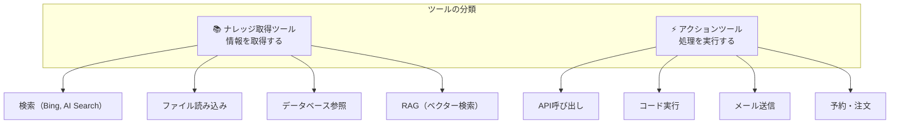

※ LLMが賢くなってきたことで、事前に検索してエージェントのプロンプトに埋め込むRAG以外にも、エージェントにナレッジベースを検索するツールを提供し、エージェント自身に自律的にRAGを実行させる形が主流になりつつあります。

### なぜツールが必要？

LLM単体では以下の限界があります

| LLMの限界 | ツールによる解決 |
|----------|----------------|
| 学習データ以降の情報を知らない | 🔍 **検索ツール**でリアルタイム情報を取得 |
| 企業の内部データにアクセスできない | 📚 **RAG**で独自ナレッジを参照 |
| 計算やコード実行ができない | 💻 **Code Interpreter**で処理を実行 |
| 外部システムを操作できない | ⚡ **API連携**でアクションを実行 |

LLM単体では、学習データに基づく応答しかできず、最新情報の取得や外部システムの操作ができません。しかし、**ツール**を組み合わせることで、リアルタイム情報の取得、独自データの参照、計算処理、外部システムの操作など、**多様なタスクを自律的に遂行**できるようになります。
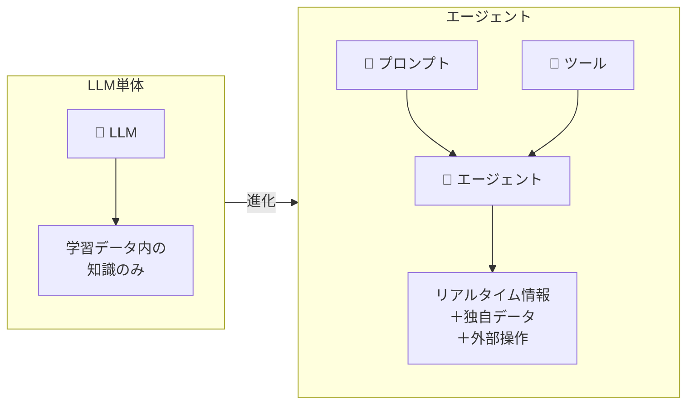

### Foundryにおけるエージェント構成要素

この「プロンプト × ツール」の概念を、Foundryでは以下の機能でカバーしています

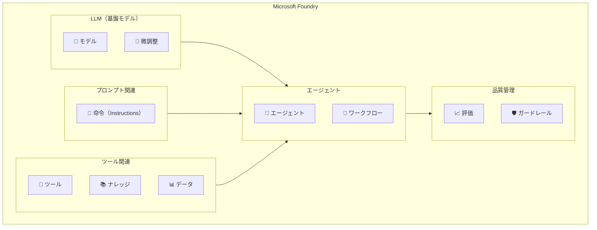

| Foundry機能 | 役割 |
|------------|------|
| **モデル** | 基盤となるLLMを選択・デプロイ |
| **微調整** | モデルをカスタマイズ |
| **ツール** | 検索・API・コード実行などの機能 |
| **ナレッジ** | RAGによる独自データ参照 |
| **データ** | 学習データ・評価データの管理 |
| **エージェント** | プロンプト×ツールを組み合わせ |
| **ワークフロー** | 複数エージェントの連携 |
| **評価** | エージェントの性能を測定 |
| **ガードレール** | 安全性の制約を追加 |

この構造を理解した上で、各機能を詳しく見ていきましょう。

---

# Foundryポータルの全体像

Foundryポータルの左サイドメニューには、9つの主要機能があります


エージェントを構築していくときは、以下の流れで設計していきます。
- どのモデルを使うか
- どのようなツールを使うか
- どのようなナレッジ/データが必要か
- モデル、ツール、ナレッジ/データを組み合わせてエージェントを定義
- 決まった手続きの場合はワークフローとしてエージェントを用意
- 作成したエージェントの評価
- エージェントのガードレール

ですので、上記の順番で各機能を詳しく解説していきます。

---

# モデル 🧠


**モデル**ページでは、AIモデルのデプロイ、管理、監視を行います。エージェントの基盤となるLLMを払い出します。

以下のように、OpenAIのモデル以外にも、DeepSeekやAnthropicなどのサードパーティモデルも利用できます。
Microsoft Foundryは、**AIエージェントの基盤として、多様なモデルをサポートしている**ことがわかります。
わたしは、AnthropicのClaudeモデルは、ツール呼び出しに強みがあるので、ツールが多く、目的達成のためにツールを使いこなす必要がある場合によく使っています。


### デプロイ時の設定

モデルのデプロイ時には、以下を設定します
| 設定項目 | 説明 |
|---------|------|
| **デプロイ名** | デプロイメントの一意な名前。API呼び出し時に使用。 |
| **デプロイタイプ** | モデルのホスティング方法。Standard、Global-Standard、Provisioned-Managed、Global-Batchから選択。 |
| **モデルバージョン** | 使用するモデルのバージョン。 |
| **アップグレードポリシー** | どのタイミングでモデルのバージョンをアップグレードするのかを指定。<br>・新しい既定のバージョンが利用可能になったら<br>・現在のバージョンの有効期限が切れたら<br>・モデルバージョンの自動アップグレードをしない |
| **1分あたりのトークン数レート制限** | API呼び出し時の1分あたりのトークン数の上限を設定。 |
| **ガードレール** | モデルの応答に対する制約を設定 |


#### デプロイメントタイプ

デプロイするときに、デプロイタイプを選択する必要があります。それらの違いは以下の通りです。

| タイプ | 特徴 | ユースケース |
|-------|------|------------|
| **Standard** | 指定リージョンで処理、データレジデンシー確保 | コンプライアンス要件がある場合 |
| **Global-Standard** | グローバルインフラで動的ルーティング、高スループット | 推奨開始点、最高の可用性 |
| **Provisioned-Managed** | 予約容量、予測可能なスループット | 高負荷・低レイテンシが必要 |
| **Global-Batch** | 非同期大量処理、50%低コスト | 大規模データ処理 |

:::message alert
**重要**: APIでモデルを呼び出す際は、モデル名ではなく**デプロイ名**を使用します。これはOpenAI APIとAzure OpenAI APIの主な違いの一つです。
:::

---

# 微調整 🎯

**微調整 Fine-tuning**は、基盤モデルを独自のデータセットでカスタマイズし、特定のタスクに最適化する機能です。エージェントのLLMに層を追加し、特定のドメイン知識や応答スタイルを学習させることができます。

### 微調整の手法

| 手法 | 対応モデル | 説明 |
|-----|----------|------|
| **Supervised Fine-Tuning (SFT)** | 非推論モデル全般 | 教師あり学習による微調整 |
| **Direct Preference Optimization (DPO)** | GPT-4o | 人間の好みに基づく最適化 |
| **Reinforcement Fine-Tuning (RFT)** | o4-miniなど推論モデル | 強化学習による微調整 |

### 微調整のワークフロー

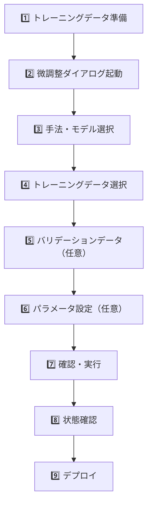

### トレーニングタイプ

| タイプ | 説明 | 特徴 |
|-------|------|------|
| **Standard** | 現在のリージョンで処理 | データレジデンシー確保 |
| **Global** | グローバルで処理 | 低コスト、データレジデンシーなし |

### データ形式

トレーニングデータはJSONL形式で準備します

```json
{"messages": [{"role": "user", "content": "質問"}, {"role": "assistant", "content": "回答"}]}
{"messages": [{"role": "user", "content": "質問2"}, {"role": "assistant", "content": "回答2"}]}
```

:::message
**ファイル要件**
- 形式: JSONL、UTF-8エンコード（BOM付き）
- サイズ: 512MB未満
:::

### チェックポイント

各エポック完了時にチェックポイントが生成されます。過学習前のスナップショットとして、最新3バージョンが利用可能です。

---

# ツール 🔧

### 概要

**ツール**は、エージェントに「手足」を与える機能です。データ取得やアクション実行の能力を付与し、LLM単体ではできないタスクを実行できるようにします。

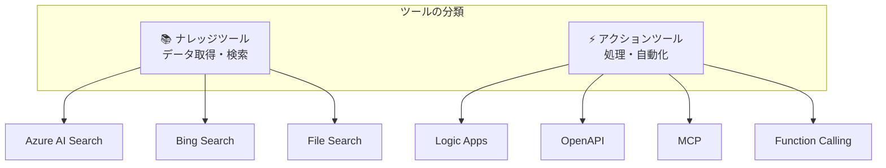

### 組み込みツール一覧


かなりの数があるのと、今後も増えていく予定なので、主要なものをピックアップして紹介します。
詳細は公式ドキュメントをご覧ください。
https://learn.microsoft.com/ja-jp/azure/ai-foundry/agents/concepts/tool-catalog?view=foundry

| ツール | 説明 |
|-------|------|
| **Fabric Data Agent** | Fabricデータにアクセスする |
| **SharePoint** | SharePointのデータにアクセスする |
| **ブラウザー自動化** | ブラウザ操作を自動化する |
| **Azure AI Search** | 既存のインデックスでエージェントをグラウンディング |
| **Bing Search** | インターネットからリアルタイム情報を取得 |
| **Code Interpreter** | Pythonコードをサンドボックスで実行 |
| **File Search** | アップロードしたドキュメントを検索 |
| **Browser Automation** | 自然言語でブラウザタスクを実行 |
| **Deep Research** | o3-deep-research + Bing による高度な調査 |
| **Logic Apps** | 1,400以上のコネクタでワークフロー自動化 |
| **Image Generation** | 会話中に画像生成 |

### カスタムツール

| ツール | 説明 |
|-------|------|
| **MCP** | Model Context Protocolエンドポイント接続 |
| **OpenAPI** | OpenAPI 3.0仕様で外部API接続 |
| **Agent2Agent** | ほかのエージェントとA2Aプロトコルで連携 |

### ツールの3つのカテゴリ

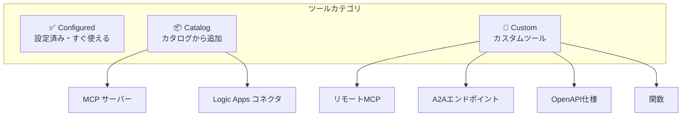

### ツールの接続

画面右上の「ツールを接続」ボタンから、新しいツールを追加できます。Bing SearchなどのAPIキーが必要なツールは、Foundryの接続設定で認証情報を管理します。


---

# ナレッジ 📚

### 概要

**ナレッジ**（**Foundry IQ**）は、エージェントのツールの中でも特に重要な「ナレッジ取得」機能を提供します。企業データや独自ドキュメントを接続し、**グラウンディング**（根拠に基づいた回答）を実現します。

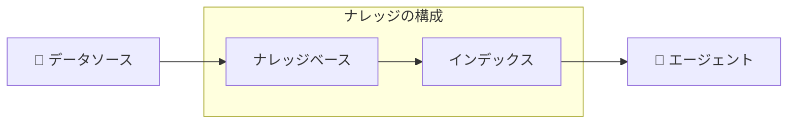

### ナレッジベースとインデックス

| 概念 | 説明 |
|-----|------|
| **ナレッジベース** | 複数のデータソースを統合したナレッジの集合 |
| **インデックス** | 検索可能なベクターインデックス（Azure AI Search） |

### Azure AI Searchとの連携

ナレッジ機能を使用するには、Azure AI Searchリソースを接続する必要があります

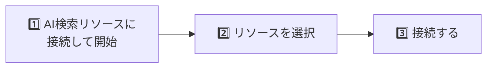

※個人的には、AI Searchの金額感を可用性を加味すると、ベクトル検索できるCosmosDBで済むのであればCosmosDBでも十分なシーンもあると思っています。

### ベクターストアの仕組み

ファイルをアップロードすると、システムが自動的に以下の処理を実施してくれます。

1. **チャンキング**: ドキュメントを管理可能な断片に分割
2. **ベクター化**: 各チャンクを高次元ベクターに変換
3. **インデックス作成**: 最適化された検索インデックスに保存
4. **関連付け**: ベクターと元コンテンツを紐付け

### セットアップオプション

| オプション | ストレージ | 特徴 |
|----------|----------|------|
| **Basic** | Microsoft管理 | 簡単セットアップ |
| **Standard** | 独自のAzureリソース | データ主権・コンプライアンス制御 |

:::message
**Standard セットアップ**を選択すると、ファイルは接続したAzure Blob Storageに保存され、ベクターストアは接続したAzure AI Searchリソースに作成されます。
:::

---

# エージェント 🤖

### 概要

**エージェント**ページは、プロンプト（モデル＋命令）とツールを組み合わせて、AIエージェントを構築・管理できます。

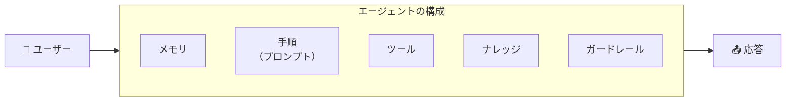

### 主な機能

| 機能 | 説明 |
|-----|------|
| **エージェントの作成** | モデル、命令、ツールを設定してエージェントを作成 |
| **プレイグラウンド** | 作成したエージェントをテスト・デバッグ |
| **公開** | エージェントを本番環境にデプロイ |

### 3種類のエージェント

Microsoft Foundryでは、3種類のエージェントを作成できます。
エージェントページで作成できるのは、**プロンプトベース**のエージェントです。

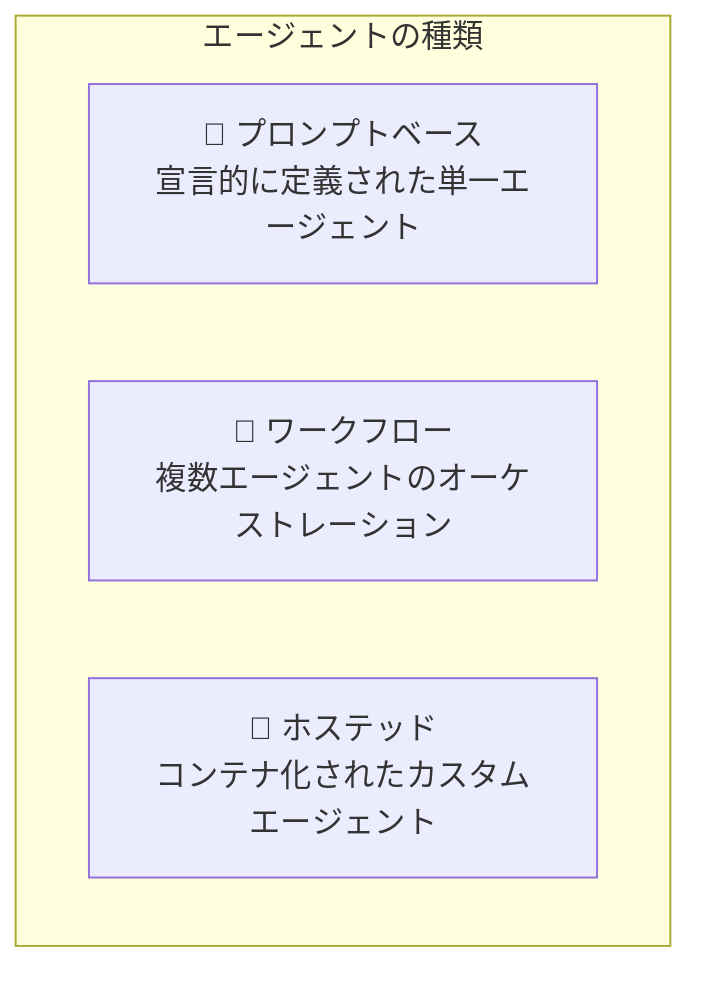

| 種類 | 特徴 | 編集方法 |
|-----|------|---------|
| **プロンプトベース** | モデル設定、命令、ツール、プロンプトで動作を定義 | Agents Playground |
| **ワークフロー** | アクションのシーケンスや複数エージェントの連携 | Workflow UI<br>次のセクションで解説 |
| **ホステッド** | コードで構築したコンテナ化エージェント | SDK/CLI |

### エージェント作成の流れ


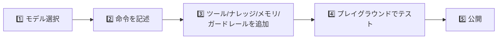

### 必要なロール

エージェントを作成・編集するには、プロジェクトスコープで**Azure AI User**ロールが必要です。

```
最小権限: agents/*/read, agents/*/action, agents/*/delete
```

### ツール呼び出しの制御

プレイグランドで、**いつツールを使用するか**を設定できます。


| 値 | 動作 |
|----|------|
| `いつ使用するかをモデルに選択させる` | ツールを使用するかどうかをモデルが判断<br>エージェントへの依頼によってはツールが呼び出されない場合がある |
| `常に使用する` | 必ずツールを呼び出す |

### トレース

Application Insightsと連携して、エージェントの呼び出し履歴をトレースできます。


以下のように、エージェントの各ステップ（LLMによる推論、ツール呼び出しなど）を詳細に確認できます。
以下の場合は、
- ユーザメッセージの受信
- Instructions（指示）の読み込み
- Web検索ツール呼び出し
- 回答生成
が実行されたことがわかります。


### モニター

モニタータブでは以下の内容を確認できます。
- エージェントの使用状況（金額、トークン使用料）
- エージェントの評価　※評価の設定や、アラートの事前設定が必要
- レッドチーミング評価（エージェントの安全性とセキュリティの評価）


### プレビューエージェント

プレビューでは、事前用意されたチャットUIでエージェントのふるまいを確認できます。


もしこのUIをベースにアプリケーションを構築したい場合は、GitHubでソースコードが公開されています。
.envに必要な設定をすれば、GitHubのCodeSpacesですぐに起動するようになっています。
https://github.com/microsoft-foundry/foundry-agent-webapp

### 発行

エージェントを発行すると、そのエージェントは専用のエンドポイントとIDを持ちます。Microsoftならではとして、EntraID のアプリケーション配下にIDが作成されます。
また、Microsoft365CopilotやMicrosoftTeamsからも呼び出せるようになります。


---

## ワークフロー 🔀

### 概要

**ワークフロー**は、複数のエージェントとビジネスロジックを**ビジュアルビルダー**で連携させる機能です。ノーコード/ローコードで複雑なAIワークフローを構築できます。
Copilot Studio Fullに似てますね。

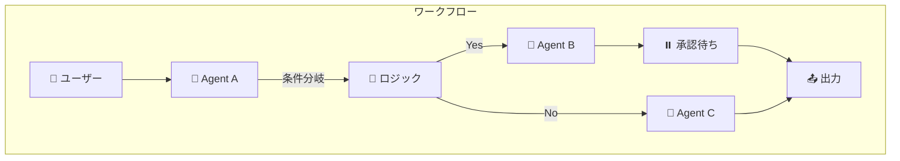

実際の画面はこちらです。


裏側はAgentFrameworkのワークフローとなっており、ワークフローはYaml形式で表現されています。


### ワークフロー作成オプション

画面右上の「作成」ボタンから、以下のテンプレートを選択できます

| テンプレート | 説明 |
|------------|------|
| **空白のワークフロー** | ゼロから自由に構築 |
| **順次（Sequential）** | 定義された順序でエージェントを実行 |
| **ヒューマンインループ** | ユーザーの承認や入力を待機 |
| **グループチャット** | 複数エージェント間で動的に制御を渡す |

### 3つのオーケストレーションパターン

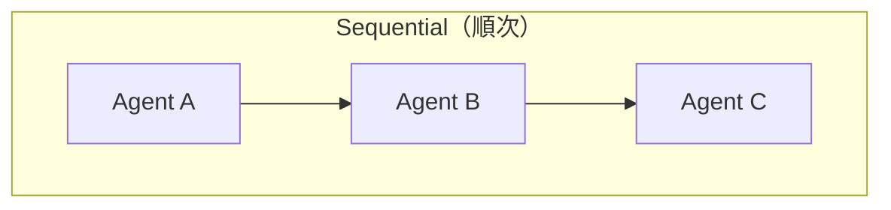

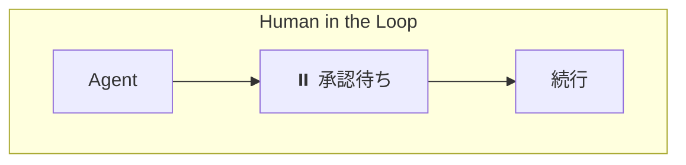

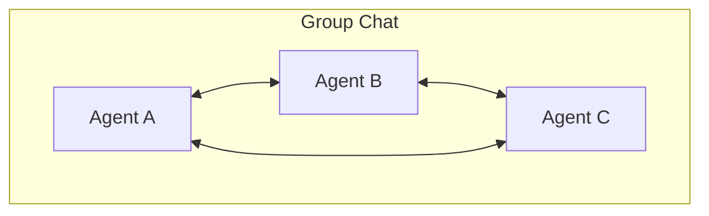

### ワークフローのノード

ワークフローは**ノード**で構成されます

| ノード | 機能 |
|-------|------|
| **エージェントノード** | エージェントを呼び出す |
| **ロジックノード** | if/else、go to、each |
| **データ変換ノード** | 変数の設定、値の解析 |
| **基本チャットノード** | メッセージ送信、質問 |

---

# データ 📊

### 概要

**データ**ページでは、エージェントや微調整で使用するデータセットの管理、ファイルのアップロード、合成データの生成を行います。

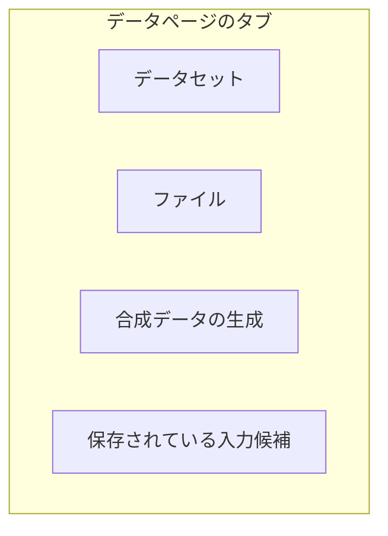

### タブの機能

| タブ | 説明 |
|-----|------|
| **データセット** | 評価や微調整用のデータセットを管理 |
| **ファイル** | エージェントやモデルで使用するファイルをアップロード |
| **合成データの生成** | 微調整用の合成データを自動生成 |
| **保存されている入力候補** | プレイグラウンドで使用した入力を保存 |

### 合成データ生成（プレビュー）

実データが不足している場合、合成データを生成して微調整に活用できます

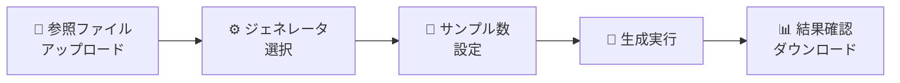

### ジェネレータの種類

| ジェネレータ | 用途 | 入力ファイル |
|------------|------|------------|
| **Simple Q&A** | ドキュメントからQ&Aペアを生成 | PDF, Markdown, テキスト |
| **Tool use** | API仕様からツール呼び出しデータを生成 | OpenAPI Specification (JSON) |

### 合成データのベストプラクティス

- **高品質な参照ファイルを使用**: 生成データの品質は参照ファイルに依存
- **小さいバッチから開始**: まず少量生成して品質を確認
- **実データと組み合わせ**: 合成データと実データを混合して学習
- **ハイパーパラメータを実験**: 学習率を低めに設定するなど調整

:::message
**サポートリージョン**: eastus2, eastus, westus, northcentralus, southcentralus, swedencentral, germanywestcentral, francecentral, uksouth, uaenorth, japaneast, australiaeast
:::

---

# 評価 📈

### 概要

**評価**機能は、構築したエージェントの品質と安全性を業界標準のメトリクスで測定し、最適なバージョンを選択するための機能です。

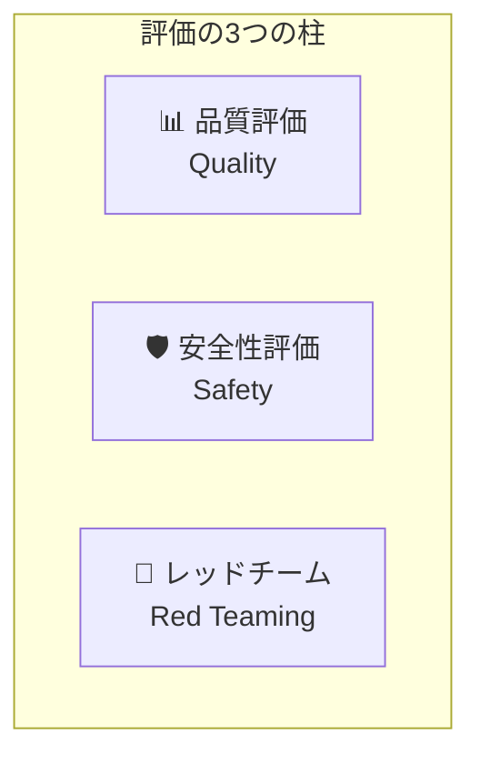

### 主要な評価メトリクス

品質メトリクスには4つの主要な指標があります。

| メトリクス | 説明 |
|----------|------|
| **Groundedness** | 応答が提供されたコンテキストに基づいているか |
| **Relevance** | 応答がクエリに関連しているか |
| **Coherence** | 応答が論理的に一貫しているか |
| **Fluency** | 応答が流暢で自然か |

安全性メトリクスには以下の指標があります。

| メトリクス | 説明 |
|----------|------|
| **Hate** | 憎悪表現の検出 |
| **Sexual** | 性的コンテンツの検出 |
| **Self-harm** | 自傷行為に関するコンテンツ |
| **Violence** | 暴力的コンテンツの検出 |

エージェント固有のメトリクスは以下の通りです。

| メトリクス | 説明 |
|----------|------|
| **Intent Resolution** | ユーザーの意図を正しく認識しているか |
| **Tool Call Accuracy** | 適切なツールを呼び出しているか |
| **Task Adherence** | タスク指示に従っているか |

### AI Red Teaming Agent

**AI Red Teaming Agent**は、Microsoft の PyRIT フレームワークを活用し、AIシステムの安全性リスクを自動的に検出します
- **Attack Success Rate (ASR)**: 攻撃成功率を算出
- **複数の攻撃戦略**: 文字反転、ジェイルブレイクなど
- **継続的な監視**: 本番環境でのスケジュール実行

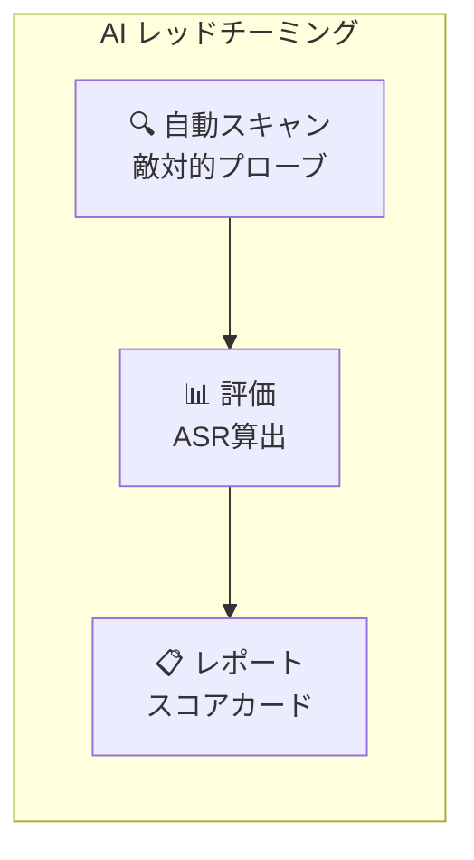

:::message alert
**推奨**: AI Red Teaming Agentは、人間の専門家によるレビューと組み合わせて使用してください。自動テストだけでは検出できないリスクもあります。
:::

---

# ガードレール 🛡️

### 概要

**ガードレール**は、エージェントの「プロンプト」に安全性の制約を追加する機能です。AIアプリケーションのリスクを軽減し、安全で信頼性の高いユーザー体験を提供します。

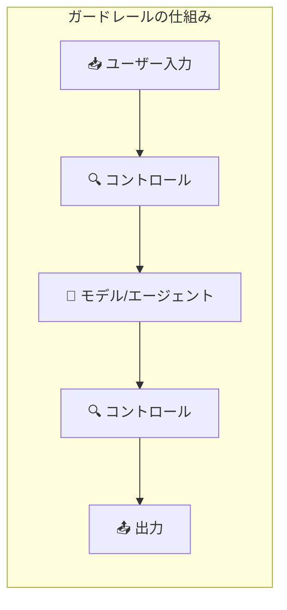

### ガードレールタブの構成

| タブ | 説明 |
|-----|------|
| **ガードレール** | カスタムガードレールの作成・管理 |
| **ブロックリスト** | 特定のコンテンツをブロックするリスト |

### デフォルトガードレール

- **Microsoft.Default**: 基本的な安全性コントロール
- **Microsoft.DefaultV2**: 最新の安全性コントロール（モデルに自動適用）

### 介入ポイント

ガードレールは4つのポイントでリスクを検出します

```mermaid
flowchart LR
    U["👤 User Input<br/>ユーザー入力"] --> T1["🔧 Tool Call<br/>ツール呼び出し"]
    T1 --> T2["📥 Tool Response<br/>ツール応答"]
    T2 --> O["📤 Output<br/>出力"]
    
    style U fill:#e1f5fe
    style T1 fill:#fff3e0
    style T2 fill:#fff3e0
    style O fill:#e8f5e9
```

| 介入ポイント | モデル | エージェント |
|------------|-------|------------|
| **User Input** | ✅ | ✅ |
| **Tool Call** | ❌ | ✅ |
| **Tool Response** | ❌ | ✅ |
| **Output** | ✅ | ✅ |

### 検出可能なリスク

| リスク | モデル | エージェント |
|-------|-------|------------|
| Hate（憎悪） | ✅ | ✅ |
| Sexual（性的） | ✅ | ✅ |
| Self-harm（自傷） | ✅ | ✅ |
| Violence（暴力） | ✅ | ✅ |
| User prompt attacks | ✅ | ✅ |
| Indirect attacks | ✅ | ✅ |
| Protected material (code/text) | ✅ | ✅ |
| PII（個人情報）| ✅ | ✅ |

### アクションの種類

| アクション | 説明 | モデル | エージェント |
|----------|------|-------|------------|
| **Annotate** | リスクをアノテーション | ✅ | ❌ |
| **Annotate and Block** | アノテーション＆ブロック | ✅ | ✅ |

### ガードレールの継承と上書き

```mermaid
flowchart TB
    M["モデルのガードレール<br/>Violence: High"] --> A["エージェントのガードレール<br/>Violence: Low"]
    
    A --> R["結果: Violence は Low で検出<br/>（エージェントが上書き）"]
```

:::message alert
**重要**: エージェントに割り当てられたガードレールは、基盤モデルのガードレールを**完全に上書き**します。エージェント用のガードレールが設定されていない介入ポイントは、スキャンされません。
:::

### カスタムガードレールの作成手順

```mermaid
flowchart LR
    S1["1️⃣ 作成ボタン"] --> S2["2️⃣ コントロール追加"]
    S2 --> S3["3️⃣ 介入ポイント設定"]
    S3 --> S4["4️⃣ モデル/エージェント割り当て"]
    S4 --> S5["5️⃣ 名前付けて保存"]
```

---

## まとめ 📝

2025年のMicrosoft Ingite でAI FoundryからMicrosoft Foundryとリブランディングしたサービスを解説しました。

最後まで読んでいただきありがとうございました！質問やフィードバックがあれば、コメントでお知らせください 🙌