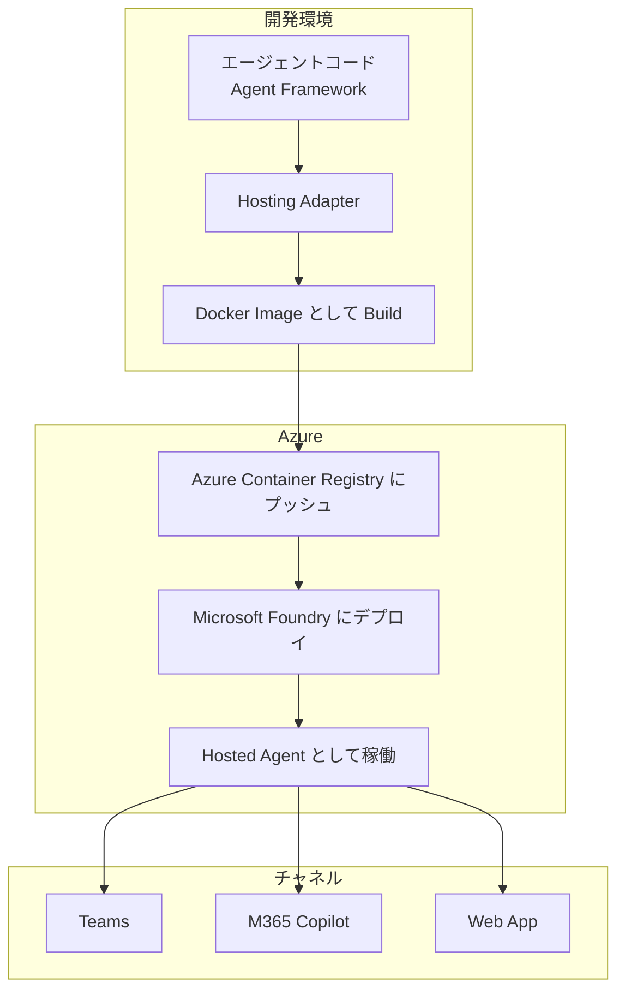
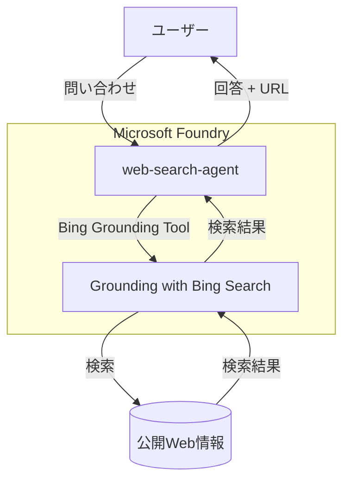
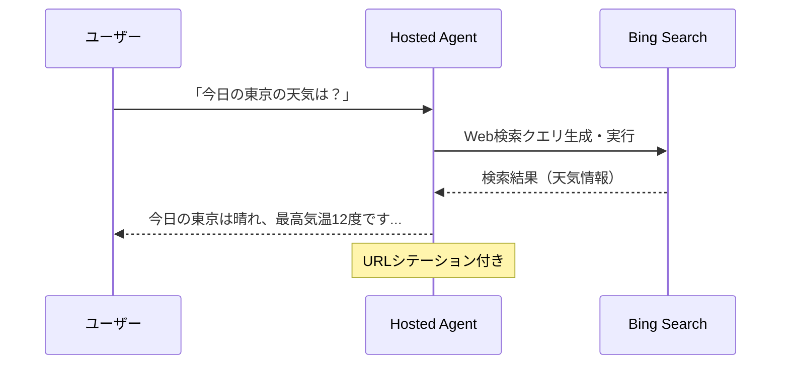

# はじめに

前回、**Microsoft Foundry AIエージェント完全ガイド** の記事を書きました。
https://zenn.dev/nomhiro/articles/microsoft-foundry-agent-poc-20260125
この記事では、Microsoft Foundry の9つの主要機能を解説しました。その中で「エージェント = プロンプト × ツール」という概念を紹介しました。
今回は **Hosted Agent**に焦点を当てて解説します。

**Hosted Agent を一言で言うと、**
> 自分で書いたコードをコンテナ化し、Microsoft のマネージドインフラ上でエージェントとして実行できる仕組み

です。

本記事では、Hosted Agentに焦点を当てるので、簡単なエージェント（Foundry 組み込みの Bing 検索ツールを使った 検索アシスタント） を用意して、Hosted Agent をコードとともに解説します！

### 参考情報

::: message alert
本記事の内容は **2026年2月1日時点** の情報に基づいています。Foundry は急速に進化しているため、最新情報は公式ドキュメントを参照してください。
:::

- [What are hosted agents?](https://learn.microsoft.com/en-us/azure/ai-foundry/agents/concepts/hosted-agents?view=foundry)
- [Work with Hosted Agents in VS Code](https://learn.microsoft.com/en-us/azure/ai-foundry/agents/how-to/vs-code-agents-workflow-pro-code?view=foundry)
- [Agent Framework Documentation](https://learn.microsoft.com/en-us/agent-framework/)d
- [Foundry Samples (GitHub)](https://github.com/azure-ai-foundry/foundry-samples)
- [LangGraph Travel Agent Sample](https://github.com/MSFT-Innovation-Hub-India/LangGraph-Foundry-HostedAgent-TravelAgent)


---

# Hosted Agent の基本概念

**そもそも、これを使う対象者はどういう方で、どういうシーンで使うのでしょう？**
以下のように整理してますが、複雑なエージェントになるのでコーディングしたほうが楽だ！　というエンジニアに向いてると思います。
また、M365 Copilot や Teams にエージェントを公開できるのもよいですね。

| 対象者 | シーン |
|--------|--------|
| **既存のエージェントコードを再利用したい開発者** | LangGraph、Microsoft Agent Framework などで構築済みのエージェントをFoundryで運用したい |
| **複雑なワークフローを実装したい開発者**  | 条件分岐、並列処理、マルチエージェント連携など、GUIでは表現しきれないロジックが必要 |
| **インフラ管理から解放されたい開発者** | コンテナ化、スケーリング、監視、セキュリティをマネージドサービスに任せたい |
| **エンタープライズ統合が必要なチーム** | Teams、M365 Copilot への公開、Application Insights 連携が前提 |

対応できるシーンは多岐に渡ります。端的に言うと、AgentFrameworkでできることがほぼ全て対応可能です。

| シーン | 具体例 |
|--------|--------|
| **カスタムオーケストレーション** | 複数のAIモデルを組み合わせた高度な推論フロー |
| **外部API連携** | 社内システム、データベース、サードパーティAPIとの統合 |
| **マルチエージェント構成** | Researcher → Writer → Reviewer のような連携パイプライン |
| **Human-in-the-loop** | 承認フローや人間の介入が必要なプロセス |
| **既存コードの移行** | オンプレミスやVMで動かしていたエージェントのクラウド移行 |


### プロンプトベースエージェントとの違い

前回紹介したエージェントは「プロンプトベース」でした。GUIでプロンプトを設定し、Foundry が提供するツールを組み合わせる方式です。

| 観点 | プロンプトベース | Hosted Agent |
|------|----------------|--------------|
| 構築方法 | GUIでプロンプト設定 | コードでロジック実装 |
| デプロイ | Foundry内で自動 | コンテナイメージを手動デプロイ |
| 柔軟性 | Foundry提供ツールに限定 | フレームワーク自由選択 |
| ユースケース | シンプルなQ&A | 複雑なワークフロー |
| スケーラビリティ | Foundry管理 | レプリカ数を指定可能 |

Microsoft Foundry のエージェント一覧画面の**種類列**で **Hosted** と表示されているものが Hosted Agent です。
**prompt** と表示されているものがプロンプトベースエージェントです。


### アーキテクチャ

Hosted Agent は以下の流れで開発します。



### 対応フレームワーク

Hosted Agent は複数のフレームワークに対応しています

| フレームワーク | Python | C# |
|---------------|--------|-----|
| **Microsoft Agent Framework** | ✅ | ✅ |
| LangGraph | ✅ | ❌ |
| カスタムコード | ✅ | ✅ |

本記事では **Microsoft Agent Framework**（Python）を使用します。

### Hosting Adapter の役割

Hosting Adapter は、エージェントフレームワークと Foundry の間を橋渡しするコンポーネントです

- **プロトコル変換**: Foundry の Request/Response 形式とフレームワークのネイティブ形式を相互変換
- **会話管理**: メッセージのシリアライズ、ストリーミングイベント生成
- **可観測性**: OpenTelemetry によるトレース、メトリクス、ログの出力
- **ローカルテスト**: `localhost:8088` で HTTP サーバーを起動

---

### コストの考え方

Hosted Agent と プロンプトベースエージェントでは、課金の仕組みが異なります。

#### プロンプトベースエージェントのコスト

| コスト項目 | 説明 |
|-----------|------|
| **推論コスト** | 使用するベースモデル（gpt-4o等）の入力/出力トークン数に応じた課金 |
| **Code Interpreter** | セッション単位で課金（同一スレッドで1時間以内なら1セッション） |
| **File Search** | ベクトルストレージの使用量に応じた課金 |

```
総コスト = モデル推論 + ツール使用料
```

#### Hosted Agent のコスト

| コスト項目 | 説明 |
|-----------|------|
| **ホスティング基盤** | マネージドコンテナ実行環境（CPU/メモリ×レプリカ数×稼働時間） |
| **推論コスト** | モデル呼び出しの入力/出力トークン |
| **ACR** | コンテナイメージの保存料金 |
| **Application Insights** | ログ・トレースの保存料金（オプション） |

```
総コスト = ホスティング基盤 + モデル推論 + 関連サービス
```

#### コスト比較の視点

| 観点 | プロンプトベース | Hosted Agent |
|------|----------------|--------------|
| **初期コスト** | なし | ACR、イメージビルド |
| **実行コスト** | リクエスト時のみ | 稼働中は常時（レプリカ分） |
| **スケール** | 自動（課金も自動増加） | レプリカ数で制御可能 |
| **適したユースケース** | 散発的なリクエスト | 常時稼働・高頻度利用 |

:::message
**プレビュー期間の特典**
- Hosted Agent のホスティング基盤は **2026年2月1日以降**に課金開始予定
- プレビュー期間中は **ホスティング基盤のコストは無料**
- モデル推論コストは通常通り発生
:::

詳細な価格は [Foundry 価格ページ](https://azure.microsoft.com/pricing/details/ai-foundry/) を参照してください。

---

# 実践シナリオ：Web 検索アシスタント

Foundry 組み込みの **Grounding with Bing Search** ツールを使った、シンプルな Hosted Agent を構築します。

**特徴**
- 外部サーバー不要（Bing 検索は Foundry のマネージドサービス）
- リアルタイムの Web 情報を取得可能
- Hosted Agent の概念理解に集中できる構成

### 構成



### ツール呼び出しフロー



---

## ステップバイステップ実装

### Step 1: 前提条件の準備

**必要なリソース**
- **Microsoft Foundry プロジェクト**
- **Azure Container Registry**
- **モデルデプロイメント**（gpt-5.1）
- **Grounding with Bing Search** リソース（Foundry 接続済み）

**RBAC設定**

| 対象リソース | 必要なロール |
|-------------|-------------|
| Foundry アカウント | Azure AI Owner |
| Foundry プロジェクト | Azure AI User |
| Container Registry | AcrPull |

### Step 2: Bing Grounding 接続の作成

1. Azure Portal で「Grounding with Bing Search」リソースを作成
    
2. Foundry Portal → Connected resources → 接続を追加
3. 「Grounding with Bing Search」を選択してリソースを接続
    
4. 接続IDをメモ（環境変数で使用）

```
接続ID形式:
/subscriptions/{subscriptionID}/resourceGroups/{resourceGroupName}/providers/Microsoft.CognitiveServices/accounts/{accountName}/projects/{projectName}/connections/{connectionName}
```

### Step 3: Hosted Agent プロジェクト作成

```bash
uv init web-search-agent
cd web-search-agent
uv add azure-ai-projects azure-identity python-dotenv
```

### Step 4: エージェントコードの作成

```python
# agent.py - Web検索アシスタント（Bing Grounding）
from azure.ai.projects import AIProjectClient
from azure.ai.projects.models import (
    PromptAgentDefinition,
    BingGroundingAgentTool,
    BingGroundingSearchToolParameters,
    BingGroundingSearchConfiguration,
)
from azure.identity import DefaultAzureCredential

def create_agent(client: AIProjectClient, connection_id: str):
    """Bing Groundingツールを持つエージェントを作成"""

    bing_tool = BingGroundingAgentTool(
        bing_grounding=BingGroundingSearchToolParameters(
            search_configurations=[
                BingGroundingSearchConfiguration(
                    project_connection_id=connection_id
                )
            ]
        )
    )

    agent = client.agents.create_version(
        agent_name="WebSearchAgent",
        definition=PromptAgentDefinition(
            model="gpt-4o",
            instructions="""
            あなたはWeb検索アシスタントです。
            ユーザーの質問に対し、Bing検索を使って
            最新の情報を取得して回答します。
            回答には必ず情報源のURLを含めてください。
            """,
            tools=[bing_tool],
        ),
    )
    return agent
```

**Hosting Adapter でラップ（container.py）:**

```python
from azure.ai.agentserver.agentframework import from_agent_framework
from agent import create_agent

if __name__ == "__main__":
    agent = create_agent()
    # localhost:8088 でHTTPサーバーとして公開
    from_agent_framework(agent).run()
```

### Step 5: ローカルテスト

```bash
cd web-search-agent
uv run python src/container.py
```

REST Client でテスト:

```http
POST http://localhost:8088/responses
Content-Type: application/json

{
    "input": {
        "messages": [
            {"role": "user", "content": "今日の東京の天気は？"}
        ]
    }
}
```

**期待されるレスポンス:**
- 天気情報とともに URL シテーション（参照元）が含まれる

### Step 6: コンテナ化とACRプッシュ

```bash
# Docker イメージビルド
docker build -t web-search-agent:v1 .

# ACRへプッシュ
az acr login --name myregistry
docker tag web-search-agent:v1 myregistry.azurecr.io/web-search-agent:v1
docker push myregistry.azurecr.io/web-search-agent:v1
```

### Step 7: Hosted Agent の作成

**VS Code 拡張機能（推奨）**からデプロイ

1. `Ctrl+Shift+P` → `Microsoft Foundry: Deploy Hosted Agent`
2. ターゲットワークスペースを選択
3. `container.py` を指定

**または Python SDK**でデプロイ

```python
from azure.ai.projects import AIProjectClient
from azure.ai.projects.models import (
    ImageBasedHostedAgentDefinition,
    ProtocolVersionRecord,
    AgentProtocol,
)
from azure.identity import DefaultAzureCredential

client = AIProjectClient(
    endpoint=os.environ["AZURE_AI_PROJECT_ENDPOINT"],
    credential=DefaultAzureCredential()
)

agent = client.agents.create_version(
    agent_name="web-search-agent",
    definition=ImageBasedHostedAgentDefinition(
        container_protocol_versions=[
            ProtocolVersionRecord(protocol=AgentProtocol.RESPONSES, version="v1")
        ],
        cpu="1",
        memory="2Gi",
        image="myregistry.azurecr.io/web-search-agent:v1",
        environment_variables={
            "AZURE_AI_PROJECT_ENDPOINT": os.environ["AZURE_AI_PROJECT_ENDPOINT"],
            "AZURE_AI_MODEL_DEPLOYMENT_NAME": "gpt-4o",
            "BING_PROJECT_CONNECTION_ID": os.environ["BING_PROJECT_CONNECTION_ID"]
        }
    )
)
```

デプロイすると、Microsof Foundryに Hosted Agent が作成されます。
デプロイ後は停止済みになっていますね。


---

## 管理と運用

### ライフサイクル管理
以下のコマンドで Hosted Agent の開始、停止、更新が可能です。

```bash
# 開始
az cognitiveservices agent start \
  --account-name myAccount \
  --project-name myProject \
  --name web-search-agent \
  --agent-version 1

# 停止
az cognitiveservices agent stop \
  --account-name myAccount \
  --project-name myProject \
  --name web-search-agent \
  --agent-version 1

# 更新（新バージョン作成）
az cognitiveservices agent update \
  --account-name myAccount \
  --project-name myProject \
  --name web-search-agent \
  --agent-version 1 \
  --min-replicas 1 \
  --max-replicas 3
```

ほかにも Microsoft Foundry の VSCode 拡張機能からも操作可能です。こちらはGUIで分かりやすいですね。


開始すると、Microsoft Foundry のブラウザからエージェントの動作確認ができます。

---

## まとめ

本記事では、Microsoft Foundry の **Hosted Agent** を使ってWeb検索アシスタントを構築しました。
Azureでエージェントを構築する手段は、本記事で紹介した Hosted Agent 以外にも、Durable Agent の選択肢もあります。AgentFrameworkでは実現できない、より**複雑でユースケースに特化したエージェントを構築したい場合は、Durable Agent の検討もおすすめ**します。