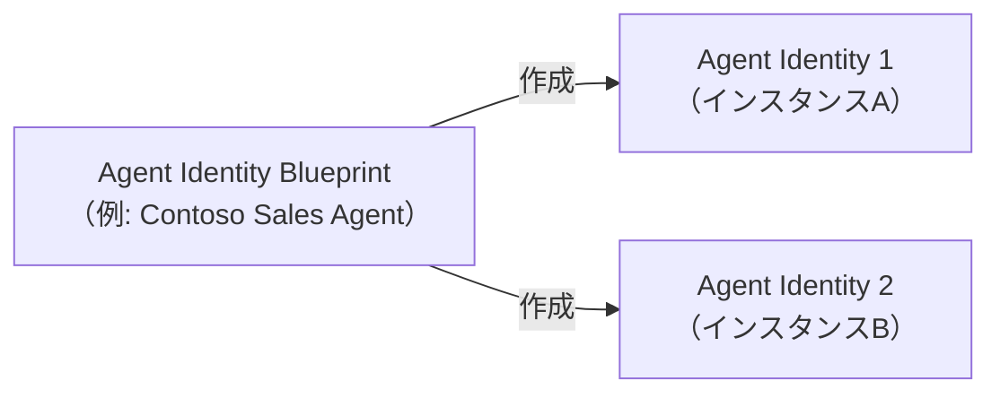
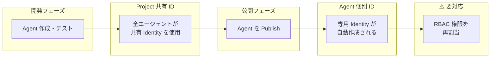
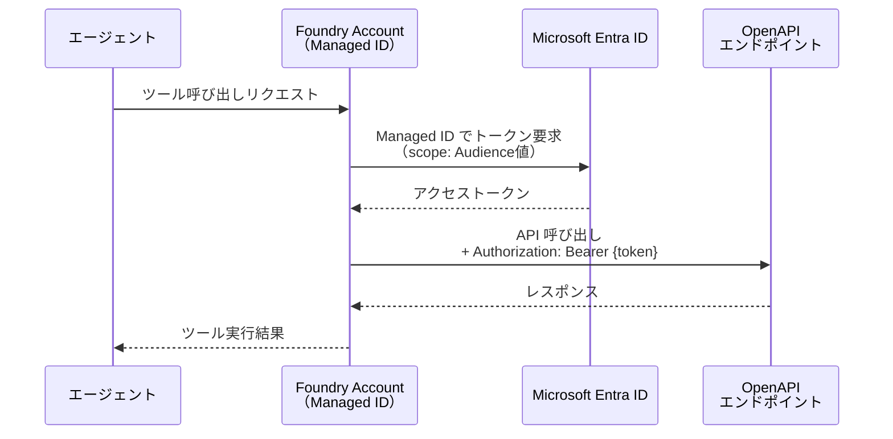
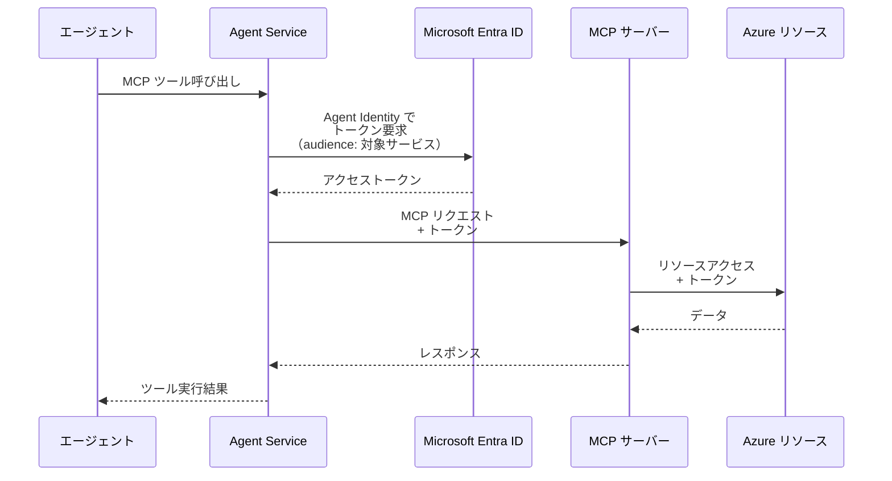
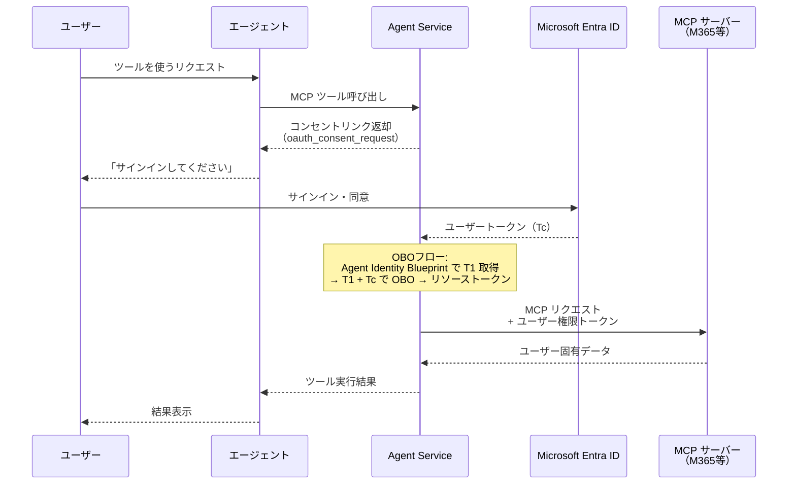
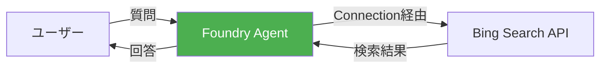
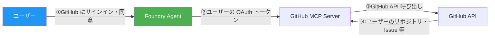

# はじめに

前回・前々回の記事では、Microsoft Foundry の **プロンプトベースエージェント** と **Hosted Agent** をそれぞれ紹介しました。

https://zenn.dev/nomhiro/articles/microsoft-foundry-agent-poc-20260125
https://zenn.dev/nomhiro/articles/microsoft-foundry-hosted-agent

エージェントを構築していくと、次に気になるのが **「ツールを呼び出すとき、認証・認可はどう動いているのか？」** という点です。OpenAPI ツールで外部 API を叩く場合、MCP サーバーに接続する場合、他のエージェントを呼び出す（A2A）場合 ─ それぞれ認証の仕組みは異なるのでしょうか？

先に結論を述べると、
::: message
Foundry のツール認証は、**開発中は Project 共有 ID、公開後は Agent 固有 ID** に自動切替される設計です。さらに、ツール種別ごとに利用可能な認証方式が異なります。
:::

私自身が認証回りの知識が豊富ではないため、勉強のために調べました。本記事では、この内容を掘り下げて解説します！

また、記事の後半では、**無人実行（Agent Identity）** と **ユーザー代理（OAuth Passthrough）** の2パターンで、実際にツールを呼び出して認証フローの違いを体験してみます。

:::message alert
本記事の内容は **2026年2月15日時点** の情報に基づいています。Microsoft Foundry はプレビュー機能を含むため、今後仕様が変更される可能性があります。
:::

### 参考情報

- [Agent identity concepts in Microsoft Foundry](https://learn.microsoft.com/en-us/azure/ai-foundry/agents/concepts/agent-identity?view=foundry)
- [Authentication and authorization in Microsoft Foundry](https://learn.microsoft.com/en-us/azure/ai-foundry/concepts/authentication-authorization-foundry?view=foundry)
- [Connect agents to OpenAPI tools](https://learn.microsoft.com/en-us/azure/ai-foundry/agents/how-to/tools/openapi?view=foundry)
- [Agent2Agent (A2A) authentication](https://learn.microsoft.com/en-us/azure/ai-foundry/agents/concepts/agent-to-agent-authentication?view=foundry)
- [Publish and share agents in Microsoft Foundry](https://learn.microsoft.com/en-us/azure/ai-foundry/agents/how-to/publish-agent?view=foundry)
- [Governing Agent Identities (Preview) - Microsoft Entra](https://learn.microsoft.com/en-us/entra/id-governance/agent-id-governance-overview)
- [Microsoft Foundry のAIエージェント機能を触ってみた](https://zenn.dev/nomhiro/articles/microsoft-foundry-agent-poc-20260125)
- [Microsoft Foundry の Hosted Agent を試す](https://zenn.dev/nomhiro/articles/microsoft-foundry-hosted-agent)

---

# 全体アーキテクチャ

まず、Foundry のリソース階層と Agent Identity の俯瞰図です。このブログでお伝えすることをまとめるとこうなります。ビジーな絵になってしまいすみません。。。


**主要コンポーネントの役割**

| コンポーネント | 役割 |
|---------------|------|
| **Foundry Account** | リソースの親。システム割当 Managed Identity を保持 |
| **Foundry Project** | 開発の単位。共有 Agent Identity と Connection を保持 |
| **Agent（未公開）** | プロジェクトの共有 ID で認証 |
| **Agent Application（公開後）** | 個別の Agent Identity で認証 |
| **Agent Identity Blueprint** | Agent Identity のテンプレート。ガバナンスとポリシー適用の単位 |
| **Connection** | 認証情報（キー、トークン、認証方式）を格納する Project 単位のリソース |

---

# 🔑 Agent Identity とは

Microsoft Foundry は、従来の ID タイプ（ユーザー、サービスプリンシパル、マネージド ID）とは **別の新しい ID 体系** として **Agent Identity** を導入しました。これは Microsoft Entra ID 上の **AI エージェント専用サービスプリンシパル** です。

## 従来の ID タイプとの比較

| ID タイプ | 用途 | Foundry での役割 |
|----------|------|-----------------|
| **User Principal** | 人間のユーザー | Portal / SDK を使う開発者 |
| **Service Principal** | アプリケーション | CI/CD パイプライン等 |
| **Managed Identity** | Azure リソース間認証 | Foundry Account → OpenAPI ツール認証 |
| **Agent Identity** | AI エージェント専用 | エージェント → MCP / A2A ツール認証 |

このあたりのAgent Identity 及び Agent 365 については、sakemi-sanのスライド資料をぜひ参照ください。
https://www.docswell.com/s/skmkzyk/ZEYGRR-getting-to-know-microsoft-agent-365

セキュリティから見た Agent Identity の役割は以下だと思っています。
- **AIエージェントの操作を人間やアプリの操作と区別** できる
- エージェント単位で **最小権限アクセス** を設定可能
  - エージェントが **セキュリティクリティカルなロール** にアクセスすることを防止

## Agent Identity Blueprint

Agent Identity Blueprint は、Agent Identity の **クラス（テンプレート）** に相当するオブジェクトです。



Blueprint の役割はこれらです。

| 役割 | 説明 |
|------|------|
| **型分類** | エージェントのカテゴリを定義。Conditional Access ポリシーを一括適用可能 |
| **ID 作成権限** | OAuth 資格情報を保持し、Agent Identity の CRUD を実行 |
| **ランタイム認証** | ホスティングサービスが Blueprint の資格情報でトークンを取得 |

## Entra Admin Center での管理

Microsoft Entra 管理センターには **Agent Identity 専用タブ** が追加されています。テナント内の全エージェント（Foundry、Copilot Studio、Teams 等）を一元管理でき、以下のセキュリティ制御が可能です。

- **Conditional Access**: エージェント ID へのアクセスポリシー適用
- **Identity Protection**: 脅威の監視と保護
- **Network Access**: ネットワークベースのアクセス制御
- **Governance**: 有効期限、所有者、スポンサーの管理


---

# 🔄 Agent ID のライフサイクル ─ Project 共有 vs Agent 個別

このセクションが、このブログで整理したかったことです。
Agent Identity は、**エージェントの公開状態によって自動的に切り替わります**。



## 開発中: 共有プロジェクト ID

Foundry Project で最初のエージェントを作成すると、システムが **デフォルトの Agent Identity Blueprint と Agent Identity** を自動プロビジョニングします。同じプロジェクト内の **全ての未公開エージェントが、この共有 ID を使用** します。

**メリット**

| 観点 | 説明 |
|------|------|
| 管理の簡素化 | 1つの ID に権限を設定すれば、プロジェクト内の全エージェントに適用 |
| ID スプロール防止 | 試行錯誤中に不要な ID が増殖しない |
| 開発者の自律性 | 共有 ID が設定済みなら、各開発者が個別に認証設定する必要なし |

**共有 ID の確認方法**
Azure Portal → Foundry Project → Overview → JSON View

最新の API バージョンを選択


## 公開後: 個別 Agent ID

エージェントを **Publish（公開）** すると、そのエージェント専用の **Agent Identity Blueprint と Agent Identity が自動作成** されます。

**個別 ID が必要なシナリオ**

- 結合テスト段階のエージェント
- 本番環境にデプロイするエージェント
- 他のエージェントとは異なる権限セットが必要なエージェント
- 独立した監査証跡が求められるエージェント

## ⚠️ 公開時の RBAC 再割当

:::message alert
**公開時に権限は自動移行されません！** プロジェクトの共有 ID に付与していた RBAC ロールは、公開後の個別 Agent ID には引き継がれません。手動での再割当が必要です。
:::

公開後にツール認証が失敗する場合、まず以下を確認してください:

1. 権限が **正しい ID** に割り当てられているか（共有 ID ではなく個別 ID へ）
2. 必要な **RBAC ロール** がターゲットリソースに設定されているか
3. **Audience** の値が正しいか

---

# 🔧 ツール種別ごとの認証方式

ツールの種類によって、利用可能な認証方式が異なります。
※最新情報は公式ページを確認ください。
https://learn.microsoft.com/ja-jp/azure/ai-foundry/agents/how-to/tools/governance?view=foundry

| ツール種別 | Anonymous | API Key | Managed Identity | Agent Identity | OAuth Passthrough |
|-----------|-----------|---------|------------------|----------------|-------------------|
| **OpenAPI** | ✅ | ✅ | ✅（Foundry Account MI） | - | - |
| **MCP** | ✅ | ✅ | ✅（Project MI） | ✅ | ✅ |
| **A2A** | ✅ | ✅ | ✅（Project MI） | ✅ | ✅ |
| **Azure AI Search** | - | ✅ | ✅（Keyless/RBAC） | - | - |
| **Bing Grounding** | - | - | ✅（Connection経由） | - | - |

MCP と A2A は同じ5方式をフルサポートしています。認証方式の選び方は **「誰として認証するか」** で決まります。

- **全ユーザーで共有の ID を使いたい**　：　**Key-based** または **Entra ID**（Agent Identity / Project MI）
- **ユーザーごとの権限を維持したい**　：　**OAuth Identity Passthrough**
- **シークレット管理を避けたい**　：　**Entra ID 認証**


## 🏗️ OpenAPI ツール

OpenAPI ツールは **Anonymous / API Key / Managed Identity** の3方式をサポートします。

| 認証方式 | 向いているケース | セットアップ複雑度 |
|---------|-----------------|------------------|
| Anonymous | 認証不要の公開 API | 低 |
| API Key | サードパーティ API（キーベース） | 中 |
| Managed Identity | Azure サービスや Entra ID 保護された API | 中〜高 |

**Managed Identity 設定手順**

1. Foundry リソースの **システム割当マネージド ID** を有効化（Azure Portal → Foundry リソース → Identity）
2. 接続先リソースの **アクセス制御（IAM）** でロール割当を追加
3. 割当先として「Managed Identity」→ ドロップダウンで **Foundry Account** を選択
4. 必要なロール（最低 Reader）を付与
5. Microsoft Foundry で OpenAPI ツール設定時に認証方式 **Managed Identity** を選択し、**Audience** を指定

:::message
Managed Identity のドロップダウンで選択する際の表示名は「**Foundry Account**」です（公式ドキュメントでも同名称で記載）。
:::

## 🏗️ MCP ツール

MCP（Model Context Protocol）ツールは **5つの認証方式すべて** をサポートしています。中でも代表的なのが **Agent Identity**（無人実行）と **OAuth Identity Passthrough**（ユーザー代理）です。

### Agent Identity による認証（無人実行）

認証タイプは `AgenticIdentityToken` です。エージェントが自分自身の ID でリソースにアクセスします。

**設定手順**

1. Azure Portal で Foundry Project の `agentIdentityId` を取得（Overview → JSON View）
2. MCP サーバーがアクセスするリソースに、Agent Identity への RBAC ロールを割当
   - 例: Azure Storage → **Storage Blob Data Contributor**
   - 例: Logic Apps → **Logic Apps Standard Reader**
3. Microsoft Foundry でツール接続を作成:
   - **Authentication**: Microsoft Entra → **Agent Identity**
   - **Endpoint**: MCP サーバーの URL
   - **Audience**: ターゲットサービスの識別子（例: `https://storage.azure.com`）

REST API で接続を作成する場合:

```json
{
  "properties": {
    "authType": "AgenticIdentityToken",
    "category": "RemoteTool",
    "target": "{MCP_REMOTE_URL}",
    "audience": "{AUDIENCE_VALUE}",
    "metadata": {
      "ApiType": "Azure"
    }
  }
}
```

エージェントが MCP サーバーを呼び出すと、Agent Identity で **Audience 宛のトークンを自動取得** し、MCP サーバーに渡します。

### OAuth Identity Passthrough による認証（ユーザー代理）

エージェントが **ユーザーの権限で** リソースにアクセスするパターンです。OAuth 2.0 の On-Behalf-Of (OBO) フローが裏側で動きます。

**コンセントフロー**:
1. ユーザーが初めてツールを使うとき、エージェントが **コンセントリンク**（`oauth_consent_request`）を返す
2. ユーザーがリンクを開き、サインイン・アクセス許可に同意
3. Agent Service がユーザーの OAuth トークン（アクセス + リフレッシュ）を安全に保存
4. 以降のリクエストではユーザーのトークンを自動で使用（再同意不要）

**利用可能な Microsoft 系 MCP サーバー（Agent 365）**:

| MCP サーバー | スコープ | 対象サービス |
|-------------|---------|------------|
| Outlook Mail | `McpServers.Mail.All` | メールの読み書き |
| Outlook Calendar | `McpServers.Calendar.All` | 予定の管理 |
| Teams | `McpServers.Teams.All` | チャット・チャネル操作 |
| OneDrive/SharePoint | `McpServers.OneDriveSharepoint.All` | ファイル操作 |
| SharePoint Lists | `McpServers.SharepointLists.All` | リスト操作 |
| Word | `McpServers.Word.All` | ドキュメント操作 |
| User Profile (Me) | `McpServers.Me.All` | ユーザープロフィール |
| Copilot Search | `McpServers.CopilotMCP.All` | Copilot 検索 |
| M365 Admin Center | `McpServers.M365Admin.All` | 管理センター操作 |
| Dataverse | `McpServers.Dataverse.All` | Dataverse 操作 |

:::message
Agent 365 の MCP サーバーは、Managed OAuth（Microsoft 管理）または Custom OAuth（自前のアプリ登録）のどちらでも接続できます。
:::

## 🏗️ A2A（Agent-to-Agent）ツール

A2A ツールは最も多くの認証方式をサポートし、**5つの方式** から選択できます。

| 方式 | 説明 | ユーザーコンテキスト | 推奨シーン |
|------|------|-------------------|-----------|
| **Key-based** | API キー / PAT / トークン | 維持しない | 共有IDで全ユーザー同一アクセス |
| **Entra ID - Agent Identity** | エージェント固有の ID で認証 | 維持しない | Azure サービス連携（Entra 対応） |
| **Entra ID - Project MI** | プロジェクトの MI で認証 | 維持しない | 全エージェントで共有したい場合 |
| **OAuth Identity Passthrough** | ユーザー認証をパススルー | **維持する** | ユーザーごとの権限が必要な場合 |
| **Unauthenticated** | 認証なし | 維持しない | 公開エンドポイント |

**ポイント**: ユーザーごとの権限を維持したい場合は **OAuth Identity Passthrough** が唯一の選択肢です。

---

# 📊 データフロー

エージェントがツールを呼び出す際の認証フローを、代表的な2パターンで示します。

## OpenAPI ツール（Managed Identity）の場合



## MCP ツール（Agent Identity）の場合



**違いのポイント**: OpenAPI ツールは **Foundry Account の Managed Identity** がトークンを取得するのに対し、MCP ツールは **Agent Identity（エージェント専用 ID）** がトークンを取得します。

## MCP ツール（OAuth Identity Passthrough / ユーザー代理）の場合



**無人実行との決定的な違い**: コンセントリンクが表示され、**ユーザーの同意が必要** です。取得されるトークンはユーザーの権限を持つため、ユーザーごとに見えるデータが異なります。

---

# 🚀 実際に試してみる: 無人実行 vs ユーザー代理

ここまで理論的な解説をしてきましたが、実際に **具体的なツールを使って2つのパターンの違いを確認** してみます。

- 🤖 **無人実行**: **Bing Grounding**（Foundry 組み込みツール）で Web 検索
- 👤 **ユーザー代理**: **GitHub MCP Server**（GitHub 公式 MCP サーバー）でユーザーの GitHub リポジトリにアクセス

## 全体の比較

| 観点 | 🤖 無人実行 | 👤 ユーザー代理 |
|------|-----------|--------------|
| **使うツール** | Bing Grounding（組み込みツール） | GitHub MCP Server（MCP） |
| **認証主体** | Agent（Connection 経由） | ユーザー本人（OAuth Passthrough） |
| **ユーザーコンテキスト** | 維持しない | **維持する** |
| **同意（コンセント）** | **不要** | **必要**（初回のみ） |
| **アクセスするデータ** | 公開 Web 情報（全ユーザー共通） | ユーザーの GitHub リポジトリ・Issue 等（ユーザーごとに異なる） |
| **認証方式の設定** | Connection（API キー） | OAuth Identity Passthrough |
| **利用シーン** | Web 検索、公開情報の取得 | ユーザー固有データ（コード、PR、Issue 等） |

## 🤖 無人実行: Bing Grounding でWeb検索エージェントを作る

Foundry 組み込みの **Bing Grounding** ツールを使って、エージェントが Web 検索を行います。認証は Connection 経由で自動的に処理され、**ユーザーの同意は不要** です。

**構成図**:


> **ポイント**: エージェントが Connection に保存された API キーで Bing にアクセスするため、ユーザーの認証情報は一切不要です。誰が質問しても同じ検索結果が返ります。

### Step 1: Azure Portal で Bing リソースを作成

Azure Portal で「Grounding with Bing Search」リソースを作成します。

1. [Azure Portal](https://portal.azure.com) → **リソースの作成**
2. 「Grounding with Bing Search」を検索 → **作成**
3. リソースグループ・リージョン・名前を入力して作成


### Step 2: Microsoft Foundry で接続を作成

Microsoft Foundry で Bing リソースへの接続を追加します。

1. [Microsoft Foundry](https://ai.azure.com) → ビルド → **ツール**
2. **New connection** → 「Grounding with Bing Search」を選択
3. Step 1 で作成した Bing リソースを選択 → 作成


### Step 3: エージェントに Bing Grounding ツールを追加

Agent Builder で Bing Grounding をナレッジツールとして追加します。

1. **Agents** → エージェントを選択（または新規作成）

2. プレイグラウンド → **ナレッジ** → **追加**　

3. **Grounding with Bing Search** を選択 → Step 2 の接続を選択　
　


### Step 4: Playground で実行

Playground でエージェントに質問してみます。

- 例: 「最新の AI ニュースを教えて」「Microsoft Foundry の最新アップデートは？」

**確認ポイント**:
- ✅ APIキーでBingSearchリソースに接続しているので、**ユーザ認証は不要で動作**します
- ✅ **コンセントリンクは表示されない** → 即座に実行される
- ✅ 検索結果には URL 引用が含まれる
- ✅ どのユーザーが質問しても同じ検索結果が返る


---

## 👤 ユーザー代理: GitHub MCP Server でユーザーのリポジトリにアクセス

**[GitHub MCP Server](https://github.com/github/github-mcp-server)**（GitHub 公式）を OAuth Identity Passthrough で接続し、**ユーザー自身の GitHub アカウント** でリポジトリや Issue にアクセスします。

**構成図**:


> **ポイント**: Foundry の OAuth Identity Passthrough は **Microsoft 以外の OAuth プロバイダー**（GitHub 等）もサポートしています。[公式ドキュメント](https://learn.microsoft.com/en-us/azure/ai-foundry/agents/how-to/mcp-authentication)でも「GitHub からコミットやPRを取得するエージェント」がユースケースとして紹介されています。

**前提条件**:
- GitHub アカウント（無料の個人アカウントで OK）
- GitHub OAuth App の登録

### Step 1: GitHub OAuth App を作成

GitHub で OAuth App を登録します。

1. [GitHub Settings](https://github.com/settings/developers) → **OAuth Apps** → **New OAuth App**
2. 以下を入力:
   - **Application name**: `Foundry Agent`（任意）
   - **Homepage URL**: `https://ai.azure.com`
   - **Authorization callback URL**: Step 2 で Foundry から取得する Redirect URL を後で設定
   
3. **Register application** → **Client ID** と **Client Secret** をメモ


### Step 2: Microsoft Foundry で MCP 接続を作成（OAuth Identity Passthrough）

Microsoft Foundry で GitHub MCP Server への接続を作成します。

1. **Agents** → エージェント → **Tools** → **Add** → **Model Context Protocol (MCP)**

2. 以下を設定:

| 設定項目 | 値 |
|---------|-----|
| **Name** | `github-mcp` |
| **Remote MCP Server endpoint** | `https://api.githubcopilot.com/mcp/` |
| **Authentication** | **OAuth Identity Passthrough** |
| **Client ID** | Step 1 の GitHub OAuth App の Client ID |
| **Client Secret** | Step 1 の Client Secret |
| **Auth URL** | `https://github.com/login/oauth/authorize` |
| **Token URL** | `https://github.com/login/oauth/access_token` |
| **Refresh URL** | `https://github.com/login/oauth/access_token` |
| **Scopes** | `repo read:user` |


3. **Connect** → 表示される **Redirect URL** をコピー


4. GitHub OAuth App の設定画面に戻り、**Authorization callback URL** に Redirect URL を貼り付けて保存

### Step 3: エージェントを実行 → コンセントリンクが表示される

Playground でエージェントに質問すると、**無人実行との決定的な違い**として**コンセントリンク**が表示されます。

- 例: 「私が最近1か月に更新したGitHubリポジトリの一覧を教えて」

リンクを開き、ユーザーが **GitHub にサインイン** してアクセス許可に同意します。


認証が成功しました


### Step 4: 再実行 → ユーザー固有データにアクセス

同意後に再実行すると、**ユーザーの GitHub アカウントに紐づくデータ** が返ります。

- 例: 「最近更新したリポジトリは？」「オープンな Issue を教えて」

ツール呼び出しを承認します


このように、GitHubMCPからの取得結果をもとに推論されました


**確認ポイント**:
- ✅ **初回実行時にコンセントリンクが表示される** → 無人実行との最大の違い
- ✅ ユーザーの GitHub アカウントに応じて見えるリポジトリが異なる
- ✅ プライベートリポジトリにもユーザー権限でアクセスできる

---

## 🔍 比較まとめ: 無人実行 vs ユーザー代理

実際に試してみると、**コンセントリンクの有無** が最も分かりやすい違いです。

| 観点 | 🤖 Bing Grounding（無人実行） | 👤 GitHub MCP Server（ユーザー代理） |
|------|------|------|
| 初回実行 | 即座に実行される | **コンセントリンクが表示される** |
| 認証の流れ | Connection → Bing API（Agent が直接アクセス） | OAuth → ユーザー同意 → GitHub API（OBO フロー） |
| データの範囲 | 公開 Web 情報（全ユーザー共通） | ユーザーの GitHub アカウントに応じた情報 |
| ツール種別 | 組み込みツール | MCP サーバー |
| 適切な用途 | Web 検索、公開情報の取得 | ユーザー固有データへのアクセス |

---

# まとめ

Microsoft Foundry のツール認証について、以下のポイントを押さえておきましょう！

1. **Agent Identity は AI エージェント専用の新しい ID タイプ**。従来の Managed ID とは異なり、Entra ID 上でエージェントを一級市民として扱う仕組みです
2. **ライフサイクルで ID が切り替わる**。開発中は Project 共有 ID、公開後は Agent 個別 ID に自動切替。公開時の **RBAC 再割当を忘れずに**
3. **「誰として認証するか」が設計の分岐点**。エージェント自身のIDで動く **無人実行**（Agent Identity）と、ユーザーの権限で動く **ユーザー代理**（OAuth Identity Passthrough）の2パターンを理解し、適切に使い分けましょう

# 参考リンク

- [Agent identity concepts in Microsoft Foundry](https://learn.microsoft.com/en-us/azure/ai-foundry/agents/concepts/agent-identity?view=foundry)
- [Authentication and authorization in Microsoft Foundry](https://learn.microsoft.com/en-us/azure/ai-foundry/concepts/authentication-authorization-foundry?view=foundry)
- [Set up MCP server authentication](https://learn.microsoft.com/en-us/azure/ai-foundry/agents/how-to/mcp-authentication?view=foundry)
- [Agent2Agent (A2A) authentication](https://learn.microsoft.com/en-us/azure/ai-foundry/agents/concepts/agent-to-agent-authentication?view=foundry)
- [Agent On-Behalf-Of OAuth flow](https://learn.microsoft.com/en-us/entra/agent-id/identity-platform/agent-on-behalf-of-oauth-flow)
- [Agent 365 tooling servers overview](https://learn.microsoft.com/en-us/microsoft-agent-365/tooling-servers-overview)
- [Foundry tool catalog (preview)](https://learn.microsoft.com/en-us/azure/ai-foundry/agents/concepts/tool-catalog?view=foundry)
- [Grounding with Bing Search tool](https://learn.microsoft.com/en-us/azure/ai-foundry/agents/how-to/tools/bing-tools)
- [GitHub MCP Server](https://github.com/github/github-mcp-server)
- [Setting up the GitHub MCP Server](https://docs.github.com/en/copilot/how-tos/provide-context/use-mcp/set-up-the-github-mcp-server)

