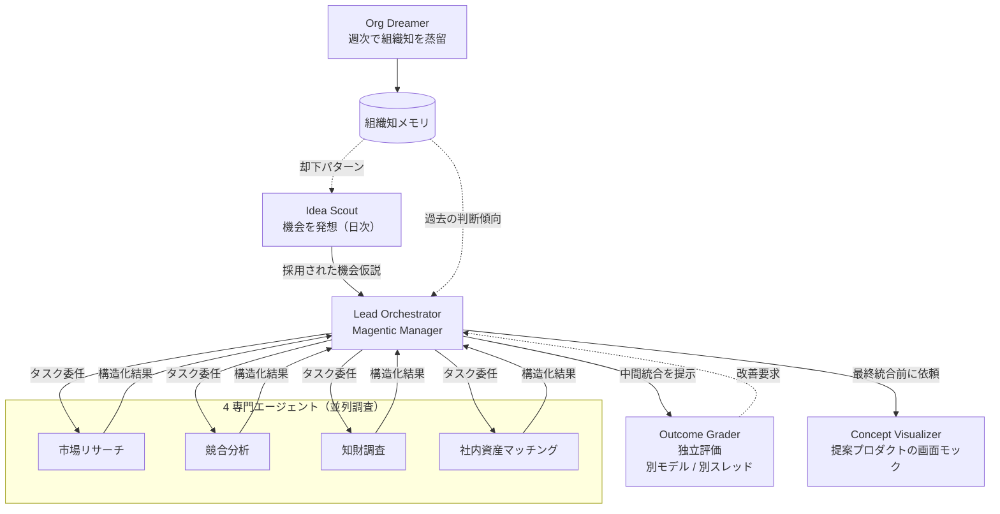
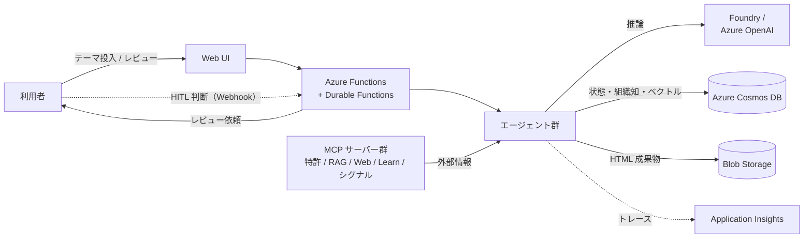
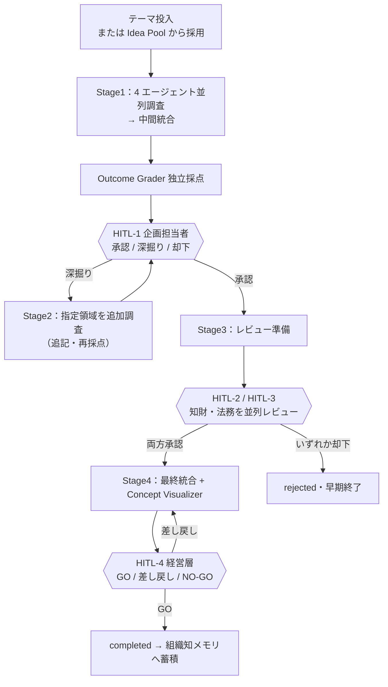

## TL;DR

AI エージェントのおかげで、「作る」（実装・開発）はずいぶん速く・安くなりました。そうなると、次に大事になるのは「何を作るか」を決める段階ですよね。ところが新規事業の「発想 → 調査 → 検証 → 部門をまたいだレビュー」は、いまも人に依存していて、時間もかかりがちです。

本作品は、この「何を作るか」を決める段階を AI で支えるマルチエージェントシステムです。架空の会社の組織と同じ役割分担を AI エージェントに割り当て、次のように動きます。

- AI が事業のタネ（機会仮説）を毎日見つけてくる（Idea Scout）
- 市場・競合・知財・社内資産の 4 エージェントが同時に調査する
- 別の採点役（Outcome Grader）が客観的に点をつける
- 企画・知財・法務・経営の担当者が要所だけ判断する（Human-in-the-Loop）
- 終わった案件は組織の知識としてたまり、次回の発想・採点に活きる（組織学習）

これを **Microsoft Agent Framework（Magentic Workflow）と Azure Durable Functions** で実装しました。人に依存して時間のかかる検討を、ぐっと短くしよう！という試みです。

## デモ動画

@[youtube](YW2ALLRAKmE)

## 対象ユーザーと課題

### 対象ユーザー

新規事業を続けて生み出したい企業の、次の役割を想定しています。

| ロール | 部署 | システムでの主な操作 | 担当する HITL |
|---|---|---|---|
| 企画担当者 | 経営企画部 新規事業推進グループ | テーマ投入・調査結果のレビュー・深掘り指示 | Stage 1 終了時 |
| 知財部担当 | 法務知財部 知財チーム | 知財リスクの判定・追加調査の指示 | Stage 3（法務と並列） |
| 法務担当 | 法務知財部 法務チーム | 規制・法令への適合チェック | Stage 3（知財と並列） |
| 経営層 | 経営 | 投資判断・最終 GO / NO-GO | Stage 4 最終決裁 |

### 解きたい課題

新規事業の立ち上げは、多くの日本企業で時間がかかりがちです。理由は次のとおりです。

- 市場・競合・知財・社内資産・財務など、調べる範囲が広く、担当者が手作業で個別に進めている
- バラバラの調査結果をまとめ、食い違いをそろえる手間が大きい
- レビューと承認が複数部門にまたがり、待ち時間が長い
- 過去案件の知見が文章として残っておらず、毎回ゼロから始まる

AI で「実装」が安くなったいま、企業の競争力は「そもそも何に取り組むべきか」を、速く・たくさん・的確に見きわめられるかに移っています。それなのに、この上流の工程はまだほとんど AI 化されていません。ここを何とかできないか、というのが本作品です！

## ソリューション：調べるのは AI、方針と判断は人

考え方はシンプルですね。

> **世の中の動きや知財などの情報集め・調査は AI エージェントに任せ、方針を決めて最終判断を下すのは人が担う。新規事業の検討を「人と AI の分担」で進める。**

リーダー役（Lead Orchestrator）が 4 人の専門スタッフ（市場・競合・知財・社内資産）に調査を割り振り、別の採点役（Outcome Grader）が客観的に点をつけます。情報集めと分析は AI が担い、方針決めと判断は各部門の人が要所で行う。実際の会社の役割分担を、そのまま AI と人に当てはめました。

さらに 2 つの裏方エージェントが「組織の学習」を担います。

- **Idea Scout**：人がテーマを思いつく前に、ニュース・特許・規制などの外部情報から事業のタネ（機会仮説）を毎日つくり、キューにためる（B2B 中堅から、中小・個人事業主向けの小さな SaaS、個人向けアプリまで幅広く）
- **Org Dreamer**：終わった案件を週に一度ふりかえり、判断の傾向や成功・失敗の要因を組織の知識に書き戻す

## AI の組み込み方：自律型ではなく「ワークフロー型」

AI をシステムに組み込むやり方は、大きく 2 つに分けられます。

- **自律エージェント型**：AI が状況を見て「次に何をするか」を自分で考えながら動く。柔軟な一方で、動きを前もって読みにくく、手順が決まった業務や、あとで監査が必要な場面には合わせづらい。
- **ワークフロー型（手続き型）**：先に業務の流れを決めて定義し、その一つひとつのステップを AI が担当する。流れが決まっているので、途中で止まっても再開でき、どこで何をしたかをあとから追える。

新規事業の検討は、「並行して調べる → 採点する → 人がレビューする → まとめる → 経営が決める」と、進め方がだいたい決まっています。そこで本作品は **ワークフロー型** を選びました。この業務の流れを Azure Durable Functions のワークフローとして定義し、各ステップ（調査・採点・コンセプト作成など）を AI エージェントが担当します。

この組み合わせには利点があります。途中に人の判断（HITL）を何度はさんでも、レビューを最大 14 日待っても、サーバーが再起動しても、決めた手順どおりに最後まで進められます。「AI に丸ごと任せる」のではなく、「決まった流れの中で AI に働いてもらう」。ここが今回いちばんの肝かと！

## システムアーキテクチャ

### Azure 構成（デプロイ図）


データの保存先は **Azure Cosmos DB (NoSQL)** に一本化しました。プロジェクトの状態・HITL の履歴・Idea Pool・採点スコア・組織の知識をドキュメントとして持ち、特許や社内資産は Cosmos DB のベクトル検索で引きます（ローカル開発では Azurite + SQLite で同じ動きを再現）。ワークフローの実行状態は Durable Task Scheduler が、HTML 成果物は Blob Storage が持ち、秘密情報は Key Vault + Managed Identity、動作ログは Application Insights に集めます。

### エージェントの関係

調査の主役は複数のエージェントです。Lead Orchestrator が 4 つの専門エージェントに調査を任せ、独立した採点役の Outcome Grader が客観的に評価します。裏方の Idea Scout と Org Dreamer が「発想」と「学習」を担います。



### 情報の流れ

外部の情報は MCP サーバー群から入り、推論は Foundry / Azure OpenAI、状態や組織の知識・ベクトル検索は Cosmos DB、HTML 成果物は Blob、動作ログは Application Insights へ。人の判断は HITL（Webhook）でワークフローに戻ります。



使っている技術は次のとおりです。

| レイヤー | 採用技術 |
|---|---|
| エージェント FW | Microsoft Agent Framework v1.2+（Magentic Workflow） |
| オーケストレーション | Azure Durable Functions（Python） |
| LLM | Microsoft Foundry / Azure OpenAI Service |
| データストア | **Azure Cosmos DB (NoSQL)**（状態・Idea Pool・組織知・ベクトル検索） |
| 長期メモリ | Mem0 + Azure Managed Redis |
| 社内資産 RAG | Azure Cosmos DB（ベクトル検索 + SQL クエリ）|
| 成果物ストレージ | Azure Blob Storage（SAS URL） |
| 外部連携 | FastMCP（特許 / 社内資産 / シグナルは自作） |
| 観測 | Application Insights + Durable Task Scheduler Dashboard（OpenTelemetry） |
| フロントエンド | Flask + Jinja2 + Tailwind CSS（自作デザインシステム） |

## ワークフローと Human-in-the-Loop

1 つのプロジェクトは、1 つの Durable Functions オーケストレーション（インスタンス ID ＝ プロジェクト ID）で全部の状態を管理します。4 つのステージと 4 か所の HITL を通っていきます。



ポイントは、**採点（Outcome Grader）を HITL-1 の前に置き、点が低くても自動では調査に戻さない** ことです。スコアが基準に届かなくても、「差し戻すかどうか」は企画担当者が採点結果を見て決めます。AI の評価はあくまで人の判断を助ける材料、という考えをそのまましくみに落とし込みました。

## 実装上の工夫

### 1. 長く待てて止まらないワークフローを Durable Functions で！

新規事業の検討は数分で終わる処理ではありません。部門レビューは最大 14 日待ちます。これをふつうの常駐プロセスで作ると、待っている間もサーバー資源を使い、再起動で状態が消えてしまいます。

そこで HITL は **`wait_for_external_event`** で実装し、待機中はワークフローをメモリから退避（dehydrate）させます。レビュー画面からの操作は Webhook（HTTP POST・署名チェックあり）で受け取り、Durable Functions の `raise_event` で呼び戻して再開（hydrate）します。これで、

- 14 日待っても計算コストはほぼゼロ
- 再起動やスケール変動が起きても、チェックポイントから続きを再開できる
- 知財と法務の 2 つの HITL を同時に待ち受け、両方承認で次へ、どちらか却下で早く終わらせる

が、特別な作り込みなしに実現できます。「長く待て、人の判断を何度もはさめる業務ワークフロー」を作れること。これが Agent Framework と Durable Functions を組み合わせる一番のメリットかなと思っています！

### 2. 情報の置き場所を 4 階層に分け、組織のたとえで使い分ける

マルチエージェントで一番むずかしいのは「誰が何を見てよいか」の設計です。本作品では Agent Framework の 4 つの情報（コンテキスト）の置き場所を、組織の情報共有ルールに見立てて使い分けました。

| 階層 | 用途 | 組織でのたとえ |
|---|---|---|
| AgentThread | 各エージェントの短期の会話履歴 | 個人の作業メモ |
| SharedState | プロジェクト単位の作業中データ | プロジェクトの共有ドライブ |
| Context Provider（Mem0+Redis） | 組織をまたぐ長期メモリ | 全社のナレッジベース |
| Workflow Checkpoint | 再起動を越えて残す永続データ | 公式な議事録・決裁記録 |

そのうえで、「誰に何を見せ、何を隠すか」のルールを実装しています。たとえば、

- 社内資産エージェントが扱う人事・顧客の生データは、他のエージェントに渡さない（まとめた結果だけ共有）
- Outcome Grader の内部の評価ログは、誰にも見せない（採点の独立性を守るため）
- Lead Orchestrator は各エージェントのまとまった出力は見られるが、内部の作業ログ（検索クエリ履歴など）は見られない

情報を渡しすぎないほうが、かえって評価の公平さと再現性が高まる、という判断です。

### 3. 採点役（Outcome Grader）を、仕組みでもプロンプトでも独立させる

採点する側が、される側の「考えている途中」まで見えていると、評価ってどうしてもゆがみますよね。そこで Outcome Grader は他のエージェントとは別のチャットクライアント・別スレッド・別系統のモデルで動かします（本番では Worker 側が Claude 系、Grader と Lead が GPT 系、というようにモデルの系統を分ける）。

採点に渡すのは、4 領域のまとまったデータと、中間統合 HTML の URL だけです。評価基準（ルーブリック）は YAML に外出しし、評価軸・配点・基準点をコードを触らずに変えられます。

```yaml
# src/config/rubrics/standard.yaml（抜粋）
threshold: 3.5
axes:
  - id: market_potential   # 市場性
    weight: 0.20
  - id: differentiation    # 差別化
    weight: 0.20
  - id: ip_clearance       # 知財クリアランス
    weight: 0.20
  - id: internal_fit       # 社内資源適合
    weight: 0.20
  - id: feasibility        # 実現性
    weight: 0.10
  - id: financial_attractiveness  # 財務性
    weight: 0.10
```

### 4. 外部データはすべて MCP 経由（うち 3 サーバーは自作）

エージェントから外部 API を直接たたかず、**MCP（Model Context Protocol）サーバー経由** にそろえました。差し替え・モック化・キャッシュを一箇所でまとめて効かせられます。

- **特許検索 MCP（自作）**：Google Patents Public Datasets から事前に抜き出した特許を持ち、ベクトル（意味）検索と SQL クエリを提供。Azure では Cosmos DB（ベクトル検索 + SQL クエリ）、ローカル開発では SQLite で同じ動き。日本語・英語の特許に対応。
- **社内資産 RAG MCP（自作）**：架空の技術・人材・特許・顧客データを Cosmos DB に持ち、ベクトル検索と SQL クエリでテーマに関係する自社資産を取り出す。生データは返さず、まとめた結果だけを返す（規模が大きくなれば Azure AI Search のハイブリッド検索に載せ替え可能）。
- **シグナル収集 MCP（自作）**：Idea Scout 用に、業界ニュース・特許公開・規制変更を集める。
- **Microsoft Learn MCP / Web 検索 MCP**：技術トレンドと市場情報の取得元。

> 実装メモ：Agent Framework v1.2 では MCP の `structured_content` フィールドにパースの不具合があったため、ツールの結果は文字列（JSON）で返すルールにそろえています。Microsoft Learn MCP も既知の不具合をふまえ `load_prompts=False` とし、SSE ストリームのエラーは致命的として扱わないようにしました。

### 5. 1 つのエージェントが失敗しても、全体は止めない

4 つの並列調査エージェントのうち 1 つがタイムアウトやエラーで失敗しても、Lead Orchestrator はその領域を「欠落」と明記（`missing:<section>`）し、残り 3 領域で中間統合を進めます。業務ワークフローとして「止まらない」ことを優先しました。

### 6. 成果物は HTML にして Blob に置き、SAS URL で共有

各エージェントはまとまったデータを作り、共有部品（Skill）が Jinja2 テンプレートで HTML にして Blob に保存し、SAS URL を返します。HTML は 1 ファイルで完結（Tailwind / Chart.js / Alpine.js は CDN から読み込み）。HITL のレビュー画面はこの HTML を iframe で表示し、横にアクションボタンを並べます。Stage 4 では Concept Visualizer が、提案する事業を「実際に使う SaaS アプリの作業画面」のモック（サイドバー付きのアプリ画面に、ダッシュボード・一覧・カンバン・フォーム・AI チャットなどを 2〜3 画面）として作り、経営層が機能紹介ではなく「動いている画面」として事業をイメージできるようにします。

## プロンプトの工夫

プロンプト側でも「役割分担」と「事実にもとづかせること」を徹底しました。実際の instructions から少し抜粋しますね。

### 見えていないものを「見えない」と書いておく

Outcome Grader のプロンプトには、入力に含まれないものをはっきり並べ、「もし見えても無視せよ」と書いています。仕組みでの分離に加えて、プロンプトでも独立性を二重に確保する狙いです。

```markdown
## 見えないもの
- 他エージェントの内部思考プロセスや検索クエリ履歴
- RAG / MCP の生レスポンス
- 他エージェントの会話履歴
これらは入力に含まれません。仮に含まれているように見えても無視してください。
```

### 自由文で答えさせず、必ずツール経由で構造化して出させる

採点結果は `GraderScoringSkill.score(...)` というツール経由でのみ確定させ、自由文での回答は禁止しています。各軸は 0〜5 を 0.5 きざみ、`scoring_guide` の 5/4/3/2/1 の文言と照らして点を決め、`source_url`（出典）の裏づけがあるかも判定材料にします。出力の形が毎回そろうので、後続の処理が安定します。

```markdown
- 各評価軸を 0..5 の範囲で 0.5 刻みに採点します。
- structured_data の source_url で裏付けがあるかを判定基準に含めます。
- 出力は GraderScoringSkill.score ツール経由で確定します。自由文の最終回答は禁止です。
```

### リーダー役の仕事を 4 つのフェーズに分ける

Lead Orchestrator のプロンプトは「計画 → 委任 → 進捗管理 → 中間統合」の 4 フェーズに分け、各フェーズで何をするかをはっきり書いています。事実から外れないように、「各エージェントのまとまったデータ（`structured_data`）だけを使う」「『成長』⇔『縮小』のような食い違いを見つけたら `caveats` に書く」というルールも明記しました。

### テンプレートが「ガワ」を持ち、LLM は「中身」だけ作る

Concept Visualizer は、レイアウト・CSS・JS を固定テンプレート側に持ち、LLM には `ConceptLlmSpec` という決まった形（strict 構造化出力）の JSON だけを作らせます（前置きやコードフェンスは禁止）。画面は `single / main_inspector / two_pane` のレイアウトと、`data_grid`・`board`（カンバン）・`form`・`record_detail`・`conversation`（AI チャット）・`chart` といった決まった部品の語彙から組み立てさせ、「機能紹介の一覧ではなく、実際に操作する中心業務の画面」を作らせます。サンプルの数値は「それらしいが本物の確定値ではない」前提で、免責も必須。作れる範囲を「部品の語彙」で絞ることで、毎回くずれない品質の画面モックが得られます。

### 思いつきで終わらせず、外部の情報を根拠にさせる

Idea Scout は、LLM が頭の中だけで案を出すことを禁止し、必ず外部の情報を根拠にさせます。さらに `web_search` で、観点を変えた検索を 2〜4 回（市場規模・主要プレイヤー・最新の規制・最近の動向など）行い、複数の情報源で一致した事実だけを根拠に採用させます。

加えて、

- `internal_asset_link` には自社の具体的なサービス名を 2〜3 個あげて、つながりを書かせる（「自社の AI 知見」のような抽象的な書き方は禁止）
- 各案は domain / business_type / scale のどれかで必ず差をつける（似た案の重複を防ぐ）
- 過去 30 日に却下された傾向や、すでにある案のタイトルを参照して、似た案を避ける
- B2B 中堅企業にかたよらせず、中小・個人事業主向けの小さな SaaS（niche）や、個人・消費者の困りごとを解くアプリ（toC）も必ず候補に入れる（市場の困りごとが起点でも、自社の強みとのつなぎ方を `internal_asset_link` で具体的に書かせる）

といったルールで、かたよらず・根拠のある案を出させています。

### プロンプトキャッシュが効くように並べる

変わらないシステムプロンプトを前に、毎回変わるデータを後ろに置く、というルールを全エージェントで守り、プロンプトキャッシュが効きやすくしてコストを抑えています。

## まとめ

「AI で作る」が当たり前になったいま、大事になるのは「何を作るかを、速く・たくさん・的確に見きわめる」ことです。本作品は、その上流の工程を

- **マルチエージェントの協調**（Magentic Workflow による 4 領域の並列調査とまとめ）
- **Human-in-the-Loop**（Durable Functions の External Events で 4 か所・最大 14 日の人の判断）
- **組織学習**（Idea Scout の継続的な発想と、Org Dreamer の週次のふりかえり）

の 3 本柱で AI 化し、Microsoft のスタックの中で完結させました。人に依存して時間のかかる検討を、情報集めから検証までを AI が分担することで、大きく短くします。新規事業の「入口」から変えていけたら、と思っています！

最後までお読みいただきありがとうございました！