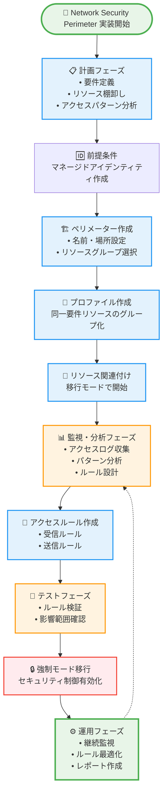

# はじめに

クラウドアプリケーションにおいて、セキュリティは絶対に軽視できない要素です。特に、PaaSサービスを活用する現代のアプリケーション開発において、データの機密性と完全性を保護することは、企業の信頼性に直結します。

この度、Microsoftは**Azure Network Security Perimeter（ネットワークセキュリティペリメーター）**のパブリックプレビューを発表しました。これは、Azure Cosmos DBのセキュリティ機能を大幅に向上させる画期的な機能です。

# Network Security Perimeter とは？

## 基本概念

Network Security Perimeter は、Azure Cosmos DB などのPaaSサービスに対して論理的なネットワーク境界を作成し、アプリケーションのネットワークをインターネットなどの外部ネットワークから分離する機能です。

簡単に説明すると、従来のファイアウォールが物理的な境界線を作るのに対し、Network Security Perimeter は**論理的な境界線**を作成します。この境界線内では、信頼できるリソース同士が自由に通信でき、外部からの不正アクセスを効果的にブロックします。

## 従来のセキュリティ機能との違い

これまでのAzure Cosmos DBのセキュリティ機能と比較してみましょう：

**従来のアプローチ：**
- Private Endpoint：仮想ネットワーク内からのプライベートアクセス
- VNet Injection：マネージドVNetからのアクセス制御
- IP制限：特定のIPアドレスからのアクセス制御

**Network Security Perimeter の新機能：**
- PaaS サービス間での論理的な境界を作成
- ペリメーター内のリソース間での自由な通信
- 外部アクセスに対する柔軟なルール設定

# なぜ Network Security Perimeter が必要なのか？

## 1. **データ流出防止の強化**

Azure Cosmos DB をペリメーターに追加することで、データ流出を防ぐことができます。従来のセキュリティ機能では、個別のサービスレベルでの制御が中心でしたが、Network Security Perimeter では、複数のPaaSサービスを一つの境界で管理できます。

## 2. **PaaSサービス間の安全な通信**

現代のアプリケーションは、Azure Cosmos DB、Azure Key Vault、Azure Storage、Azure Cognitive Searchなど、複数のPaaSサービスを組み合わせて構築されています。ペリメーター内のすべてのリソースが、他のリソースと安全に通信できます。

## 3. **統合的なセキュリティ管理**

従来は各サービスごとに個別のセキュリティ設定が必要でしたが、Network Security Perimeter では、複数のPaaSサービスのセキュリティ設定を一元管理できます。

# 主要機能の詳細解説

## 1. **PaaS間通信のセキュリティ強化**

ペリメーター内のすべてのリソースは、ペリメーター内の他のリソースと通信できます。これにより、以下のような高度なセキュリティ要件を満たすことができます：

- **マイクロサービス間の安全な通信**：複数のCosmos DBアカウントやその他のPaaSサービス間での暗号化通信
- **データ処理パイプラインの保護**：Azure Functions、Logic Apps、Cosmos DB間での安全なデータフロー
- **分析ワークロードの保護**：Cosmos DBから Azure Synapse Analytics、Power BI への安全なデータ転送

## 2. **柔軟なアクセス制御**

**受信アクセス制御：**
ソースIPアドレス、サブスクリプションなどのクライアントのネットワークおよびアイデンティティ属性を使用して、パブリック受信アクセスを承認できます。

**送信アクセス制御：**
外部宛先の完全修飾ドメイン名（FQDN）を使用して、パブリック送信を承認できます。

これにより、企業の複雑なネットワーク要件に対応できます。

## 3. **監査とコンプライアンス**

監査とコンプライアンスのために、ペリメーター内のPaaSリソースに対して診断ログが有効になります。これにより、以下の要件を満たすことができます：

- **コンプライアンス要件の遵守**：GDPR、HIPAA、SOX法などの規制要件
- **セキュリティ監査**：すべてのアクセスログの追跡と分析
- **インシデント対応**：セキュリティインシデント発生時の迅速な調査

# 実装時の考慮事項

## 現在のサポート状況と制限事項

**重要な制限事項：**
現在、Azure Network Security Perimeter、カスタマーマネージドキー（CMK）、Analytical Store、All Versions and Deletes Change Feed Mode、Materialized Views、Point-in-Time Restore などのログストア機能の組み合わせはサポートされていません。

**CMK使用時の注意点：**
CMKが有効なアカウントでAzure Network Security Perimeter を使用している場合、復元を実行するには、Key Vaultのペリメーター設定を一時的に緩和して、Cosmos DBアカウントがキーにアクセスできるようにする必要があります。

## 設定の前提条件

ネットワークセキュリティペリメーターを設定する前に、Azureでマネージドアイデンティティを作成する必要があります。これは、ペリメーター内のリソース間の安全な認証に必要です。

# 実装手順の概要

## 1. **事前準備**
- Azure ポータルでマネージドアイデンティティを作成
- 必要な権限の設定
- 既存のCosmos DBアカウントの確認

## 2. **ペリメーターの作成**
- Azure ポータルで「network security perimeters」を検索
- リソースの作成と設定
- 関連付けるリソースの選択

## 3. **アクセスルールの設定**
- 受信アクセスルールの定義
- 送信アクセスルールの定義
- 必要に応じた例外ルールの作成

## 4. **監視と運用**
- 診断ログの設定
- アクセスパターンの監視
- セキュリティポリシーの定期的な見直し

# 既存のセキュリティ機能との統合

## Private Endpoint との関係

Network Security Perimeter は、Private Endpoint と組み合わせて使用できます。Private Endpoint により、ペリメーター内のプライベートリソースへのアクセスが可能になります。

## VNet Injection との協調

VNet Injection により、マネージドVNetオファリングがペリメーター内のリソースにアクセスできるようになります。

これにより、企業の既存のネットワーク構成を変更することなく、段階的にセキュリティを強化できます。

# ユースケース例

## 1. **マルチテナントSaaSアプリケーション**
- 顧客ごとに独立したCosmos DBアカウント
- 共通のKey VaultとStorage Account
- テナント間のデータ分離と安全な共通リソースアクセス

## 2. **データ分析プラットフォーム**
- Cosmos DBでのリアルタイムデータ取得
- Azure Synapse Analyticsでの分析処理
- Power BIでの可視化
- 全体を通じたデータ保護

## 3. **マイクロサービスアーキテクチャ**
- 複数のCosmos DBデータベース
- Azure Service Busでのメッセージング
- Azure Key Vaultでの秘密情報管理
- サービス間の安全な通信

# 今後の展望

## 機能の拡張予定

Network Security Perimeter は現在パブリックプレビューの段階ですが、今後以下のような機能強化が予想されます：

- **対応サービスの拡大**：より多くのPaaSサービスでの利用
- **詳細なアクセス制御**：よりきめ細かなポリシー設定
- **自動化機能**：Azure Policy との統合による自動設定

## 企業導入のベストプラクティス

1. **段階的な導入**：まずは開発環境から始めて、本番環境への適用を検討
2. **既存システムとの統合**：現在のセキュリティ設定との整合性を確認
3. **監視体制の構築**：新しいセキュリティ境界に対応した監視システムの構築

# Network Security Perimeter の詳細概念

## アーキテクチャコンポーネント

Network Security Perimeter は、以下の主要コンポーネントで構成されています：

### 1. **ネットワークセキュリティ境界（最上位リソース）**
PaaS リソースをセキュリティ保護するための論理ネットワーク境界を定義する最上位リソースです。これは、従来の物理的なファイアウォールに代わる、クラウドネイティブな境界線として機能します。

### 2. **プロファイル**
プロファイルに関連付けられたリソースに適用されるアクセス規則のコレクションです。同様の受信および送信アクセス要件のセットを持つ PaaS リソースをグループ化できます。

### 3. **アクセス規則**
境界外へのアクセスを許可するための、境界内のリソースに対する受信および送信規則です。以下の種類があります：

**受信ルール：**
- **サブスクリプションベースの規則**：特定のAzureサブスクリプションからのアクセスを許可
- **IPベースの規則**：特定のIPアドレス範囲からのアクセスを許可（IPv6もサポート）

**送信ルール：**
- **FQDNベースの規則**：外部宛先の FQDN（完全修飾ドメイン名）を使用して承認

### 4. **リソースの関連付け**
PaaS リソースの境界メンバーシップを定義します。これにより、どのリソースが境界内に含まれるかが決定されます。

### 5. **診断設定**
境界内のすべてのリソースのログとメトリックを収集するために Microsoft Insights によってホストされる拡張リソースです。

## アクセスモードの詳細

Network Security Perimeter では、2つのアクセスモードが提供されています：

### 移行モード（以前の学習モード）
- 既定のアクセス モード
- ネットワーク管理者が PaaS リソースの既存のアクセス パターンを理解するのに役立ちます
- 実際の制限を行う前に、現在のトラフィックパターンを分析するためのモード
- 強制モードに移行する前の推奨使用モード

### 強制モード
- 管理者が設定する必要があります
- 既定では、境界内トラフィックを除くすべてのトラフィックは、許可 アクセス規則が存在しない限り、このモードでは拒否されます
- 実際にセキュリティ制御が有効になるモード

## アーキテクチャ図

```mermaid
graph TB
    subgraph "🌐 External Networks"
        INT[🌍 Internet]
        ON[🏢 On-Premise]
        API[🔗 External APIs]
    end

    subgraph "🛡️ Network Security Perimeter"
        subgraph "📋 Profile 1 (Web Apps)"
            KV[🔐 Key Vault]
            AS[🌐 App Service]
        end
        
        subgraph "📋 Profile 2 (Data Services)"
            CDB[🗄️ Cosmos DB]
            ST[💾 Storage]
        end
        
        IR[📥 Inbound Rules<br/>• IP-based<br/>• Subscription-based]
        OR[📤 Outbound Rules<br/>• FQDN-based]
        
        DIAG[📊 Diagnostic Settings]
    end
    
    LA[📈 Log Analytics<br/>Workspace]

    %% Internal secure communications
    CDB <-.-> KV
    AS <-.-> CDB
    AS <-.-> KV
    CDB <-.-> ST

    %% External access through rules
    INT --> IR
    IR -.-> AS
    ST --> OR
    OR --> API

    %% Blocked traffic
    ON -.x.-> CDB

    %% Logging
    DIAG --> LA

    %% Styling
    classDef perimeter fill:#e3f2fd,stroke:#2196f3,stroke-width:3px
    classDef profile fill:#f3e5f5,stroke:#9c27b0,stroke-width:2px
    classDef resource fill:#e8f5e8,stroke:#4caf50,stroke-width:2px
    classDef rule fill:#fff3e0,stroke:#ff9800,stroke-width:2px
    classDef external fill:#ffebee,stroke:#f44336,stroke-width:2px
    classDef blocked stroke:#f44336,stroke-dasharray: 5 5

    class KV,AS,CDB,ST resource
    class IR,OR rule
    class INT,ON,API external
```

## アクセスモード比較

### 移行モード（Learning Mode）
```
┌─────────────────────────────────────┐
│ 🔍 移行モード（学習モード）          │
├─────────────────────────────────────┤
│ ┌─ ─ ─ ─ ─ ─ ─ ─ ─ ─ ─ ─ ─ ─ ─ ─ ┐ │
│ ┆ 🗄️ Cosmos DB  🔐 Key Vault      ┆ │
│ ┆                                 ┆ │
│ ┆ 💾 Storage     🌐 App Service   ┆ │
│ └─ ─ ─ ─ ─ ─ ─ ─ ─ ─ ─ ─ ─ ─ ─ ─ ┘ │
│                                     │
│ ✅ 全アクセス許可（監視のみ）        │
│ 📊 トラフィックパターン収集          │
│ 🔍 アクセス要件分析                 │
└─────────────────────────────────────┘
```

### 強制モード（Enforced Mode）
```
┌─────────────────────────────────────┐
│ 🔒 強制モード（セキュリティ有効）    │
├─────────────────────────────────────┤
│ ┌─────────────────────────────────┐ │
│ │ 🗄️ Cosmos DB  🔐 Key Vault    │ │
│ │                               │ │
│ │ 💾 Storage     🌐 App Service │ │
│ └─────────────────────────────────┘ │
│                                     │
│ 🚫 デフォルト拒否                   │
│ ✅ 明示的ルールのみ許可             │
│ 🛡️ データ流出防止                  │
└─────────────────────────────────────┘
```

## 対応PaaSサービス

現時点でオンボード済みのプライベート リンク リソースには以下が含まれます：

| サービス | 用途 | 特徴 |
|---------|------|------|
| **Azure AI Search** | 検索・分析 | インデクサー接続対応 |
| **Azure Cosmos DB** | NoSQLデータベース | 複数API対応 |
| **Azure Event Hubs** | イベントストリーミング | リアルタイム処理 |
| **Azure Key Vault** | 秘密情報管理 | 暗号化キー管理 |
| **Azure SQL Database** | リレーショナルDB | 高可用性 |
| **Azure Storage** | オブジェクトストレージ | Blob、File、Queue |
| **Azure Monitor関連** | 監視・ログ | Application Insights等 |

## スケール制限事項

ネットワーク セキュリティ境界機能を使用すると、次のスケール制限がある一般的なパブリック ネットワーク制御を使用した PaaS リソースのデプロイをサポートできます：

| 項目 | 制限値 | 種別 |
|------|-------|------|
| ネットワークセキュリティ境界数 | サブスクリプションあたり最大100個 | 推奨制限 |
| プロファイル数 | 境界あたり最大200個 | 推奨制限 |
| ルール要素数 | プロファイルあたり受信・送信それぞれ最大200件 | ハードリミット |
| PaaSリソース数 | 同一境界内で最大1000個 | 推奨制限 |

## 運用上の制限事項

### ログ記録の制限
ネットワーク セキュリティ境界のアクセス ログを有効にする場合、ネットワーク セキュリティ境界に関連付ける Log Analytics ワークスペースは、Azure Monitor でサポートされているリージョンのいずれかに配置する必要があります。

### 運用制限
- 同じリソース グループに複数のネットワーク セキュリティ境界が存在する場合、ネットワーク セキュリティ境界をリソース グループ/サブスクリプション間で移動することはできません
- ネットワーク セキュリティ境界を削除する前に、すべての関連付けを削除する必要があります
- リソース名は 44 文字を超えることはできません
- サービス エンドポイント トラフィックはサポートされていません

## 実装フローチャート



# まとめ

Azure Network Security Perimeter は、クラウドネイティブアプリケーションのセキュリティを大幅に向上させる革新的な機能です。これまでのPrivate Endpointや VNet Injection と組み合わせることで、包括的なセキュリティソリューションを提供します。

現在はパブリックプレビューの段階ですが、本格的な導入に向けて、企業は以下の点を検討する必要があります：

- **現在のセキュリティ要件の評価**
- **段階的な導入計画の策定**（移行モード→強制モードの移行戦略）
- **運用チームのトレーニング**
- **監視とコンプライアンス体制の整備**
- **スケール制限事項の確認と設計への反映**

クラウドセキュリティの新時代において、Network Security Perimeter は企業のデータ保護戦略の中核を担う重要な機能となるでしょう。早期の検討と適切な導入により、より安全で効率的なクラウドアプリケーションの開発が可能になります。

---

*本記事は、2024年11月に発表されたMicrosoft公式ブログの内容を基に、詳細な解説を加えて作成されています。Network Security Perimeter はパブリックプレビュー段階のため、本番環境での使用前に十分な検証を行ってください。*