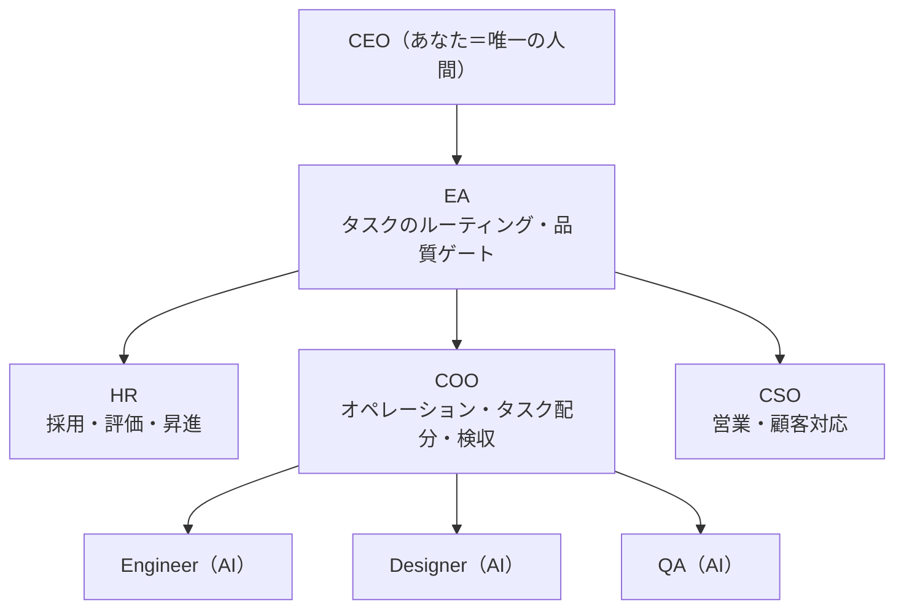
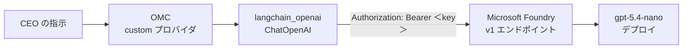

# はじめに

OSS の [OneManCompany](https://github.com/1mancompany/OneManCompany)（以下 OMC）は、**AI 社員が自律的に働く「会社の OS」** です。CEO（人間）がタスクを投げると、AI 社員たちが役割分担し、プロジェクトを命名し、成果物を作り、CEO に報告する、という一連の会社運営を AI だけで回します（OMC 自体の詳しい紹介は次の章でします）。

この OMC、デフォルトでは **OpenRouter** 経由で LLM を呼びます。本記事では、この LLM を **Azure の Microsoft Foundry** にデプロイしたモデルに差し替えてみます。

OneManCompany がどんなプロジェクトなのかを紹介しつつ、実際に **Azure の Microsoft Foundry のモデル**で動かすところまで、ひととおりまとめます。

:::message
やり方の要点を先に書いておくと、OMC の `custom` プロバイダ設定を使って `.onemancompany/.env` を書き換えるだけで Microsoft Foundry に繋がります。鍵は「Microsoft Foundry の **v1 API（OpenAI 互換）** が API キーを `Authorization: Bearer` ヘッダで受け付ける」点で、OMC が内部で使う `langchain_openai.ChatOpenAI` がそのまま使えます。
:::

<!-- 画像(後で挿入): OMC のピクセルアートなオフィス UI 全体。例: /images/omc-azure-foundry/office-ui.png -->

---

# そもそも OneManCompany とは？


> OneManCompany（略称 OMC）は、「一人会社のための AI OS」を標榜する OSS です。ブラウザから、完全に AI で駆動する会社を構築・運営できることを目指しています。

コンセプトはとても明快です。**あなたが CEO（唯一の人間）** で、HR・COO・エンジニア・デザイナーといった他の全員は、自律的に考え・協働し・実際の成果物を出す **AI 従業員**。「サボらない、病欠しない、昇給も要求しない。たまに激励が必要なくらい」というのが売り文句です。

単なるチャットボットでも、エージェントの寄せ集めでもなく、**会社運営そのものを OS として体系化**しようとしている点が最大の特徴ですね。

## あなたは経営する、AI が実行する

組織構造は Fortune 500 企業をモデルにしています。創業チーム（EA・HR・COO・CSO）は最初から内蔵されていて、人手が足りなければ HR が後述の Talent Market から新しい AI 従業員を採用してきます。



Engineer・Designer・QA は、後述の **Talent Market** から採用してくる AI 従業員です。たとえば「モバイル向けパズルゲームを作って」と投げると、ざっくり次のように流れます。

1. EA がタスクを受け取り、担当へルーティングする
2. COO がタスクを分解し、サブタスクを配分する
3. エンジニア・デザイナー・QA が自律的に作業する
4. 必要に応じて会議を開いてすり合わせる
5. 成果物がレビュー・反復・品質ゲートを通る
6. あなたに通知が届き、最終成果物を承認する

会社の新入社員に仕事を任せる感覚に近くて、CEO である自分は「経営」だけに集中できる、というわけです。

## なぜ今「一人会社の OS」なのか

OMC は、2026 年に盛り上がっている **「一人会社（one-person company）／ソロ・ユニコーン」** という潮流のなかにあります。背景をいろいろ調べましたが、こんな整理です。

- かつてビジネスの制約は「**労働力**」だった。成果を増やすには人を雇うしかなかった。
- AI エージェントは人を速くするだけでなく、成果（アウトプット）の経済性そのものを変える。生産が安くなると、人員数に依存したビジネスモデルが崩れる。
- スケールの単位が「従業員」から「エージェント」へシフトする。
- そこに **一人会社** という新カテゴリが生まれる。運営者ひとりが AI システムの中心に座り、10 人チーム相当のアウトプットを出しながら、人間は戦略・センス・顧客成果に集中する。

OMC は、この流れを個別ツールの寄せ集めではなく、ひとつの OS として束ねようとしている、と理解すると腑に落ちます。

:::message
一方で、AIによる成果をビジネスにつなげられていなければ、無駄な経費となってしまうことは言うまでもありません。
特に最近はAIツールが従量課金モデルに移ってきているので、**コスト管理**も重要な要素になってきます。
:::

## 設計のキモは「Vessel ＋ Talent」

OMC の設計で特徴的なのが、**「Vessel（器）＋ Talent（才能）」の分離**です。エヴァやガンダムでたとえられていて、パイロットが乗り込むと機体が動き出す、というイメージですね。

| 要素 | 役割 |
| --- | --- |
| Vessel（機体）= 実行コンテナ | **従業員がどう動くか**を定義。リトライ・タイムアウト・ツールアクセス・通信プロトコルを司る |
| Talent（パイロット）= 能力パッケージ | **スキル・知識・人格・専用ツール**を持ち込む |
| Employee（従業員）= Vessel ＋ Talent | Talent Market から Talent を雇い、Vessel にデプロイすると**従業員**が成立する |

この「統一ランタイム」のおかげで、従業員が Claude Code と OpenClaw のどちらで動いているかを意識しなくても、Vessel 層がスケジューリング・リトライ・通信を一手に引き受けてくれます。Talent の能力は **Skill** として定義され、スマホの App Store のようにアプリ感覚でインストールできます。

## 主な機能

OMC は「本物の会社運営」を仮想的に再現したものです。代表的なものだけ抜き出すと、こんな感じです。

| 機能 | 内容 |
| --- | --- |
| **ピクセルアートのオフィス** | ブラウザを開くとレトロなオフィスが広がり、AI 従業員が机で働く様子がリアルタイムに見える。これは一昔前のゲーム感があって面白いですね。 |
| **採用・解雇・評価** | HR が Talent Market を検索、CEO が面接、自動オンボーディング。四半期評価や PIP、昇進トラックもある |
| **マルチエージェント会議** | 従業員同士が会議を開いて調整。CEO も参加して舵を取れる |
| **1on1 コーチング** | 説明した内容が恒久的な業務経験として従業員に蓄積される |
| **反復管理** | V1 → V2 → V3 のバージョン管理と全履歴 |
| **コスト会計** | プロジェクト別の LLM トークン使用量と USD コストを追跡 |
| **自己進化** | レトロや 1on1 で従業員が成長し、繰り返すタスクはワークフローへ自動的に蒸留される |

---

# OMC を Microsoft Foundry のモデルで動かす

いきなり設定をいじる前に、OMC がどうやって LLM に繋がっているかを把握します。

わかったことを以下にまとめます。

- OMC は **Python（FastAPI + LangChain / LangGraph）** + フロントエンドの構成です。LangChain は LLM アプリ構築フレームワーク、LangGraph はその上でエージェントの処理フローを状態機械として組むライブラリです。起動は `npx @1mancompany/onemancompany` または `bash start.sh`。
- LLM プロバイダの定義は `src/onemancompany/core/config.py` の `PROVIDER_REGISTRY` に集約されている。
- 実際の LLM クライアント生成は `src/onemancompany/agents/base.py` の `make_llm()`。
  - OpenAI 互換プロバイダ → `langchain_openai.ChatOpenAI(model, api_key, base_url, ...)` を生成。
  - Anthropic → `ChatAnthropic`。
- 設定の優先順位は、**従業員ごとの `profile.yaml`**（`api_provider` / `llm_model` / `api_key`）→ **会社デフォルト**（`.onemancompany/.env` の `Settings`）。

## 「custom」プロバイダを使う

:::message
README の TODO には「More LLM provider options (Ollama local, **Azure OpenAI**, AWS Bedrock, etc.)」とあり、Azure OpenAI の**ネイティブ対応はまだ未実装**でした。そこで今回は `custom` プロバイダ経由で対応します。
:::

`PROVIDER_REGISTRY` には `custom` というプロバイダがあり、これで **任意の OpenAI 互換エンドポイント** を指定できます。今回はこれを使います。

| `.env` キー | 役割 |
| --- | --- |
| `DEFAULT_API_PROVIDER=custom` | プロバイダを custom に切り替え |
| `DEFAULT_API_BASE_URL=...` | 任意のエンドポイント URL |
| `CUSTOM_API_KEY=...` | API キー |
| `CUSTOM_CHAT_CLASS=openai` | API 形式（`openai` / `anthropic`） |
| `DEFAULT_LLM_MODEL=...` | モデル名（**Azure ではデプロイ名**） |

`make_llm()` の該当ロジックを抜粋すると、こうなっています。

```python
if api_provider == "custom" or (settings.default_api_base_url and api_provider == settings.default_api_provider):
    base_url = settings.default_api_base_url
...
return ChatOpenAI(model=model, api_key=effective_key, base_url=base_url, ...)
```

`ChatOpenAI` は内部で OpenAI Python SDK を使い、認証は `Authorization: Bearer <key>` ヘッダで行います。API キーを「Bearer」という共通フォーマットの封筒に入れて渡すイメージですね。

---

## どう繋ぐか、見当をつける

`langchain_openai.ChatOpenAI` は OpenAI SDK と同じ Bearer 認証なので、**OMC 側はコード変更不要**で、全体の繋がりを図にすると、こんな流れですね。



`.onemancompany/.env` を次のように設定すれば動くはずです。

```env
DEFAULT_API_PROVIDER=custom
DEFAULT_API_BASE_URL=https://<resource>.openai.azure.com/openai/v1/
CUSTOM_API_KEY=<Microsoft Foundry の API キー>
CUSTOM_CHAT_CLASS=openai
DEFAULT_LLM_MODEL=<gpt-5.4-nano のデプロイ名>
```

---

# OMC をセットアップする（Windows / dev モード）

`start.sh` は bash + POSIX venv 前提なので、Windows では `uv` を直接使います。

```powershell
cd <OneManCompany のパス>
uv venv --python 3.12
uv pip install -e .
```

（uv 0.9.8 / Python 3.12.9 / Node 24。コンソールスクリプトは `onemancompany` = サーバ、`onemancompany-init` = オンボーディングウィザード）

## オンボーディングの肝とハマりどころ

`onemancompany-init` のウィザード（`onboard.py`）は対話式ですが、`--auto -y` で非対話実行できます。`run_auto()` は **プロジェクトルートの `./.env`** を読み、最終的に `.onemancompany/.env` を生成します。

:::message alert
**ハマりどころ**: `run_auto()` は `_step_execute()` に `base_url` / `custom_chat_class` を**渡さない**実装になっており、生成される `.onemancompany/.env` から `DEFAULT_API_BASE_URL` と `CUSTOM_CHAT_CLASS` が**抜け落ちます**。auto-init 後に**手動で追記**する必要があります。
:::

手順は次のとおり。

**1) ルート `./.env` を作成**（custom プロバイダ検出用）

```env
DEFAULT_API_PROVIDER=custom
CUSTOM_API_KEY=<key>
DEFAULT_API_BASE_URL=https://my-foundry-resource.services.ai.azure.com/openai/v1/
CUSTOM_CHAT_CLASS=openai
DEFAULT_LLM_MODEL=gpt-5.4-mini
HOST=0.0.0.0
PORT=8000
```

**2) 非対話 init を実行**

```powershell
.\.venv\Scripts\onemancompany-init.exe --auto -y
```

出力（抜粋）:

```text
Provider: custom / Model: gpt-5.4-mini
✔ Company template copied
✔ .env written
sync_founding_defaults: updated 00001..00005 → provider=custom, model=gpt-5.4-mini
✔ Founding employees set to custom/gpt-5.4-mini
G E N E S I S   C O M P L E T E
```

**3) 生成された `.onemancompany/.env` に、欠落した 2 キーを追記**

```env
DEFAULT_API_BASE_URL=https://my-foundry-resource.services.ai.azure.com/openai/v1/
CUSTOM_CHAT_CLASS=openai
```

**4) 創業メンバーのプロフィールを確認**（例: EA `00004/profile.yaml`）

```yaml
api_provider: custom
hosting: company
llm_model: gpt-5.4-mini
```

---

# make_llm 経由でも繋がるか確かめる

サーバを起動する前に、OMC が実際にエージェント生成で使う `make_llm()` を直接叩いて、コードパス経由で本当に Azure に繋がるかを確認します。

```python
from onemancompany.core.config import settings
from onemancompany.agents.base import make_llm

llm = make_llm("00004")   # EA founding agent
resp = await llm.ainvoke("Reply with exactly: OMC-AZURE-OK")
```

結果:

```text
=== make_llm('00004') ===
class   : ChatOpenAI
model   : gpt-5.4-mini
base_url: https://my-foundry-resource.services.ai.azure.com/openai/v1/

=== live ainvoke ===
content   : OMC-AZURE-OK
resp model: gpt-5.4-nano-2026-03-17
usage     : input=17 output=11 total=28
```

:::message
OMC の従業員ランタイムが **Microsoft Foundry の gpt-5.4-nano** を使うことを、実際のコードパス（`make_llm` → `ChatOpenAI` → ライブ呼び出し）で確認できました。`usage_metadata` も取れているので、コスト集計も機能します。
:::

---

# サーバを起動する

`start.sh` を使わず、`uv` 経由で直接起動します（Windows）。

```powershell
.\.venv\Scripts\onemancompany.exe   # uvicorn 0.0.0.0:8000 をフォアグラウンド起動
```

起動ログ（抜粋）:

```text
[startup] Registered Pat EA / Sam HR / Alex COO / Morgan CSO / CEO (00001..00005) — LangChainExecutor
System crons started: ['heartbeat','review_reminder','config_reload',...]
Application startup complete.
🏢 One Man Company HQ v0.7.85 is running!  Frontend: http://localhost:8000
```

- `GET /` → HTTP 200（ピクセルアートのオフィス UI が表示）
- ERROR / 401 / 403 / missing-api-key は無し
- 注: `self-improving-agent` スキルの hook スクリプト未配置の WARNING は出るが無害

ブラウザで `http://localhost:8000` を開くと、AI 社員（EA / HR / COO / CSO）が着席したオフィスが表示されます。

<!-- 画像(後で挿入): 起動後の http://localhost:8000、AI社員が着席したオフィス画面。例: /images/omc-azure-foundry/office-running.png -->

---

# 実際にタスクを投げて、会社を動かしてみる

いよいよ本番。CEO 指示を `POST /api/ceo/task`（multipart form）に投入します。

```powershell
$task = "会社の最初のブログ記事のドラフトを作ってください。テーマは『AI社員だけで運営する一人会社（OneManCompany）とは何か』。日本語で600〜800字、見出し付き。完成したらプロジェクトのworkspaceにmarkdownで保存してください。"
Invoke-RestMethod -Method Post -Uri "http://localhost:8000/api/ceo/task" -Form @{ task=$task; mode="simple" }
```

レスポンス:

```json
{ "routed_to": "EA", "status": "processing",
  "project_id": "e9ef65fcb226", "iteration_id": "iter_001" }
```

## 自律的に動くようす（サーバログ）

```text
POST /api/ceo/task 200 OK
Project e9ef65fcb226 renamed: '会社の最初のブログ記事…' → 'AI社員だけのOneManCompanyとは'   ← LLMが命名
[PROJECT COMPLETE] EA node a2bee8e21d6d done + all subtrees resolved — scheduling CEO confirmation
[CeoExecutor] Enqueued request for project=e9ef65fcb226/iter_001 …
```

EA エージェントが使ったツール（`verification.json` より）:

```text
set_project_name → write → read → glob_files → report_to_ceo
```

= **プロジェクト命名 → 記事執筆 → 保存 → 内容確認 → CEO 報告** を自律実行しています。

<!-- 画像(後で挿入): CEOタスク実行中／トレースビューア(ツール呼び出しの流れ)。例: /images/omc-azure-foundry/task-trace.png -->

## 成果物: `company/first_blog_draft.md`（1709 bytes）

```markdown
# AI社員だけで運営する一人会社（OneManCompany）とは何か

## はじめに
OneManCompanyは、「人を増やす」ことで成長するのではなく、AIを“社員”として迎え入れ、
運営の仕組みごと外部化する一人会社です。…

## AI社員とは何をするのか
…（企画、要件整理、文章作成、レビュー観点の提示、タスク分解、進捗記録 …）

## なぜ一人会社なのか / 下流まで考える運営 / これからの姿
…完了条件は「次へ手渡せた状態」…
```

見出し付き・約 700 字の日本語ドラフトが自動生成されました。