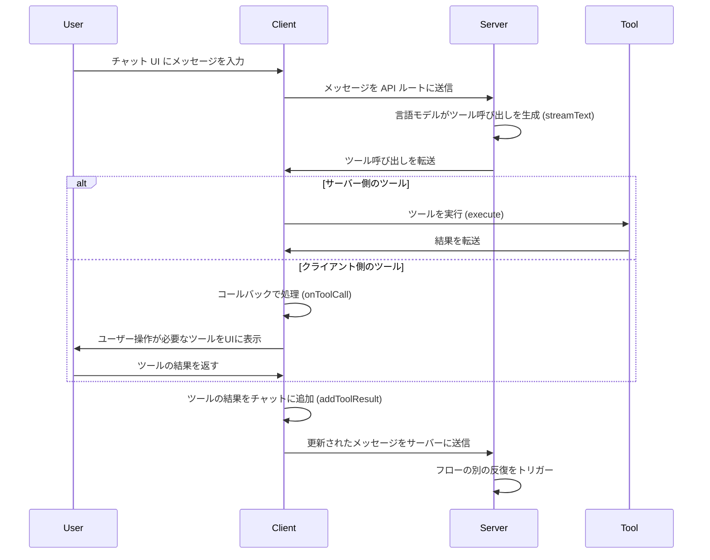

# モチベーション
AIエージェントの実装では、OpenAI,Gemini,Llamaなど複数のAIモデルを組み合わせて利用することが多いです。また、用途によって切り替えることもあります。そのため、複数のAIモデルを組み合わせて利用するアプリケーションを実装することがあります。
**モデルが異なると、モデルを呼び出すための専用のSDKを使い分ける必要があり、さらにSDKの更新に追従する必要があり、ボトルネックになることがあります。**

# Vercel AI SDK を使うと何が嬉しいの？
**Vercel AI SDKでは、各種モデルの処理を汎用化しているため、個々のモデルごとにSDKを使い分ける必要がなくなります。**
また、AIエージェントを使ったアプリでは、UXが非常に大事になりますので、Next.jsを使って実装することが多いです。
**Vercel AI SDKは、Next.jsとの親和性が高い**ため、AIエージェントを使ったアプリを実装する際に非常に便利です。

今回はAzureOpenAIを使います。

# Vercel AI SDK の概要

## サポートしているプロバイダーとモデル
:::message
最新の情報は、[Vercel AI SDKの公式ドキュメント](https://sdk.vercel.ai/docs/foundations/providers-and-models#ai-sdk-providers)を参照してください。
:::

主要なプロバイダーとモデルは以下の通りです。
- OpenAI
- Azure OpenAI
- Anthropic
- Amazon Bedrock
- Google
- Mistral
- xAI Grok
- DeepSeek

## チャットボットツール
Vercel AI SDKのuseChatとstreamTextを使うと、以下のツールを用意し実行できます。
- 自動的に実行されるサーバー側のツール
- 自動的に実行されるクライアント側ツール
- ユーザーの操作が必要なツール (確認ダイアログなど)

ツール実行される場合のフローはこちらです。


# ツール実行を含めたチャットアプリ🚀
それでは、ツール実行を含めたチャットアプリを15分程度で作りましょう！！
https://youtu.be/cVolPtcA8R8

以下のツールを使い、チャットアプリを実装します。
- getWeatherInformation: 特定の都市の天気を返す、自動的に実行されるサーバー側のツール。
- askForConfirmation: ユーザーに確認を求めるユーザー操作クライアント側ツール。
- getLocation: ランダムな都市を返す、自動的に実行されるクライアント側のツール。

## 前提
- Node.js: 18以上
- Azure OpenAI リソースがあること。
  - GPT-4o モデルが使えること

## アプリ実装

#### 1. Next.jsプロジェクトの作成
まずは、Next.jsのプロジェクトを作成します。
```bash
npm create next-app@latest vercel-poc-ai-app
```

#### 2. Vercel AI SDKのインストール
必要なモジュールをインストールします。
```bash
npm install ai @ai-sdk/react @ai-sdk/azure zod
```

#### 3. 環境変数の設定
Azure OpenAIのリソースを使うため、環境変数を設定します。
Vercel AI SDKでは、以下の二つの環境変数がデフォルトで読み込まれます。
```bash
AZURE_RESOURCE_NAME="Azure OpenAIのリソース名"
AZURE_API_KEY="Azure OpenAIのAPIキー"
```

#### 4. APIの実装
api/chat/route.tsを作成し、以下のコードを記述します。
```typescript
import { azure } from '@ai-sdk/azure';
import { streamText } from 'ai';
import { z } from 'zod';

// ストリーミングのレスポンスを30秒まで許可
export const maxDuration = 30;

export async function POST(req: Request) {
  const { messages } = await req.json();

  const result = streamText({
    toolCallStreaming: true,
    model: azure('gpt-4o'),
    messages: messages,
    tools: {
      // サーバー側ツール: ユーザーに天気情報を表示する
      getWeatherInformation: {
        description: 'show the weather in a given city to the user',
        parameters: z.object({ city: z.string() }),
        execute: async ({ }: { city: string }) => {
          const weatherOptions = ['sunny', 'cloudy', 'rainy', 'snowy', 'windy'];
          return weatherOptions[
            Math.floor(Math.random() * weatherOptions.length)
          ];
        },
      },
      // ユーザーとの対話を開始するクライアント側のツール： ユーザーに確認を求める
      askForConfirmation: {
        description: 'Ask the user for confirmation.',
        parameters: z.object({
          message: z.string().describe('The message to ask for confirmation.'),
        }),
      },
      // クライアント側で自動的に実行されるツール: ユーザーの場所を取得する
      getLocation: {
        description:
          'Get the user location. Always ask for confirmation before using this tool.',
        parameters: z.object({}),
      },
    },
    maxSteps: 5,
  });

  return result.toDataStreamResponse();
}
```

#### 5. チャットアプリの実装
pages/index.tsxを作成し、以下のコードを記述します。
```tsx
'use client';

import { ToolInvocation } from 'ai';
import { useChat } from '@ai-sdk/react';

export default function Chat() {
  const { messages, input, handleInputChange, handleSubmit, addToolResult } =
    useChat({
      maxSteps: 5,

      /**
       * 自動実行されるクライアントサイドツール
       */
      async onToolCall({ toolCall }) {
        if (toolCall.toolName === 'getLocation') {
          const cities = [
            'New York',
            'Los Angeles',
            'Chicago',
            'San Francisco',
          ];
          return cities[Math.floor(Math.random() * cities.length)];
        }
      },
    });

  return (
    <div className="flex flex-col h-screen w-full max-w-2xl mx-auto py-4">
      <div className="flex-grow overflow-y-auto p-4 bg-white rounded-lg shadow-md">
        {messages?.map(message => (
          <div key={message.id} className={`mb-4 p-2 rounded ${message.role === 'user' ? 'bg-blue-500 text-white self-end' : 'bg-gray-300 text-black self-start'}`}>
            <strong>{`${message.role}: `}</strong>
            {message.parts.map(part => {
              switch (part.type) {
                // テキスト部分を単純なテキストとしてレンダリングする
                case 'text':
                  return part.text;

                // ツールの呼び出しについては、ツールとステートを区別する
                case 'tool-invocation': {
                  const callId = part.toolInvocation.toolCallId;

                  switch (part.toolInvocation.toolName) {
                    case 'askForConfirmation': {   // ユーザーに確認を求める
                      switch (part.toolInvocation.state) {
                        case 'call':   // ツールの呼び出し
                          return (
                            <div key={callId}>
                              {part.toolInvocation.args.message}
                              <div>
                                <button
                                  className="mr-2 p-1 bg-green-500 text-white rounded"
                                  onClick={() =>
                                    addToolResult({
                                      toolCallId: callId,
                                      result: 'Yes, confirmed.',
                                    })
                                  }
                                >
                                  Yes
                                </button>
                                <button
                                  className="p-1 bg-red-500 text-white rounded"
                                  onClick={() =>
                                    addToolResult({
                                      toolCallId: callId,
                                      result: 'No, denied',
                                    })
                                  }
                                >
                                  No
                                </button>
                              </div>
                            </div>
                          );
                        case 'result':   // ツールの結果
                          return (
                            <div key={callId}>
                              Location access allowed:{' '}
                              {part.toolInvocation.result}
                            </div>
                          );
                      }
                      break;
                    }

                    case 'getLocation': {   // ユーザーの場所を取得する
                      switch (part.toolInvocation.state) {
                        case 'call':   // ツールの呼び出し
                          return <div key={callId}>Getting location...</div>;
                        case 'result':   // ツールの結果
                          return (
                            <div key={callId}>
                              Location: {part.toolInvocation.result}
                            </div>
                          );
                      }
                      break;
                    }

                    case 'getWeatherInformation': {   // 天気情報を取得する
                      switch (part.toolInvocation.state) {
                        // example of pre-rendering streaming tool calls:
                        case 'partial-call':   // 進行中のツールの呼び出し
                          return (
                            <pre key={callId}>
                              {JSON.stringify(part.toolInvocation, null, 2)}
                            </pre>
                          );
                        case 'call':   // ツールの呼び出し
                          return (
                            <div key={callId}>
                              Getting weather information for{' '}
                              {part.toolInvocation.args.city}...
                            </div>
                          );
                        case 'result':   // ツールの結果
                          return (
                            <div key={callId}>
                              Weather in {part.toolInvocation.args.city}:{' '}
                              {part.toolInvocation.result}
                            </div>
                          );
                      }
                      break;
                    }
                  }
                }
              }
            })}
            <br />
          </div>
        ))}
      </div>

      <form onSubmit={handleSubmit} className="flex mt-4">
        <input
          className="flex-1 p-2 border border-gray-300 rounded"
          value={input} onChange={handleInputChange}
          placeholder="Type your message..."
        />
        <button type="submit" className="ml-2 p-2 bg-blue-500 text-white rounded">
          Send
        </button>
      </form>
    </div>
  );
}
```

#### 6. プロジェクトの起動
```bash
npm run dev
```

さて、以下のようなチャットアプリができましたね！


# まとめ
Vercel AI SDKを使うと、複数のAIモデルを組み合わせたアプリを簡単に実装できます。また、Next.jsとの親和性が高いため、AIエージェントを使ったアプリを実装する際に非常に便利です。ぜひ、Vercel AI SDKを使って、AIエージェントを使ったアプリを実装してみてください！