# はじめに

Azure OpenAI の Realtime API を使うと、音声対話を低遅延で行うことができます。カスタマーサポートなどの対話型シナリオで、ユーザーの発話に対して自然な応答を返すことが期待されます。さらに、Function Calling（関数呼び出し機能）を組み合わせることで、対話中に外部APIを動的に呼び出して最新情報の取得やデータベース操作を行うことが可能です。
本記事では、WebRTC を活用した Azure OpenAI Realtime API（以下 Realtime API）の実装方法と、音声対話中にリアルタイムでバックエンド機能を呼び出す方法を、TypeScript/React を用いたフロントエンド例を交えて解説します。コード例は説明用の簡略化サンプルです。

結論、このような動きになりました。

https://youtu.be/rVdvXBuVFKk

# 🎯 Azure OpenAI Realtime API とは

**従来の音声AI**

```mermaid
flowchart LR
  U["ユーザー: 音声入力"] --> STT["音声認識 (STT)"]
  STT --> LLM["LLM（テキスト処理）"]
  LLM --> TTS["音声合成 (TTS)"]
  TTS --> O["ユーザー: 音声出力"]
```



従来の音声AIシステムでは、以下のような課題がありました。
- **多段階処理による遅延**: 音声認識→テキスト処理→音声合成の各処理で数秒の遅延
- **中断処理の困難**: ユーザーが途中で話し始めても適切に対応できない
- **発話ニュアンスの損失**: 各段階でのデータ変換により、音声のニュアンスが失われる

**Realtime API**

```mermaid
flowchart LR
  A["音声入力 (マイク)"] <--> B["Azure OpenAI Realtime"] <--> C["音声出力 (スピーカー)"]
```



Realtime APIでは、これらの課題を大幅に軽減できます。
- **エンドツーエンド処理**: 音声から音声への直接処理するので、遅延を減らせます
- **ストリーミング処理**: バッファリングを小さくして遅延を少なくします
- **発話文脈の維持**: 発話に応じた割り込み応答や文脈維持がしやすくなります

## 主な特徴

- **低遅延**: WebRTC による直接接続で100-200ms程度の応答時間
- **自然な対話**: 人間らしいイントネーション、間の取り方
- **リアルタイム中断**: ユーザーがAIからの応答に割り込んで発話可能
- **Function Calling**: 音声会話中にリアルタイムでバックエンド機能を実行

## WebRTC の利用
リアルタイムな音声会話を実装するためには、WebRTC または WebSocket を介して Realtime API を使用して、オーディオ入力をモデルに送信し、リアルタイムでオーディオ応答を受信できます。
WebRTC は、ブラウザーとモバイル アプリケーション間のリアルタイム通信 (RTC) できるプロトコルです。

※サーバーからクライアントにオーディオデータをストリーミングする必要がある場合、またはクライアントとサーバーの間でリアルタイムでデータを送受信する必要がある場合は、 WebSocket 経由で Realtime API を使用しましょう。

:::message
WebSocket は、WebRTC よりも待機時間が長いため、リアルタイム オーディオ ストリーミングには推奨されません。
:::

# 🌐 WebRTCの基礎

WebRTC通信を始めて触れるので、理解した概要を簡単に解説します。

- HTTPは「手紙やメール」のイメージ：送って返事を待つ。
- WebRTCは「通話」のイメージ：一度つながれば声をリアルタイムにやり取りできる。

```mermaid
flowchart LR
  Mail["HTTP: リクエスト→レスポンス"] -->|1回ごと| Server
  Call["WebRTC: 継続的な通話"] -->|常時接続| Peer
```



**WebRTCで何が起きる？**
1. 接続の準備（相手と話すための約束を交換）
2. ネットワークの経路を決める（直接つなぐ or 中継を使う）
3. 音声やデータを安全に送りあう

以下でそれぞれを簡単に説明します。

### 1) シグナリング（接続の準備）
- クライアント同士（またはクライアントとサービス）が「どのコーデックを使うか」「どのポートでやり取りするか」などの情報を交換します。
※コーデック（Codec）： 音声や映像を圧縮・伸張する仕組み。代表的な音声コーデックに Opus や G.711 などがあります。
- 実際の音声はこの段階ではまだ流れません。まず通話の約束をします。

（実装ではこのやり取りにHTTPやWebSocketを使います。コード例は本文中の `createOffer()` / `setLocalDescription()` の流れです）

### 2) ICE（STUN / TURN）
- 家庭や会社のルーターがあると、直接つながれないことがあります。ICEは接続経路を探す仕組みです。
- STUN: 自分の『外の住所（IP/ポート）』を調べるための仕組み。直接つなげるときに役立ちます。
- TURN: 直接つながれない場合に使う『中継サーバー』。確実ですが遅延やコストが増えます。

### 3) データの送受信（DTLS / RTP / データチャネル）
- DTLS: 音声やデータを暗号化して安全に送る仕組み（通話の「鍵」を作る役割）。
- RTP: 音声を小さなパケットに分けて送るルール。音声の順番やタイミングを管理します。
- データチャネル: 音声とは別に小さなメッセージ（例：Function Call の指示や転写テキスト）を送れるチャネルです。

```mermaid
flowchart LR
  Mic["マイク入力"] -->|RTP| Network
  Network -->|RTP| Speaker["スピーカー出力"]
  DataChannel["データチャネル"] ---|JSONメッセージ| App["アプリケーションロジック"]
```



## 接続の簡単な流れ（まとめ）
1. クライアントAが「話したい」と言う（Offer を作る）
2. Offer をサーバー経由で相手に渡し、相手がAnswerを返す
3. ICEで最適な経路（直接 or TURN）を決める
4. DTLSで暗号鍵を交換し、RTPで音声を送受信する
5. 必要に応じてデータチャネルで追加メッセージをやり取りする

---

## WebRTCでgpt-realtimeを利用する方法

1. サーバー（バックエンド）が Azure の Realtime `/realtime/sessions` エンドポイントを呼び、エフェメラルAPIキーを発行する
2. クライアントはサーバーから受け取ったエフェメラルキーで WebRTC の SDP 交換（/v1/realtimertc）を行い、ピア接続を確立する
3. 音声は RTP 経由で送受信、データチャネルでイベント（session.update, function_call 等）をやり取りする

### セッション URL / WebRTC URL の使い分け
- セッション URL: Azure OpenAI リソース URL + /openai/realtimeapi/sessions?api-version=... （ここでセッション作成とエフェメラルキー発行を行う）
- WebRTC URL: リージョン固有の realtimeapi-preview.ai.azure.com/v1/realtimertc に対して SDP を投げ、Answer を受け取る

### 実装の簡易シーケンス図

```mermaid
sequenceDiagram
  participant C as "クライアント (Browser)"
  participant B as "バックエンド"
  participant AZ as "Azure Realtime API"

  C->>B: 1. セッション作成リクエスト
  B->>AZ: 2. POST /openai/realtimeapi/sessions?api-version=...
  B->>AZ: 2b. (APIキーで認証)
  AZ-->>B: 3. セッション情報 + client_secret (ephemeral key)
  B-->>C: 4. エフェメラルキーを返却
  C->>C: 5. RTCPeerConnection 作成 + getUserMedia
  C->>AZ: 6. POST WebRTC URL?model=...
  C->>AZ: 6b. (SDP Offer, Authorization: Bearer ephemeral)
  AZ-->>C: 7. SDP Answer (接続確立)
  C->>AZ: 8. 音声 RTP の送受信
  AZ->>C: 8b. データチャネルでイベント交換
```



# 💬 Function Calling の技術的背景

## Function Calling とは？

**Function Calling** は、LLM（大規模言語モデル）が外部システムの機能を呼び出す仕組みです。従来のAPIコールとは異なり、自然言語で表現された意図を構造化されたAPIコールに変換します。

例えば、ユーザー「"来週末に東京付近でレンタカーを借りたい"」と発言した場合、
LLMが意図を解析し、
function呼び出しが以下のように生成されます。
```
function: list_locations
arguments: { region: "tokyo", date_preference: "weekend" }
```

:::message
**function callだと、上記や後続で解説するツール定義を各アプリで定義してツール呼び出しも実装しなければなりませんが、
MCP（Model Context Protocol）を使えば、MCPサーバとクライアントアプリを疎結合にできるます。この記事ではMCPは使わず簡易的にfunction callingを使います。**
:::

## Function Calling 動作フロー

### 1. ツール定義（Tool Definition）
```json
{
  "type": "function",
  "name": "get_weather",
  "description": "指定された都市の現在の天気情報を取得します",
  "parameters": {
    "type": "object",
    "properties": {
      "city": {
        "type": "string",
        "description": "天気を調べたい都市名"
      },
      "unit": {
        "type": "string",
        "enum": ["celsius", "fahrenheit"],
        "description": "温度の単位"
      }
    },
    "required": ["city"]
  }
}
```

### 2. 意図認識と引数抽出
```
ユーザー発話: "明日の東京の気温は何度くらいですか？"
↓
LLM解析結果:
- 意図: 天気情報取得
- 場所: 東京
- 時間: 明日
- 単位: 摂氏（日本のデフォルト）
↓
Function Call:
{
  "name": "get_weather",
  "arguments": {
    "city": "東京",
    "unit": "celsius"
  }
}
```

### 3. 実行と結果統合
```typescript
// Function実行
const weatherData = await getWeather("東京", "celsius");

// 結果をLLMに返却
const result = {
  "temperature": 25,
  "condition": "晴れ",
  "humidity": 65
};

// LLMが自然言語で回答生成
"東京の現在の気温は25度で、晴れています。湿度は65%です。"
```


# PoC🚀

Azureリソースを準備して、実装＋動作検証を行いました。

以下のようなシステム構成です。


- アプリケーション： React + TypeScriptで実装される、音声対話するためのWebアプリケーションです。
- Voice Live API： Azure OpenAI Realtime APIを利用します。モデルは `gpt-realtime` を使用します。
- Agent Service：AI 


## Azureリソースの準備

- Azure AI Foundry で、gpt-realtime モデルをデプロイ
- CosmosDB（予約システムのデータベースを想定）　※こういうアプリケーションはRDBが多いと思いますが、今回は検証なので簡易的にするためにNoSQLを使います


### gpt-realtimeモデルのデプロイ


### CosmosDB

- データベース名：rentacar-db
- コンテナ名：locations
```json
{
    "id": "loc1",
    "name": "中央レンタカー",
    "address": "東京都千代田区丸の内1-1",
    "phone": "+81-3-1234-0001",
    "timezone": "Asia/Tokyo",
    "inventory": [
        {
            "vehicleId": "v-loc1-001",
            "vehicleType": "コンパクト",
            "registration": "品川 500 あ 1001",
            "manufacturer": "トヨタ",
            "vehicleModel": "ヤリス"
        },
        {
            "vehicleId": "v-loc1-002",
            "vehicleType": "SUV",
            "registration": "品川 500 あ 1002",
            "manufacturer": "トヨタ",
            "vehicleModel": "ライズ"
        },
        {
            "vehicleId": "v-loc1-003",
            "vehicleType": "コンパクト",
            "registration": "品川 500 あ 1003",
            "manufacturer": "トヨタ",
            "vehicleModel": "カローラ"
        }
    ],
    "_rid": "sXwoALQaXTEBAAAAAAAAAA==",
    "_self": "dbs/sXwoAA==/colls/sXwoALQaXTE=/docs/sXwoALQaXTEBAAAAAAAAAA==/",
    "_etag": "\"23008d89-0000-0200-0000-68c7a61c0000\"",
    "_attachments": "attachments/",
    "_ts": 1757914652
}
```
- コンテナ名：reservations


## 1. WebRTC接続の確立

```typescript
// 注: 以下のコードは説明目的の簡略サンプルです。
// 実行する際は認証トークンの管理、必要なimport、例外処理を追加してください。
// セッション作成
const sessionResponse = await fetch('/api/realtime/session');
const { client_secret, realtimeUrl } = await sessionResponse.json();

// WebRTC接続
const pc = new RTCPeerConnection();
const offer = await pc.createOffer();
await pc.setLocalDescription(offer);

// SDP交換でAzureと接続（モデル名やエンドポイントは環境に合わせて確認してください）
const sdpResponse = await fetch(realtimeUrl, {
  method: 'POST',
  headers: {
    'Content-Type': 'application/sdp',
    'Authorization': `Bearer ${client_secret}`
  },
  body: offer.sdp
});

const answerSdp = await sdpResponse.text();
await pc.setRemoteDescription({ type: 'answer', sdp: answerSdp });
```

## 2. データチャネルによるイベント処理

WebRTC のデータチャネルを通じて、音声以外のメタデータやFunction Callイベントをやり取りします。

```typescript
// データチャネル作成
const dataChannel = pc.createDataChannel('oai-events');

dataChannel.onmessage = async (event) => {
  const payload = JSON.parse(event.data);

  // Function Call の検出と実行
  if (isFunctionCall(payload)) {
    await handleFunctionCall(payload, dataChannel);
  }

  // 音声転写の表示
  if (isTranscript(payload)) {
    updateTranscript(payload);
  }
};
```

# 🔧 Function Calling の実装

## 1. Azure Realtime セッションでのツール定義

サーバーサイドで Azure Realtime セッションを作成する際に、利用可能なツールを定義します。

```typescript
// app/api/realtime/session/route.ts
const sessionBody = {
  model: 'gpt-realtime',
  instructions: `レンタカーの予約窓口のオペレーターです。
                 用意されているツールを利用し、お客様の予約管理を行ってください。`,
  tools: [
    {
      type: 'function',
      name: 'list_locations',
      description: 'レンタカー店舗一覧を取得',
      parameters: { type: 'object', properties: {}, required: [] }
    },
    {
      type: 'function',
      name: 'get_availability',
      description: '指定した店舗と日時の空車状況を確認',
      parameters: {
        type: 'object',
        properties: {
          locationId: { type: 'string' },
          startDate: { type: 'string', description: 'ISO8601形式' },
          endDate: { type: 'string', description: 'ISO8601形式' },
          vehicleType: { type: 'string', description: 'オプション' }
        },
        required: ['locationId', 'startDate', 'endDate']
      }
    },
    {
      type: 'function',
      name: 'create_reservation',
      description: '予約を作成',
      parameters: {
        type: 'object',
        properties: {
          locationId: { type: 'string' },
          startDate: { type: 'string' },
          endDate: { type: 'string' },
          customerName: { type: 'string' },
          vehicleType: { type: 'string' }
        },
        required: ['locationId', 'startDate', 'endDate', 'customerName']
      }
    }
  ]
};
```

## 2. クライアントサイドでのFunction Call処理

データチャネルで受信したFunction Callイベントを処理し、対応するAPIエンドポイントを呼び出します。

```typescript
async function handleFunctionCall(payload: any, dataChannel: RTCDataChannel) {
  // Function Callの詳細を抽出
  const functionCall = extractFunctionCall(payload);
  const { name: functionName, call_id: callId, arguments: args } = functionCall;

  try {
    // ローカルAPIエンドポイントを呼び出し
    const response = await fetch(`/api/functions/${functionName}`, {
      method: 'POST',
      headers: { 'Content-Type': 'application/json' },
      body: JSON.stringify(args)
    });

    const result = await response.json();

    // 結果をAzureに送信
    const outputMessage = {
      type: 'conversation.item.create',
      item: {
        type: 'function_call_output',
        call_id: callId,
        output: JSON.stringify(result)
      }
    };

    dataChannel.send(JSON.stringify(outputMessage));

    // AIに応答生成を指示
    const responseCreate = { type: 'response.create' };
    await new Promise(resolve => setTimeout(resolve, 500)); // 少し待機
    dataChannel.send(JSON.stringify(responseCreate));

  } catch (error) {
    console.error('Function call failed:', error);

    // エラーレスポンスを送信
    const errorMessage = {
      type: 'conversation.item.create',
      item: {
        type: 'function_call_output',
        call_id: callId,
        output: JSON.stringify({ error: 'Function execution failed' })
      }
    };
    dataChannel.send(JSON.stringify(errorMessage));
  }
}
```

## 3. APIエンドポイントの実装

Function Call から呼び出されるAPIエンドポイントを実装します。

```typescript
// app/api/functions/get_availability/route.ts
// 注意: このサンプルで NextResponse を使う場合は `import { NextResponse } from 'next/server'` を追加してください。
export async function POST(request: Request) {
  try {
    const { locationId, startDate, endDate, vehicleType } = await request.json();

    // Cosmos DB または サンプルデータから空車状況を取得
    const availability = await checkVehicleAvailability({
      locationId,
      startDate,
      endDate,
      vehicleType
    });

    return NextResponse.json({
      success: true,
      locationId,
      period: { startDate, endDate },
      availableVehicles: availability
    });

  } catch (error) {
    return NextResponse.json(
      { error: 'Failed to check availability' },
      { status: 500 }
    );
  }
}
```

# 🎙️ 想定する音声対話の流れ

1. **ユーザー**: 「来週の土曜日に東京でレンタカーを借りたいのですが」

2. **AI**: 「承知いたしました。少々お待ちください、東京の店舗を確認いたします」
   - 👆 **Function Call**: `list_locations` を実行

3. **AI**: 「東京には3つの店舗がございます。どちらの店舗をご希望でしょうか？」

4. **ユーザー**: 「東京駅前店でお願いします。朝の10時から夕方6時まで使いたいです」

5. **AI**: 「東京駅前店で来週土曜日の10時から18時ですね。空車状況を確認いたします」
   - 👆 **Function Call**: `get_availability` を実行

6. **AI**: 「コンパクトカーが2台、ミニバンが1台空いております。どちらをご希望でしょうか？」

7. **ユーザー**: 「コンパクトカーでお願いします」

8. **AI**: 「承知いたしました。予約を作成いたします」
   - 👆 **Function Call**: `create_reservation` を実行

9. **AI**: 「予約が完了いたしました。予約番号は R-001 です」

## 重要なポイント

- **並行処理**: AIは Function Call 実行中も自然な相槌や状況説明を続ける
- **エラーハンドリング**: API呼び出しが失敗しても、対話は継続される
- **状態管理**: 対話の文脈を保持しながら、複数のFunction Callを組み合わせる

# デモ
https://youtu.be/rVdvXBuVFKk

# おわりに

今回は、function callingを使ったリアルタイム音声対話エージェントをPoCしてみました。。Function Callingを活用することで、対話中に動的に外部APIを呼び出し、最新情報の取得やデータベース操作が可能となり、よりインタラクティブで有用な音声AIアプリケーションの構築が期待されます。

以下にあるように、リモートMCPサーバのサポートもしているようなので、次はMCPサーバを使う構成も試してみたいと思います。
https://openai.com/ja-JP/index/introducing-gpt-realtime/


# 参考リンク

- https://learn.microsoft.com/ja-jp/azure/ai-foundry/openai/realtime-audio-quickstart?tabs=api-key%2Cwindows&pivots=programming-language-typescript
- https://learn.microsoft.com/ja-jp/azure/ai-foundry/openai/how-to/realtime-audio-webrtc
- https://openai.com/ja-JP/index/introducing-gpt-realtime/
- https://platform.openai.com/docs/guides/realtime-conversations#function-calling
- https://zenn.dev/dxclab/articles/e78dac9d46e17f