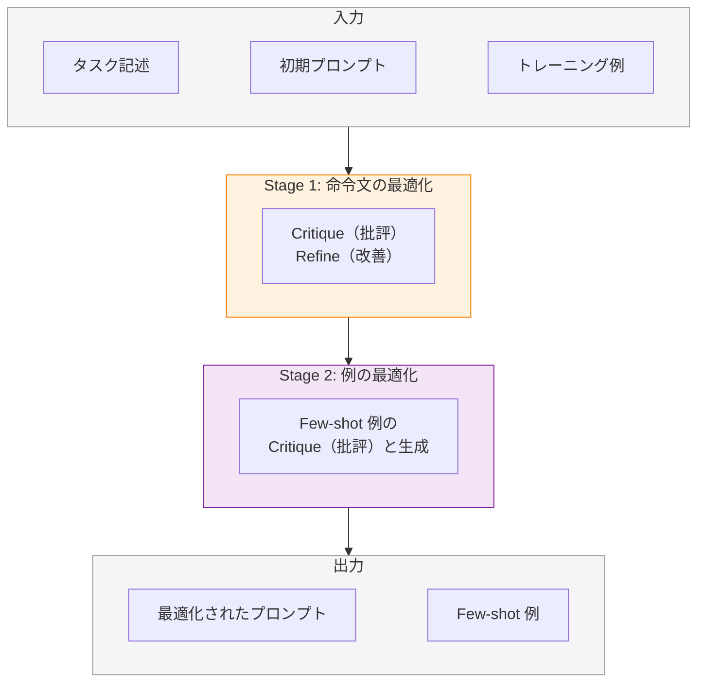
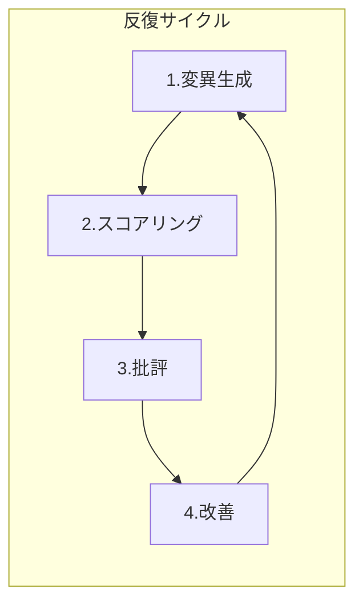
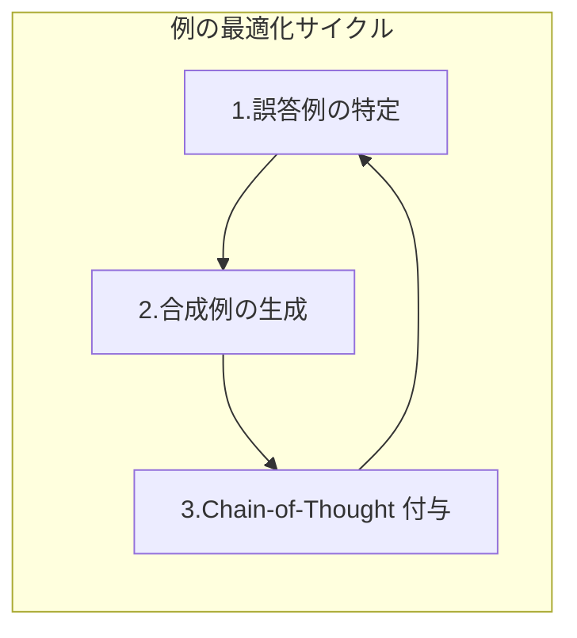
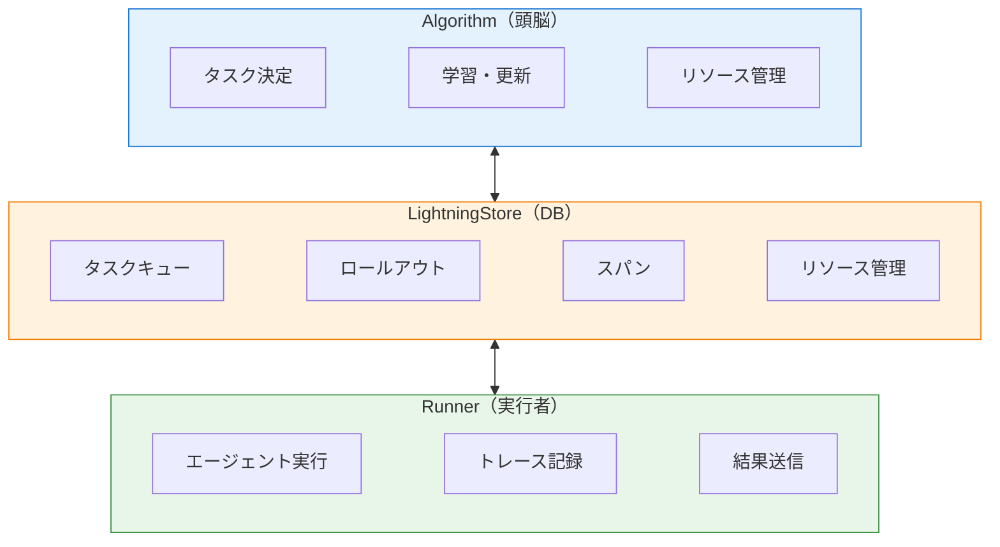
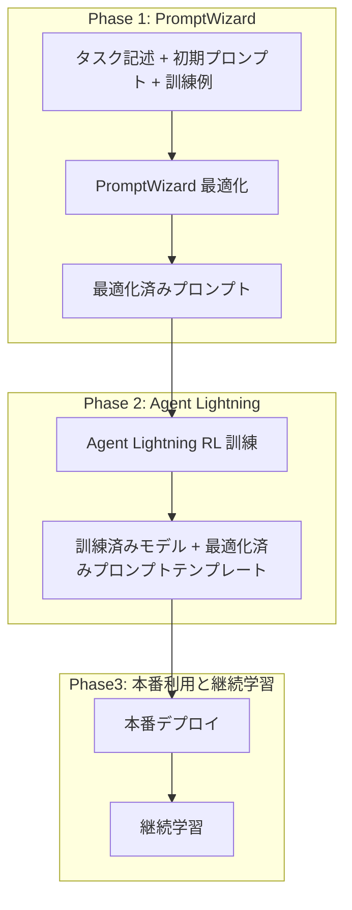

# はじめに

2026年は「AI エージェント社会実装」の年と言われていますね。PoCで終わるのではなく、いかにエンドユーザやビジネスに価値をもたらせられるか？が問われています。

そんななか、AIエージェントに対して、利用結果に応じて賢くなってくれたら...と思います。
※もちろん、AIエージェントを成り立たせる、ナレッジデータとツールについてはエンジニアリング力が必要なのですが、AIエージェントの振る舞いのプロンプトについては、自己進化してほしい。という場面があったります。

プロンプトやモデルの重みを進化させるフレームワークが、Microsoft Research から出ています。
:::message
私個人の思いとしては、まだ発展途上ですので、プロンプトやツールの最適化を実際のプロダクトに組み込むのはハードルが非常に高いです。
ですが、考え方や将来に向けての方向性を理解するには良い材料だと思います。
:::

- **PromptWizard** — プロンプトと Few-shot 例を自動最適化するフレームワーク
- **Agent Lightning** — AI エージェントを強化学習 (RL) で訓練するフレームワーク

https://github.com/microsoft/PromptWizard
https://github.com/microsoft/agent-lightning

どちらも、従来の機械学習の考え方が取り入れて、生成AIのふるまいを自己進化させようとしています。
ですが、プロンプトレイヤーの自己進化と、エージェントレイヤーの自己進化で、それぞれ進化対象が異なります。本記事では両者の概念・アーキテクチャ・機能・ユースケースを整理し、使い分けを整理します。

実際の利用結果については、別途利用した結果をブログにまとめようと思っています。

:::message alert
2026年2月時点での情報に基づいています。両フレームワークは活発に開発が進んでおり、最新情報は公式リポジトリ・ドキュメントをご参照ください。
:::

# まずはふわっと概念の比較

Prompt Wizard と Agent Lightning の基本的な違いをざっくりと整理します。

| | PromptWizard | Agent Lightning |
|---|---|---|
| **要約** | プロンプト文面を自動で磨き上げる | エージェントの行動を RL で鍛え上げる<br>※RL: 強化学習 |
| **最適化対象** | プロンプト命令文 + Few-shot 例 | モデル重み / プロンプトテンプレート |
| **主要手法** | Critique & Refine（LLM 自己フィードバック） | 強化学習 (GRPO/PPO) + APO + SFT |
| **モデル変更** | なし（推論時のプロンプトのみ変更） | あり（ファインチューニング可能） |
| **コード変更量** | 設定ファイル + データセット定義 | ほぼゼロ（既存エージェントにそのまま適用） |

---

# PromptWizard とは

## 概要

PromptWizard (PW) は、Microsoft Research India が開発した**タスク認識型プロンプト最適化フレームワーク**です。LLM が自分自身のプロンプトを生成・批評・改善する「自己進化メカニズム」を採用しており、数分で高品質なプロンプトを生成できます。

- **GitHub**: https://github.com/microsoft/PromptWizard 
- **論文**: [arXiv:2405.18369](https://arxiv.org/abs/2405.18369)（2024年5月）
- **ライセンス**: MIT

## コアアーキテクチャ

PromptWizard は 2 段階のパイプラインで動作します。



**主要コンポーネント**

| コンポーネント | 役割 |
|---|---|
| `GluePromptOpt` | 全体のオーケストレーター。YAML 設定を読み込み、最適化パイプラインを制御 |
| `CritiqueNRefine` | コアアルゴリズム。命令文の変異・スコアリング・批評・改善を反復実行 |
| `DatasetSpecificProcessing` | データセット固有の前処理。JSONL 形式に標準化 |
| `LLMMgr` | OpenAI / Azure OpenAI API との統合管理 |

## 最適化プロセスの詳細

**Stage1：命令文の最適化**



1. **変異生成** — 思考スタイル（分析的、創造的、批判的など）を混合し、命令文のバリエーションを生成
2. **スコアリング** — データセットのランダムサブセットで各候補を評価
3. **批評** — 高スコア/低スコアの命令文に対して LLM が改善点を分析
4. **改善** — 批評をもとに命令文を再合成

このサイクルを 3〜5 回繰り返し、最良の命令文に収束させます。

**Stage2：例の最適化**



1. **誤答例の特定** — 最適化された命令文で推論し、間違えた例を抽出
2. **合成例の生成** — 批評→合成→解析のパイプラインで新しい例を作成
3. **Chain-of-Thought 付与** — 各例にステップバイステップの推論を追加

## 利用シナリオ

| シナリオ | 説明 | 設定 |
|---|---|---|
| **Zero-Shot 最適化** | 訓練データなしで命令文のみ最適化 | `use_examples=False` |
| **合成データ生成** | 合成例を生成し、それを使って最適化 | `generate_synthetic_examples=True` |
| **フル最適化** | 実データ + 例の最適化 | `use_examples=True`, `run_without_train_examples=False` |

## 性能実績

PromptWizard は 45 タスクで評価され、以下の実績を残しています。

- Zero-shot で 19 タスク中 13 タスク（68%）で最高精度
- 1-shot で 19 タスク中 16 タスク（84%）で最高精度
- 1 タスクあたりのコストはわずか **$0.05**（既存手法の 5〜60 分の 1）

---

# Agent Lightning とは

## 概要

Agent Lightning は、Microsoft Research Asia（上海）が開発した**エージェント訓練フレームワーク**です。既存の AI エージェントを、コードをほぼ変更せずに強化学習で訓練・最適化する という思想です。

- **GitHub**: https://github.com/microsoft/agent-lightning 
- **論文**: [arXiv:2508.03680](https://arxiv.org/abs/2508.03680)（2025年8月）
- **ライセンス**: MIT

## コアアーキテクチャ

Agent Lightning には 3 つの主要コンポーネントがあります。



## 対応学習アルゴリズム

| アルゴリズム | 種別 | 何をする？ | いつ使う？ |
|---|---|---|---|
| **VERL** | 強化学習 | vLLM + FSDP で分散 RL 訓練。GRPO/PPO でモデルの重みを更新 | GPU があり、モデル自体を強化したい |
| **APO** | プロンプト最適化 | モデルは変更せず、プロンプトテンプレートを自動改善 | GPU なし、商用 API を使いたい |
| **SFT** | 教師あり微調整 | 成功例の入出力ペアでモデルを微調整。安定性が高い | 高品質な正解データがある |
| **LightningRL** | 階層的 RL | マルチステップ行動を分析し、各ステップに報酬を配分して学習 | 複雑なエージェントを訓練したい |

## 対応フレームワーク

Agent Lightning は、以下をサポートしています。

- LangChain / LangGraph
- OpenAI Agent SDK
- AutoGen
- CrewAI
- Microsoft Agent Framework
- カスタム Python 実装（フレームワークなし）

---

# 詳細比較

両者の根本的な違いは**何を最適化するか**です。

**PromptWizard** は「**モデルは賢い。問題は指示の出し方だ**」という発想です。LLM 自身に「このプロンプトのどこがダメ？」と批評させ、改善を繰り返します。モデルの重みには一切触れません。

**Agent Lightning** は「**エージェントの行動そのもの**を学習させよう」という発想です。**強化学習でモデルの重みを更新**したり、**プロンプトテンプレートをフィードバックで改善**します。

| 観点 | PromptWizard | Agent Lightning |
|---|---|---|
| **思想** | 「最良のプロンプトを見つける」 | 「エージェント自体を学習させる」 |
| **最適化レイヤー** | プロンプト | モデル重み / プロンプト |
| **LLM への影響** | モデルは不変。入力を改善 | モデル自体を変更可能 |

## 技術的な比較

PromptWizard はプロンプトのみの改善なので、API 呼び出しだけで動作し、数分で結果が出ます。一方、Agent Lightning は**機械学習 パイプライン**です。GPU が必要になる場合もありますが、マルチエージェントや分散実行などの機能が充実しています。

| 項目 | PromptWizard | Agent Lightning |
|---|---|---|
| **入力** | タスク記述 + 初期プロンプト + 少量の訓練例 | エージェントコード + タスクデータセット + 報酬定義 |
| **出力** | 最適化されたプロンプト + Few-shot 例 | 訓練済みモデル / 最適化されたプロンプトテンプレート |
| **最適化ループ** | 3〜5 イテレーション（数分） | 複数エポック（数時間〜数日） |
| **計算資源** | API 呼び出しのみ（GPU 不要） | GPU 必要（RL 訓練の場合） |
| **マルチエージェント** | 非対応（単一プロンプト対象） | 対応（選択的に個別エージェントを最適化可能） |
| **マルチターン** | 非対応（単一応答のプロンプト対象） | 対応（複数ターンの対話・ツール使用を記録） |
| **分散実行** | 非対応 | 対応（Ray クラスター、Client-Server アーキテクチャ） |
| **トレーシング** | なし | OpenTelemetry ベースの詳細トレース |

## ユースケース比較

「どんなタスクに向いているか」を考えてみます。

PromptWizard は**単発の推論タスク**（分類、QA、数学的推論など）に強みがあります。一方、Agent Lightning は**複雑なエージェントワークフロー**（SQL 生成、RAG、マルチエージェント協調など）に強みがありそうです。

| ユースケース | PromptWizard | Agent Lightning |
|---|---|---|
| 数学的推論の改善 | ✅ GSM8k, SVAMP, AQUA-RAT で実証 | ✅ Calc-X で実証 |
| テキスト分類タスク | ✅ BBII 45 タスクで実証 | △（直接の実証は少ない） |
| SQL 生成エージェント | △（プロンプト改善で間接的に可能） | ✅ Spider ベンチマークで実証 |
| RAG パイプライン | △ | ✅ MuSiQue + Wikipedia で実証 |
| マルチエージェント協調 | ✗ | ✅（DeepWerewolf, AgentFlow 等） |
| 本番エージェントの継続学習 | ✗ | ✅（Client-Server で分離運用） |
| コスト重視の改善 | ✅（$0.05/タスク） | △（GPU リソースが必要） |

---

# どちらを選ぶべきか？

## PromptWizard が適している場合

- **GPU リソースがない**API 呼び出しだけで完結するため、クラウド API があれば利用可能
- **既存モデルを変えたくない**GPT-4o や Claude など商用 API をそのまま使いたい
- **単発タスクの精度を上げたい**分類・QA・推論など、単一応答のタスク精度向上
- **素早く効果を出したい**数分で最適化が完了し、すぐに効果を確認できる
- **コストを抑えたい**1 タスクあたり約 $0.05 と非常に低コスト

## Agent Lightning が適している場合

- **エージェントをまるごと賢くしたい**マルチステップのツール使用・推論チェーン全体を改善
- **自社モデルをファインチューニングしたい**Llama 3 等のオープンモデルを RL で訓練
- **マルチエージェントシステムを運用している**個別エージェントの選択的最適化が可能
- **本番環境で継続的に改善したい**デプロイ済みのエージェントを実行しながら訓練
- **複雑なワークフローを扱う**マルチターン対話、動的コンテキスト、エラーハンドリングを含むシステム

---

# 簡単なコード例

## PromptWizardプロンプト最適化の実行

```python
from promptopt import GluePromptOpt

# 設定ファイルで初期化
optimizer = GluePromptOpt(
    promptopt_config="promptopt_config.yaml",
    setup_config="setup_config.yaml"
)

# 最適化を実行
best_prompt = optimizer.get_best_prompt(
    use_examples=True,
    run_without_train_examples=False,
    generate_synthetic_examples=False
)

print(best_prompt)  # 最適化された命令文 + Few-shot 例
```

## Agent Lightningエージェントの RL 訓練

```python
import agentlightning as agl
from agentlightning import Trainer, LitAgent, rollout

@rollout
def my_agent(task, prompt_template: agl.PromptTemplate):
    # 既存のエージェントロジック
    response = llm.chat(prompt_template.render(task=task))
    reward = evaluate(response, task["expected"])
    return reward

# 訓練の実行
trainer = Trainer(
    agent=my_agent,
    algorithm="APO",  # or "VERL" for RL training
    tasks=task_dataset
)
trainer.fit()
```

---
# まとめ

上記では"比較"という形で整理しましたが、進化レイヤーが異なるため、どちらかだけを使うというよりも、必要に応じて両方とも使うことができる関係性だと思います。
Agent Lightningでは、APO（Automatic Prompt Optimization）アルゴリズムを使ってプロンプトテンプレートを最適化できますが、これはPromptWizardのアプローチと似てます。ですので、PromptWizardで最適化したプロンプトをAgent LightningのAPOに組み込むことで、両方の利点を活かすことができそうです。



このパイプラインにより、短期的にはプロンプト最適化で効果を出し、長期的にはモデル自体の改善をすることもできそうです。

---

# 参考リンク

- [PromptWizard GitHub](https://github.com/microsoft/PromptWizard)
- [PromptWizard 論文 (arXiv)](https://arxiv.org/abs/2405.18369)
- [PromptWizard Microsoft Research Blog](https://www.microsoft.com/en-us/research/blog/promptwizard-the-future-of-prompt-optimization-through-feedback-driven-self-evolving-prompts/)
- [Agent Lightning GitHub](https://github.com/microsoft/agent-lightning)
- [Agent Lightning 論文 (arXiv)](https://arxiv.org/abs/2508.03680)
- [Agent Lightning Microsoft Research Blog](https://www.microsoft.com/en-us/research/blog/agent-lightning-adding-reinforcement-learning-to-ai-agents-without-code-rewrites/)
- [Agent Lightning ドキュメント](https://microsoft.github.io/agent-lightning/latest/)