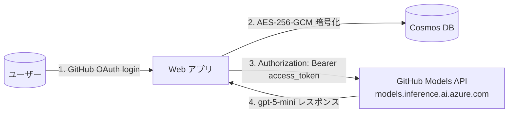

# はじめに

「LLM を使った Web アプリを作って公開してみたい」と思ったことがある人は、たぶん同じ壁にぶつかったことがあるのではないでしょうか。

- OpenAI / Azure OpenAI の **API 料金を運営者が背負う構造**になる
- ユーザーが増えるほど月の請求が読めなくなる
- レート制限もサービス全体で 1 つの枠を奪い合う

無料で公開できる規模の趣味プロダクトだと、この時点で「公開はやめておくか」となりがちです。

そんな折、GitHub Copilot プランを持っているユーザーであれば、**そのプランに紐づく利用枠で LLM を直接呼べる**仕組みがあります。GitHub OAuth で取った access token を、そのまま OpenAI 互換 API のヘッダに載せるだけです。これで運営者は API キーを 1 円も負担しなくて済みます。

実際にこの仕組みを組み込んで、試してみました。
なお、後述しますが本構成は **個人プロジェクト・LT デモを前提とした実装事例** です。商用 SaaS としてそのまま流用するのは規約面でリスクがあるため、その点も含めて誠実に共有します。

# GitHub Copilot のトークンで LLM を呼ぶ

- **LLM 料金はユーザーの GitHub Copilot 利用枠から消費される**
- **アプリ作成者は OpenAI / Azure OpenAI の API キーを 1 円も負担しない**

題材は Microsoft / GitHub 認定資格の学習を RPG として遊べる Web アプリで、クイズの問題自体も毎回 LLM が生成しています。それを成立させているのが、GitHub OAuth で取った user-to-server access token を、そのまま GitHub Models API に渡すだけの実装です。

:::message alert
**本記事は、個人プロジェクトおよび LT デモを前提とした実装事例の紹介です。商用 SaaS としての運用や、第三者ユーザーへの公開サービスとして転用することは想定していません。**


本構成を真似される場合は、必ず最新の[GitHub Models 利用規約](https://docs.github.com/en/github-models)・[GitHub Copilot Product Specific Terms](https://github.com/customer-terms/github-copilot-product-specific-terms)・[Acceptable Use Policies](https://docs.github.com/en/site-policy/acceptable-use-policies/github-acceptable-use-policies)をご自身で確認し、必要に応じて GitHub サポートへ問い合わせてください。本稿の内容は法的助言ではなく、規約への準拠を保証するものでもありません。
:::

ちなみに、このPoCではこのようなMicrosoft/GitHubの認定資格の学習ガイドを元に、LLMが毎回クイズを生成して、それをユーザーが解いていく形式のRPG学習アプリを作ってみました。※個人/身内での利用用途です。


# GitHub Models / GitHub Copilot SDK とは

実装の話に入る前に、用語を整理しておきます。

## GitHub Models

GitHub が提供する **LLM 推論プラットフォーム**で、**OpenAI Chat Completions API と互換のインターフェース**で OpenAI・Meta Llama・Microsoft Phi・DeepSeek など各社の主要モデルを横断的に呼べます。`openai` 公式 SDK の `baseURL` を上書きするだけで、既存の OpenAI 向けコードがほぼそのまま動きます。

主な公式ドキュメント：

- 入口: [GitHub Models（公式ドキュメント）](https://docs.github.com/en/github-models)
- モデル一覧: [GitHub Marketplace の Models カテゴリ](https://github.com/marketplace?type=models)
- REST API: [Catalog](https://docs.github.com/en/rest/models/catalog) / [Inference](https://docs.github.com/en/rest/models/inference) / [Embeddings](https://docs.github.com/en/rest/models/embeddings)
- プロトタイピング手引き: [Prototyping with AI models](https://docs.github.com/en/github-models/use-github-models/prototyping-with-ai-models)
- 利用枠（rate limit）の考え方: [Solving the inference problem for open source AI projects with GitHub Models（GitHub Blog）](https://github.blog/ai-and-ml/llms/solving-the-inference-problem-for-open-source-ai-projects-with-github-models/)

## GitHub Copilot SDK の位置づけ

「GitHub Copilot SDK」は単体製品ではなく、GitHub Copilot エコシステムを構成するいくつかの SDK / API の総称として使われます。代表的なものは次の通り。

| 構成要素 | 役割 | 主なドキュメント |
| --- | --- | --- |
| **GitHub Models** | LLM 推論。OpenAI 互換 API | [docs.github.com/en/github-models](https://docs.github.com/en/github-models) |
| GitHub Copilot REST API | Copilot 利用状況・座席管理 | [Copilot REST API](https://docs.github.com/en/rest/copilot) |
| Copilot Chat | エディタ内の対話インターフェース | [Copilot Chat](https://docs.github.com/en/copilot/github-copilot-chat) |
| Copilot Extensions | サードパーティ拡張の開発 | [Copilot Extensions](https://docs.github.com/en/copilot/building-copilot-extensions) |

本記事で扱うのは **GitHub Models** です。ユーザーが GitHub Copilot プラン（Pro / Business / Enterprise / Pro+）に加入していれば、Models の利用枠もそのプランに紐づきます。OAuth で取得した user-to-server access token を bearer に渡すと、その**ユーザー自身の Copilot 利用枠**から推論コストが引かれます。

## エンドポイント

| 用途 | URL |
| --- | --- |
| 公式の新エンドポイント | `https://models.github.ai/inference/chat/completions` |
| 旧エンドポイント（本記事のコード例はこちら） | `https://models.inference.ai.azure.com` |

新規実装なら `models.github.ai` 側を選ぶのが無難です。OpenAI 公式 SDK の `baseURL` 上書きパターンが使えるのは両エンドポイント共通です。

# 仕組みの全体像



1. ユーザーが GitHub OAuth でログイン（`scope: read:user user:email` だけで足りる）
2. 払い出された **user-to-server access token** をアプリ側で暗号化して保存
3. LLM を呼ぶときは、その access token を **そのまま** `Authorization: Bearer` ヘッダに載せる
4. `https://models.inference.ai.azure.com` が `gpt-5-mini` などのレスポンスを返す

GitHub の側から見れば、これは「GitHub Copilot 利用枠を持っているユーザーが、ブラウザ越しに GitHub Models を叩いている」と区別がつきません。**つまり料金もユーザー側で清算される**、というのが今回の構成のキモです。

# ① OAuth コールバックで access_token を取得

GitHub OAuth の標準的なフローです。

```js
// routes/auth.js（抜粋）
router.get('/github/callback', async (req, res) => {
  const { code } = req.query;

  // code を access_token に交換
  const tokenRes = await fetch('https://github.com/login/oauth/access_token', {
    method: 'POST',
    headers: { 'Content-Type': 'application/json', Accept: 'application/json' },
    body: JSON.stringify({
      client_id: process.env.GITHUB_CLIENT_ID,
      client_secret: process.env.GITHUB_CLIENT_SECRET,
      code,
    }),
  });
  const { access_token: accessToken } = await tokenRes.json();

  // ユーザー情報と一緒に Cosmos に upsert（access_token は AES-256-GCM で暗号化）
  const user = await userService.upsertGithubUser({ ...githubUser, accessToken });

  // 以降の認証は JWT Cookie で
  const token = jwtService.sign({ userId: user.id, email: user.email, username: user.username });
  res.cookie(jwtService.COOKIE_NAME, token, jwtService.getCookieOptions());
  res.redirect('/adventure');
});
```

ここで受け取った OAuth user-to-server token を、そのまま LLM 呼び出しの bearer に使えるのが今回の肝です。

# ② access_token は AES-256-GCM で暗号化して保存

DB ダンプが万一漏れても復号できないように、Node 標準の `crypto` で暗号化してから保存します。

```js
// services/userService.js（抜粋）
const ALGORITHM = 'aes-256-gcm';

function encrypt(plaintext) {
  const iv = crypto.randomBytes(12);
  const cipher = crypto.createCipheriv(ALGORITHM, getEncryptionKey(), iv);
  const encrypted = Buffer.concat([cipher.update(plaintext, 'utf8'), cipher.final()]);
  const authTag = cipher.getAuthTag();
  return `${iv.toString('hex')}:${authTag.toString('hex')}:${encrypted.toString('hex')}`;
}

async function getGithubAccessToken(id) {
  const user = await getUserById(id);
  if (!user?.githubAccessToken) return null;
  return decrypt(user.githubAccessToken);
}
```

`ENCRYPTION_KEY` は環境変数で別管理。LLM を呼ぶ直前にだけ復号してメモリに展開し、リクエスト終了とともに破棄します。

# ③ `openai` SDK で叩く

実装はシンプルで、`openai` 公式 SDK の `baseURL` を上書きして、`apiKey` に GitHub のアクセストークンを渡すだけです。

```js
// services/generationService.js（抜粋）
const openai = new OpenAI({
  baseURL: 'https://models.inference.ai.azure.com', // 上書き先
  apiKey: accessToken,                              // GitHub OAuth で取った token
});

const response = await openai.chat.completions.create({
  model: 'gpt-5-mini',
  messages,
  temperature: 0.7,
});
```

注意点は 3 つ。

- Azure OpenAI 用のクライアントではなく、**OpenAI 公式 SDK の `baseURL` 上書きパターン**を使う。Azure OpenAI クライアントは API 仕様が違うので通らない
- `apiKey` には GitHub OAuth の access token をそのまま渡せる。PAT や Personal API Key を別途発行する必要はない
- リクエストごとに**ユーザーの Copilot プランの rate limit を消費**する

# ④ Microsoft Learn MCP と組み合わせて問題を生成する

LLM 単体だと「学習ガイドの最新情報」を持っていないので、Microsoft Learn 公式の MCP を併用しています。

```js
// services/mcpClient.js（抜粋）
async function callLearnFetch(url) {
  return withClient(async (client) => {
    const result = await client.callTool({ name: 'microsoft_docs_fetch', arguments: { url } });
    return result?.content?.map((c) => c.text).join('\n') || '';
  });
}
```

クイズ生成の流れはこうです。

1. **MCP の `microsoft_docs_fetch`** で学習ガイド markdown を取得
2. ドメイン名キーワード周辺 4000 文字を切り出し
3. few-shot 1 例を添えて `gpt-5-mini` に「JSON のみで 4 択 10 問」を依頼
4. レスポンスから `[...]` を抽出 → `JSON.parse` → Cosmos に append

役割分担はシンプルで、

- **Microsoft Learn MCP**: 公式の最新情報（学習ガイド・コース）の取得
- **GitHub Models**: 取得したテキストを元に問題を組み立てる

LLM 単体だと古い情報や架空の試験ドメインを出すことがありますが、MCP で公式 markdown を引いてからプロンプトに埋め込むと、ハルシネーションがかなり減ります。

# 何が嬉しいのか

運営者視点で並べると効果がはっきりします。

| 観点 | 自前で API key を持つ場合 | 今回の方式 |
| --- | --- | --- |
| **料金負担** | **運営者** | **ユーザー（GitHub Copilot 利用枠）** |
| Rate limit | サービス全体で枯渇しやすい | ユーザー単位で分離される |
| キーローテ | 運営者が管理 | OAuth リフレッシュに乗る |
| ユーザー認証 | 別途必要 | 同じ OAuth で完結 |
| ベンダーロックイン | プロバイダ次第 | GitHub に寄せる |

自分用に作ったツールを他人にも触ってもらいたいが、LLM の課金は背負いたくない。そんなケースにはまります。

# 設計判断のメモ

## OAuth scope は最小にする

`read:user user:email` だけで GitHub Models が呼べました。`repo` などを乗せると不必要に強い権限になるので避けています。

## ハルシネーション対策はアプリ層で必ずやる

LLM が「それっぽい架空の資格 ID」を返してくることが何度かありました。Prompt engineering を磨くよりも、コード側で「システムに存在する集合」との intersection を取って弾く 1 行のほうが確実です。

```js
const dungeons = (data.dungeons || [])
  .map((id) => String(id || '').toLowerCase().trim())
  .filter((id) => knownCertIds.has(id)); // ハルシネーション フィルタ
```

## アクセストークンが失効したら再ログインに誘導する

OAuth user-to-server token は GitHub 側のポリシーで失効することがあります。`401 Unauthorized` を捉えたら「再ログインしてください」とユーザーに戻す UX を入れておくと、デバッグが楽になります。

# モデル選択：gpt-5 系を使う

GitHub Models で利用できる gpt-5 系を用途別に並べると、

| モデル | 立ち位置 | 向いている用途 |
| --- | --- | --- |
| `gpt-5` | フラッグシップ | 重い 10 問生成・複雑なルート設計など、品質最優先 |
| **`gpt-5-mini`** | バランス型・登録不要 | 今回のデフォルト。コスト × 速度 × 品質のバランスが良い |
| `gpt-5-nano` | 最廉価・登録不要 | 大量呼び出し、応答時間重視のケース |
| `gpt-5-chat` (preview) | マルチモーダル・会話特化 | コーチ的な対話 UI を足すとき |
| `gpt-5.5` | Copilot 経由で GA | Copilot Pro+ / Business / Enterprise で利用可。品質をさらに上げたいとき |

ユーザーの利用枠を消費する以上、デフォルトは `gpt-5-mini` にしておき、UI からモデル切り替えできるようにするのが現実的です。

# まとめ

- **GitHub Copilot のトークンで LLM を呼ぶ**
- **LLM 料金はユーザーの GitHub Copilot 利用枠から消費**
- **アプリ作成者は OpenAI / Azure OpenAI の API キーを 1 円も負担しない**
- ※ **GitHub Models はプレビュー**。利用規約と rate limit は変わり続けるので、本番投入時は最新仕様の確認とユーザーへの同意取得を忘れずに

実装は `openai` SDK の `baseURL` を `https://models.inference.ai.azure.com` に上書きして、`apiKey` に OAuth の access token を渡すだけ。あとは Microsoft Learn MCP で公式情報を補強すれば、最新の学習ガイドに沿ったクイズが毎回 LLM から返ってきます。

LLM を使った SaaS の料金問題は、OAuth + GitHub Models で消せる。自分用のツールを他人にも触ってもらいたいけれど課金は背負いたくない、というケースにはまります。

---

**参考リンク**

- [GitHub Models ドキュメント](https://docs.github.com/en/github-models)
- [OpenAI gpt-5-mini · GitHub Models](https://github.com/marketplace/models/azure-openai/gpt-5-mini)
- [Microsoft Learn MCP](https://learn.microsoft.com/training/support/mcp)
- [Model Context Protocol](https://modelcontextprotocol.io/)
