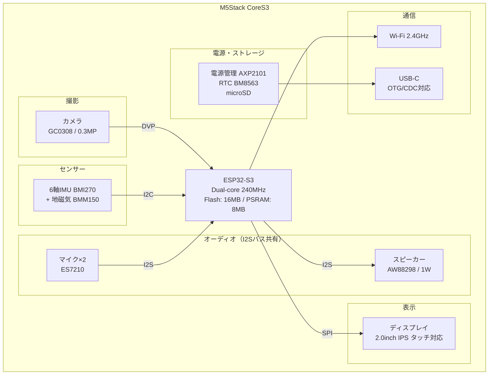
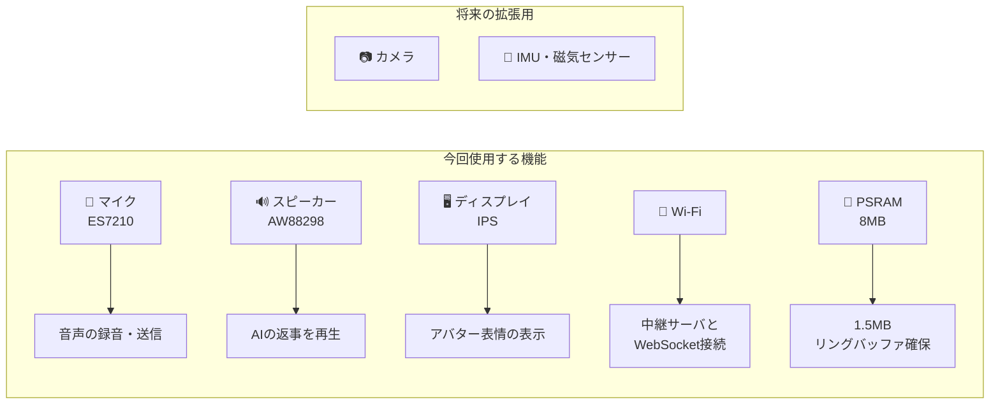
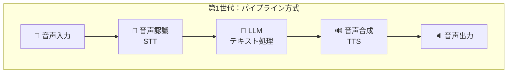
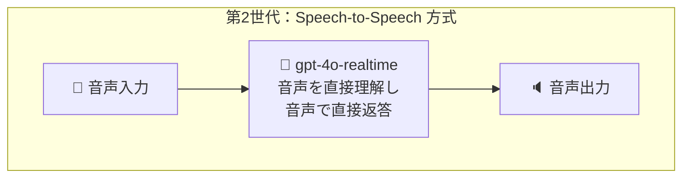
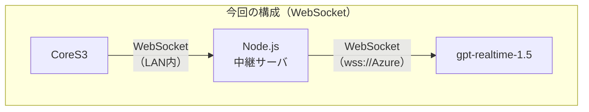
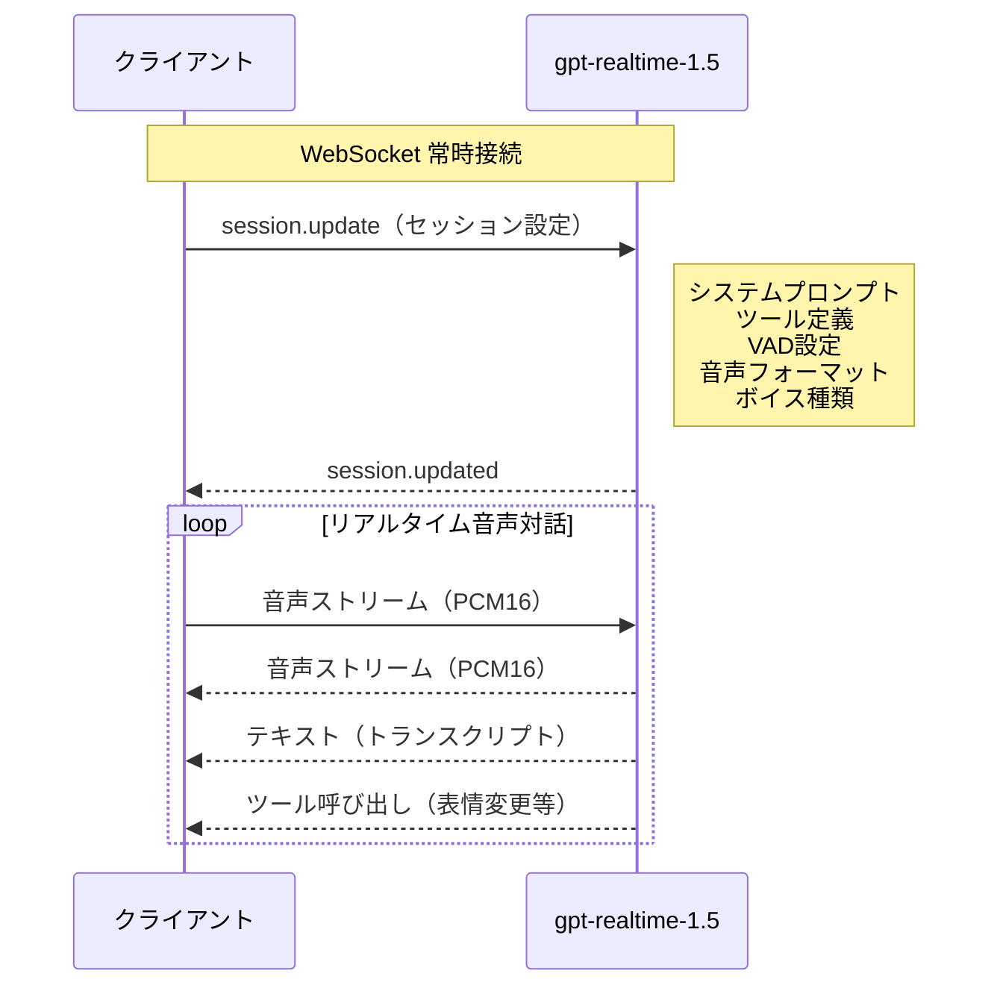
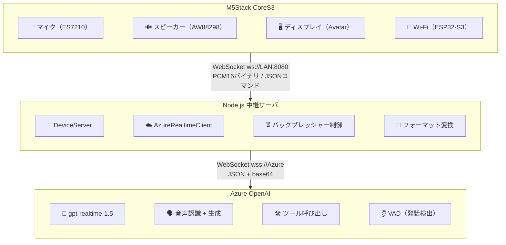
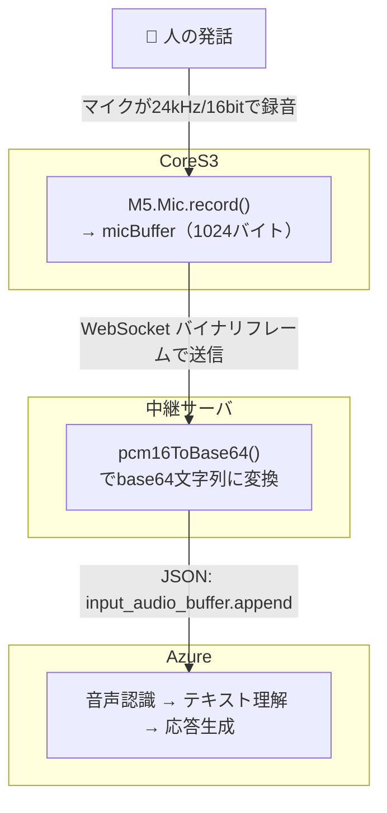
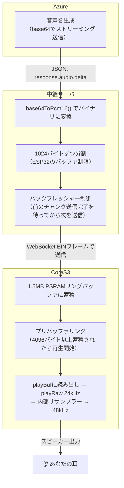
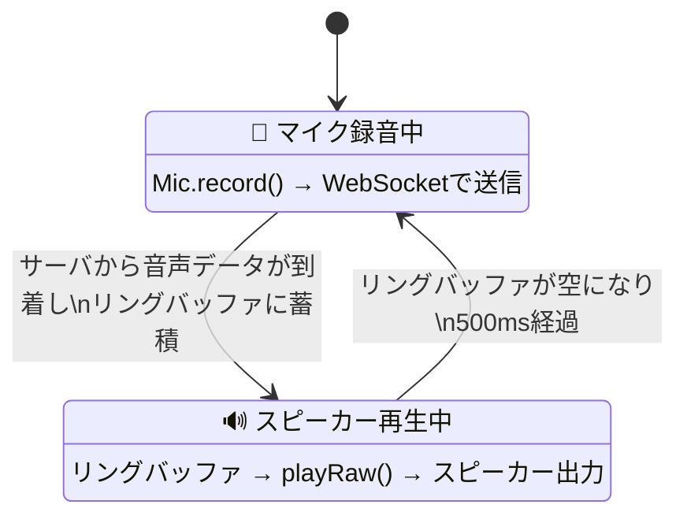

## はじめに

2/28 に、AgentCon - Tokyo のイベントがありました。
https://globalai.community/chapters/tokyo/events/agentcon-tokyo/

私はこのイベントで登壇させていただいたのですが、そのときに [Maki-san](https://x.com/yuma_prog) が「Azure AI Agent のフロントエンドとしてのロボット： ｽﾀｯｸﾁｬﾝで実践するAIロボット開発」というタイトルで登壇されていました。
私自身、なんらかIoTデバイス関連とLLMの組み合わせはもともと興味があったので、これだー！！！と感化され、その日のうちに M5Stack CoreS3 をポチりました。

家に届いてから、IoTとかをまったくやったことがない私ですが、GitHub Copilot や Claude などに助けられながら動く状態になりましたので、その過程を残しておきたいと思います。

## そもそもｽﾀｯｸﾁｬﾝって？

ｽﾀｯｸﾁｬﾝとは、M5Stackで組まれたかわいいロボットです。

https://github.com/stack-chan/stack-chan

私の場合は、M5Stack CoreS3をベースにしています。このマイコンは、マイクとスピーカーとディスプレイとカメラが内蔵されています。
私がM5Stack CoreS3にした理由は、カメラが付いているので将来的に画像認識もやってみたいなと思ったからです。

今回チャレンジするのは、gpt-realtime-1.5を使ったｽﾀｯｸﾁｬﾝとの会話です！
https://techcommunity.microsoft.com/blog/azure-ai-foundry-blog/new-azure-open-ai-models-bring-fast-expressive-and-real%E2%80%91time-ai-experiences-in-m/4496184
ｽﾀｯｸﾁｬﾝに話しかけると、Azureにデプロイした gpt-realtime-1.5 がリアルタイムで音声を認識し、音声で返事をしてくれます。さらに、会話の感情に合わせてディスプレイ上の顔（アバター）の表情が変わります。

※まだｽﾀｯｸﾁｬﾝに足？などはつけていないので、動いたりはしません。

| 項目 | 内容 |
|------|------|
| ハードウェア | M5Stack CoreS3（ESP32-S3、マイク、スピーカー、ディスプレイ内蔵） |
| AI | Azure OpenAI gpt-realtime-1.5（リアルタイム音声対話モデル） |
| 通信 | WebSocket（双方向リアルタイム通信） |
| 音声形式 | PCM16, 24kHz, モノラル |
| 言語 | 日本語 |

## この記事で学べること（というより私が詰まったポイント）

- WebSocketを使ったリアルタイム音声ストリーミング
- ESP32のI2Sオーディオの制約と対処法
- Azure OpenAI Realtime APIの使い方
- リングバッファやバックプレッシャーといったプロデューサー/コンシューマーパターン
- AIのツール呼び出しでハードウェアを制御する方法

---

# 前提知識

## M5Stack CoreS3の概要

M5Stack CoreS3は、**ESP32-S3**を搭載したオールインワンのIoT開発キットです。マイク・スピーカー・ディスプレイ・カメラがすべて一体になっているため、外付け部品なしで音声対話ロボットを作ることができます。
https://www.switch-science.com/products/8960?srsltid=AfmBOop6lZHoxE7NMs-hONsrarjYPUHgnWpxBdXpZEFANJ5AF_12vdj5

### ハードウェア構成

CoreS3の中身を図にすると、こんな感じです。中央のESP32-S3がすべてのコンポーネントを束ねていて、I2SやSPIといったバスで各チップとつながっています。



### 主要スペック

| カテゴリ | 仕様 |
|:---|:---|
| **プロセッサ** | ESP32-S3 デュアルコア Xtensa LX7 @ 240MHz |
| **メモリ** | Flash 16MB / PSRAM 8MB |
| **ディスプレイ** | 2.0インチ IPS（320×240）、静電容量式タッチ |
| **スピーカー** | AW88298（16bit I2S アンプ）、1W出力 |
| **マイク** | ES7210（I2S オーディオコーデック）、デュアルマイク |
| **カメラ** | GC0308（0.3MP） |
| **センサー** | 6軸IMU（BMI270）+ 地磁気（BMM150） |
| **電源管理** | AXP2101 PMU、リチウムバッテリー対応 |
| **通信** | Wi-Fi（2.4GHz）、USB-C（OTG/CDC対応） |
| **ストレージ** | microSDスロット |

### このプロジェクトで使う機能

今回のｽﾀｯｸﾁｬﾝでは、CoreS3の以下の機能を活用しています。カメラやIMUは今回は使いませんが、将来的に画像認識などで活躍してくれる予定です！



:::message
マイクとスピーカーが**同じI2Sバスを共有**しているため、同時使用ができないという制約があります（後述の「I2Sバス排他制御」で詳しく解説します）。
:::

---

## gpt-realtime-1.5の概要

今回は、gpt-realtime-1.5という、リアルタイムにおしゃべりできるLLMを使って、ｽﾀｯｸﾁｬﾝに話しかけると返事が返ってくるようにしています。

gpt-realtime-1.5は、OpenAIが提供する**リアルタイム音声対話に特化したAIモデル**です。今回はAzure OpenAI経由でデプロイして利用しています。

このモデルがどうすごいのかを理解するために、まずは「AIと音声で会話する」技術がどう進化してきたかを振り返ってみましょう。知ってるよっ！って方は読み飛ばしてください！

### 音声対話AIの進化

AIと音声で会話するには、もともと3つの部品を組み合わせる必要がありました。

1. **音声認識（STT: Speech-to-Text）** -- マイクで拾った音声を文字に変換する。「今日の天気は？」という音声が「今日の天気は？」というテキストになる
2. **大規模言語モデル（LLM）** -- テキストを受け取って、テキストで回答を生成する。ChatGPTなどのモデル
3. **音声合成（TTS: Text-to-Speech）** -- テキストの回答を音声に変換する。「晴れです」というテキストが音声になる

この3つをパイプラインのようにつなげることで、「音声で質問→音声で回答」を実現していました。



この方式でも会話はできますが、3つの処理を順番に待つ必要があるので、**数秒〜十数秒の待ち時間**が発生します。電話で話しているというよりは、メッセージを送って返事を待つ感覚に近いです。また、音声→テキスト→音声と変換するたびに、声のトーンや感情のニュアンスが失われてしまいます。

---

2024年10月、OpenAIは **Realtime API** と `gpt-4o-realtime-preview` モデルを発表しました。個人的にはこれがゲームチェンジャーだー、すげー！！と思った記憶があります。

このモデルは、音声を一度テキストに変換してからLLMに渡すのではなく、**音声を直接理解して、音声で直接返答する**ことができます。この方式を **Speech-to-Speech** と呼びます。



パイプラインの3段階が1つのモデルに統合されたことで、待ち時間が大幅に短縮されました。しかも、テキストへの変換を介さないので、声のトーンやニュアンスも保持されます。

---

その後の進化はこちらです。

| 時期 | モデル | 主な改善点 |
|:---|:---|:---|
| 2024年10月 | `gpt-4o-realtime-preview` | Realtime API初登場。Speech-to-Speech対応 |
| 2024年12月 | `gpt-4o-realtime-preview` (Dec) | 安定性向上 |
| 2025年8月 | `gpt-realtime` | 正式リリース（GA）。価格20%削減、MCP対応、画像入力対応 |
| 2025年12月 | `gpt-realtime-mini` | 軽量版。ツール呼び出し・指示追従の改善 |
| 2026年2月 | **`gpt-realtime-1.5`** | 音声推論+5%、文字起こし精度+10%、指示追従+7% |

今回使う `gpt-realtime-1.5` は、この系譜の最新モデルです。前世代と比べて、音声の理解力、指示への忠実さ、ツール呼び出しの精度が向上しています。

今回は音声対話のみですが、画像認識もですし、LLMからの呼び出せるさまざまなツールを付けてもっとエージェント化していきたいですー！

### 接続方式：WebSocket と WebRTC

Realtime APIには2つの接続方式があります。

| | WebSocket | WebRTC |
|:---|:---|:---|
| **接続先** | サーバ ↔ Azure | ブラウザ ↔ Azure（直接） |
| **主な用途** | サーバサイド処理、中継サーバ経由 | ブラウザから直接音声対話 |
| **特徴** | 柔軟な制御が可能。データ形式の変換やツール呼び出しの処理をサーバ側で行える | NAT越えや暗号化が自動。ブラウザだけで完結 |
| **認証** | APIキーをサーバ側で安全に管理 | 一時トークンを事前に取得して使用 |

**今回はWebSocketを採用しています。** 理由は、ESP32（CoreS3）はブラウザではないので WebRTC が使えないためです。中継サーバ（Node.js）がWebSocketでAzureに接続し、ESP32はその中継サーバとWebSocketでやり取りする構成になっています。



### セッションの仕組み

gpt-realtime-1.5はHTTPリクエストではなく、**WebSocketの常時接続セッション**で動作します。最初にセッション設定を送ったら、あとは音声データを流し続けるだけで会話が成り立ちます。



セッション開始時にAIの性格やツール定義をまとめて設定し、あとは音声を流し続けるだけで会話が成立します。従来のようなリクエスト/レスポンスの繰り返しではなく、**常時接続の双方向チャネル**になっているのが、このAPIの面白いところです。

---

# システム全体像

## 3つのコンポーネント

このシステムは3つの部品で構成されています。



### なぜ中継サーバが必要なのでしょうか？

「M5Stack CoreS3 から直接Azure APIに繋げばいいのでは？」と思うかもしれません。わたしもそう思って最初は実装していましたが、やっていくと以下の問題にぶち当たり、中継サーバを挟む構成に切り替えました。
AgentConの登壇者の [Maki-san](https://x.com/yuma_prog) も、中継サーバ経由の構成を採用されていまして、やってみてこういうことか！！　となりました。

1. **メモリの制約**: Azure Realtime APIはTLS（暗号化通信）が必須ですが、ESP32でTLS接続を維持するには大量のRAMが必要で、音声バッファと両立が困難です
2. **データ形式の変換**: Azure APIはJSON形式でbase64エンコードされた音声データをやり取りしますが、ESP32でのbase64変換はCPU負荷が高く、リアルタイム処理に支障が出る可能性があります。
3. **認証の複雑さ**: Azure APIキーの管理やセッション制御をサーバ側に集約できます。**IoTデバイスにAPIキーを直接持たせるのはセキュリティリスクが高いです。**

### 各コンポーネントの役割

- **M5Stack CoreS3（ファームウェア）** 
  - 音声の入出力とアバター表示を担当します。マイクで録音した音声をWebSocketでサーバに送り、サーバから受け取った音声をスピーカーで再生します。ファームウェアはC++で書かれた単一ファイル（`main.cpp`）です。
- **Node.js中継サーバ** 
  - デバイスとAzureの橋渡しをします。デバイスからのPCM16バイナリ音声をbase64に変換してAzureに転送し、Azureからのbase64音声をデコードしてデバイスに送り返します。TypeScriptで書かれた5ファイル構成です。
- **Azure OpenAI Realtime API** 
  - 音声認識と音声合成を一括で行うクラウドAIです。音声を受け取ると、その内容を理解し、音声で返事を生成します。さらにツール呼び出しという機能で、「表情を変える」といったアクションを自律的に実行します。

## WebSocketプロトコル

デバイスとサーバ間のWebSocket通信には2種類のメッセージがあります。

| フレーム種別 | 内容 | 方向 |
|:---|:---|:---|
| バイナリ | PCM16音声データ（生の音声波形） | 双方向 |
| テキスト | JSONコマンド | サーバ→デバイス |

JSONコマンドの例です。
```json
{"type": "expression", "value": "happy"}   // 表情変更
{"type": "lip_sync", "value": 0.7}         // 口パク（0.0〜1.0）
```

---

# 音声データの旅 -- 話してから返事が来るまで

ロボットに「今日の天気は？」と話しかけてから返事が聞こえるまで、音声データがどう流れるかを追いかけてみましょう。

## 送信パス（あなたの声 → AI）



ファームウェア側のマイク録音コードはこのようになっています。
```cpp
// main.cpp
if (M5.Mic.record(micBuffer, AUDIO_BUFFER_SIZE / sizeof(int16_t), SAMPLE_RATE)) {
    webSocket.sendBIN((uint8_t*)micBuffer, AUDIO_BUFFER_SIZE);
}
```

中継サーバでの変換処理です。
```typescript
// deviceServer.ts
ws.on("message", (data: Buffer, isBinary: boolean) => {
    if (isBinary) {
        const base64Audio = pcm16ToBase64(data as Buffer);
        this.emit("audio_from_device", base64Audio);
    }
});
```

## 受信パス（AIの返事 → スピーカー）

こちらのほうが複雑です。AIは音声を**リアルタイムより速く**生成するため、溢れないように工夫が必要です。

「リアルタイムより速く」とはどういうことかというと、**1秒分の音声データを1秒未満で生成できる**ということです。たとえば**3秒間の返答音声を、AIは0.5秒程度で生成**し終えます。
一方、スピーカーは24kHzの再生速度（1秒かけて1秒分を再生）を超えられないので、AIからの音声データは**再生が消化しきれないほど速く到着**します。
そのため、「速く届きすぎるデータを一旦溜めておいて、再生速度に合わせて少しずつ取り出す」仕組みが必要です。この先で解説する、中継サーバでの送信ペース調整（バックプレッシャー制御）と、デバイス側の大きな一時保管庫（リングバッファ）がその役割を担います。



:::details 初心者ですしまだ試し切れていないですが、サイズの理由
- **1024バイト分割（約21ミリ秒分の音声）**: 目的はメモリの節約ではなく、**送信ペースの制御**です。ESP32には8MBのPSRAM（外部メモリ）があり容量は余裕がありますが、データを受け取る瞬間にはESP32のネットワーク層（内蔵SRAM、約512KB）を通ります。AIからの音声は再生速度より速く届くため、大きなデータを一気に送るとこのネットワーク層が詰まるリスクがあります。小さく分割して「1つ送信完了を確認してから次を送る」ことで、ESP32が確実に受け取れるペースに調整しています
- **4096バイト（約85ミリ秒分の音声）**: 再生を始める前に溜めておく量です。少なすぎると再生開始後すぐにデータが足りなくなって音が途切れ、多すぎると話しかけてから最初の音が聞こえるまでが遅く感じます。「人間が違和感を感じにくい約100ミリ秒以下」に収まるよう調整しました
:::

中継サーバでの1024バイト分割の実装です。
```typescript
// deviceServer.ts
sendAudioToDevice(base64Audio: string): void {
    if (this.deviceSocket?.readyState !== WebSocket.OPEN) return;
    const pcmBuffer = base64ToPcm16(base64Audio);
    // ESP32 WebSocketライブラリのバッファ制限のため1024Bずつ分割
    for (let i = 0; i < pcmBuffer.length; i += 1024) {
        this.audioQueue.push(Buffer.from(pcmBuffer.subarray(i, Math.min(i + 1024, pcmBuffer.length))));
    }
    if (!this.isSending) {
        this.drainAudioQueue();
    }
}
```

## なぜbase64を使うのか

Azure Realtime APIはWebSocketで通信しますが、音声データはJSON形式のイベントに埋め込んで送ります。JSONにバイナリデータをそのまま入れることはできないため、base64という「バイナリ→テキスト」変換が必要です。中継サーバがこの変換を肩代わりすることで、非力なESP32の負荷を軽減しています。

## VAD（Voice Activity Detection）

AI側は「人がいつ話し終わったか」をどう判定するかというと、gpt-realtime-1.5モデルを利用する際の、[Realtime APIの公式な仕様](https://learn.microsoft.com/azure/foundry/openai/how-to/realtime-audio#voice-activity-detection-vad-and-the-audio-buffer)で、`session.update` イベントの `turn_detection` プロパティで設定します。Azureが音声ストリームを常に監視し、500ミリ秒の無音を検出すると「発話終了」と判定して応答生成を開始します。ユーザは何もボタンを押す必要がありません。

```typescript
// azureRealtimeClient.ts - セッション設定でVADを有効化
turn_detection: {
    type: "server_vad",    // サーバ側で発話を検出
    threshold: 0.5,         // 音声検出の感度
    prefix_padding_ms: 300, // 発話開始前の300msも含める
    silence_duration_ms: 500, // 500ms無音で発話終了と判定
},
```

---

# ファームウェアに側の工夫

私はIoTだったりなどの組み込み開発は初心者なので、ここに書かれていることは最適解ではないかもしれないこと、すみませんがご了承ください...

## I2Sバス排他制御 -- マイクとスピーカーは同時に使えない

**I2S（Inter-IC Sound）** はデジタルオーディオの通信規格で、マイクやスピーカーとマイコンの間でデータをやり取りするのに使います。CoreS3では、マイク（ES7210）とスピーカー（AW88298）が**同じI2Sバスを共有**しています。

これは電車の単線のようなもので、同時に両方向の列車は走れません。マイクで録音中にスピーカーから音を出すことはできないってことです。

そこで、ファームウェアは**状態マシン**（**ステートマシン**）で排他制御しています。



```cpp
// main.cpp
enum AudioMode { MODE_MIC, MODE_SPEAKER };
volatile AudioMode currentMode = MODE_MIC;
```

切り替え時は、必ず「今使っているほうを止めてから、もう一方を開始」という手順を踏みます。

```cpp
// main.cpp マイク→スピーカーへの切替
if (currentMode == MODE_MIC) {
    M5.Mic.end();          // まずマイクを停止
    M5.Speaker.begin();    // それからスピーカーを開始
    M5.Speaker.setVolume(150);
    currentMode = MODE_SPEAKER;
}
```

```cpp
// main.cpp スピーカー→マイクへの切替
M5.Speaker.end();          // まずスピーカーを停止
M5.Mic.begin();            // それからマイクを開始
currentMode = MODE_MIC;
spkPreBuffered = false;    // プリバッファリングフラグをリセット
avatar.setMouthOpenRatio(0); // 口を閉じる
```

## 1.5MBリングバッファ -- なぜ必要か

**問題**: AIは音声を**リアルタイムの再生速度より速く**生成します。1秒分の音声データが0.3秒で送られてくるようなイメージです。受け取った音声を即座に再生しようとすると、再生が追いつかずデータが溢れてしまいます。

**解決策**: **リングバッファ**（循環バッファ）を使います。データの書き込み位置と読み出し位置を別々に管理し、書き込みが読み出しを追い越しても上書きされないよう、十分な容量を確保します。

```
リングバッファのイメージです。
┌──────────────────────────────────────────┐
│■■■■■■■■■■□□□□□□□□□□□□□□□□□□□□□□□□□□□□□□  │
│          ↑                              ↑│
│       readPos                    writePos│
│      (読み出し位置)          (書き込み位置)│
│                                          │
│  ■ = 再生待ちデータ   □ = 空き領域         │
└──────────────────────────────────────────┘
```

```cpp
// main.cpp
static const size_t SPK_RING_SIZE = 1024 * 1536;  // 1.5MB ≒ 約32秒分 (24kHz/16bit/mono)
uint8_t *spkRingBuffer = nullptr;       // PSRAM上に確保
volatile size_t spkWritePos = 0;        // WebSocketコールバックが書き込む位置
volatile size_t spkReadPos = 0;         // メインループが読み出す位置
volatile size_t spkAvailable = 0;       // 蓄積されているバイト数
```

なぜ1.5MBもの大きなバッファが必要なのでしょうか。CoreS3には**8MBのPSRAM**（外部メモリ）が搭載されているため、1.5MB（約32秒分）を確保しても余裕があります。AIの長い返答でもオーバーフローしません。

```cpp
// main.cpp PSRAMにバッファを確保
spkRingBuffer = (uint8_t *)ps_malloc(SPK_RING_SIZE);
if (!spkRingBuffer) {
    spkRingBuffer = (uint8_t *)malloc(SPK_RING_SIZE);  // PSRAMが使えなければ通常RAM
}
if (!spkRingBuffer) {
    LOG("FATAL: Ring buffer allocation failed!");
    while (true) delay(1000);  // 確保できなければ停止
}
```

書き込み関数は、WebSocketコールバックから呼ばれます。

```cpp
// main.cpp
void spkRingWrite(const uint8_t *data, size_t len) {
    size_t freeSpace = SPK_RING_SIZE - spkAvailable;
    if (len > freeSpace) {
        LOG("[WARN] Ring buffer overflow! dropping %d bytes (available=%d, ringSize=%d)",
            len - freeSpace, spkAvailable, SPK_RING_SIZE);
    }
    for (size_t i = 0; i < len; i++) {
        if (spkAvailable < SPK_RING_SIZE) {
            spkRingBuffer[spkWritePos] = data[i];
            spkWritePos = (spkWritePos + 1) % SPK_RING_SIZE;  // 末尾に達したら先頭に戻る
            spkAvailable++;
        }
    }
}
```

## playRaw()のポインタ問題と解決策

ここが一番ハマったポイントです。

**M5UnifiedのplayRaw()はデータをコピーしません。ポインタだけを保存します。**

つまり、`playRaw(buf, ...)` を呼んだ後、`buf` の中身を書き換えると、スピーカーが壊れたデータを再生してしまいます。これが「音がガビガビになる」「音が早送りになる」問題の原因でした。
これが全然わからなくて、ｽﾀｯｸﾁｬﾝがずっと圧縮されたガビガビな甲高い声でしか話さず、全然かわいくねぇ。って思いながらデバッグしていました。`

```
playRaw()の落とし穴

1. playBuf にチャンクAを書き込み → playRaw(playBuf) → 成功（ポインタだけ保存）
2. playBuf にチャンクBを書き込み → playRaw(playBuf) → 成功（同じポインタ）
3. オーディオタスクがplayBufを読みに行く → チャンクAはもうBで上書きされている！
   → 音声データ破壊 → ノイズ・音飛び
```

**解決策**: `isPlaying()` ゲートで、前のチャンクの再生が完了するまで次のデータを書き込みません。

```cpp
// main.cpp
static uint8_t playBuf[AUDIO_BUFFER_SIZE]; // 再生用バッファ（1024バイト）
static size_t  playBufLen = 0;
static bool    waitingForPlayback = false;  // 再生完了待ちフラグ
```

```cpp
// main.cpp isPlaying()ゲートによる安全な再生
// 再生完了を待ってからバッファを再利用
if (waitingForPlayback) {
    if (!M5.Speaker.isPlaying()) {
        waitingForPlayback = false;  // 再生完了 → バッファ書き換えOK
    }
}

if (!waitingForPlayback) {
    if (playBufLen == 0) {
        playBufLen = spkRingRead(playBuf, AUDIO_BUFFER_SIZE);  // リングバッファから読み出し
    }
    if (playBufLen > 0) {
        bool played = M5.Speaker.playRaw(
            (const int16_t *)playBuf,
            playBufLen / 2,       // サンプル数（バイト数÷2）
            SAMPLE_RATE,          // 24kHz
            false, 1);
        if (played) {
            // ... リップシンク処理 ...
            playBufLen = 0;
            waitingForPlayback = true;  // 再生完了を待つ
        }
    }
}
```

## プリバッファリングと猶予時間

### プリバッファリング

ネットワーク経由で少しずつ届く音声をすぐ再生し始めると、最初の数十ミリ秒は途切れ途切れの音になります。そこで、**4096バイト（約85ミリ秒分）が蓄積されるまで再生を待ちます**。

```cpp
// main.cpp
static const size_t SPK_PREBUFFER_SIZE = 4096; // 再生開始前に蓄積するバイト数
volatile bool spkPreBuffered = false;

// main.cpp
if (!spkPreBuffered && spkAvailable >= SPK_PREBUFFER_SIZE) {
    spkPreBuffered = true;
    LOG("[PREBUF] Pre-buffered %d bytes, starting playback", spkAvailable);
}
```

### 猶予時間（グレースピリオド）

人間の発話には単語間に100〜300ミリ秒の自然なポーズがあります。リングバッファが一瞬空になったからといって、すぐマイクモードに戻すと、次のチャンクが届いたときにまたスピーカーモードに切り替えることになり、頻繁な切替で音が途切れます。

そこで、**バッファが空になっても500ミリ秒待ってからマイクモードに戻します**。

```cpp
// main.cpp
static const unsigned long SPK_GRACE_MS = 500; // 猶予時間
unsigned long spkEmptySince = 0;

// main.cpp
if (currentMode == MODE_SPEAKER) {
    if (spkEmptySince == 0) {
        spkEmptySince = millis();  // バッファが空になった時刻を記録
    }
    // 500ms経過 かつ 再生中でなければマイクモードに戻す
    if ((millis() - spkEmptySince) >= SPK_GRACE_MS && !M5.Speaker.isPlaying()) {
        M5.Speaker.end();
        M5.Mic.begin();
        currentMode = MODE_MIC;
    }
}
```

## リップシンク -- 音声振幅から口の動きへ

再生する音声チャンクの**ピーク振幅**をリアルタイムに計算し、アバターの口の開き具合に反映します。大きな声のときは口が大きく開き、静かなときは閉じます。

```cpp
// main.cpp
int16_t *samples = (int16_t *)playBuf;
int sampleCount = playBufLen / 2;
float maxVal = 0;
for (int i = 0; i < sampleCount; i++) {
    float val = abs(samples[i]) / 32768.0f;  // -1.0〜1.0に正規化
    if (val > maxVal) maxVal = val;
}
avatar.setMouthOpenRatio(maxVal);  // 0.0（閉じ）〜 1.0（全開）
```

## スピーカーDMAチューニング

ストリーミング再生では、**DMA（Direct Memory Access）バッファ**の設定が音質に直結します。デフォルト設定では音切れが発生するため、以下のように調整しています。

```cpp
// main.cpp
auto spk_cfg = M5.Speaker.config();
spk_cfg.sample_rate = 48000;    // ハードウェアレート（AW88298コーデックの最適値）
spk_cfg.dma_buf_len = 512;      // DMAバッファ長: 256→512（余裕を持たせる）
spk_cfg.dma_buf_count = 12;     // DMAバッファ数: 8→12（キューを深くする）
spk_cfg.task_priority = 3;      // タスク優先度: 2→3（DMAアンダーラン防止）
M5.Speaker.config(spk_cfg);
```

スピーカーハードウェアは48kHzで動作しますが、音声データは24kHzです。`playRaw(..., 24000)` と指定すると、M5Unifiedが内部で24kHz→48kHzへのリサンプリングを自動的に行います。

---

# 中継サーバ: デバイスとAIの橋渡し

中継サーバはTypeScriptです。Node.jsのイベント駆動モデルを活かし、デバイスとAzureの間でリアルタイムにデータを橋渡しします。

## DeviceServer -- ESP32との接続管理

`deviceServer.ts` はポート8080でWebSocketサーバを立ち上げ、CoreS3からの接続を待ち受けます。**同時接続は1台のみ**で、新しいデバイスが接続すると前の接続は自動的に切断されます。

```typescript
// deviceServer.ts
this.wss.on("connection", (ws, req) => {
    const clientIp = req.socket.remoteAddress;
    console.log(`[Device] CoreS3 connected from ${clientIp}`);

    // 1台のみ接続を許可 -- 新接続が来たら前の接続を閉じる
    if (this.deviceSocket) {
        console.log("[Device] Closing previous connection");
        this.deviceSocket.close();
    }
    this.deviceSocket = ws;
    this.emit("device_connected");
    // ...
});
```

受信したバイナリメッセージはPCM16音声としてbase64に変換し、`audio_from_device` イベントとして発火します。テキストメッセージはJSONとしてパースします。

## バックプレッシャー制御 -- 溢れさせない仕組み

Azureは音声をリアルタイムの再生速度より速く生成します。サーバがAzureから受け取った音声を一気にESP32に送ると、ESP32のWebSocketバッファが溢れてデータが失われます。

この問題を**バックプレッシャー制御**で解決しています。具体的には以下の流れです。

1. base64音声データをPCM16に変換する
2. 1024バイトずつの小さなチャンクに分割してキューに入れる
3. 1つのチャンクの送信が完了してから（TCPバッファに書き込まれてから）、次のチャンクを送信する

```typescript
// deviceServer.ts
private audioQueue: Buffer[] = [];
private isSending = false;

sendAudioToDevice(base64Audio: string): void {
    if (this.deviceSocket?.readyState !== WebSocket.OPEN) return;
    const pcmBuffer = base64ToPcm16(base64Audio);
    for (let i = 0; i < pcmBuffer.length; i += 1024) {
        this.audioQueue.push(Buffer.from(pcmBuffer.subarray(i, Math.min(i + 1024, pcmBuffer.length))));
    }
    if (!this.isSending) {
        this.drainAudioQueue();
    }
}

private drainAudioQueue(): void {
    if (this.audioQueue.length === 0 || this.deviceSocket?.readyState !== WebSocket.OPEN) {
        this.isSending = false;
        return;
    }
    this.isSending = true;
    const chunk = this.audioQueue.shift()!;
    this.deviceSocket.send(chunk, () => {
        // コールバック: 前のチャンクがTCPバッファに書き込まれてから次を送信
        // setImmediate でイベントループに制御を返しつつ即座に次を処理
        setImmediate(() => this.drainAudioQueue());
    });
}
```

`setImmediate()` は「イベントループに一度制御を戻してから、すぐに次の処理を実行する」という意味です。これにより、Azureからの新しいイベントなど他の処理もブロックされずに実行されます。

## AzureRealtimeClient -- セッション管理

### 接続とセッション設定

接続URLは以下のとおりです。
```
wss://{endpoint}/openai/realtime?api-version=2025-04-01-preview&deployment={deploymentName}
```

接続後、`session.update` イベントでAIの振る舞いを設定します。

```typescript
// azureRealtimeClient.ts
const event: SessionUpdateEvent = {
    type: "session.update",
    session: {
        modalities: ["text", "audio"],         // テキストと音声の両方を使用
        instructions: `あなたはIoTロボット「スタックチャン」です。...`,  // システムプロンプト
        voice: "shimmer",                       // 音声の種類
        input_audio_format: "pcm16",            // 入力音声形式
        output_audio_format: "pcm16",           // 出力音声形式
        turn_detection: {                       // VAD設定
            type: "server_vad",
            threshold: 0.5,
            prefix_padding_ms: 300,
            silence_duration_ms: 500,
        },
        tools: [/* ... set_expression ツール ... */],
    },
};
```

### セッション準備完了の管理

Azureから `session.updated` イベントが届くまで、音声データの送信は行いません。準備前に音声を送るとエラーになるためです。

```typescript
// azureRealtimeClient.ts
get isReady(): boolean {
    return this._isReady;
}

sendAudio(pcmBase64: string): void {
    if (!this._isReady) return;  // セッション準備前は送信しない
    const event: InputAudioBufferAppendEvent = {
        type: "input_audio_buffer.append",
        audio: pcmBase64,
    };
    this.send(event);
}
```

### 自動再接続

予期しない切断時は5秒後に自動再接続します。ただし、`disconnect()` を明示的に呼んだ場合（デバイスの切断時など）は再接続しません。

```typescript
// azureRealtimeClient.ts
this.ws.on("close", (code, reason) => {
    // 意図的な切断でなければ自動再接続
    if (!this.intentionalDisconnect) {
        setTimeout(() => this.connect(), 5000);
    }
});
```

---

## ツール呼び出し: AIが表情を変える仕組み

AIが自律的にロボットの表情を変えられるのは、**ツール呼び出し**という仕組みのおかげです。

### 仕組みの流れ

1. セッション設定で `set_expression` というツールをAIに登録する
2. AIが会話の文脈から感情を判断し、「表情を変えたい」と思ったら `set_expression` を呼び出す
3. 中継サーバがツール呼び出しを受け取り、表情コマンドをデバイスに転送する
4. ファームウェアがアバターの表情を更新する

### ツール定義

セッション設定の `tools` 配列でAIに使えるツールを教えます。

```typescript
// azureRealtimeClient.ts
tools: [{
    type: "function",
    name: "set_expression",
    description: "ロボットの表情を変更する。応答の感情に合わせて呼び出す。",
    parameters: {
        type: "object",
        properties: {
            expression: {
                type: "string",
                enum: ["happy", "sad", "angry", "sleepy", "neutral"],
                description: "設定する表情",
            },
        },
        required: ["expression"],
    },
}],
```

### ツール呼び出しの処理

AIがこのツールを呼び出すと、中継サーバで以下のように処理されます。

```typescript
// azureRealtimeClient.ts
private handleFunctionCall(item: Record<string, unknown>): void {
    const name = item.name as string;
    const callId = item.call_id as string;
    let args: Record<string, unknown> = {};
    try {
        args = JSON.parse(item.arguments as string);
    } catch { /* ... */ }

    if (name === "set_expression") {
        const expression = args.expression as string;
        this.emit("expression_change", expression);  // デバイスに転送

        // Azureに「ツール実行成功」を返す
        this.send({
            type: "conversation.item.create",
            item: {
                type: "function_call_output",
                call_id: callId,
                output: JSON.stringify({ success: true, expression }),
            },
        });
        // 応答生成を続行
        this.send({ type: "response.create" });
    }
}
```

### ファームウェア側の受信処理

デバイス側では、JSONコマンドを受け取ってアバターの表情を切り替えます。

```cpp
// main.cpp
case WStype_TEXT: {
    JsonDocument doc;
    deserializeJson(doc, payload, length);
    String cmdType = doc["type"] | "";

    if (cmdType == "expression") {
        String expr = doc["value"] | "neutral";
        if (expr == "happy")       avatar.setExpression(Expression::Happy);
        else if (expr == "sad")    avatar.setExpression(Expression::Sad);
        else if (expr == "angry")  avatar.setExpression(Expression::Angry);
        else if (expr == "sleepy") avatar.setExpression(Expression::Sleepy);
        else                        avatar.setExpression(Expression::Neutral);
    }
    else if (cmdType == "lip_sync") {
        float ratio = doc["value"] | 0.0f;
        avatar.setMouthOpenRatio(ratio);
    }
    break;
}
```

---

# 開発環境の準備とセットアップ

## 必要なもの

| カテゴリ | アイテム | 備考 |
|:---|:---|:---|
| ハードウェア | M5Stack CoreS3 | マイク・スピーカー・ディスプレイ内蔵 |
| ケーブル | USB-C（データ通信対応） | 書き込み用 |
| クラウド | Azureサブスクリプション | gpt-realtime-1.5のデプロイ用 |
| サーバ | Node.js 18+ が動くPC | 中継サーバ用（CoreS3と同じWi-Fiネットワーク） |
| IDE | VSCode + PlatformIO拡張 | ファームウェア開発用 |

## Azure OpenAI セットアップ

### リソース作成

1. [Azure Portal](https://portal.azure.com) にログイン
2. **「リソースの作成」** → **「Azure OpenAI」** を検索して作成
3. リージョン: **East US 2** または **Sweden Central**（gpt-realtimeが利用可能）
4. 価格レベル: Standard S0

### モデルデプロイ

1. [Azure AI Foundry](https://ai.azure.com) を開く
2. **Models + endpoints** → **Deploy model** → **Deploy base model**
3. **gpt-realtime-1.5** を検索して選択
4. デプロイ名を設定（例: `gpt-realtime-1.5`）→ **Deploy**

### 認証情報の取得

Azure PortalでOpenAIリソースを開き、**Keys and Endpoint** からエンドポイントとAPIキーを取得します。

## ファームウェアのビルドと書き込み

#### VSCode拡張機能のインストール

1. **PlatformIO IDE** (`platformio.platformio-ide`) -- ESP32開発の統合環境
   

2. **C/C++** (`ms-vscode.cpptools`) -- IntelliSense・デバッグサポート
   

### プロジェクト構成

`stock-shiro-chan/` フォルダが既にPlatformIOプロジェクトとして構成されています。

**platformio.ini**（ビルド設定）:
```ini
[env:m5stack-cores3]
platform = espressif32@6.7.0
board = esp32-s3-devkitc-1
framework = arduino
upload_speed = 460800
monitor_speed = 115200

build_flags =
    -DESP32S3
    -DBOARD_HAS_PSRAM
    -mfix-esp32-psram-cache-issue
    -DCORE_DEBUG_LEVEL=3
    -DARDUINO_USB_CDC_ON_BOOT=1
    -DARDUINO_USB_MODE=1

lib_deps =
    M5Unified=https://github.com/m5stack/M5Unified
    https://github.com/stack-chan/m5stack-avatar.git
    bblanchon/ArduinoJson@^7.1.0
    links2004/WebSockets@^2.4.1
```

### config.hの設定

`include/config.h.sample` を `include/config.h` にコピーして編集します。

```cpp
#ifndef CONFIG_H
#define CONFIG_H

// Wi-Fi設定（2.4GHz帯のみ対応。5GHzは使えません）
#define WIFI_SSID     "YOUR_WIFI_SSID"
#define WIFI_PASSWORD "YOUR_WIFI_PASSWORD"

// 中継サーバ設定（PCのIPアドレス。Windowsなら ipconfig で確認）
#define WS_SERVER_HOST "192.168.1.100"
#define WS_SERVER_PORT 8080
#define WS_SERVER_PATH "/"

// 音声設定（変更不要）
#define SAMPLE_RATE    24000
#define BITS_PER_SAMPLE 16
#define CHANNELS       1

// 録音バッファサイズ（バイト）
#define AUDIO_BUFFER_SIZE 1024

#endif
```

> **セキュリティ注意**: `config.h` にはWi-Fiパスワードが含まれます。`.gitignore` に `include/config.h` を追加してGitにコミットしないようにしましょう。

### ビルドと書き込み

1. CoreS3をUSB-CでPCに接続
2. VSCode下部のPlatformIOツールバーから操作します。
   - **Build（チェックマーク）** でコンパイル確認
   
   
   - **Upload（矢印）** で書き込み
   
   
   - **Serial Monitor** でログ確認
   
   

> 書き込みできない場合は、**リセットボタンを3秒間長押し**（緑色LED点灯）してダウンロードモードに入ってから再試行してください。

## 中継サーバのセットアップ

```bash
cd m5cores3-relay-server
npm install
```

`.env` ファイルを作成:
```env
AZURE_OPENAI_ENDPOINT=your-resource.openai.azure.com
AZURE_OPENAI_DEPLOYMENT=gpt-realtime-1.5
AZURE_OPENAI_API_KEY=your-api-key-here
DEVICE_WS_PORT=8080
```

開発モードで起動（ファイル変更時に自動再起動）:
```bash
npm run dev
```

本番ビルドの場合はこちらです。
```bash
npm run build
npm start
```

---

# 動かしてみる

## 起動手順

1. **中継サーバを起動**
   ```bash
   cd m5cores3-relay-server
   npm run dev
   ```
   以下のログが表示されれば成功です。
   ```
   [Device] WebSocket server listening on port 8080
   === M5Stack CoreS3 IoT Robot Relay Server ===
   Waiting for device connection...
   ```

2. **CoreS3を起動** -- ファームウェアを書き込み済みのCoreS3をUSBまたはバッテリーで起動

3. **接続確認** -- サーバのログに以下が表示されれば接続成功です。
   ```
   [Device] CoreS3 connected from ::ffff:192.168.x.x
   [Main] Device connected, starting Azure session...
   [Azure] Connected to Realtime API
   [Azure] Session created
   [Azure] Session updated
   ```
   CoreS3のシリアルモニタにも `[WS] Connected to server` と表示されます。

4. **話しかける** -- CoreS3に向かって日本語で話しかけてみましょう。AIが音声で返事をし、アバターの表情と口パクが動くはずです。

---

## 参考リンク

- [M5Stack CoreS3 公式ドキュメント](https://docs.m5stack.com/en/core/CoreS3)
- [M5Stack-Avatar ライブラリ](https://github.com/stack-chan/m5stack-avatar)
- [Azure OpenAI Realtime API (WebSocket)](https://learn.microsoft.com/en-us/azure/ai-foundry/openai/how-to/realtime-audio-websockets)
- [Azure OpenAI Realtime クイックスタート](https://learn.microsoft.com/en-us/azure/foundry/openai/how-to/realtime-audio)
- [OpenAI Realtime API ガイド](https://developers.openai.com/api/docs/guides/realtime/)
- [StackChan プロジェクト](https://docs.m5stack.com/en/StackChan)
