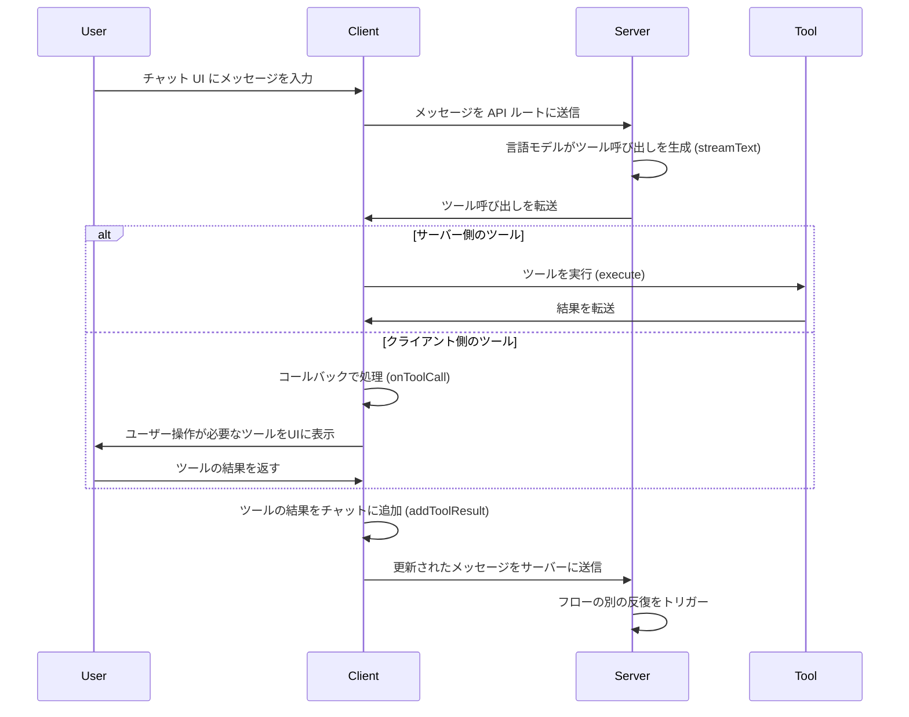

```mermaid
sequenceDiagram
    participant User
    participant Client
    participant Server
    participant Tool

    User->>Client: チャット UI にメッセージを入力
    Client->>Server: メッセージを API ルートに送信
    Server->>Server: 言語モデルがツール呼び出しを生成 (streamText)
    Server->>Client: ツール呼び出しを転送
    alt サーバー側のツール
        Client->>Tool: ツールを実行 (execute)
        Tool->>Client: 結果を転送
    else クライアント側のツール
        Client->>Client: コールバックで処理 (onToolCall)
        Client->>User: ユーザー操作が必要なツールをUIに表示
        User->>Client: ツールの結果を返す
    end
    Client->>Client: ツールの結果をチャットに追加 (addToolResult)
    Client->>Server: 更新されたメッセージをサーバーに送信
    Server->>Server: フローの別の反復をトリガー
```